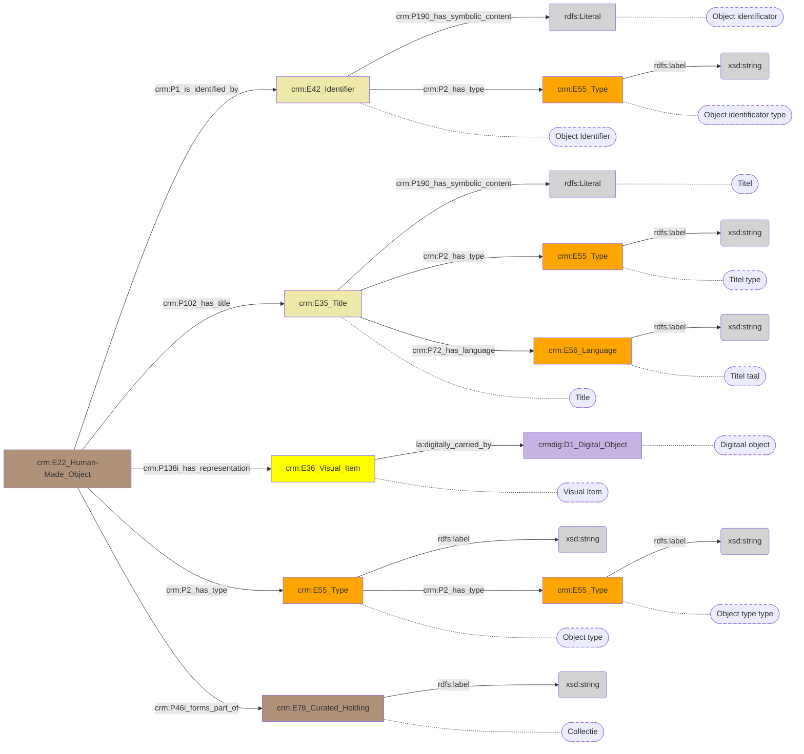

```mermaid
graph LR
a0702a46-eda1-11ed-9232-00163e71351b["crm:E55_Type"]-->|"rdfs:label"|a070322a-eda1-11ed-9232-00163e71351b(xsd:string)
a0702f0a-eda1-11ed-9232-00163e71351b["crm:E55_Type"]-->|"rdfs:label"|a07030ae-eda1-11ed-9232-00163e71351b(xsd:string)
a97fe66c-eda1-11ed-a1e6-00163e71351b["crm:E35_Title"]-->|"crm:P190_has_symbolic_content"|a97feac2-eda1-11ed-a1e6-00163e71351b(rdfs:Literal)
a97fe9a0-eda1-11ed-a1e6-00163e71351b["crm:E55_Type"]-->|"rdfs:label"|a97fed9c-eda1-11ed-a1e6-00163e71351b(xsd:string)
a97fecac-eda1-11ed-a1e6-00163e71351b["crm:E56_Language"]-->|"rdfs:label"|a97febbc-eda1-11ed-a1e6-00163e71351b(xsd:string)
d0d661c8-eda1-11ed-9655-00163e71351b["crm:E42_Identifier"]-->|"crm:P190_has_symbolic_content"|d0d6692a-eda1-11ed-9655-00163e71351b(rdfs:Literal)
d0d66aba-eda1-11ed-9655-00163e71351b["crm:E55_Type"]-->|"rdfs:label"|d0d66754-eda1-11ed-9655-00163e71351b(xsd:string)
f199cabe-466e-11ee-bc5c-00163e71351b["crm:E78_Curated_Holding"]-->|"rdfs:label"|ae34a220-46f6-11ee-bc5c-00163e71351b(xsd:string)
a0702a46-eda1-11ed-9232-00163e71351b["crm:E55_Type"]-->|"crm:P2_has_type"|a0702f0a-eda1-11ed-9232-00163e71351b["crm:E55_Type"]
a97fe66c-eda1-11ed-a1e6-00163e71351b["crm:E35_Title"]-->|"crm:P2_has_type"|a97fe9a0-eda1-11ed-a1e6-00163e71351b["crm:E55_Type"]
a97fe66c-eda1-11ed-a1e6-00163e71351b["crm:E35_Title"]-->|"crm:P72_has_language"|a97fecac-eda1-11ed-a1e6-00163e71351b["crm:E56_Language"]
d0d661c8-eda1-11ed-9655-00163e71351b["crm:E42_Identifier"]-->|"crm:P2_has_type"|d0d66aba-eda1-11ed-9655-00163e71351b["crm:E55_Type"]
fa957146-dd27-11ed-9655-00163e71351b["crm:E36_Visual_Item"]-->|"la:digitally_carried_by"|fa95c95c-dd27-11ed-9655-00163e71351b["crmdig:D1_Digital_Object"]
fa95cea2-dd27-11ed-9655-00163e71351b["crm:E22_Human-Made_Object"]-->|"crm:P1_is_identified_by"|d0d661c8-eda1-11ed-9655-00163e71351b["crm:E42_Identifier"]
fa95cea2-dd27-11ed-9655-00163e71351b["crm:E22_Human-Made_Object"]-->|"crm:P102_has_title"|a97fe66c-eda1-11ed-a1e6-00163e71351b["crm:E35_Title"]
fa95cea2-dd27-11ed-9655-00163e71351b["crm:E22_Human-Made_Object"]-->|"crm:P138i_has_representation"|fa957146-dd27-11ed-9655-00163e71351b["crm:E36_Visual_Item"]
fa95cea2-dd27-11ed-9655-00163e71351b["crm:E22_Human-Made_Object"]-->|"crm:P2_has_type"|a0702a46-eda1-11ed-9232-00163e71351b["crm:E55_Type"]
fa95cea2-dd27-11ed-9655-00163e71351b["crm:E22_Human-Made_Object"]-->|"crm:P46i_forms_part_of"|f199cabe-466e-11ee-bc5c-00163e71351b["crm:E78_Curated_Holding"]
a0702f0a-eda1-11ed-9232-00163e71351b["crm:E55_Type"]-.-a0702f0a-eda1-11ed-9232-00163e71351b_s(["Object type type"])
a97feac2-eda1-11ed-a1e6-00163e71351b["rdfs:Literal"]-.-a97feac2-eda1-11ed-a1e6-00163e71351b_s(["Titel"])
a97fe9a0-eda1-11ed-a1e6-00163e71351b["crm:E55_Type"]-.-a97fe9a0-eda1-11ed-a1e6-00163e71351b_s(["Titel type"])
a97fecac-eda1-11ed-a1e6-00163e71351b["crm:E56_Language"]-.-a97fecac-eda1-11ed-a1e6-00163e71351b_s(["Titel taal"])
d0d6692a-eda1-11ed-9655-00163e71351b["rdfs:Literal"]-.-d0d6692a-eda1-11ed-9655-00163e71351b_s(["Object identificator"])
d0d66aba-eda1-11ed-9655-00163e71351b["crm:E55_Type"]-.-d0d66aba-eda1-11ed-9655-00163e71351b_s(["Object identificator type"])
fa95c95c-dd27-11ed-9655-00163e71351b["crmdig:D1_Digital_Object"]-.-fa95c95c-dd27-11ed-9655-00163e71351b_s(["Digitaal object"])
d0d661c8-eda1-11ed-9655-00163e71351b["crm:E42_Identifier"]-.-d0d661c8-eda1-11ed-9655-00163e71351b_s(["Object Identifier"])
a97fe66c-eda1-11ed-a1e6-00163e71351b["crm:E35_Title"]-.-a97fe66c-eda1-11ed-a1e6-00163e71351b_s(["Title"])
fa957146-dd27-11ed-9655-00163e71351b["crm:E36_Visual_Item"]-.-fa957146-dd27-11ed-9655-00163e71351b_s(["Visual Item"])
a0702a46-eda1-11ed-9232-00163e71351b["crm:E55_Type"]-.-a0702a46-eda1-11ed-9232-00163e71351b_s(["Object type"])
f199cabe-466e-11ee-bc5c-00163e71351b["crm:E78_Curated_Holding"]-.-f199cabe-466e-11ee-bc5c-00163e71351b_s(["Collectie"])
style a0702f0a-eda1-11ed-9232-00163e71351b_s stroke-dasharray: 5
style a97feac2-eda1-11ed-a1e6-00163e71351b_s stroke-dasharray: 5
style a97fe9a0-eda1-11ed-a1e6-00163e71351b_s stroke-dasharray: 5
style a97fecac-eda1-11ed-a1e6-00163e71351b_s stroke-dasharray: 5
style d0d6692a-eda1-11ed-9655-00163e71351b_s stroke-dasharray: 5
style d0d66aba-eda1-11ed-9655-00163e71351b_s stroke-dasharray: 5
style fa95c95c-dd27-11ed-9655-00163e71351b_s stroke-dasharray: 5
style d0d661c8-eda1-11ed-9655-00163e71351b_s stroke-dasharray: 5
style a97fe66c-eda1-11ed-a1e6-00163e71351b_s stroke-dasharray: 5
style fa957146-dd27-11ed-9655-00163e71351b_s stroke-dasharray: 5
style a0702a46-eda1-11ed-9232-00163e71351b_s stroke-dasharray: 5
style f199cabe-466e-11ee-bc5c-00163e71351b_s stroke-dasharray: 5
style a0702a46-eda1-11ed-9232-00163e71351b fill:#ffa500
style a0702f0a-eda1-11ed-9232-00163e71351b fill:#ffa500
style a07030ae-eda1-11ed-9232-00163e71351b fill:#D3D3D3
style a070322a-eda1-11ed-9232-00163e71351b fill:#D3D3D3
style a97fe66c-eda1-11ed-a1e6-00163e71351b fill:#EEE8AA
style a97fe9a0-eda1-11ed-a1e6-00163e71351b fill:#ffa500
style a97feac2-eda1-11ed-a1e6-00163e71351b fill:#D3D3D3
style a97febbc-eda1-11ed-a1e6-00163e71351b fill:#D3D3D3
style a97fecac-eda1-11ed-a1e6-00163e71351b fill:#ffa500
style a97fed9c-eda1-11ed-a1e6-00163e71351b fill:#D3D3D3
style ae34a220-46f6-11ee-bc5c-00163e71351b fill:#D3D3D3
style d0d661c8-eda1-11ed-9655-00163e71351b fill:#EEE8AA
style d0d66754-eda1-11ed-9655-00163e71351b fill:#D3D3D3
style d0d6692a-eda1-11ed-9655-00163e71351b fill:#D3D3D3
style d0d66aba-eda1-11ed-9655-00163e71351b fill:#ffa500
style f199cabe-466e-11ee-bc5c-00163e71351b fill:#B0927A
style fa957146-dd27-11ed-9655-00163e71351b fill:#ffff00
style fa95c95c-dd27-11ed-9655-00163e71351b fill:#C5B4E3
style fa95cea2-dd27-11ed-9655-00163e71351b fill:#B0927A
```
