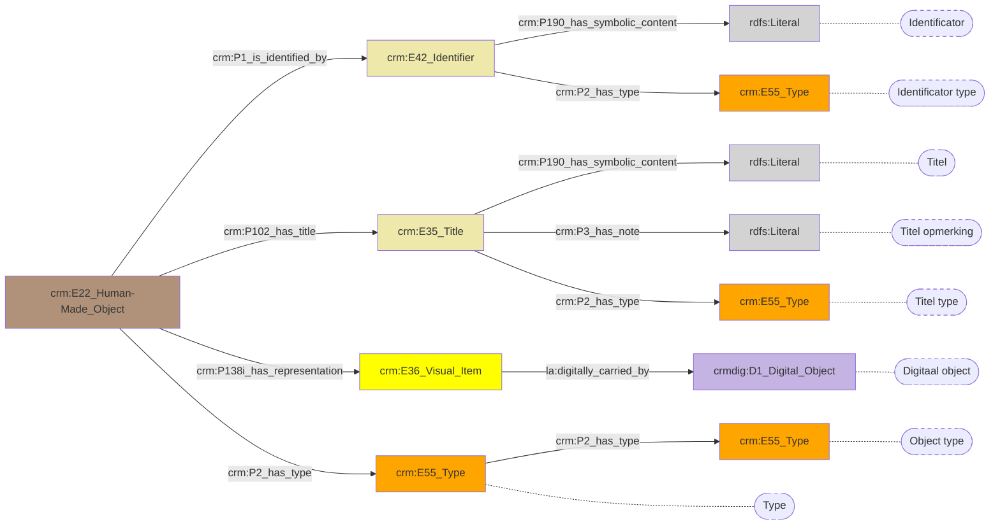

```mermaid
graph LR
style a0702a46-eda1-11ed-9232-00163e71351b fill:#ffa500
style a0702f0a-eda1-11ed-9232-00163e71351b fill:#ffa500
style a97fe66c-eda1-11ed-a1e6-00163e71351b fill:#EEE8AA
style a97fe9a0-eda1-11ed-a1e6-00163e71351b fill:#ffa500
style a97feac2-eda1-11ed-a1e6-00163e71351b fill:#D3D3D3
style d0d661c8-eda1-11ed-9655-00163e71351b fill:#EEE8AA
style d0d6692a-eda1-11ed-9655-00163e71351b fill:#D3D3D3
style d0d66aba-eda1-11ed-9655-00163e71351b fill:#ffa500
style e14fcd3b-3790-11ef-8b5d-960002548b4f fill:#D3D3D3
style fa957146-dd27-11ed-9655-00163e71351b fill:#ffff00
style fa95c95c-dd27-11ed-9655-00163e71351b fill:#C5B4E3
style fa95cea2-dd27-11ed-9655-00163e71351b fill:#B0927A
a97fe66c-eda1-11ed-a1e6-00163e71351b["crm:E35_Title"]-->|"crm:P190_has_symbolic_content"|a97feac2-eda1-11ed-a1e6-00163e71351b(rdfs:Literal)
a97fe66c-eda1-11ed-a1e6-00163e71351b["crm:E35_Title"]-->|"crm:P3_has_note"|e14fcd3b-3790-11ef-8b5d-960002548b4f(rdfs:Literal)
d0d661c8-eda1-11ed-9655-00163e71351b["crm:E42_Identifier"]-->|"crm:P190_has_symbolic_content"|d0d6692a-eda1-11ed-9655-00163e71351b(rdfs:Literal)
style a0702f0a-eda1-11ed-9232-00163e71351b_s stroke-dasharray: 5
style a97feac2-eda1-11ed-a1e6-00163e71351b_s stroke-dasharray: 5
style a97fe9a0-eda1-11ed-a1e6-00163e71351b_s stroke-dasharray: 5
style e14fcd3b-3790-11ef-8b5d-960002548b4f_s stroke-dasharray: 5
style d0d6692a-eda1-11ed-9655-00163e71351b_s stroke-dasharray: 5
style d0d66aba-eda1-11ed-9655-00163e71351b_s stroke-dasharray: 5
style fa95c95c-dd27-11ed-9655-00163e71351b_s stroke-dasharray: 5
style a0702a46-eda1-11ed-9232-00163e71351b_s stroke-dasharray: 5
a0702f0a-eda1-11ed-9232-00163e71351b["crm:E55_Type"]-.-a0702f0a-eda1-11ed-9232-00163e71351b_s(["Object type"])
a97feac2-eda1-11ed-a1e6-00163e71351b["rdfs:Literal"]-.-a97feac2-eda1-11ed-a1e6-00163e71351b_s(["Titel"])
a97fe9a0-eda1-11ed-a1e6-00163e71351b["crm:E55_Type"]-.-a97fe9a0-eda1-11ed-a1e6-00163e71351b_s(["Titel type"])
e14fcd3b-3790-11ef-8b5d-960002548b4f["rdfs:Literal"]-.-e14fcd3b-3790-11ef-8b5d-960002548b4f_s(["Titel opmerking"])
d0d6692a-eda1-11ed-9655-00163e71351b["rdfs:Literal"]-.-d0d6692a-eda1-11ed-9655-00163e71351b_s(["Identificator"])
d0d66aba-eda1-11ed-9655-00163e71351b["crm:E55_Type"]-.-d0d66aba-eda1-11ed-9655-00163e71351b_s(["Identificator type"])
fa95c95c-dd27-11ed-9655-00163e71351b["crmdig:D1_Digital_Object"]-.-fa95c95c-dd27-11ed-9655-00163e71351b_s(["Digitaal object"])
a0702a46-eda1-11ed-9232-00163e71351b["crm:E55_Type"]-.-a0702a46-eda1-11ed-9232-00163e71351b_s(["Type"])
a0702a46-eda1-11ed-9232-00163e71351b["crm:E55_Type"]-->|"crm:P2_has_type"|a0702f0a-eda1-11ed-9232-00163e71351b["crm:E55_Type"]
a97fe66c-eda1-11ed-a1e6-00163e71351b["crm:E35_Title"]-->|"crm:P2_has_type"|a97fe9a0-eda1-11ed-a1e6-00163e71351b["crm:E55_Type"]
d0d661c8-eda1-11ed-9655-00163e71351b["crm:E42_Identifier"]-->|"crm:P2_has_type"|d0d66aba-eda1-11ed-9655-00163e71351b["crm:E55_Type"]
fa957146-dd27-11ed-9655-00163e71351b["crm:E36_Visual_Item"]-->|"la:digitally_carried_by"|fa95c95c-dd27-11ed-9655-00163e71351b["crmdig:D1_Digital_Object"]
fa95cea2-dd27-11ed-9655-00163e71351b["crm:E22_Human-Made_Object"]-->|"crm:P1_is_identified_by"|d0d661c8-eda1-11ed-9655-00163e71351b["crm:E42_Identifier"]
fa95cea2-dd27-11ed-9655-00163e71351b["crm:E22_Human-Made_Object"]-->|"crm:P102_has_title"|a97fe66c-eda1-11ed-a1e6-00163e71351b["crm:E35_Title"]
fa95cea2-dd27-11ed-9655-00163e71351b["crm:E22_Human-Made_Object"]-->|"crm:P138i_has_representation"|fa957146-dd27-11ed-9655-00163e71351b["crm:E36_Visual_Item"]
fa95cea2-dd27-11ed-9655-00163e71351b["crm:E22_Human-Made_Object"]-->|"crm:P2_has_type"|a0702a46-eda1-11ed-9232-00163e71351b["crm:E55_Type"]
```
