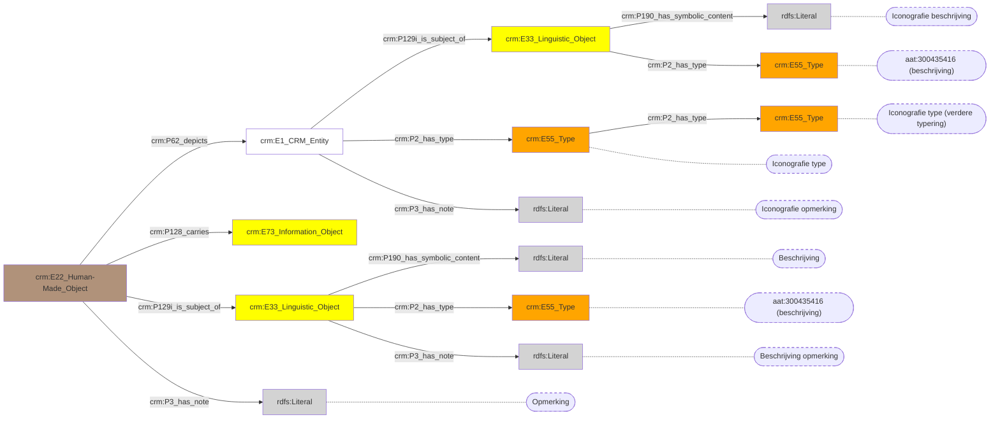

```mermaid
graph LR
style 0f49b972-12d1-11ef-ba1c-960002548b4f fill:#ffffff
style 2e35a87e-f004-11ed-a1e6-00163e71351b fill:#ffff00
style 2ea30ceb-c4d6-11ee-950c-960002548b4f fill:#D3D3D3
style 590818aa-12d1-11ef-a241-960002548b4f fill:#ffa500
style 61ee58b0-12eb-11ef-af0e-960002548b4f fill:#D3D3D3
style 652f5150-eda1-11ed-9064-00163e71351b fill:#ffff00
style 652f56d2-eda1-11ed-9064-00163e71351b fill:#D3D3D3
style 652f5a42-eda1-11ed-9064-00163e71351b fill:#ffa500
style 69b8c8c4-12e9-11ef-8706-960002548b4f fill:#D3D3D3
style a2a51de7-12d2-11ef-918c-960002548b4f fill:#ffa500
style bbe84dab-12d1-11ef-98b0-960002548b4f fill:#ffff00
style ebce452d-12d1-11ef-bea5-960002548b4f fill:#ffa500
style eec29133-233f-11ef-bb0e-960002548b4f fill:#D3D3D3
style fa95cea2-dd27-11ed-9655-00163e71351b fill:#B0927A
0f49b972-12d1-11ef-ba1c-960002548b4f["crm:E1_CRM_Entity"]-->|"crm:P3_has_note"|61ee58b0-12eb-11ef-af0e-960002548b4f(rdfs:Literal)
652f5150-eda1-11ed-9064-00163e71351b["crm:E33_Linguistic_Object"]-->|"crm:P190_has_symbolic_content"|652f56d2-eda1-11ed-9064-00163e71351b(rdfs:Literal)
652f5150-eda1-11ed-9064-00163e71351b["crm:E33_Linguistic_Object"]-->|"crm:P3_has_note"|eec29133-233f-11ef-bb0e-960002548b4f(rdfs:Literal)
bbe84dab-12d1-11ef-98b0-960002548b4f["crm:E33_Linguistic_Object"]-->|"crm:P190_has_symbolic_content"|69b8c8c4-12e9-11ef-8706-960002548b4f(rdfs:Literal)
fa95cea2-dd27-11ed-9655-00163e71351b["crm:E22_Human-Made_Object"]-->|"crm:P3_has_note"|2ea30ceb-c4d6-11ee-950c-960002548b4f(rdfs:Literal)
590818aa-12d1-11ef-a241-960002548b4f["crm:E55_Type"]-.-590818aa-12d1-11ef-a241-960002548b4f_s(["Iconografie type"])
61ee58b0-12eb-11ef-af0e-960002548b4f["rdfs:Literal"]-.-61ee58b0-12eb-11ef-af0e-960002548b4f_s(["Iconografie opmerking"])
a2a51de7-12d2-11ef-918c-960002548b4f["crm:E55_Type"]-.-a2a51de7-12d2-11ef-918c-960002548b4f_s(["Iconografie type (verdere typering)"])
652f56d2-eda1-11ed-9064-00163e71351b["rdfs:Literal"]-.-652f56d2-eda1-11ed-9064-00163e71351b_s(["Beschrijving"])
652f5a42-eda1-11ed-9064-00163e71351b["crm:E55_Type"]-.-652f5a42-eda1-11ed-9064-00163e71351b_s(["aat:300435416 (beschrijving)"])
eec29133-233f-11ef-bb0e-960002548b4f["rdfs:Literal"]-.-eec29133-233f-11ef-bb0e-960002548b4f_s(["Beschrijving opmerking"])
69b8c8c4-12e9-11ef-8706-960002548b4f["rdfs:Literal"]-.-69b8c8c4-12e9-11ef-8706-960002548b4f_s(["Iconografie beschrijving"])
ebce452d-12d1-11ef-bea5-960002548b4f["crm:E55_Type"]-.-ebce452d-12d1-11ef-bea5-960002548b4f_s(["aat:300435416 (beschrijving)"])
2ea30ceb-c4d6-11ee-950c-960002548b4f["rdfs:Literal"]-.-2ea30ceb-c4d6-11ee-950c-960002548b4f_s(["Opmerking"])
style 590818aa-12d1-11ef-a241-960002548b4f_s stroke-dasharray: 5
style 61ee58b0-12eb-11ef-af0e-960002548b4f_s stroke-dasharray: 5
style a2a51de7-12d2-11ef-918c-960002548b4f_s stroke-dasharray: 5
style 652f56d2-eda1-11ed-9064-00163e71351b_s stroke-dasharray: 5
style 652f5a42-eda1-11ed-9064-00163e71351b_s stroke-dasharray: 5
style eec29133-233f-11ef-bb0e-960002548b4f_s stroke-dasharray: 5
style 69b8c8c4-12e9-11ef-8706-960002548b4f_s stroke-dasharray: 5
style ebce452d-12d1-11ef-bea5-960002548b4f_s stroke-dasharray: 5
style 2ea30ceb-c4d6-11ee-950c-960002548b4f_s stroke-dasharray: 5
0f49b972-12d1-11ef-ba1c-960002548b4f["crm:E1_CRM_Entity"]-->|"crm:P129i_is_subject_of"|bbe84dab-12d1-11ef-98b0-960002548b4f["crm:E33_Linguistic_Object"]
0f49b972-12d1-11ef-ba1c-960002548b4f["crm:E1_CRM_Entity"]-->|"crm:P2_has_type"|590818aa-12d1-11ef-a241-960002548b4f["crm:E55_Type"]
590818aa-12d1-11ef-a241-960002548b4f["crm:E55_Type"]-->|"crm:P2_has_type"|a2a51de7-12d2-11ef-918c-960002548b4f["crm:E55_Type"]
652f5150-eda1-11ed-9064-00163e71351b["crm:E33_Linguistic_Object"]-->|"crm:P2_has_type"|652f5a42-eda1-11ed-9064-00163e71351b["crm:E55_Type"]
bbe84dab-12d1-11ef-98b0-960002548b4f["crm:E33_Linguistic_Object"]-->|"crm:P2_has_type"|ebce452d-12d1-11ef-bea5-960002548b4f["crm:E55_Type"]
fa95cea2-dd27-11ed-9655-00163e71351b["crm:E22_Human-Made_Object"]-->|"crm:P128_carries"|2e35a87e-f004-11ed-a1e6-00163e71351b["crm:E73_Information_Object"]
fa95cea2-dd27-11ed-9655-00163e71351b["crm:E22_Human-Made_Object"]-->|"crm:P129i_is_subject_of"|652f5150-eda1-11ed-9064-00163e71351b["crm:E33_Linguistic_Object"]
fa95cea2-dd27-11ed-9655-00163e71351b["crm:E22_Human-Made_Object"]-->|"crm:P62_depicts"|0f49b972-12d1-11ef-ba1c-960002548b4f["crm:E1_CRM_Entity"]
```
