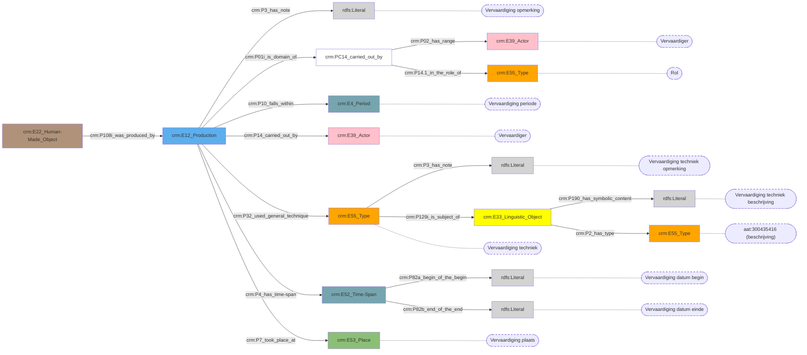

```mermaid
graph LR
style 0bbab020-c4cc-11ee-8106-960002548b4f fill:#ffff00
style 0bbab377-c4cc-11ee-98ed-960002548b4f fill:#D3D3D3
style 0bbab3fc-c4cc-11ee-8509-960002548b4f fill:#ffa500
style 73fcc5b4-eda1-11ed-9064-00163e71351b fill:#5DAEEC
style 73fcc992-eda1-11ed-9064-00163e71351b fill:#76A5AF
style 73fccd66-eda1-11ed-9064-00163e71351b fill:#ffc0cb
style 73fcce42-eda1-11ed-9064-00163e71351b fill:#ffa500
style 73fccf1e-eda1-11ed-9064-00163e71351b fill:#ffa500
style 73fcd19e-eda1-11ed-9064-00163e71351b fill:#D3D3D3
style 73fcd284-eda1-11ed-9064-00163e71351b fill:#ffffff
style 73fcd41e-eda1-11ed-9064-00163e71351b fill:#D3D3D3
style 73fcd4fa-eda1-11ed-9064-00163e71351b fill:#8CBF76
style 756a8e1e-4584-11ee-bc5c-00163e71351b fill:#76A5AF
style 7d7e51a6-1002-11ee-b0c4-00163e71351b fill:#D3D3D3
style aaaea982-1002-11ee-974d-00163e71351b fill:#D3D3D3
style b9d92aa8-11ce-11ef-a1f9-960002548b4f fill:#ffc0cb
style fa95cea2-dd27-11ed-9655-00163e71351b fill:#B0927A
0bbab020-c4cc-11ee-8106-960002548b4f["crm:E33_Linguistic_Object"]-->|"crm:P190_has_symbolic_content"|0bbab377-c4cc-11ee-98ed-960002548b4f(rdfs:Literal)
73fcc5b4-eda1-11ed-9064-00163e71351b["crm:E12_Production"]-->|"crm:P3_has_note"|7d7e51a6-1002-11ee-b0c4-00163e71351b(rdfs:Literal)
73fcc992-eda1-11ed-9064-00163e71351b["crm:E52_Time-Span"]-->|"crm:P82a_begin_of_the_begin"|73fcd41e-eda1-11ed-9064-00163e71351b(rdfs:Literal)
73fcc992-eda1-11ed-9064-00163e71351b["crm:E52_Time-Span"]-->|"crm:P82b_end_of_the_end"|73fcd19e-eda1-11ed-9064-00163e71351b(rdfs:Literal)
73fccf1e-eda1-11ed-9064-00163e71351b["crm:E55_Type"]-->|"crm:P3_has_note"|aaaea982-1002-11ee-974d-00163e71351b(rdfs:Literal)
style 0bbab377-c4cc-11ee-98ed-960002548b4f_s stroke-dasharray: 5
style 0bbab3fc-c4cc-11ee-8509-960002548b4f_s stroke-dasharray: 5
style 756a8e1e-4584-11ee-bc5c-00163e71351b_s stroke-dasharray: 5
style b9d92aa8-11ce-11ef-a1f9-960002548b4f_s stroke-dasharray: 5
style 7d7e51a6-1002-11ee-b0c4-00163e71351b_s stroke-dasharray: 5
style 73fccf1e-eda1-11ed-9064-00163e71351b_s stroke-dasharray: 5
style 73fcd4fa-eda1-11ed-9064-00163e71351b_s stroke-dasharray: 5
style 73fcd41e-eda1-11ed-9064-00163e71351b_s stroke-dasharray: 5
style 73fcd19e-eda1-11ed-9064-00163e71351b_s stroke-dasharray: 5
style aaaea982-1002-11ee-974d-00163e71351b_s stroke-dasharray: 5
style 73fccd66-eda1-11ed-9064-00163e71351b_s stroke-dasharray: 5
style 73fcce42-eda1-11ed-9064-00163e71351b_s stroke-dasharray: 5
0bbab020-c4cc-11ee-8106-960002548b4f["crm:E33_Linguistic_Object"]-->|"crm:P2_has_type"|0bbab3fc-c4cc-11ee-8509-960002548b4f["crm:E55_Type"]
73fcc5b4-eda1-11ed-9064-00163e71351b["crm:E12_Production"]-->|"crm:P01i_is_domain_of"|73fcd284-eda1-11ed-9064-00163e71351b["crm:PC14_carried_out_by"]
73fcc5b4-eda1-11ed-9064-00163e71351b["crm:E12_Production"]-->|"crm:P10_falls_within"|756a8e1e-4584-11ee-bc5c-00163e71351b["crm:E4_Period"]
73fcc5b4-eda1-11ed-9064-00163e71351b["crm:E12_Production"]-->|"crm:P14_carried_out_by"|b9d92aa8-11ce-11ef-a1f9-960002548b4f["crm:E39_Actor"]
73fcc5b4-eda1-11ed-9064-00163e71351b["crm:E12_Production"]-->|"crm:P32_used_general_technique"|73fccf1e-eda1-11ed-9064-00163e71351b["crm:E55_Type"]
73fcc5b4-eda1-11ed-9064-00163e71351b["crm:E12_Production"]-->|"crm:P4_has_time-span"|73fcc992-eda1-11ed-9064-00163e71351b["crm:E52_Time-Span"]
73fcc5b4-eda1-11ed-9064-00163e71351b["crm:E12_Production"]-->|"crm:P7_took_place_at"|73fcd4fa-eda1-11ed-9064-00163e71351b["crm:E53_Place"]
73fccf1e-eda1-11ed-9064-00163e71351b["crm:E55_Type"]-->|"crm:P129i_is_subject_of"|0bbab020-c4cc-11ee-8106-960002548b4f["crm:E33_Linguistic_Object"]
73fcd284-eda1-11ed-9064-00163e71351b["crm:PC14_carried_out_by"]-->|"crm:P02_has_range"|73fccd66-eda1-11ed-9064-00163e71351b["crm:E39_Actor"]
73fcd284-eda1-11ed-9064-00163e71351b["crm:PC14_carried_out_by"]-->|"crm:P14.1_in_the_role_of"|73fcce42-eda1-11ed-9064-00163e71351b["crm:E55_Type"]
fa95cea2-dd27-11ed-9655-00163e71351b["crm:E22_Human-Made_Object"]-->|"crm:P108i_was_produced_by"|73fcc5b4-eda1-11ed-9064-00163e71351b["crm:E12_Production"]
0bbab377-c4cc-11ee-98ed-960002548b4f["rdfs:Literal"]-.-0bbab377-c4cc-11ee-98ed-960002548b4f_s(["Vervaardiging techniek beschrijving"])
0bbab3fc-c4cc-11ee-8509-960002548b4f["crm:E55_Type"]-.-0bbab3fc-c4cc-11ee-8509-960002548b4f_s(["aat:300435416 (beschrijving)"])
756a8e1e-4584-11ee-bc5c-00163e71351b["crm:E4_Period"]-.-756a8e1e-4584-11ee-bc5c-00163e71351b_s(["Vervaardiging periode"])
b9d92aa8-11ce-11ef-a1f9-960002548b4f["crm:E39_Actor"]-.-b9d92aa8-11ce-11ef-a1f9-960002548b4f_s(["Vervaardiger"])
7d7e51a6-1002-11ee-b0c4-00163e71351b["rdfs:Literal"]-.-7d7e51a6-1002-11ee-b0c4-00163e71351b_s(["Vervaardiging opmerking"])
73fccf1e-eda1-11ed-9064-00163e71351b["crm:E55_Type"]-.-73fccf1e-eda1-11ed-9064-00163e71351b_s(["Vervaardiging techniek"])
73fcd4fa-eda1-11ed-9064-00163e71351b["crm:E53_Place"]-.-73fcd4fa-eda1-11ed-9064-00163e71351b_s(["Vervaardiging plaats"])
73fcd41e-eda1-11ed-9064-00163e71351b["rdfs:Literal"]-.-73fcd41e-eda1-11ed-9064-00163e71351b_s(["Vervaardiging datum begin"])
73fcd19e-eda1-11ed-9064-00163e71351b["rdfs:Literal"]-.-73fcd19e-eda1-11ed-9064-00163e71351b_s(["Vervaardiging datum einde"])
aaaea982-1002-11ee-974d-00163e71351b["rdfs:Literal"]-.-aaaea982-1002-11ee-974d-00163e71351b_s(["Vervaardiging techniek opmerking"])
73fccd66-eda1-11ed-9064-00163e71351b["crm:E39_Actor"]-.-73fccd66-eda1-11ed-9064-00163e71351b_s(["Vervaardiger"])
73fcce42-eda1-11ed-9064-00163e71351b["crm:E55_Type"]-.-73fcce42-eda1-11ed-9064-00163e71351b_s(["Rol"])
```
