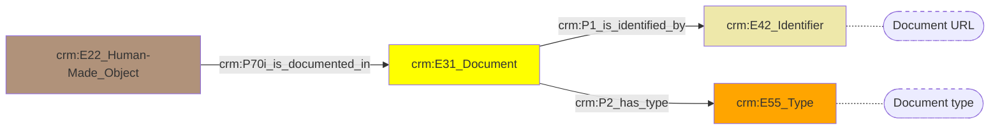

```mermaid
graph LR
style cdab1c72-6674-11ee-974d-00163e71351b fill:#ffff00
style cdab22d0-6674-11ee-974d-00163e71351b fill:#EEE8AA
style cdab2762-6674-11ee-974d-00163e71351b fill:#ffa500
style fa95cea2-dd27-11ed-9655-00163e71351b fill:#B0927A
style cdab22d0-6674-11ee-974d-00163e71351b_s stroke-dasharray: 5
style cdab2762-6674-11ee-974d-00163e71351b_s stroke-dasharray: 5
cdab1c72-6674-11ee-974d-00163e71351b["crm:E31_Document"]-->|"crm:P1_is_identified_by"|cdab22d0-6674-11ee-974d-00163e71351b["crm:E42_Identifier"]
cdab1c72-6674-11ee-974d-00163e71351b["crm:E31_Document"]-->|"crm:P2_has_type"|cdab2762-6674-11ee-974d-00163e71351b["crm:E55_Type"]
fa95cea2-dd27-11ed-9655-00163e71351b["crm:E22_Human-Made_Object"]-->|"crm:P70i_is_documented_in"|cdab1c72-6674-11ee-974d-00163e71351b["crm:E31_Document"]
cdab22d0-6674-11ee-974d-00163e71351b["crm:E42_Identifier"]-.-cdab22d0-6674-11ee-974d-00163e71351b_s(["Document URL"])
cdab2762-6674-11ee-974d-00163e71351b["crm:E55_Type"]-.-cdab2762-6674-11ee-974d-00163e71351b_s(["Document type"])
```
