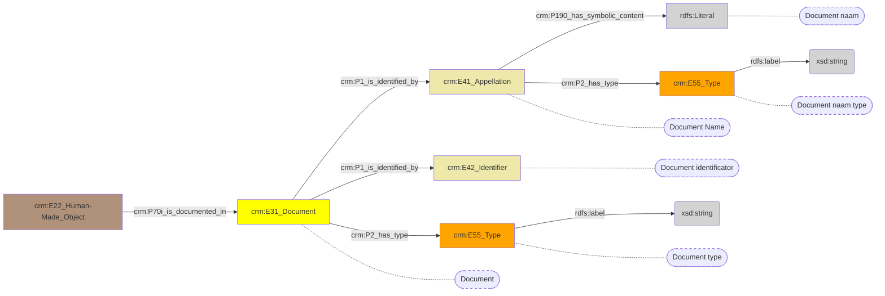

```mermaid
graph LR
cdab170e-6674-11ee-974d-00163e71351b["crm:E41_Appellation"]-->|"crm:P190_has_symbolic_content"|cdab2104-6674-11ee-974d-00163e71351b(rdfs:Literal)
cdab2460-6674-11ee-974d-00163e71351b["crm:E55_Type"]-->|"rdfs:label"|cdab25dc-6674-11ee-974d-00163e71351b(xsd:string)
cdab2762-6674-11ee-974d-00163e71351b["crm:E55_Type"]-->|"rdfs:label"|cdab28de-6674-11ee-974d-00163e71351b(xsd:string)
cdab170e-6674-11ee-974d-00163e71351b["crm:E41_Appellation"]-->|"crm:P2_has_type"|cdab2460-6674-11ee-974d-00163e71351b["crm:E55_Type"]
cdab1c72-6674-11ee-974d-00163e71351b["crm:E31_Document"]-->|"crm:P1_is_identified_by"|cdab170e-6674-11ee-974d-00163e71351b["crm:E41_Appellation"]
cdab1c72-6674-11ee-974d-00163e71351b["crm:E31_Document"]-->|"crm:P1_is_identified_by"|cdab22d0-6674-11ee-974d-00163e71351b["crm:E42_Identifier"]
cdab1c72-6674-11ee-974d-00163e71351b["crm:E31_Document"]-->|"crm:P2_has_type"|cdab2762-6674-11ee-974d-00163e71351b["crm:E55_Type"]
fa95cea2-dd27-11ed-9655-00163e71351b["crm:E22_Human-Made_Object"]-->|"crm:P70i_is_documented_in"|cdab1c72-6674-11ee-974d-00163e71351b["crm:E31_Document"]
cdab2104-6674-11ee-974d-00163e71351b["rdfs:Literal"]-.-cdab2104-6674-11ee-974d-00163e71351b_s(["Document naam"])
cdab2460-6674-11ee-974d-00163e71351b["crm:E55_Type"]-.-cdab2460-6674-11ee-974d-00163e71351b_s(["Document naam type"])
cdab170e-6674-11ee-974d-00163e71351b["crm:E41_Appellation"]-.-cdab170e-6674-11ee-974d-00163e71351b_s(["Document Name"])
cdab22d0-6674-11ee-974d-00163e71351b["crm:E42_Identifier"]-.-cdab22d0-6674-11ee-974d-00163e71351b_s(["Document identificator"])
cdab2762-6674-11ee-974d-00163e71351b["crm:E55_Type"]-.-cdab2762-6674-11ee-974d-00163e71351b_s(["Document type"])
cdab1c72-6674-11ee-974d-00163e71351b["crm:E31_Document"]-.-cdab1c72-6674-11ee-974d-00163e71351b_s(["Document"])
style cdab2104-6674-11ee-974d-00163e71351b_s stroke-dasharray: 5
style cdab2460-6674-11ee-974d-00163e71351b_s stroke-dasharray: 5
style cdab170e-6674-11ee-974d-00163e71351b_s stroke-dasharray: 5
style cdab22d0-6674-11ee-974d-00163e71351b_s stroke-dasharray: 5
style cdab2762-6674-11ee-974d-00163e71351b_s stroke-dasharray: 5
style cdab1c72-6674-11ee-974d-00163e71351b_s stroke-dasharray: 5
style cdab170e-6674-11ee-974d-00163e71351b fill:#EEE8AA
style cdab1c72-6674-11ee-974d-00163e71351b fill:#ffff00
style cdab2104-6674-11ee-974d-00163e71351b fill:#D3D3D3
style cdab22d0-6674-11ee-974d-00163e71351b fill:#EEE8AA
style cdab2460-6674-11ee-974d-00163e71351b fill:#ffa500
style cdab25dc-6674-11ee-974d-00163e71351b fill:#D3D3D3
style cdab2762-6674-11ee-974d-00163e71351b fill:#ffa500
style cdab28de-6674-11ee-974d-00163e71351b fill:#D3D3D3
style fa95cea2-dd27-11ed-9655-00163e71351b fill:#B0927A
```
