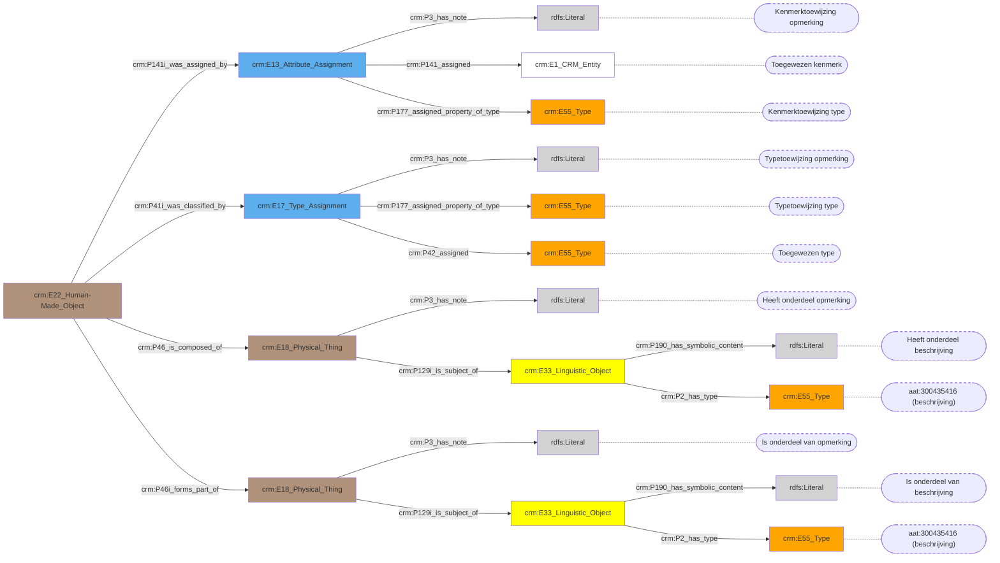

```mermaid
graph LR
style 13037bd2-181f-11ef-8625-960002548b4f fill:#5DAEEC
style 13037e31-181f-11ef-8b75-960002548b4f fill:#ffa500
style 13037ee1-181f-11ef-9f3d-960002548b4f fill:#D3D3D3
style 13037f63-181f-11ef-860a-960002548b4f fill:#ffffff
style 2de9cc6c-136b-11ef-bcb7-960002548b4f fill:#D3D3D3
style 481b1292-136a-11ef-992f-960002548b4f fill:#B0927A
style 4ae00d89-12d0-11ef-829f-960002548b4f fill:#B0927A
style 4b2dbaf6-136b-11ef-a9b6-960002548b4f fill:#ffa500
style 67d7a2d9-136a-11ef-81bd-960002548b4f fill:#D3D3D3
style 70c64122-1359-11ef-91a0-960002548b4f fill:#ffff00
style aa7e3142-12d0-11ef-bf9e-960002548b4f fill:#D3D3D3
style b6658160-1359-11ef-b19a-960002548b4f fill:#ffa500
style e233ecd1-136a-11ef-8896-960002548b4f fill:#ffff00
style f48c7ee6-1359-11ef-beda-960002548b4f fill:#D3D3D3
style fa95cea2-dd27-11ed-9655-00163e71351b fill:#B0927A
style feacd607-181e-11ef-9739-960002548b4f fill:#5DAEEC
style feacd83c-181e-11ef-ba0b-960002548b4f fill:#ffa500
style feacd8ea-181e-11ef-bb50-960002548b4f fill:#ffa500
style feacda5f-181e-11ef-9a6c-960002548b4f fill:#D3D3D3
13037bd2-181f-11ef-8625-960002548b4f["crm:E13_Attribute_Assignment"]-->|"crm:P3_has_note"|13037ee1-181f-11ef-9f3d-960002548b4f(rdfs:Literal)
481b1292-136a-11ef-992f-960002548b4f["crm:E18_Physical_Thing"]-->|"crm:P3_has_note"|67d7a2d9-136a-11ef-81bd-960002548b4f(rdfs:Literal)
4ae00d89-12d0-11ef-829f-960002548b4f["crm:E18_Physical_Thing"]-->|"crm:P3_has_note"|aa7e3142-12d0-11ef-bf9e-960002548b4f(rdfs:Literal)
70c64122-1359-11ef-91a0-960002548b4f["crm:E33_Linguistic_Object"]-->|"crm:P190_has_symbolic_content"|f48c7ee6-1359-11ef-beda-960002548b4f(rdfs:Literal)
e233ecd1-136a-11ef-8896-960002548b4f["crm:E33_Linguistic_Object"]-->|"crm:P190_has_symbolic_content"|2de9cc6c-136b-11ef-bcb7-960002548b4f(rdfs:Literal)
feacd607-181e-11ef-9739-960002548b4f["crm:E17_Type_Assignment"]-->|"crm:P3_has_note"|feacda5f-181e-11ef-9a6c-960002548b4f(rdfs:Literal)
style 13037f63-181f-11ef-860a-960002548b4f_s stroke-dasharray: 5
style 13037e31-181f-11ef-8b75-960002548b4f_s stroke-dasharray: 5
style 13037ee1-181f-11ef-9f3d-960002548b4f_s stroke-dasharray: 5
style 67d7a2d9-136a-11ef-81bd-960002548b4f_s stroke-dasharray: 5
style aa7e3142-12d0-11ef-bf9e-960002548b4f_s stroke-dasharray: 5
style f48c7ee6-1359-11ef-beda-960002548b4f_s stroke-dasharray: 5
style b6658160-1359-11ef-b19a-960002548b4f_s stroke-dasharray: 5
style 2de9cc6c-136b-11ef-bcb7-960002548b4f_s stroke-dasharray: 5
style 4b2dbaf6-136b-11ef-a9b6-960002548b4f_s stroke-dasharray: 5
style feacd83c-181e-11ef-ba0b-960002548b4f_s stroke-dasharray: 5
style feacda5f-181e-11ef-9a6c-960002548b4f_s stroke-dasharray: 5
style feacd8ea-181e-11ef-bb50-960002548b4f_s stroke-dasharray: 5
13037f63-181f-11ef-860a-960002548b4f["crm:E1_CRM_Entity"]-.-13037f63-181f-11ef-860a-960002548b4f_s(["Toegewezen kenmerk"])
13037e31-181f-11ef-8b75-960002548b4f["crm:E55_Type"]-.-13037e31-181f-11ef-8b75-960002548b4f_s(["Kenmerktoewijzing type"])
13037ee1-181f-11ef-9f3d-960002548b4f["rdfs:Literal"]-.-13037ee1-181f-11ef-9f3d-960002548b4f_s(["Kenmerktoewijzing opmerking"])
67d7a2d9-136a-11ef-81bd-960002548b4f["rdfs:Literal"]-.-67d7a2d9-136a-11ef-81bd-960002548b4f_s(["Heeft onderdeel opmerking"])
aa7e3142-12d0-11ef-bf9e-960002548b4f["rdfs:Literal"]-.-aa7e3142-12d0-11ef-bf9e-960002548b4f_s(["Is onderdeel van opmerking"])
f48c7ee6-1359-11ef-beda-960002548b4f["rdfs:Literal"]-.-f48c7ee6-1359-11ef-beda-960002548b4f_s(["Is onderdeel van beschrijving"])
b6658160-1359-11ef-b19a-960002548b4f["crm:E55_Type"]-.-b6658160-1359-11ef-b19a-960002548b4f_s(["aat:300435416 (beschrijving)"])
2de9cc6c-136b-11ef-bcb7-960002548b4f["rdfs:Literal"]-.-2de9cc6c-136b-11ef-bcb7-960002548b4f_s(["Heeft onderdeel beschrijving"])
4b2dbaf6-136b-11ef-a9b6-960002548b4f["crm:E55_Type"]-.-4b2dbaf6-136b-11ef-a9b6-960002548b4f_s(["aat:300435416 (beschrijving)"])
feacd83c-181e-11ef-ba0b-960002548b4f["crm:E55_Type"]-.-feacd83c-181e-11ef-ba0b-960002548b4f_s(["Typetoewijzing type"])
feacda5f-181e-11ef-9a6c-960002548b4f["rdfs:Literal"]-.-feacda5f-181e-11ef-9a6c-960002548b4f_s(["Typetoewijzing opmerking"])
feacd8ea-181e-11ef-bb50-960002548b4f["crm:E55_Type"]-.-feacd8ea-181e-11ef-bb50-960002548b4f_s(["Toegewezen type"])
13037bd2-181f-11ef-8625-960002548b4f["crm:E13_Attribute_Assignment"]-->|"crm:P141_assigned"|13037f63-181f-11ef-860a-960002548b4f["crm:E1_CRM_Entity"]
13037bd2-181f-11ef-8625-960002548b4f["crm:E13_Attribute_Assignment"]-->|"crm:P177_assigned_property_of_type"|13037e31-181f-11ef-8b75-960002548b4f["crm:E55_Type"]
481b1292-136a-11ef-992f-960002548b4f["crm:E18_Physical_Thing"]-->|"crm:P129i_is_subject_of"|e233ecd1-136a-11ef-8896-960002548b4f["crm:E33_Linguistic_Object"]
4ae00d89-12d0-11ef-829f-960002548b4f["crm:E18_Physical_Thing"]-->|"crm:P129i_is_subject_of"|70c64122-1359-11ef-91a0-960002548b4f["crm:E33_Linguistic_Object"]
70c64122-1359-11ef-91a0-960002548b4f["crm:E33_Linguistic_Object"]-->|"crm:P2_has_type"|b6658160-1359-11ef-b19a-960002548b4f["crm:E55_Type"]
e233ecd1-136a-11ef-8896-960002548b4f["crm:E33_Linguistic_Object"]-->|"crm:P2_has_type"|4b2dbaf6-136b-11ef-a9b6-960002548b4f["crm:E55_Type"]
fa95cea2-dd27-11ed-9655-00163e71351b["crm:E22_Human-Made_Object"]-->|"crm:P141i_was_assigned_by"|13037bd2-181f-11ef-8625-960002548b4f["crm:E13_Attribute_Assignment"]
fa95cea2-dd27-11ed-9655-00163e71351b["crm:E22_Human-Made_Object"]-->|"crm:P41i_was_classified_by"|feacd607-181e-11ef-9739-960002548b4f["crm:E17_Type_Assignment"]
fa95cea2-dd27-11ed-9655-00163e71351b["crm:E22_Human-Made_Object"]-->|"crm:P46_is_composed_of"|481b1292-136a-11ef-992f-960002548b4f["crm:E18_Physical_Thing"]
fa95cea2-dd27-11ed-9655-00163e71351b["crm:E22_Human-Made_Object"]-->|"crm:P46i_forms_part_of"|4ae00d89-12d0-11ef-829f-960002548b4f["crm:E18_Physical_Thing"]
feacd607-181e-11ef-9739-960002548b4f["crm:E17_Type_Assignment"]-->|"crm:P177_assigned_property_of_type"|feacd83c-181e-11ef-ba0b-960002548b4f["crm:E55_Type"]
feacd607-181e-11ef-9739-960002548b4f["crm:E17_Type_Assignment"]-->|"crm:P42_assigned"|feacd8ea-181e-11ef-bb50-960002548b4f["crm:E55_Type"]
```
