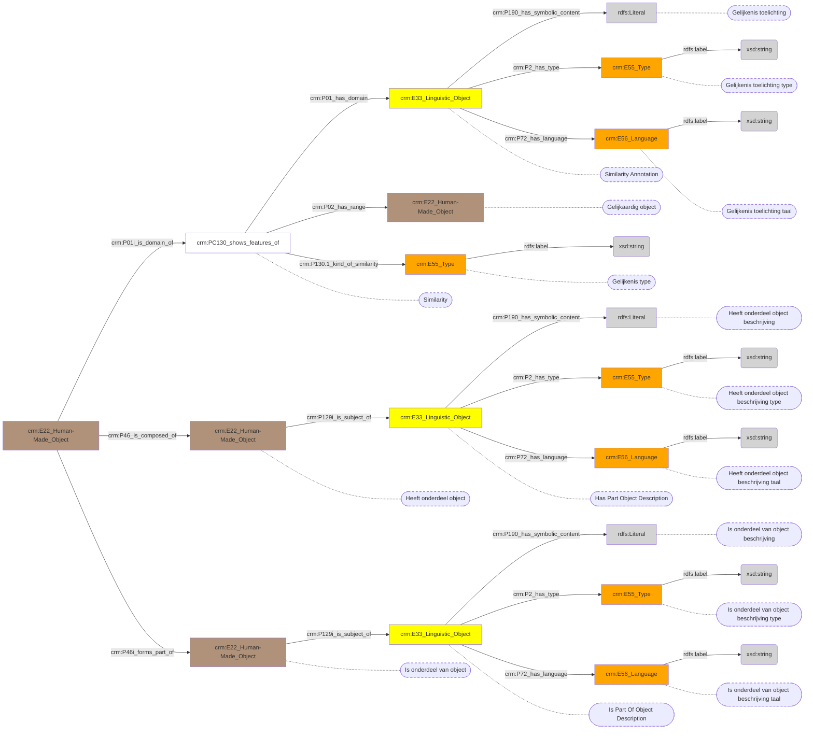

```mermaid
graph LR
6667fc1a-7c8b-11ee-b60e-00163e71351b["crm:E33_Linguistic_Object"]-->|"crm:P190_has_symbolic_content"|66680264-7c8b-11ee-b60e-00163e71351b(rdfs:Literal)
6667fff8-7c8b-11ee-b60e-00163e71351b["crm:E55_Type"]-->|"rdfs:label"|6668044e-7c8b-11ee-b60e-00163e71351b(xsd:string)
6668016a-7c8b-11ee-b60e-00163e71351b["crm:E56_Language"]-->|"rdfs:label"|6668035e-7c8b-11ee-b60e-00163e71351b(xsd:string)
911ac432-7c8c-11ee-a49f-00163e71351b["crm:E33_Linguistic_Object"]-->|"crm:P190_has_symbolic_content"|911aca68-7c8c-11ee-a49f-00163e71351b(rdfs:Literal)
911ac838-7c8c-11ee-a49f-00163e71351b["crm:E55_Type"]-->|"rdfs:label"|911acc34-7c8c-11ee-a49f-00163e71351b(xsd:string)
911ac96e-7c8c-11ee-a49f-00163e71351b["crm:E56_Language"]-->|"rdfs:label"|911acb4e-7c8c-11ee-a49f-00163e71351b(xsd:string)
e12c2308-1012-11ee-b0c4-00163e71351b["crm:E55_Type"]-->|"rdfs:label"|2dac340c-20bc-11ee-a9ac-00163e71351b(xsd:string)
ff7b00a6-7c8a-11ee-a49f-00163e71351b["crm:E33_Linguistic_Object"]-->|"crm:P190_has_symbolic_content"|ff7b1d48-7c8a-11ee-a49f-00163e71351b(rdfs:Literal)
ff7b1af0-7c8a-11ee-a49f-00163e71351b["crm:E55_Type"]-->|"rdfs:label"|ff7b1f6e-7c8a-11ee-a49f-00163e71351b(xsd:string)
ff7b1c44-7c8a-11ee-a49f-00163e71351b["crm:E56_Language"]-->|"rdfs:label"|ff7b1e7e-7c8a-11ee-a49f-00163e71351b(xsd:string)
261b3b98-45a1-11ee-bc5c-00163e71351b["crm:E22_Human-Made_Object"]-->|"crm:P129i_is_subject_of"|ff7b00a6-7c8a-11ee-a49f-00163e71351b["crm:E33_Linguistic_Object"]
6667fc1a-7c8b-11ee-b60e-00163e71351b["crm:E33_Linguistic_Object"]-->|"crm:P2_has_type"|6667fff8-7c8b-11ee-b60e-00163e71351b["crm:E55_Type"]
6667fc1a-7c8b-11ee-b60e-00163e71351b["crm:E33_Linguistic_Object"]-->|"crm:P72_has_language"|6668016a-7c8b-11ee-b60e-00163e71351b["crm:E56_Language"]
911ac432-7c8c-11ee-a49f-00163e71351b["crm:E33_Linguistic_Object"]-->|"crm:P2_has_type"|911ac838-7c8c-11ee-a49f-00163e71351b["crm:E55_Type"]
911ac432-7c8c-11ee-a49f-00163e71351b["crm:E33_Linguistic_Object"]-->|"crm:P72_has_language"|911ac96e-7c8c-11ee-a49f-00163e71351b["crm:E56_Language"]
c4cb4c24-45a1-11ee-bc5c-00163e71351b["crm:E22_Human-Made_Object"]-->|"crm:P129i_is_subject_of"|6667fc1a-7c8b-11ee-b60e-00163e71351b["crm:E33_Linguistic_Object"]
ede4725e-100c-11ee-a9ac-00163e71351b["crm:PC130_shows_features_of"]-->|"crm:P01_has_domain"|911ac432-7c8c-11ee-a49f-00163e71351b["crm:E33_Linguistic_Object"]
ede4725e-100c-11ee-a9ac-00163e71351b["crm:PC130_shows_features_of"]-->|"crm:P02_has_range"|bf90198e-1012-11ee-a9ac-00163e71351b["crm:E22_Human-Made_Object"]
ede4725e-100c-11ee-a9ac-00163e71351b["crm:PC130_shows_features_of"]-->|"crm:P130.1_kind_of_similarity"|e12c2308-1012-11ee-b0c4-00163e71351b["crm:E55_Type"]
fa95cea2-dd27-11ed-9655-00163e71351b["crm:E22_Human-Made_Object"]-->|"crm:P01i_is_domain_of"|ede4725e-100c-11ee-a9ac-00163e71351b["crm:PC130_shows_features_of"]
fa95cea2-dd27-11ed-9655-00163e71351b["crm:E22_Human-Made_Object"]-->|"crm:P46_is_composed_of"|261b3b98-45a1-11ee-bc5c-00163e71351b["crm:E22_Human-Made_Object"]
fa95cea2-dd27-11ed-9655-00163e71351b["crm:E22_Human-Made_Object"]-->|"crm:P46i_forms_part_of"|c4cb4c24-45a1-11ee-bc5c-00163e71351b["crm:E22_Human-Made_Object"]
ff7b00a6-7c8a-11ee-a49f-00163e71351b["crm:E33_Linguistic_Object"]-->|"crm:P2_has_type"|ff7b1af0-7c8a-11ee-a49f-00163e71351b["crm:E55_Type"]
ff7b00a6-7c8a-11ee-a49f-00163e71351b["crm:E33_Linguistic_Object"]-->|"crm:P72_has_language"|ff7b1c44-7c8a-11ee-a49f-00163e71351b["crm:E56_Language"]
ff7b00a6-7c8a-11ee-a49f-00163e71351b["crm:E33_Linguistic_Object"]-.-ff7b00a6-7c8a-11ee-a49f-00163e71351b_s(["Has Part Object Description"])
66680264-7c8b-11ee-b60e-00163e71351b["rdfs:Literal"]-.-66680264-7c8b-11ee-b60e-00163e71351b_s(["Is onderdeel van object beschrijving"])
6667fff8-7c8b-11ee-b60e-00163e71351b["crm:E55_Type"]-.-6667fff8-7c8b-11ee-b60e-00163e71351b_s(["Is onderdeel van object beschrijving type"])
6668016a-7c8b-11ee-b60e-00163e71351b["crm:E56_Language"]-.-6668016a-7c8b-11ee-b60e-00163e71351b_s(["Is onderdeel van object beschrijving taal"])
911aca68-7c8c-11ee-a49f-00163e71351b["rdfs:Literal"]-.-911aca68-7c8c-11ee-a49f-00163e71351b_s(["Gelijkenis toelichting"])
911ac838-7c8c-11ee-a49f-00163e71351b["crm:E55_Type"]-.-911ac838-7c8c-11ee-a49f-00163e71351b_s(["Gelijkenis toelichting type"])
911ac96e-7c8c-11ee-a49f-00163e71351b["crm:E56_Language"]-.-911ac96e-7c8c-11ee-a49f-00163e71351b_s(["Gelijkenis toelichting taal"])
6667fc1a-7c8b-11ee-b60e-00163e71351b["crm:E33_Linguistic_Object"]-.-6667fc1a-7c8b-11ee-b60e-00163e71351b_s(["Is Part Of Object Description"])
911ac432-7c8c-11ee-a49f-00163e71351b["crm:E33_Linguistic_Object"]-.-911ac432-7c8c-11ee-a49f-00163e71351b_s(["Similarity Annotation"])
bf90198e-1012-11ee-a9ac-00163e71351b["crm:E22_Human-Made_Object"]-.-bf90198e-1012-11ee-a9ac-00163e71351b_s(["Gelijkaardig object"])
e12c2308-1012-11ee-b0c4-00163e71351b["crm:E55_Type"]-.-e12c2308-1012-11ee-b0c4-00163e71351b_s(["Gelijkenis type"])
ede4725e-100c-11ee-a9ac-00163e71351b["crm:PC130_shows_features_of"]-.-ede4725e-100c-11ee-a9ac-00163e71351b_s(["Similarity"])
261b3b98-45a1-11ee-bc5c-00163e71351b["crm:E22_Human-Made_Object"]-.-261b3b98-45a1-11ee-bc5c-00163e71351b_s(["Heeft onderdeel object"])
c4cb4c24-45a1-11ee-bc5c-00163e71351b["crm:E22_Human-Made_Object"]-.-c4cb4c24-45a1-11ee-bc5c-00163e71351b_s(["Is onderdeel van object"])
ff7b1d48-7c8a-11ee-a49f-00163e71351b["rdfs:Literal"]-.-ff7b1d48-7c8a-11ee-a49f-00163e71351b_s(["Heeft onderdeel object beschrijving"])
ff7b1af0-7c8a-11ee-a49f-00163e71351b["crm:E55_Type"]-.-ff7b1af0-7c8a-11ee-a49f-00163e71351b_s(["Heeft onderdeel object beschrijving type"])
ff7b1c44-7c8a-11ee-a49f-00163e71351b["crm:E56_Language"]-.-ff7b1c44-7c8a-11ee-a49f-00163e71351b_s(["Heeft onderdeel object beschrijving taal"])
style ff7b00a6-7c8a-11ee-a49f-00163e71351b_s stroke-dasharray: 5
style 66680264-7c8b-11ee-b60e-00163e71351b_s stroke-dasharray: 5
style 6667fff8-7c8b-11ee-b60e-00163e71351b_s stroke-dasharray: 5
style 6668016a-7c8b-11ee-b60e-00163e71351b_s stroke-dasharray: 5
style 911aca68-7c8c-11ee-a49f-00163e71351b_s stroke-dasharray: 5
style 911ac838-7c8c-11ee-a49f-00163e71351b_s stroke-dasharray: 5
style 911ac96e-7c8c-11ee-a49f-00163e71351b_s stroke-dasharray: 5
style 6667fc1a-7c8b-11ee-b60e-00163e71351b_s stroke-dasharray: 5
style 911ac432-7c8c-11ee-a49f-00163e71351b_s stroke-dasharray: 5
style bf90198e-1012-11ee-a9ac-00163e71351b_s stroke-dasharray: 5
style e12c2308-1012-11ee-b0c4-00163e71351b_s stroke-dasharray: 5
style ede4725e-100c-11ee-a9ac-00163e71351b_s stroke-dasharray: 5
style 261b3b98-45a1-11ee-bc5c-00163e71351b_s stroke-dasharray: 5
style c4cb4c24-45a1-11ee-bc5c-00163e71351b_s stroke-dasharray: 5
style ff7b1d48-7c8a-11ee-a49f-00163e71351b_s stroke-dasharray: 5
style ff7b1af0-7c8a-11ee-a49f-00163e71351b_s stroke-dasharray: 5
style ff7b1c44-7c8a-11ee-a49f-00163e71351b_s stroke-dasharray: 5
style 261b3b98-45a1-11ee-bc5c-00163e71351b fill:#B0927A
style 2dac340c-20bc-11ee-a9ac-00163e71351b fill:#D3D3D3
style 6667fc1a-7c8b-11ee-b60e-00163e71351b fill:#ffff00
style 6667fff8-7c8b-11ee-b60e-00163e71351b fill:#ffa500
style 6668016a-7c8b-11ee-b60e-00163e71351b fill:#ffa500
style 66680264-7c8b-11ee-b60e-00163e71351b fill:#D3D3D3
style 6668035e-7c8b-11ee-b60e-00163e71351b fill:#D3D3D3
style 6668044e-7c8b-11ee-b60e-00163e71351b fill:#D3D3D3
style 911ac432-7c8c-11ee-a49f-00163e71351b fill:#ffff00
style 911ac838-7c8c-11ee-a49f-00163e71351b fill:#ffa500
style 911ac96e-7c8c-11ee-a49f-00163e71351b fill:#ffa500
style 911aca68-7c8c-11ee-a49f-00163e71351b fill:#D3D3D3
style 911acb4e-7c8c-11ee-a49f-00163e71351b fill:#D3D3D3
style 911acc34-7c8c-11ee-a49f-00163e71351b fill:#D3D3D3
style bf90198e-1012-11ee-a9ac-00163e71351b fill:#B0927A
style c4cb4c24-45a1-11ee-bc5c-00163e71351b fill:#B0927A
style e12c2308-1012-11ee-b0c4-00163e71351b fill:#ffa500
style ede4725e-100c-11ee-a9ac-00163e71351b fill:#ffffff
style fa95cea2-dd27-11ed-9655-00163e71351b fill:#B0927A
style ff7b00a6-7c8a-11ee-a49f-00163e71351b fill:#ffff00
style ff7b1af0-7c8a-11ee-a49f-00163e71351b fill:#ffa500
style ff7b1c44-7c8a-11ee-a49f-00163e71351b fill:#ffa500
style ff7b1d48-7c8a-11ee-a49f-00163e71351b fill:#D3D3D3
style ff7b1e7e-7c8a-11ee-a49f-00163e71351b fill:#D3D3D3
style ff7b1f6e-7c8a-11ee-a49f-00163e71351b fill:#D3D3D3
```
