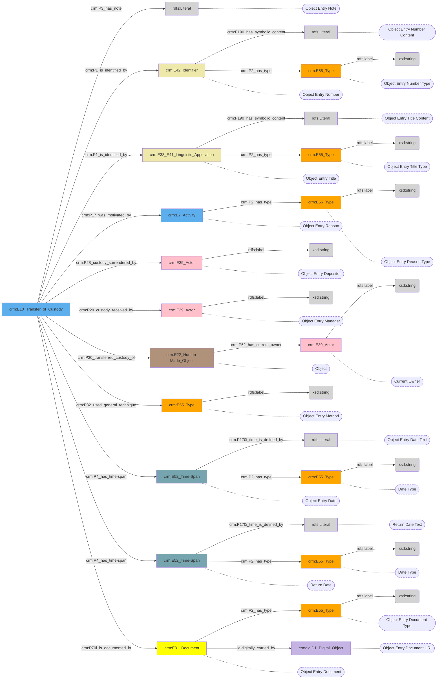

```mermaid
graph LR
0e5e9f22-f0e5-11ee-9217-960002548b4f["crm:E55_Type"]-->|"rdfs:label"|25bf268f-f0e5-11ee-80ed-960002548b4f(xsd:string)
1d7ad933-e1d7-11ee-a71a-960002548b4f["crm:E55_Type"]-->|"rdfs:label"|ca2ee292-e1d8-11ee-8e38-960002548b4f(xsd:string)
1f9b4f98-e1d6-11ee-ad77-960002548b4f["crm:E10_Transfer_of_Custody"]-->|"crm:P3_has_note"|05db6ace-e1d7-11ee-908d-960002548b4f(rdfs:Literal)
2571b569-e1d9-11ee-b642-960002548b4f["crm:E39_Actor"]-->|"rdfs:label"|555a16ed-e1da-11ee-bea5-960002548b4f(xsd:string)
321c9896-f0e5-11ee-a497-960002548b4f["crm:E55_Type"]-->|"rdfs:label"|47314ab7-f0e5-11ee-b978-960002548b4f(xsd:string)
39d92082-e1d7-11ee-946d-960002548b4f["crm:E42_Identifier"]-->|"crm:P190_has_symbolic_content"|4aa351dc-e1d7-11ee-b0be-960002548b4f(rdfs:Literal)
63caf351-e1d7-11ee-bba4-960002548b4f["crm:E55_Type"]-->|"rdfs:label"|b05ad79b-e1d8-11ee-93ef-960002548b4f(xsd:string)
8345d854-e1d8-11ee-ab66-960002548b4f["crm:E55_Type"]-->|"rdfs:label"|a08b17b4-e1d8-11ee-a444-960002548b4f(xsd:string)
90661a1c-e1d6-11ee-9c04-960002548b4f["crm:E39_Actor"]-->|"rdfs:label"|77eef018-e1da-11ee-a237-960002548b4f(xsd:string)
910ecd41-e1d7-11ee-98e8-960002548b4f["crm:E33_E41_Linguistic_Appellation"]-->|"crm:P190_has_symbolic_content"|a98e21c4-e1d7-11ee-a32c-960002548b4f(rdfs:Literal)
b85df4cb-e1d7-11ee-a75a-960002548b4f["crm:E55_Type"]-->|"rdfs:label"|bea7a34f-e1d8-11ee-86b2-960002548b4f(xsd:string)
c644cd72-e1d6-11ee-b2ca-960002548b4f["crm:E39_Actor"]-->|"rdfs:label"|6c9f91c3-e1da-11ee-8a53-960002548b4f(xsd:string)
d6a2c87a-e1dd-11ee-a454-960002548b4f["crm:E55_Type"]-->|"rdfs:label"|7db5b5ff-e1e6-11ee-aebe-960002548b4f(xsd:string)
e9c1c0b3-e1d7-11ee-b638-960002548b4f["crm:E52_Time-Span"]-->|"crm:P170i_time_is_defined_by"|84c54bea-f0e4-11ee-a203-960002548b4f(rdfs:Literal)
eaae2b41-f0e4-11ee-af7a-960002548b4f["crm:E52_Time-Span"]-->|"crm:P170i_time_is_defined_by"|004a3d68-f0e5-11ee-a548-960002548b4f(rdfs:Literal)
1f9b4f98-e1d6-11ee-ad77-960002548b4f["crm:E10_Transfer_of_Custody"]-->|"crm:P1_is_identified_by"|39d92082-e1d7-11ee-946d-960002548b4f["crm:E42_Identifier"]
1f9b4f98-e1d6-11ee-ad77-960002548b4f["crm:E10_Transfer_of_Custody"]-->|"crm:P1_is_identified_by"|910ecd41-e1d7-11ee-98e8-960002548b4f["crm:E33_E41_Linguistic_Appellation"]
1f9b4f98-e1d6-11ee-ad77-960002548b4f["crm:E10_Transfer_of_Custody"]-->|"crm:P17_was_motivated_by"|2f653c79-e1d8-11ee-9b7a-960002548b4f["crm:E7_Activity"]
1f9b4f98-e1d6-11ee-ad77-960002548b4f["crm:E10_Transfer_of_Custody"]-->|"crm:P28_custody_surrendered_by"|c644cd72-e1d6-11ee-b2ca-960002548b4f["crm:E39_Actor"]
1f9b4f98-e1d6-11ee-ad77-960002548b4f["crm:E10_Transfer_of_Custody"]-->|"crm:P29_custody_received_by"|90661a1c-e1d6-11ee-9c04-960002548b4f["crm:E39_Actor"]
1f9b4f98-e1d6-11ee-ad77-960002548b4f["crm:E10_Transfer_of_Custody"]-->|"crm:P30_transferred_custody_of"|77be0d4f-e1d6-11ee-b2ca-960002548b4f["crm:E22_Human-Made_Object"]
1f9b4f98-e1d6-11ee-ad77-960002548b4f["crm:E10_Transfer_of_Custody"]-->|"crm:P32_used_general_technique"|1d7ad933-e1d7-11ee-a71a-960002548b4f["crm:E55_Type"]
1f9b4f98-e1d6-11ee-ad77-960002548b4f["crm:E10_Transfer_of_Custody"]-->|"crm:P4_has_time-span"|e9c1c0b3-e1d7-11ee-b638-960002548b4f["crm:E52_Time-Span"]
1f9b4f98-e1d6-11ee-ad77-960002548b4f["crm:E10_Transfer_of_Custody"]-->|"crm:P4_has_time-span"|eaae2b41-f0e4-11ee-af7a-960002548b4f["crm:E52_Time-Span"]
1f9b4f98-e1d6-11ee-ad77-960002548b4f["crm:E10_Transfer_of_Custody"]-->|"crm:P70i_is_documented_in"|373eddf6-e1dd-11ee-a9dd-960002548b4f["crm:E31_Document"]
2f653c79-e1d8-11ee-9b7a-960002548b4f["crm:E7_Activity"]-->|"crm:P2_has_type"|8345d854-e1d8-11ee-ab66-960002548b4f["crm:E55_Type"]
373eddf6-e1dd-11ee-a9dd-960002548b4f["crm:E31_Document"]-->|"crm:P2_has_type"|d6a2c87a-e1dd-11ee-a454-960002548b4f["crm:E55_Type"]
373eddf6-e1dd-11ee-a9dd-960002548b4f["crm:E31_Document"]-->|"la:digitally_carried_by"|a306efc4-e1dd-11ee-be19-960002548b4f["crmdig:D1_Digital_Object"]
39d92082-e1d7-11ee-946d-960002548b4f["crm:E42_Identifier"]-->|"crm:P2_has_type"|63caf351-e1d7-11ee-bba4-960002548b4f["crm:E55_Type"]
77be0d4f-e1d6-11ee-b2ca-960002548b4f["crm:E22_Human-Made_Object"]-->|"crm:P52_has_current_owner"|2571b569-e1d9-11ee-b642-960002548b4f["crm:E39_Actor"]
910ecd41-e1d7-11ee-98e8-960002548b4f["crm:E33_E41_Linguistic_Appellation"]-->|"crm:P2_has_type"|b85df4cb-e1d7-11ee-a75a-960002548b4f["crm:E55_Type"]
e9c1c0b3-e1d7-11ee-b638-960002548b4f["crm:E52_Time-Span"]-->|"crm:P2_has_type"|0e5e9f22-f0e5-11ee-9217-960002548b4f["crm:E55_Type"]
eaae2b41-f0e4-11ee-af7a-960002548b4f["crm:E52_Time-Span"]-->|"crm:P2_has_type"|321c9896-f0e5-11ee-a497-960002548b4f["crm:E55_Type"]
style 39d92082-e1d7-11ee-946d-960002548b4f_s stroke-dasharray: 5
style 910ecd41-e1d7-11ee-98e8-960002548b4f_s stroke-dasharray: 5
style 2f653c79-e1d8-11ee-9b7a-960002548b4f_s stroke-dasharray: 5
style c644cd72-e1d6-11ee-b2ca-960002548b4f_s stroke-dasharray: 5
style 90661a1c-e1d6-11ee-9c04-960002548b4f_s stroke-dasharray: 5
style 05db6ace-e1d7-11ee-908d-960002548b4f_s stroke-dasharray: 5
style 77be0d4f-e1d6-11ee-b2ca-960002548b4f_s stroke-dasharray: 5
style 1d7ad933-e1d7-11ee-a71a-960002548b4f_s stroke-dasharray: 5
style e9c1c0b3-e1d7-11ee-b638-960002548b4f_s stroke-dasharray: 5
style eaae2b41-f0e4-11ee-af7a-960002548b4f_s stroke-dasharray: 5
style 373eddf6-e1dd-11ee-a9dd-960002548b4f_s stroke-dasharray: 5
style 8345d854-e1d8-11ee-ab66-960002548b4f_s stroke-dasharray: 5
style d6a2c87a-e1dd-11ee-a454-960002548b4f_s stroke-dasharray: 5
style a306efc4-e1dd-11ee-be19-960002548b4f_s stroke-dasharray: 5
style 4aa351dc-e1d7-11ee-b0be-960002548b4f_s stroke-dasharray: 5
style 63caf351-e1d7-11ee-bba4-960002548b4f_s stroke-dasharray: 5
style 2571b569-e1d9-11ee-b642-960002548b4f_s stroke-dasharray: 5
style a98e21c4-e1d7-11ee-a32c-960002548b4f_s stroke-dasharray: 5
style b85df4cb-e1d7-11ee-a75a-960002548b4f_s stroke-dasharray: 5
style 84c54bea-f0e4-11ee-a203-960002548b4f_s stroke-dasharray: 5
style 0e5e9f22-f0e5-11ee-9217-960002548b4f_s stroke-dasharray: 5
style 004a3d68-f0e5-11ee-a548-960002548b4f_s stroke-dasharray: 5
style 321c9896-f0e5-11ee-a497-960002548b4f_s stroke-dasharray: 5
39d92082-e1d7-11ee-946d-960002548b4f["crm:E42_Identifier"]-.-39d92082-e1d7-11ee-946d-960002548b4f_s(["Object Entry Number"])
910ecd41-e1d7-11ee-98e8-960002548b4f["crm:E33_E41_Linguistic_Appellation"]-.-910ecd41-e1d7-11ee-98e8-960002548b4f_s(["Object Entry Title"])
2f653c79-e1d8-11ee-9b7a-960002548b4f["crm:E7_Activity"]-.-2f653c79-e1d8-11ee-9b7a-960002548b4f_s(["Object Entry Reason"])
c644cd72-e1d6-11ee-b2ca-960002548b4f["crm:E39_Actor"]-.-c644cd72-e1d6-11ee-b2ca-960002548b4f_s(["Object Entry Depositor"])
90661a1c-e1d6-11ee-9c04-960002548b4f["crm:E39_Actor"]-.-90661a1c-e1d6-11ee-9c04-960002548b4f_s(["Object Entry Manager"])
05db6ace-e1d7-11ee-908d-960002548b4f["rdfs:Literal"]-.-05db6ace-e1d7-11ee-908d-960002548b4f_s(["Object Entry Note"])
77be0d4f-e1d6-11ee-b2ca-960002548b4f["crm:E22_Human-Made_Object"]-.-77be0d4f-e1d6-11ee-b2ca-960002548b4f_s(["Object"])
1d7ad933-e1d7-11ee-a71a-960002548b4f["crm:E55_Type"]-.-1d7ad933-e1d7-11ee-a71a-960002548b4f_s(["Object Entry Method"])
e9c1c0b3-e1d7-11ee-b638-960002548b4f["crm:E52_Time-Span"]-.-e9c1c0b3-e1d7-11ee-b638-960002548b4f_s(["Object Entry Date"])
eaae2b41-f0e4-11ee-af7a-960002548b4f["crm:E52_Time-Span"]-.-eaae2b41-f0e4-11ee-af7a-960002548b4f_s(["Return Date"])
373eddf6-e1dd-11ee-a9dd-960002548b4f["crm:E31_Document"]-.-373eddf6-e1dd-11ee-a9dd-960002548b4f_s(["Object Entry Document"])
8345d854-e1d8-11ee-ab66-960002548b4f["crm:E55_Type"]-.-8345d854-e1d8-11ee-ab66-960002548b4f_s(["Object Entry Reason Type"])
d6a2c87a-e1dd-11ee-a454-960002548b4f["crm:E55_Type"]-.-d6a2c87a-e1dd-11ee-a454-960002548b4f_s(["Object Entry Document Type"])
a306efc4-e1dd-11ee-be19-960002548b4f["crmdig:D1_Digital_Object"]-.-a306efc4-e1dd-11ee-be19-960002548b4f_s(["Object Entry Document URI"])
4aa351dc-e1d7-11ee-b0be-960002548b4f["rdfs:Literal"]-.-4aa351dc-e1d7-11ee-b0be-960002548b4f_s(["Object Entry Number Content"])
63caf351-e1d7-11ee-bba4-960002548b4f["crm:E55_Type"]-.-63caf351-e1d7-11ee-bba4-960002548b4f_s(["Object Entry Number Type"])
2571b569-e1d9-11ee-b642-960002548b4f["crm:E39_Actor"]-.-2571b569-e1d9-11ee-b642-960002548b4f_s(["Current Owner"])
a98e21c4-e1d7-11ee-a32c-960002548b4f["rdfs:Literal"]-.-a98e21c4-e1d7-11ee-a32c-960002548b4f_s(["Object Entry Title Content"])
b85df4cb-e1d7-11ee-a75a-960002548b4f["crm:E55_Type"]-.-b85df4cb-e1d7-11ee-a75a-960002548b4f_s(["Object Entry Title Type"])
84c54bea-f0e4-11ee-a203-960002548b4f["rdfs:Literal"]-.-84c54bea-f0e4-11ee-a203-960002548b4f_s(["Object Entry Date Text"])
0e5e9f22-f0e5-11ee-9217-960002548b4f["crm:E55_Type"]-.-0e5e9f22-f0e5-11ee-9217-960002548b4f_s(["Date Type"])
004a3d68-f0e5-11ee-a548-960002548b4f["rdfs:Literal"]-.-004a3d68-f0e5-11ee-a548-960002548b4f_s(["Return Date Text"])
321c9896-f0e5-11ee-a497-960002548b4f["crm:E55_Type"]-.-321c9896-f0e5-11ee-a497-960002548b4f_s(["Date Type"])
style 004a3d68-f0e5-11ee-a548-960002548b4f fill:#D3D3D3
style 05db6ace-e1d7-11ee-908d-960002548b4f fill:#D3D3D3
style 0e5e9f22-f0e5-11ee-9217-960002548b4f fill:#ffa500
style 1d7ad933-e1d7-11ee-a71a-960002548b4f fill:#ffa500
style 1f9b4f98-e1d6-11ee-ad77-960002548b4f fill:#5DAEEC
style 2571b569-e1d9-11ee-b642-960002548b4f fill:#ffc0cb
style 25bf268f-f0e5-11ee-80ed-960002548b4f fill:#D3D3D3
style 2f653c79-e1d8-11ee-9b7a-960002548b4f fill:#5DAEEC
style 321c9896-f0e5-11ee-a497-960002548b4f fill:#ffa500
style 373eddf6-e1dd-11ee-a9dd-960002548b4f fill:#ffff00
style 39d92082-e1d7-11ee-946d-960002548b4f fill:#EEE8AA
style 47314ab7-f0e5-11ee-b978-960002548b4f fill:#D3D3D3
style 4aa351dc-e1d7-11ee-b0be-960002548b4f fill:#D3D3D3
style 555a16ed-e1da-11ee-bea5-960002548b4f fill:#D3D3D3
style 63caf351-e1d7-11ee-bba4-960002548b4f fill:#ffa500
style 6c9f91c3-e1da-11ee-8a53-960002548b4f fill:#D3D3D3
style 77be0d4f-e1d6-11ee-b2ca-960002548b4f fill:#B0927A
style 77eef018-e1da-11ee-a237-960002548b4f fill:#D3D3D3
style 7db5b5ff-e1e6-11ee-aebe-960002548b4f fill:#D3D3D3
style 8345d854-e1d8-11ee-ab66-960002548b4f fill:#ffa500
style 84c54bea-f0e4-11ee-a203-960002548b4f fill:#D3D3D3
style 90661a1c-e1d6-11ee-9c04-960002548b4f fill:#ffc0cb
style 910ecd41-e1d7-11ee-98e8-960002548b4f fill:#EEE8AA
style a08b17b4-e1d8-11ee-a444-960002548b4f fill:#D3D3D3
style a306efc4-e1dd-11ee-be19-960002548b4f fill:#C5B4E3
style a98e21c4-e1d7-11ee-a32c-960002548b4f fill:#D3D3D3
style b05ad79b-e1d8-11ee-93ef-960002548b4f fill:#D3D3D3
style b85df4cb-e1d7-11ee-a75a-960002548b4f fill:#ffa500
style bea7a34f-e1d8-11ee-86b2-960002548b4f fill:#D3D3D3
style c644cd72-e1d6-11ee-b2ca-960002548b4f fill:#ffc0cb
style ca2ee292-e1d8-11ee-8e38-960002548b4f fill:#D3D3D3
style d6a2c87a-e1dd-11ee-a454-960002548b4f fill:#ffa500
style e9c1c0b3-e1d7-11ee-b638-960002548b4f fill:#76A5AF
style eaae2b41-f0e4-11ee-af7a-960002548b4f fill:#76A5AF
```
