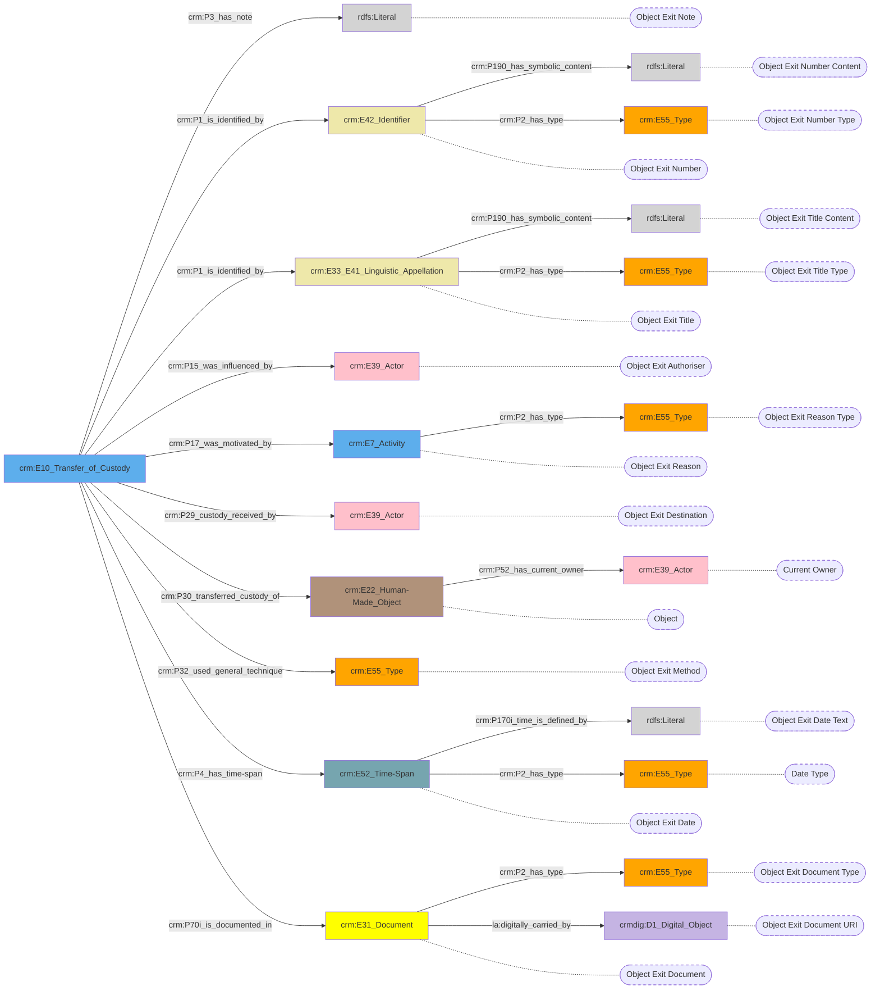

```mermaid
graph LR
style a59d46eb-f0e5-11ee-a7f7-960002548b4f fill:#D3D3D3
style c45a12c8-f0e5-11ee-87ed-960002548b4f fill:#ffa500
style d8da3363-e53d-11ee-a83a-960002548b4f fill:#B0927A
style d8da4e4c-e53d-11ee-949f-960002548b4f fill:#EEE8AA
style d8da50b7-e53d-11ee-81f4-960002548b4f fill:#EEE8AA
style d8da5318-e53d-11ee-9e14-960002548b4f fill:#76A5AF
style d8da5585-e53d-11ee-a49f-960002548b4f fill:#ffa500
style d8da57e5-e53d-11ee-b83e-960002548b4f fill:#D3D3D3
style d8da5a57-e53d-11ee-afff-960002548b4f fill:#ffc0cb
style d8da5d13-e53d-11ee-bac0-960002548b4f fill:#ffc0cb
style d8da5f7a-e53d-11ee-bb1a-960002548b4f fill:#5DAEEC
style d8da61e8-e53d-11ee-9265-960002548b4f fill:#ffff00
style d8da6449-e53d-11ee-abdd-960002548b4f fill:#5DAEEC
style d8da6a12-e53d-11ee-bf4f-960002548b4f fill:#ffc0cb
style d8da6cc1-e53d-11ee-b287-960002548b4f fill:#D3D3D3
style d8da6d39-e53d-11ee-9595-960002548b4f fill:#ffa500
style d8da6e1b-e53d-11ee-b4f4-960002548b4f fill:#ffa500
style d8da6f11-e53d-11ee-ac8f-960002548b4f fill:#D3D3D3
style d8da7211-e53d-11ee-b5e1-960002548b4f fill:#ffa500
style d8da72f2-e53d-11ee-9674-960002548b4f fill:#ffa500
style d8da7446-e53d-11ee-961f-960002548b4f fill:#C5B4E3
d8da4e4c-e53d-11ee-949f-960002548b4f["crm:E42_Identifier"]-->|"crm:P190_has_symbolic_content"|d8da6cc1-e53d-11ee-b287-960002548b4f(rdfs:Literal)
d8da50b7-e53d-11ee-81f4-960002548b4f["crm:E33_E41_Linguistic_Appellation"]-->|"crm:P190_has_symbolic_content"|d8da6f11-e53d-11ee-ac8f-960002548b4f(rdfs:Literal)
d8da5318-e53d-11ee-9e14-960002548b4f["crm:E52_Time-Span"]-->|"crm:P170i_time_is_defined_by"|a59d46eb-f0e5-11ee-a7f7-960002548b4f(rdfs:Literal)
d8da6449-e53d-11ee-abdd-960002548b4f["crm:E10_Transfer_of_Custody"]-->|"crm:P3_has_note"|d8da57e5-e53d-11ee-b83e-960002548b4f(rdfs:Literal)
d8da3363-e53d-11ee-a83a-960002548b4f["crm:E22_Human-Made_Object"]-->|"crm:P52_has_current_owner"|d8da6a12-e53d-11ee-bf4f-960002548b4f["crm:E39_Actor"]
d8da4e4c-e53d-11ee-949f-960002548b4f["crm:E42_Identifier"]-->|"crm:P2_has_type"|d8da6d39-e53d-11ee-9595-960002548b4f["crm:E55_Type"]
d8da50b7-e53d-11ee-81f4-960002548b4f["crm:E33_E41_Linguistic_Appellation"]-->|"crm:P2_has_type"|d8da6e1b-e53d-11ee-b4f4-960002548b4f["crm:E55_Type"]
d8da5318-e53d-11ee-9e14-960002548b4f["crm:E52_Time-Span"]-->|"crm:P2_has_type"|c45a12c8-f0e5-11ee-87ed-960002548b4f["crm:E55_Type"]
d8da5f7a-e53d-11ee-bb1a-960002548b4f["crm:E7_Activity"]-->|"crm:P2_has_type"|d8da7211-e53d-11ee-b5e1-960002548b4f["crm:E55_Type"]
d8da61e8-e53d-11ee-9265-960002548b4f["crm:E31_Document"]-->|"crm:P2_has_type"|d8da72f2-e53d-11ee-9674-960002548b4f["crm:E55_Type"]
d8da61e8-e53d-11ee-9265-960002548b4f["crm:E31_Document"]-->|"la:digitally_carried_by"|d8da7446-e53d-11ee-961f-960002548b4f["crmdig:D1_Digital_Object"]
d8da6449-e53d-11ee-abdd-960002548b4f["crm:E10_Transfer_of_Custody"]-->|"crm:P1_is_identified_by"|d8da4e4c-e53d-11ee-949f-960002548b4f["crm:E42_Identifier"]
d8da6449-e53d-11ee-abdd-960002548b4f["crm:E10_Transfer_of_Custody"]-->|"crm:P1_is_identified_by"|d8da50b7-e53d-11ee-81f4-960002548b4f["crm:E33_E41_Linguistic_Appellation"]
d8da6449-e53d-11ee-abdd-960002548b4f["crm:E10_Transfer_of_Custody"]-->|"crm:P15_was_influenced_by"|d8da5d13-e53d-11ee-bac0-960002548b4f["crm:E39_Actor"]
d8da6449-e53d-11ee-abdd-960002548b4f["crm:E10_Transfer_of_Custody"]-->|"crm:P17_was_motivated_by"|d8da5f7a-e53d-11ee-bb1a-960002548b4f["crm:E7_Activity"]
d8da6449-e53d-11ee-abdd-960002548b4f["crm:E10_Transfer_of_Custody"]-->|"crm:P29_custody_received_by"|d8da5a57-e53d-11ee-afff-960002548b4f["crm:E39_Actor"]
d8da6449-e53d-11ee-abdd-960002548b4f["crm:E10_Transfer_of_Custody"]-->|"crm:P30_transferred_custody_of"|d8da3363-e53d-11ee-a83a-960002548b4f["crm:E22_Human-Made_Object"]
d8da6449-e53d-11ee-abdd-960002548b4f["crm:E10_Transfer_of_Custody"]-->|"crm:P32_used_general_technique"|d8da5585-e53d-11ee-a49f-960002548b4f["crm:E55_Type"]
d8da6449-e53d-11ee-abdd-960002548b4f["crm:E10_Transfer_of_Custody"]-->|"crm:P4_has_time-span"|d8da5318-e53d-11ee-9e14-960002548b4f["crm:E52_Time-Span"]
d8da6449-e53d-11ee-abdd-960002548b4f["crm:E10_Transfer_of_Custody"]-->|"crm:P70i_is_documented_in"|d8da61e8-e53d-11ee-9265-960002548b4f["crm:E31_Document"]
style d8da6a12-e53d-11ee-bf4f-960002548b4f_s stroke-dasharray: 5
style d8da6cc1-e53d-11ee-b287-960002548b4f_s stroke-dasharray: 5
style d8da6d39-e53d-11ee-9595-960002548b4f_s stroke-dasharray: 5
style d8da6f11-e53d-11ee-ac8f-960002548b4f_s stroke-dasharray: 5
style d8da6e1b-e53d-11ee-b4f4-960002548b4f_s stroke-dasharray: 5
style a59d46eb-f0e5-11ee-a7f7-960002548b4f_s stroke-dasharray: 5
style c45a12c8-f0e5-11ee-87ed-960002548b4f_s stroke-dasharray: 5
style d8da7211-e53d-11ee-b5e1-960002548b4f_s stroke-dasharray: 5
style d8da72f2-e53d-11ee-9674-960002548b4f_s stroke-dasharray: 5
style d8da7446-e53d-11ee-961f-960002548b4f_s stroke-dasharray: 5
style d8da4e4c-e53d-11ee-949f-960002548b4f_s stroke-dasharray: 5
style d8da50b7-e53d-11ee-81f4-960002548b4f_s stroke-dasharray: 5
style d8da5d13-e53d-11ee-bac0-960002548b4f_s stroke-dasharray: 5
style d8da5f7a-e53d-11ee-bb1a-960002548b4f_s stroke-dasharray: 5
style d8da5a57-e53d-11ee-afff-960002548b4f_s stroke-dasharray: 5
style d8da57e5-e53d-11ee-b83e-960002548b4f_s stroke-dasharray: 5
style d8da3363-e53d-11ee-a83a-960002548b4f_s stroke-dasharray: 5
style d8da5585-e53d-11ee-a49f-960002548b4f_s stroke-dasharray: 5
style d8da5318-e53d-11ee-9e14-960002548b4f_s stroke-dasharray: 5
style d8da61e8-e53d-11ee-9265-960002548b4f_s stroke-dasharray: 5
d8da6a12-e53d-11ee-bf4f-960002548b4f["crm:E39_Actor"]-.-d8da6a12-e53d-11ee-bf4f-960002548b4f_s(["Current Owner"])
d8da6cc1-e53d-11ee-b287-960002548b4f["rdfs:Literal"]-.-d8da6cc1-e53d-11ee-b287-960002548b4f_s(["Object Exit Number Content"])
d8da6d39-e53d-11ee-9595-960002548b4f["crm:E55_Type"]-.-d8da6d39-e53d-11ee-9595-960002548b4f_s(["Object Exit Number Type"])
d8da6f11-e53d-11ee-ac8f-960002548b4f["rdfs:Literal"]-.-d8da6f11-e53d-11ee-ac8f-960002548b4f_s(["Object Exit Title Content"])
d8da6e1b-e53d-11ee-b4f4-960002548b4f["crm:E55_Type"]-.-d8da6e1b-e53d-11ee-b4f4-960002548b4f_s(["Object Exit Title Type"])
a59d46eb-f0e5-11ee-a7f7-960002548b4f["rdfs:Literal"]-.-a59d46eb-f0e5-11ee-a7f7-960002548b4f_s(["Object Exit Date Text"])
c45a12c8-f0e5-11ee-87ed-960002548b4f["crm:E55_Type"]-.-c45a12c8-f0e5-11ee-87ed-960002548b4f_s(["Date Type"])
d8da7211-e53d-11ee-b5e1-960002548b4f["crm:E55_Type"]-.-d8da7211-e53d-11ee-b5e1-960002548b4f_s(["Object Exit Reason Type"])
d8da72f2-e53d-11ee-9674-960002548b4f["crm:E55_Type"]-.-d8da72f2-e53d-11ee-9674-960002548b4f_s(["Object Exit Document Type"])
d8da7446-e53d-11ee-961f-960002548b4f["crmdig:D1_Digital_Object"]-.-d8da7446-e53d-11ee-961f-960002548b4f_s(["Object Exit Document URI"])
d8da4e4c-e53d-11ee-949f-960002548b4f["crm:E42_Identifier"]-.-d8da4e4c-e53d-11ee-949f-960002548b4f_s(["Object Exit Number"])
d8da50b7-e53d-11ee-81f4-960002548b4f["crm:E33_E41_Linguistic_Appellation"]-.-d8da50b7-e53d-11ee-81f4-960002548b4f_s(["Object Exit Title"])
d8da5d13-e53d-11ee-bac0-960002548b4f["crm:E39_Actor"]-.-d8da5d13-e53d-11ee-bac0-960002548b4f_s(["Object Exit Authoriser"])
d8da5f7a-e53d-11ee-bb1a-960002548b4f["crm:E7_Activity"]-.-d8da5f7a-e53d-11ee-bb1a-960002548b4f_s(["Object Exit Reason"])
d8da5a57-e53d-11ee-afff-960002548b4f["crm:E39_Actor"]-.-d8da5a57-e53d-11ee-afff-960002548b4f_s(["Object Exit Destination"])
d8da57e5-e53d-11ee-b83e-960002548b4f["rdfs:Literal"]-.-d8da57e5-e53d-11ee-b83e-960002548b4f_s(["Object Exit Note"])
d8da3363-e53d-11ee-a83a-960002548b4f["crm:E22_Human-Made_Object"]-.-d8da3363-e53d-11ee-a83a-960002548b4f_s(["Object"])
d8da5585-e53d-11ee-a49f-960002548b4f["crm:E55_Type"]-.-d8da5585-e53d-11ee-a49f-960002548b4f_s(["Object Exit Method"])
d8da5318-e53d-11ee-9e14-960002548b4f["crm:E52_Time-Span"]-.-d8da5318-e53d-11ee-9e14-960002548b4f_s(["Object Exit Date"])
d8da61e8-e53d-11ee-9265-960002548b4f["crm:E31_Document"]-.-d8da61e8-e53d-11ee-9265-960002548b4f_s(["Object Exit Document"])
```
