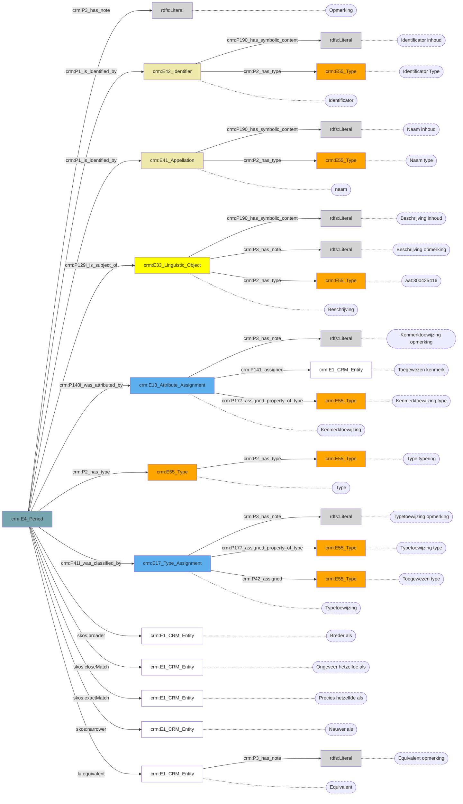

```mermaid
graph LR
03f79e92-18e8-11ef-8e83-960002548b4f["crm:E17_Type_Assignment"]-->|"crm:P3_has_note"|03f7a8a1-18e8-11ef-a23d-960002548b4f(rdfs:Literal)
29b9c9c6-ef21-11ed-a1e6-00163e71351b["crm:E4_Period"]-->|"crm:P3_has_note"|e8b78153-18e7-11ef-9612-960002548b4f(rdfs:Literal)
601d8971-18e7-11ef-8994-960002548b4f["crm:E13_Attribute_Assignment"]-->|"crm:P3_has_note"|601d9133-18e7-11ef-bdad-960002548b4f(rdfs:Literal)
77e0edcd-18e7-11ef-a6bb-960002548b4f["crm:E33_Linguistic_Object"]-->|"crm:P190_has_symbolic_content"|77e0f704-18e7-11ef-9231-960002548b4f(rdfs:Literal)
77e0edcd-18e7-11ef-a6bb-960002548b4f["crm:E33_Linguistic_Object"]-->|"crm:P3_has_note"|77e0f333-18e7-11ef-acb5-960002548b4f(rdfs:Literal)
845c6791-18e7-11ef-a842-960002548b4f["crm:E1_CRM_Entity"]-->|"crm:P3_has_note"|845c6c6a-18e7-11ef-bdb0-960002548b4f(rdfs:Literal)
97ea71f5-18e7-11ef-9ad0-960002548b4f["crm:E42_Identifier"]-->|"crm:P190_has_symbolic_content"|97ea785e-18e7-11ef-85be-960002548b4f(rdfs:Literal)
ae87805c-18e7-11ef-9f4e-960002548b4f["crm:E41_Appellation"]-->|"crm:P190_has_symbolic_content"|ae878847-18e7-11ef-86e0-960002548b4f(rdfs:Literal)
03f79e92-18e8-11ef-8e83-960002548b4f["crm:E17_Type_Assignment"]-->|"crm:P177_assigned_property_of_type"|03f7a385-18e8-11ef-8618-960002548b4f["crm:E55_Type"]
03f79e92-18e8-11ef-8e83-960002548b4f["crm:E17_Type_Assignment"]-->|"crm:P42_assigned"|03f7a514-18e8-11ef-860f-960002548b4f["crm:E55_Type"]
29b9c9c6-ef21-11ed-a1e6-00163e71351b["crm:E4_Period"]-->|"crm:P1_is_identified_by"|97ea71f5-18e7-11ef-9ad0-960002548b4f["crm:E42_Identifier"]
29b9c9c6-ef21-11ed-a1e6-00163e71351b["crm:E4_Period"]-->|"crm:P1_is_identified_by"|ae87805c-18e7-11ef-9f4e-960002548b4f["crm:E41_Appellation"]
29b9c9c6-ef21-11ed-a1e6-00163e71351b["crm:E4_Period"]-->|"crm:P129i_is_subject_of"|77e0edcd-18e7-11ef-a6bb-960002548b4f["crm:E33_Linguistic_Object"]
29b9c9c6-ef21-11ed-a1e6-00163e71351b["crm:E4_Period"]-->|"crm:P140i_was_attributed_by"|601d8971-18e7-11ef-8994-960002548b4f["crm:E13_Attribute_Assignment"]
29b9c9c6-ef21-11ed-a1e6-00163e71351b["crm:E4_Period"]-->|"crm:P2_has_type"|f6f47909-18e7-11ef-a920-960002548b4f["crm:E55_Type"]
29b9c9c6-ef21-11ed-a1e6-00163e71351b["crm:E4_Period"]-->|"crm:P41i_was_classified_by"|03f79e92-18e8-11ef-8e83-960002548b4f["crm:E17_Type_Assignment"]
29b9c9c6-ef21-11ed-a1e6-00163e71351b["crm:E4_Period"]-->|"skos:broader"|17e9cfbc-1dad-11ef-94b5-960002548b4f["crm:E1_CRM_Entity"]
29b9c9c6-ef21-11ed-a1e6-00163e71351b["crm:E4_Period"]-->|"skos:closeMatch"|1e005315-1dad-11ef-b901-960002548b4f["crm:E1_CRM_Entity"]
29b9c9c6-ef21-11ed-a1e6-00163e71351b["crm:E4_Period"]-->|"skos:exactMatch"|243101f5-1dad-11ef-baa6-960002548b4f["crm:E1_CRM_Entity"]
29b9c9c6-ef21-11ed-a1e6-00163e71351b["crm:E4_Period"]-->|"skos:narrower"|299c2d52-1dad-11ef-9802-960002548b4f["crm:E1_CRM_Entity"]
29b9c9c6-ef21-11ed-a1e6-00163e71351b["crm:E4_Period"]-->|"la:equivalent"|845c6791-18e7-11ef-a842-960002548b4f["crm:E1_CRM_Entity"]
601d8971-18e7-11ef-8994-960002548b4f["crm:E13_Attribute_Assignment"]-->|"crm:P141_assigned"|601d8ff4-18e7-11ef-b93e-960002548b4f["crm:E1_CRM_Entity"]
601d8971-18e7-11ef-8994-960002548b4f["crm:E13_Attribute_Assignment"]-->|"crm:P177_assigned_property_of_type"|601d8e66-18e7-11ef-b512-960002548b4f["crm:E55_Type"]
77e0edcd-18e7-11ef-a6bb-960002548b4f["crm:E33_Linguistic_Object"]-->|"crm:P2_has_type"|77e0f9bc-18e7-11ef-9056-960002548b4f["crm:E55_Type"]
97ea71f5-18e7-11ef-9ad0-960002548b4f["crm:E42_Identifier"]-->|"crm:P2_has_type"|97ea79a5-18e7-11ef-87f9-960002548b4f["crm:E55_Type"]
ae87805c-18e7-11ef-9f4e-960002548b4f["crm:E41_Appellation"]-->|"crm:P2_has_type"|ae878579-18e7-11ef-a85a-960002548b4f["crm:E55_Type"]
f6f47909-18e7-11ef-a920-960002548b4f["crm:E55_Type"]-->|"crm:P2_has_type"|f6f47e09-18e7-11ef-87de-960002548b4f["crm:E55_Type"]
style 03f79e92-18e8-11ef-8e83-960002548b4f fill:#5DAEEC
style 03f7a385-18e8-11ef-8618-960002548b4f fill:#ffa500
style 03f7a514-18e8-11ef-860f-960002548b4f fill:#ffa500
style 03f7a8a1-18e8-11ef-a23d-960002548b4f fill:#D3D3D3
style 17e9cfbc-1dad-11ef-94b5-960002548b4f fill:#ffffff
style 1e005315-1dad-11ef-b901-960002548b4f fill:#ffffff
style 243101f5-1dad-11ef-baa6-960002548b4f fill:#ffffff
style 299c2d52-1dad-11ef-9802-960002548b4f fill:#ffffff
style 29b9c9c6-ef21-11ed-a1e6-00163e71351b fill:#76A5AF
style 601d8971-18e7-11ef-8994-960002548b4f fill:#5DAEEC
style 601d8e66-18e7-11ef-b512-960002548b4f fill:#ffa500
style 601d8ff4-18e7-11ef-b93e-960002548b4f fill:#ffffff
style 601d9133-18e7-11ef-bdad-960002548b4f fill:#D3D3D3
style 77e0edcd-18e7-11ef-a6bb-960002548b4f fill:#ffff00
style 77e0f333-18e7-11ef-acb5-960002548b4f fill:#D3D3D3
style 77e0f704-18e7-11ef-9231-960002548b4f fill:#D3D3D3
style 77e0f9bc-18e7-11ef-9056-960002548b4f fill:#ffa500
style 845c6791-18e7-11ef-a842-960002548b4f fill:#ffffff
style 845c6c6a-18e7-11ef-bdb0-960002548b4f fill:#D3D3D3
style 97ea71f5-18e7-11ef-9ad0-960002548b4f fill:#EEE8AA
style 97ea785e-18e7-11ef-85be-960002548b4f fill:#D3D3D3
style 97ea79a5-18e7-11ef-87f9-960002548b4f fill:#ffa500
style ae87805c-18e7-11ef-9f4e-960002548b4f fill:#EEE8AA
style ae878579-18e7-11ef-a85a-960002548b4f fill:#ffa500
style ae878847-18e7-11ef-86e0-960002548b4f fill:#D3D3D3
style e8b78153-18e7-11ef-9612-960002548b4f fill:#D3D3D3
style f6f47909-18e7-11ef-a920-960002548b4f fill:#ffa500
style f6f47e09-18e7-11ef-87de-960002548b4f fill:#ffa500
style 03f7a385-18e8-11ef-8618-960002548b4f_s stroke-dasharray: 5
style 03f7a8a1-18e8-11ef-a23d-960002548b4f_s stroke-dasharray: 5
style 03f7a514-18e8-11ef-860f-960002548b4f_s stroke-dasharray: 5
style 97ea71f5-18e7-11ef-9ad0-960002548b4f_s stroke-dasharray: 5
style ae87805c-18e7-11ef-9f4e-960002548b4f_s stroke-dasharray: 5
style 77e0edcd-18e7-11ef-a6bb-960002548b4f_s stroke-dasharray: 5
style 601d8971-18e7-11ef-8994-960002548b4f_s stroke-dasharray: 5
style f6f47909-18e7-11ef-a920-960002548b4f_s stroke-dasharray: 5
style e8b78153-18e7-11ef-9612-960002548b4f_s stroke-dasharray: 5
style 03f79e92-18e8-11ef-8e83-960002548b4f_s stroke-dasharray: 5
style 17e9cfbc-1dad-11ef-94b5-960002548b4f_s stroke-dasharray: 5
style 1e005315-1dad-11ef-b901-960002548b4f_s stroke-dasharray: 5
style 243101f5-1dad-11ef-baa6-960002548b4f_s stroke-dasharray: 5
style 299c2d52-1dad-11ef-9802-960002548b4f_s stroke-dasharray: 5
style 845c6791-18e7-11ef-a842-960002548b4f_s stroke-dasharray: 5
style 601d8ff4-18e7-11ef-b93e-960002548b4f_s stroke-dasharray: 5
style 601d8e66-18e7-11ef-b512-960002548b4f_s stroke-dasharray: 5
style 601d9133-18e7-11ef-bdad-960002548b4f_s stroke-dasharray: 5
style 77e0f704-18e7-11ef-9231-960002548b4f_s stroke-dasharray: 5
style 77e0f9bc-18e7-11ef-9056-960002548b4f_s stroke-dasharray: 5
style 77e0f333-18e7-11ef-acb5-960002548b4f_s stroke-dasharray: 5
style 845c6c6a-18e7-11ef-bdb0-960002548b4f_s stroke-dasharray: 5
style 97ea785e-18e7-11ef-85be-960002548b4f_s stroke-dasharray: 5
style 97ea79a5-18e7-11ef-87f9-960002548b4f_s stroke-dasharray: 5
style ae878847-18e7-11ef-86e0-960002548b4f_s stroke-dasharray: 5
style ae878579-18e7-11ef-a85a-960002548b4f_s stroke-dasharray: 5
style f6f47e09-18e7-11ef-87de-960002548b4f_s stroke-dasharray: 5
03f7a385-18e8-11ef-8618-960002548b4f["crm:E55_Type"]-.-03f7a385-18e8-11ef-8618-960002548b4f_s(["Typetoewijzing type"])
03f7a8a1-18e8-11ef-a23d-960002548b4f["rdfs:Literal"]-.-03f7a8a1-18e8-11ef-a23d-960002548b4f_s(["Typetoewijzing opmerking"])
03f7a514-18e8-11ef-860f-960002548b4f["crm:E55_Type"]-.-03f7a514-18e8-11ef-860f-960002548b4f_s(["Toegewezen type"])
97ea71f5-18e7-11ef-9ad0-960002548b4f["crm:E42_Identifier"]-.-97ea71f5-18e7-11ef-9ad0-960002548b4f_s(["Identificator"])
ae87805c-18e7-11ef-9f4e-960002548b4f["crm:E41_Appellation"]-.-ae87805c-18e7-11ef-9f4e-960002548b4f_s(["naam"])
77e0edcd-18e7-11ef-a6bb-960002548b4f["crm:E33_Linguistic_Object"]-.-77e0edcd-18e7-11ef-a6bb-960002548b4f_s(["Beschrijving"])
601d8971-18e7-11ef-8994-960002548b4f["crm:E13_Attribute_Assignment"]-.-601d8971-18e7-11ef-8994-960002548b4f_s(["Kenmerktoewijzing"])
f6f47909-18e7-11ef-a920-960002548b4f["crm:E55_Type"]-.-f6f47909-18e7-11ef-a920-960002548b4f_s(["Type"])
e8b78153-18e7-11ef-9612-960002548b4f["rdfs:Literal"]-.-e8b78153-18e7-11ef-9612-960002548b4f_s(["Opmerking"])
03f79e92-18e8-11ef-8e83-960002548b4f["crm:E17_Type_Assignment"]-.-03f79e92-18e8-11ef-8e83-960002548b4f_s(["Typetoewijzing"])
17e9cfbc-1dad-11ef-94b5-960002548b4f["crm:E1_CRM_Entity"]-.-17e9cfbc-1dad-11ef-94b5-960002548b4f_s(["Breder als"])
1e005315-1dad-11ef-b901-960002548b4f["crm:E1_CRM_Entity"]-.-1e005315-1dad-11ef-b901-960002548b4f_s(["Ongeveer hetzelfde als"])
243101f5-1dad-11ef-baa6-960002548b4f["crm:E1_CRM_Entity"]-.-243101f5-1dad-11ef-baa6-960002548b4f_s(["Precies hetzelfde als"])
299c2d52-1dad-11ef-9802-960002548b4f["crm:E1_CRM_Entity"]-.-299c2d52-1dad-11ef-9802-960002548b4f_s(["Nauwer als"])
845c6791-18e7-11ef-a842-960002548b4f["crm:E1_CRM_Entity"]-.-845c6791-18e7-11ef-a842-960002548b4f_s(["Equivalent"])
601d8ff4-18e7-11ef-b93e-960002548b4f["crm:E1_CRM_Entity"]-.-601d8ff4-18e7-11ef-b93e-960002548b4f_s(["Toegewezen kenmerk"])
601d8e66-18e7-11ef-b512-960002548b4f["crm:E55_Type"]-.-601d8e66-18e7-11ef-b512-960002548b4f_s(["Kenmerktoewijzing type"])
601d9133-18e7-11ef-bdad-960002548b4f["rdfs:Literal"]-.-601d9133-18e7-11ef-bdad-960002548b4f_s(["Kenmerktoewijzing opmerking"])
77e0f704-18e7-11ef-9231-960002548b4f["rdfs:Literal"]-.-77e0f704-18e7-11ef-9231-960002548b4f_s(["Beschrijving inhoud"])
77e0f9bc-18e7-11ef-9056-960002548b4f["crm:E55_Type"]-.-77e0f9bc-18e7-11ef-9056-960002548b4f_s(["aat:300435416"])
77e0f333-18e7-11ef-acb5-960002548b4f["rdfs:Literal"]-.-77e0f333-18e7-11ef-acb5-960002548b4f_s(["Beschrijving opmerking"])
845c6c6a-18e7-11ef-bdb0-960002548b4f["rdfs:Literal"]-.-845c6c6a-18e7-11ef-bdb0-960002548b4f_s(["Equivalent opmerking"])
97ea785e-18e7-11ef-85be-960002548b4f["rdfs:Literal"]-.-97ea785e-18e7-11ef-85be-960002548b4f_s(["Identificator inhoud"])
97ea79a5-18e7-11ef-87f9-960002548b4f["crm:E55_Type"]-.-97ea79a5-18e7-11ef-87f9-960002548b4f_s(["Identificator Type"])
ae878847-18e7-11ef-86e0-960002548b4f["rdfs:Literal"]-.-ae878847-18e7-11ef-86e0-960002548b4f_s(["Naam inhoud"])
ae878579-18e7-11ef-a85a-960002548b4f["crm:E55_Type"]-.-ae878579-18e7-11ef-a85a-960002548b4f_s(["Naam type"])
f6f47e09-18e7-11ef-87de-960002548b4f["crm:E55_Type"]-.-f6f47e09-18e7-11ef-87de-960002548b4f_s(["Type typering"])
```
