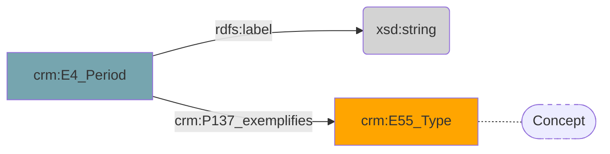

```mermaid
graph LR
29b9c9c6-ef21-11ed-a1e6-00163e71351b["crm:E4_Period"]-->|"rdfs:label"|6a9a1eb4-ef21-11ed-a1e6-00163e71351b(xsd:string)
29b9c9c6-ef21-11ed-a1e6-00163e71351b["crm:E4_Period"]-->|"crm:P137_exemplifies"|4c660cb4-ef21-11ed-9232-00163e71351b["crm:E55_Type"]
4c660cb4-ef21-11ed-9232-00163e71351b["crm:E55_Type"]-.-4c660cb4-ef21-11ed-9232-00163e71351b_s(["Concept"])
style 4c660cb4-ef21-11ed-9232-00163e71351b_s stroke-dasharray: 5
style 29b9c9c6-ef21-11ed-a1e6-00163e71351b fill:#76A5AF
style 4c660cb4-ef21-11ed-9232-00163e71351b fill:#ffa500
style 6a9a1eb4-ef21-11ed-a1e6-00163e71351b fill:#D3D3D3
```
