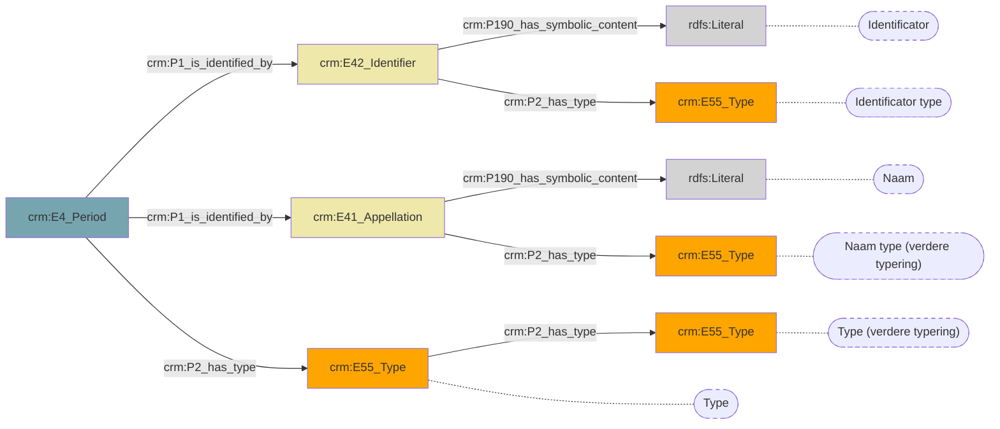

```mermaid
graph LR
style 29b9c9c6-ef21-11ed-a1e6-00163e71351b fill:#76A5AF
style 97ea71f5-18e7-11ef-9ad0-960002548b4f fill:#EEE8AA
style 97ea785e-18e7-11ef-85be-960002548b4f fill:#D3D3D3
style 97ea79a5-18e7-11ef-87f9-960002548b4f fill:#ffa500
style ae87805c-18e7-11ef-9f4e-960002548b4f fill:#EEE8AA
style ae878579-18e7-11ef-a85a-960002548b4f fill:#ffa500
style ae878847-18e7-11ef-86e0-960002548b4f fill:#D3D3D3
style f6f47909-18e7-11ef-a920-960002548b4f fill:#ffa500
style f6f47e09-18e7-11ef-87de-960002548b4f fill:#ffa500
97ea71f5-18e7-11ef-9ad0-960002548b4f["crm:E42_Identifier"]-->|"crm:P190_has_symbolic_content"|97ea785e-18e7-11ef-85be-960002548b4f(rdfs:Literal)
ae87805c-18e7-11ef-9f4e-960002548b4f["crm:E41_Appellation"]-->|"crm:P190_has_symbolic_content"|ae878847-18e7-11ef-86e0-960002548b4f(rdfs:Literal)
29b9c9c6-ef21-11ed-a1e6-00163e71351b["crm:E4_Period"]-->|"crm:P1_is_identified_by"|97ea71f5-18e7-11ef-9ad0-960002548b4f["crm:E42_Identifier"]
29b9c9c6-ef21-11ed-a1e6-00163e71351b["crm:E4_Period"]-->|"crm:P1_is_identified_by"|ae87805c-18e7-11ef-9f4e-960002548b4f["crm:E41_Appellation"]
29b9c9c6-ef21-11ed-a1e6-00163e71351b["crm:E4_Period"]-->|"crm:P2_has_type"|f6f47909-18e7-11ef-a920-960002548b4f["crm:E55_Type"]
97ea71f5-18e7-11ef-9ad0-960002548b4f["crm:E42_Identifier"]-->|"crm:P2_has_type"|97ea79a5-18e7-11ef-87f9-960002548b4f["crm:E55_Type"]
ae87805c-18e7-11ef-9f4e-960002548b4f["crm:E41_Appellation"]-->|"crm:P2_has_type"|ae878579-18e7-11ef-a85a-960002548b4f["crm:E55_Type"]
f6f47909-18e7-11ef-a920-960002548b4f["crm:E55_Type"]-->|"crm:P2_has_type"|f6f47e09-18e7-11ef-87de-960002548b4f["crm:E55_Type"]
f6f47909-18e7-11ef-a920-960002548b4f["crm:E55_Type"]-.-f6f47909-18e7-11ef-a920-960002548b4f_s(["Type"])
97ea785e-18e7-11ef-85be-960002548b4f["rdfs:Literal"]-.-97ea785e-18e7-11ef-85be-960002548b4f_s(["Identificator"])
97ea79a5-18e7-11ef-87f9-960002548b4f["crm:E55_Type"]-.-97ea79a5-18e7-11ef-87f9-960002548b4f_s(["Identificator type"])
ae878847-18e7-11ef-86e0-960002548b4f["rdfs:Literal"]-.-ae878847-18e7-11ef-86e0-960002548b4f_s(["Naam"])
ae878579-18e7-11ef-a85a-960002548b4f["crm:E55_Type"]-.-ae878579-18e7-11ef-a85a-960002548b4f_s(["Naam type (verdere typering)"])
f6f47e09-18e7-11ef-87de-960002548b4f["crm:E55_Type"]-.-f6f47e09-18e7-11ef-87de-960002548b4f_s(["Type (verdere typering)"])
style f6f47909-18e7-11ef-a920-960002548b4f_s stroke-dasharray: 5
style 97ea785e-18e7-11ef-85be-960002548b4f_s stroke-dasharray: 5
style 97ea79a5-18e7-11ef-87f9-960002548b4f_s stroke-dasharray: 5
style ae878847-18e7-11ef-86e0-960002548b4f_s stroke-dasharray: 5
style ae878579-18e7-11ef-a85a-960002548b4f_s stroke-dasharray: 5
style f6f47e09-18e7-11ef-87de-960002548b4f_s stroke-dasharray: 5
```
