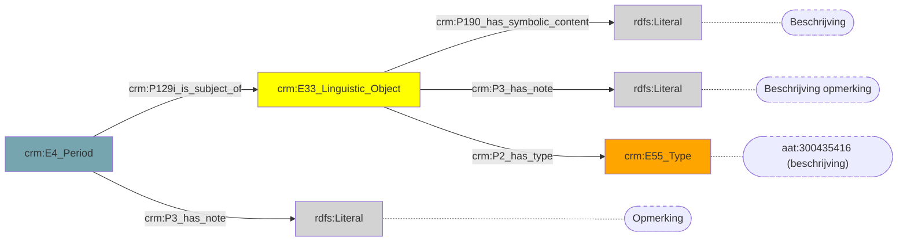

```mermaid
graph LR
style 29b9c9c6-ef21-11ed-a1e6-00163e71351b fill:#76A5AF
style 77e0edcd-18e7-11ef-a6bb-960002548b4f fill:#ffff00
style 77e0f333-18e7-11ef-acb5-960002548b4f fill:#D3D3D3
style 77e0f704-18e7-11ef-9231-960002548b4f fill:#D3D3D3
style 77e0f9bc-18e7-11ef-9056-960002548b4f fill:#ffa500
style e8b78153-18e7-11ef-9612-960002548b4f fill:#D3D3D3
29b9c9c6-ef21-11ed-a1e6-00163e71351b["crm:E4_Period"]-->|"crm:P3_has_note"|e8b78153-18e7-11ef-9612-960002548b4f(rdfs:Literal)
77e0edcd-18e7-11ef-a6bb-960002548b4f["crm:E33_Linguistic_Object"]-->|"crm:P190_has_symbolic_content"|77e0f704-18e7-11ef-9231-960002548b4f(rdfs:Literal)
77e0edcd-18e7-11ef-a6bb-960002548b4f["crm:E33_Linguistic_Object"]-->|"crm:P3_has_note"|77e0f333-18e7-11ef-acb5-960002548b4f(rdfs:Literal)
29b9c9c6-ef21-11ed-a1e6-00163e71351b["crm:E4_Period"]-->|"crm:P129i_is_subject_of"|77e0edcd-18e7-11ef-a6bb-960002548b4f["crm:E33_Linguistic_Object"]
77e0edcd-18e7-11ef-a6bb-960002548b4f["crm:E33_Linguistic_Object"]-->|"crm:P2_has_type"|77e0f9bc-18e7-11ef-9056-960002548b4f["crm:E55_Type"]
style e8b78153-18e7-11ef-9612-960002548b4f_s stroke-dasharray: 5
style 77e0f704-18e7-11ef-9231-960002548b4f_s stroke-dasharray: 5
style 77e0f9bc-18e7-11ef-9056-960002548b4f_s stroke-dasharray: 5
style 77e0f333-18e7-11ef-acb5-960002548b4f_s stroke-dasharray: 5
e8b78153-18e7-11ef-9612-960002548b4f["rdfs:Literal"]-.-e8b78153-18e7-11ef-9612-960002548b4f_s(["Opmerking"])
77e0f704-18e7-11ef-9231-960002548b4f["rdfs:Literal"]-.-77e0f704-18e7-11ef-9231-960002548b4f_s(["Beschrijving"])
77e0f9bc-18e7-11ef-9056-960002548b4f["crm:E55_Type"]-.-77e0f9bc-18e7-11ef-9056-960002548b4f_s(["aat:300435416 (beschrijving)"])
77e0f333-18e7-11ef-acb5-960002548b4f["rdfs:Literal"]-.-77e0f333-18e7-11ef-acb5-960002548b4f_s(["Beschrijving opmerking"])
```
