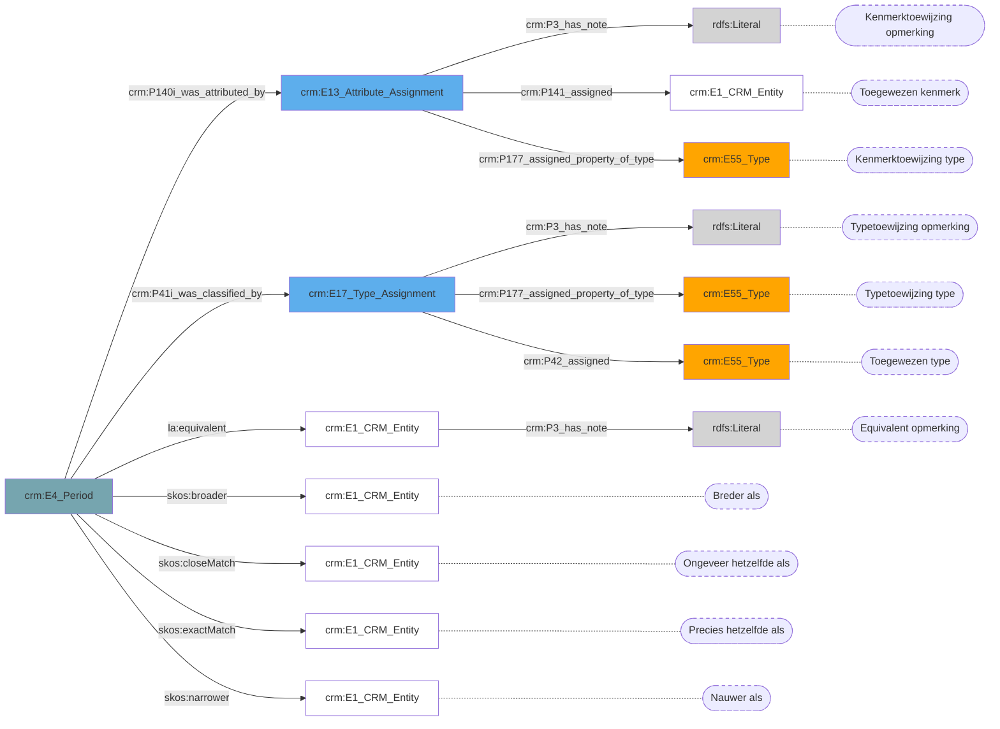

```mermaid
graph LR
style 03f79e92-18e8-11ef-8e83-960002548b4f fill:#5DAEEC
style 03f7a385-18e8-11ef-8618-960002548b4f fill:#ffa500
style 03f7a514-18e8-11ef-860f-960002548b4f fill:#ffa500
style 03f7a8a1-18e8-11ef-a23d-960002548b4f fill:#D3D3D3
style 17e9cfbc-1dad-11ef-94b5-960002548b4f fill:#ffffff
style 1e005315-1dad-11ef-b901-960002548b4f fill:#ffffff
style 243101f5-1dad-11ef-baa6-960002548b4f fill:#ffffff
style 299c2d52-1dad-11ef-9802-960002548b4f fill:#ffffff
style 29b9c9c6-ef21-11ed-a1e6-00163e71351b fill:#76A5AF
style 601d8971-18e7-11ef-8994-960002548b4f fill:#5DAEEC
style 601d8e66-18e7-11ef-b512-960002548b4f fill:#ffa500
style 601d8ff4-18e7-11ef-b93e-960002548b4f fill:#ffffff
style 601d9133-18e7-11ef-bdad-960002548b4f fill:#D3D3D3
style 845c6791-18e7-11ef-a842-960002548b4f fill:#ffffff
style 845c6c6a-18e7-11ef-bdb0-960002548b4f fill:#D3D3D3
03f79e92-18e8-11ef-8e83-960002548b4f["crm:E17_Type_Assignment"]-->|"crm:P3_has_note"|03f7a8a1-18e8-11ef-a23d-960002548b4f(rdfs:Literal)
601d8971-18e7-11ef-8994-960002548b4f["crm:E13_Attribute_Assignment"]-->|"crm:P3_has_note"|601d9133-18e7-11ef-bdad-960002548b4f(rdfs:Literal)
845c6791-18e7-11ef-a842-960002548b4f["crm:E1_CRM_Entity"]-->|"crm:P3_has_note"|845c6c6a-18e7-11ef-bdb0-960002548b4f(rdfs:Literal)
style 03f7a385-18e8-11ef-8618-960002548b4f_s stroke-dasharray: 5
style 03f7a8a1-18e8-11ef-a23d-960002548b4f_s stroke-dasharray: 5
style 03f7a514-18e8-11ef-860f-960002548b4f_s stroke-dasharray: 5
style 17e9cfbc-1dad-11ef-94b5-960002548b4f_s stroke-dasharray: 5
style 1e005315-1dad-11ef-b901-960002548b4f_s stroke-dasharray: 5
style 243101f5-1dad-11ef-baa6-960002548b4f_s stroke-dasharray: 5
style 299c2d52-1dad-11ef-9802-960002548b4f_s stroke-dasharray: 5
style 601d8ff4-18e7-11ef-b93e-960002548b4f_s stroke-dasharray: 5
style 601d8e66-18e7-11ef-b512-960002548b4f_s stroke-dasharray: 5
style 601d9133-18e7-11ef-bdad-960002548b4f_s stroke-dasharray: 5
style 845c6c6a-18e7-11ef-bdb0-960002548b4f_s stroke-dasharray: 5
03f7a385-18e8-11ef-8618-960002548b4f["crm:E55_Type"]-.-03f7a385-18e8-11ef-8618-960002548b4f_s(["Typetoewijzing type"])
03f7a8a1-18e8-11ef-a23d-960002548b4f["rdfs:Literal"]-.-03f7a8a1-18e8-11ef-a23d-960002548b4f_s(["Typetoewijzing opmerking"])
03f7a514-18e8-11ef-860f-960002548b4f["crm:E55_Type"]-.-03f7a514-18e8-11ef-860f-960002548b4f_s(["Toegewezen type"])
17e9cfbc-1dad-11ef-94b5-960002548b4f["crm:E1_CRM_Entity"]-.-17e9cfbc-1dad-11ef-94b5-960002548b4f_s(["Breder als"])
1e005315-1dad-11ef-b901-960002548b4f["crm:E1_CRM_Entity"]-.-1e005315-1dad-11ef-b901-960002548b4f_s(["Ongeveer hetzelfde als"])
243101f5-1dad-11ef-baa6-960002548b4f["crm:E1_CRM_Entity"]-.-243101f5-1dad-11ef-baa6-960002548b4f_s(["Precies hetzelfde als"])
299c2d52-1dad-11ef-9802-960002548b4f["crm:E1_CRM_Entity"]-.-299c2d52-1dad-11ef-9802-960002548b4f_s(["Nauwer als"])
601d8ff4-18e7-11ef-b93e-960002548b4f["crm:E1_CRM_Entity"]-.-601d8ff4-18e7-11ef-b93e-960002548b4f_s(["Toegewezen kenmerk"])
601d8e66-18e7-11ef-b512-960002548b4f["crm:E55_Type"]-.-601d8e66-18e7-11ef-b512-960002548b4f_s(["Kenmerktoewijzing type"])
601d9133-18e7-11ef-bdad-960002548b4f["rdfs:Literal"]-.-601d9133-18e7-11ef-bdad-960002548b4f_s(["Kenmerktoewijzing opmerking"])
845c6c6a-18e7-11ef-bdb0-960002548b4f["rdfs:Literal"]-.-845c6c6a-18e7-11ef-bdb0-960002548b4f_s(["Equivalent opmerking"])
03f79e92-18e8-11ef-8e83-960002548b4f["crm:E17_Type_Assignment"]-->|"crm:P177_assigned_property_of_type"|03f7a385-18e8-11ef-8618-960002548b4f["crm:E55_Type"]
03f79e92-18e8-11ef-8e83-960002548b4f["crm:E17_Type_Assignment"]-->|"crm:P42_assigned"|03f7a514-18e8-11ef-860f-960002548b4f["crm:E55_Type"]
29b9c9c6-ef21-11ed-a1e6-00163e71351b["crm:E4_Period"]-->|"crm:P140i_was_attributed_by"|601d8971-18e7-11ef-8994-960002548b4f["crm:E13_Attribute_Assignment"]
29b9c9c6-ef21-11ed-a1e6-00163e71351b["crm:E4_Period"]-->|"crm:P41i_was_classified_by"|03f79e92-18e8-11ef-8e83-960002548b4f["crm:E17_Type_Assignment"]
29b9c9c6-ef21-11ed-a1e6-00163e71351b["crm:E4_Period"]-->|"skos:broader"|17e9cfbc-1dad-11ef-94b5-960002548b4f["crm:E1_CRM_Entity"]
29b9c9c6-ef21-11ed-a1e6-00163e71351b["crm:E4_Period"]-->|"skos:closeMatch"|1e005315-1dad-11ef-b901-960002548b4f["crm:E1_CRM_Entity"]
29b9c9c6-ef21-11ed-a1e6-00163e71351b["crm:E4_Period"]-->|"skos:exactMatch"|243101f5-1dad-11ef-baa6-960002548b4f["crm:E1_CRM_Entity"]
29b9c9c6-ef21-11ed-a1e6-00163e71351b["crm:E4_Period"]-->|"skos:narrower"|299c2d52-1dad-11ef-9802-960002548b4f["crm:E1_CRM_Entity"]
29b9c9c6-ef21-11ed-a1e6-00163e71351b["crm:E4_Period"]-->|"la:equivalent"|845c6791-18e7-11ef-a842-960002548b4f["crm:E1_CRM_Entity"]
601d8971-18e7-11ef-8994-960002548b4f["crm:E13_Attribute_Assignment"]-->|"crm:P141_assigned"|601d8ff4-18e7-11ef-b93e-960002548b4f["crm:E1_CRM_Entity"]
601d8971-18e7-11ef-8994-960002548b4f["crm:E13_Attribute_Assignment"]-->|"crm:P177_assigned_property_of_type"|601d8e66-18e7-11ef-b512-960002548b4f["crm:E55_Type"]
```
