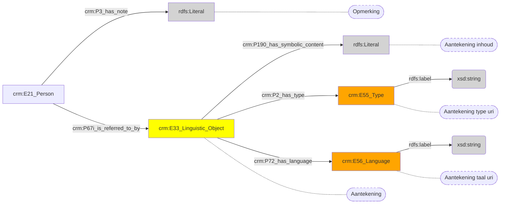

```mermaid
graph LR
0d9d4cb4-e37c-11ed-9064-00163e71351b["crm:E21_Person"]-->|"crm:P3_has_note"|c5f20b3e-e439-11ed-a1e6-00163e71351b(rdfs:Literal)
79858ef4-ee3b-11ed-9064-00163e71351b["crm:E33_Linguistic_Object"]-->|"crm:P190_has_symbolic_content"|79859714-ee3b-11ed-9064-00163e71351b(rdfs:Literal)
798593b8-ee3b-11ed-9064-00163e71351b["crm:E55_Type"]-->|"rdfs:label"|798599da-ee3b-11ed-9064-00163e71351b(xsd:string)
79859584-ee3b-11ed-9064-00163e71351b["crm:E56_Language"]-->|"rdfs:label"|7985987c-ee3b-11ed-9064-00163e71351b(xsd:string)
0d9d4cb4-e37c-11ed-9064-00163e71351b["crm:E21_Person"]-->|"crm:P67i_is_referred_to_by"|79858ef4-ee3b-11ed-9064-00163e71351b["crm:E33_Linguistic_Object"]
79858ef4-ee3b-11ed-9064-00163e71351b["crm:E33_Linguistic_Object"]-->|"crm:P2_has_type"|798593b8-ee3b-11ed-9064-00163e71351b["crm:E55_Type"]
79858ef4-ee3b-11ed-9064-00163e71351b["crm:E33_Linguistic_Object"]-->|"crm:P72_has_language"|79859584-ee3b-11ed-9064-00163e71351b["crm:E56_Language"]
style c5f20b3e-e439-11ed-a1e6-00163e71351b_s stroke-dasharray: 5
style 79858ef4-ee3b-11ed-9064-00163e71351b_s stroke-dasharray: 5
style 79859714-ee3b-11ed-9064-00163e71351b_s stroke-dasharray: 5
style 798593b8-ee3b-11ed-9064-00163e71351b_s stroke-dasharray: 5
style 79859584-ee3b-11ed-9064-00163e71351b_s stroke-dasharray: 5
c5f20b3e-e439-11ed-a1e6-00163e71351b["rdfs:Literal"]-.-c5f20b3e-e439-11ed-a1e6-00163e71351b_s(["Opmerking"])
79858ef4-ee3b-11ed-9064-00163e71351b["crm:E33_Linguistic_Object"]-.-79858ef4-ee3b-11ed-9064-00163e71351b_s(["Aantekening"])
79859714-ee3b-11ed-9064-00163e71351b["rdfs:Literal"]-.-79859714-ee3b-11ed-9064-00163e71351b_s(["Aantekening inhoud"])
798593b8-ee3b-11ed-9064-00163e71351b["crm:E55_Type"]-.-798593b8-ee3b-11ed-9064-00163e71351b_s(["Aantekening type uri"])
79859584-ee3b-11ed-9064-00163e71351b["crm:E56_Language"]-.-79859584-ee3b-11ed-9064-00163e71351b_s(["Aantekening taal uri"])
style 79858ef4-ee3b-11ed-9064-00163e71351b fill:#ffff00
style 798593b8-ee3b-11ed-9064-00163e71351b fill:#ffa500
style 79859584-ee3b-11ed-9064-00163e71351b fill:#ffa500
style 79859714-ee3b-11ed-9064-00163e71351b fill:#D3D3D3
style 7985987c-ee3b-11ed-9064-00163e71351b fill:#D3D3D3
style 798599da-ee3b-11ed-9064-00163e71351b fill:#D3D3D3
style c5f20b3e-e439-11ed-a1e6-00163e71351b fill:#D3D3D3
```
