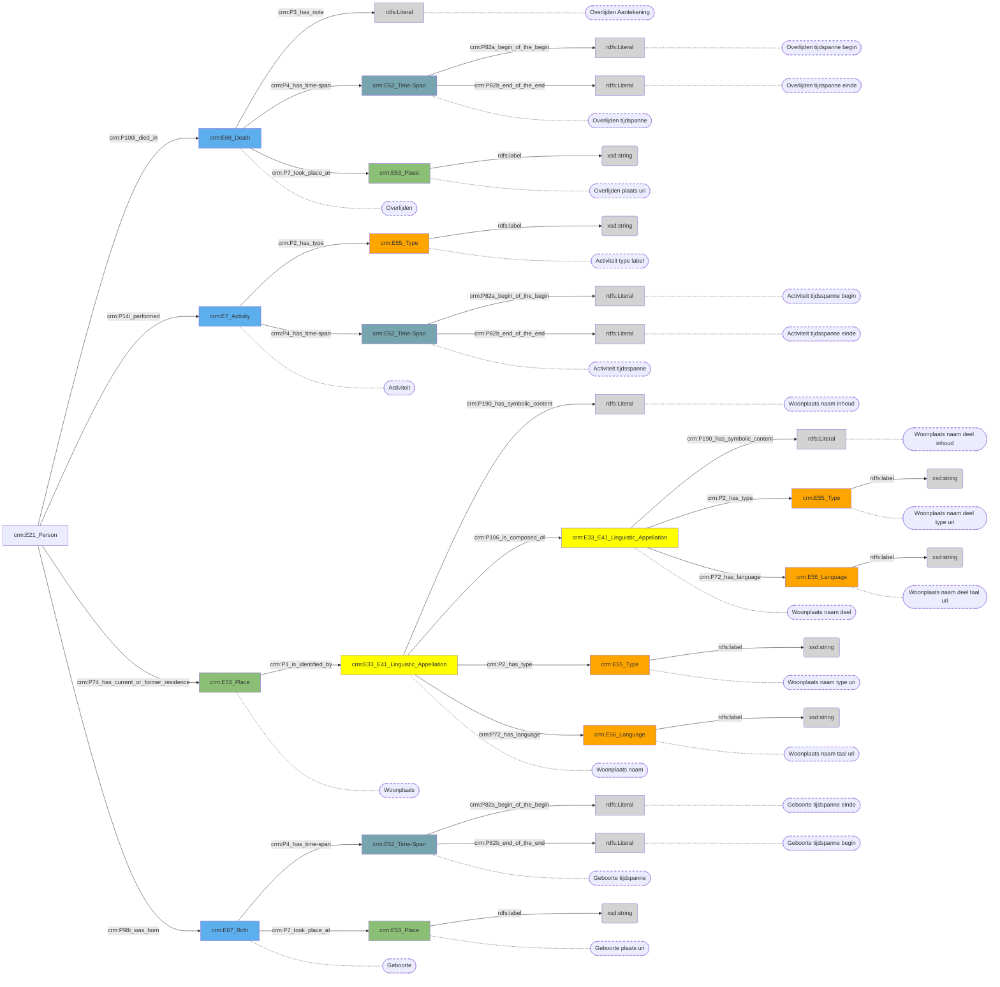

```mermaid
graph LR
0d9cefd0-e37c-11ed-9064-00163e71351b["crm:E69_Death"]-->|"crm:P3_has_note"|0d9d3d32-e37c-11ed-9064-00163e71351b(rdfs:Literal)
0d9d1a64-e37c-11ed-9064-00163e71351b["crm:E53_Place"]-->|"rdfs:label"|0d9d3ab2-e37c-11ed-9064-00163e71351b(xsd:string)
0d9d1c58-e37c-11ed-9064-00163e71351b["crm:E52_Time-Span"]-->|"crm:P82a_begin_of_the_begin"|0d9d32f6-e37c-11ed-9064-00163e71351b(rdfs:Literal)
0d9d1c58-e37c-11ed-9064-00163e71351b["crm:E52_Time-Span"]-->|"crm:P82b_end_of_the_end"|0d9d4958-e37c-11ed-9064-00163e71351b(rdfs:Literal)
0d9d2086-e37c-11ed-9064-00163e71351b["crm:E55_Type"]-->|"rdfs:label"|0d9d2176-e37c-11ed-9064-00163e71351b(xsd:string)
0d9d2414-e37c-11ed-9064-00163e71351b["crm:E33_E41_Linguistic_Appellation"]-->|"crm:P190_has_symbolic_content"|0d9d4d7c-e37c-11ed-9064-00163e71351b(rdfs:Literal)
0d9d2874-e37c-11ed-9064-00163e71351b["crm:E56_Language"]-->|"rdfs:label"|0d9d1e9c-e37c-11ed-9064-00163e71351b(xsd:string)
0d9d2a2c-e37c-11ed-9064-00163e71351b["crm:E55_Type"]-->|"rdfs:label"|0d9d4a34-e37c-11ed-9064-00163e71351b(xsd:string)
0d9d3210-e37c-11ed-9064-00163e71351b["crm:E56_Language"]-->|"rdfs:label"|0d9d2338-e37c-11ed-9064-00163e71351b(xsd:string)
0d9d390e-e37c-11ed-9064-00163e71351b["crm:E55_Type"]-->|"rdfs:label"|0d9d3774-e37c-11ed-9064-00163e71351b(xsd:string)
0d9d3c56-e37c-11ed-9064-00163e71351b["crm:E52_Time-Span"]-->|"crm:P82a_begin_of_the_begin"|0d9d2bee-e37c-11ed-9064-00163e71351b(rdfs:Literal)
0d9d3c56-e37c-11ed-9064-00163e71351b["crm:E52_Time-Span"]-->|"crm:P82b_end_of_the_end"|0d9d3418-e37c-11ed-9064-00163e71351b(rdfs:Literal)
0d9d4084-e37c-11ed-9064-00163e71351b["crm:E52_Time-Span"]-->|"crm:P82a_begin_of_the_begin"|0d9d44d0-e37c-11ed-9064-00163e71351b(rdfs:Literal)
0d9d4084-e37c-11ed-9064-00163e71351b["crm:E52_Time-Span"]-->|"crm:P82b_end_of_the_end"|0d9d2cca-e37c-11ed-9064-00163e71351b(rdfs:Literal)
0d9d43f4-e37c-11ed-9064-00163e71351b["crm:E53_Place"]-->|"rdfs:label"|0d9d2252-e37c-11ed-9064-00163e71351b(xsd:string)
0d9d51b4-e37c-11ed-9064-00163e71351b["crm:E33_E41_Linguistic_Appellation"]-->|"crm:P190_has_symbolic_content"|0d9d4b10-e37c-11ed-9064-00163e71351b(rdfs:Literal)
0d9cefd0-e37c-11ed-9064-00163e71351b["crm:E69_Death"]-->|"crm:P4_has_time-span"|0d9d3c56-e37c-11ed-9064-00163e71351b["crm:E52_Time-Span"]
0d9cefd0-e37c-11ed-9064-00163e71351b["crm:E69_Death"]-->|"crm:P7_took_place_at"|0d9d43f4-e37c-11ed-9064-00163e71351b["crm:E53_Place"]
0d9cf714-e37c-11ed-9064-00163e71351b["crm:E67_Birth"]-->|"crm:P4_has_time-span"|0d9d1c58-e37c-11ed-9064-00163e71351b["crm:E52_Time-Span"]
0d9cf714-e37c-11ed-9064-00163e71351b["crm:E67_Birth"]-->|"crm:P7_took_place_at"|0d9d1a64-e37c-11ed-9064-00163e71351b["crm:E53_Place"]
0d9cfe80-e37c-11ed-9064-00163e71351b["crm:E7_Activity"]-->|"crm:P2_has_type"|0d9d390e-e37c-11ed-9064-00163e71351b["crm:E55_Type"]
0d9cfe80-e37c-11ed-9064-00163e71351b["crm:E7_Activity"]-->|"crm:P4_has_time-span"|0d9d4084-e37c-11ed-9064-00163e71351b["crm:E52_Time-Span"]
0d9d1578-e37c-11ed-9064-00163e71351b["crm:E53_Place"]-->|"crm:P1_is_identified_by"|0d9d51b4-e37c-11ed-9064-00163e71351b["crm:E33_E41_Linguistic_Appellation"]
0d9d2414-e37c-11ed-9064-00163e71351b["crm:E33_E41_Linguistic_Appellation"]-->|"crm:P2_has_type"|0d9d2a2c-e37c-11ed-9064-00163e71351b["crm:E55_Type"]
0d9d2414-e37c-11ed-9064-00163e71351b["crm:E33_E41_Linguistic_Appellation"]-->|"crm:P72_has_language"|0d9d2874-e37c-11ed-9064-00163e71351b["crm:E56_Language"]
0d9d4cb4-e37c-11ed-9064-00163e71351b["crm:E21_Person"]-->|"crm:P100i_died_in"|0d9cefd0-e37c-11ed-9064-00163e71351b["crm:E69_Death"]
0d9d4cb4-e37c-11ed-9064-00163e71351b["crm:E21_Person"]-->|"crm:P14i_performed"|0d9cfe80-e37c-11ed-9064-00163e71351b["crm:E7_Activity"]
0d9d4cb4-e37c-11ed-9064-00163e71351b["crm:E21_Person"]-->|"crm:P74_has_current_or_former_residence"|0d9d1578-e37c-11ed-9064-00163e71351b["crm:E53_Place"]
0d9d4cb4-e37c-11ed-9064-00163e71351b["crm:E21_Person"]-->|"crm:P98i_was_born"|0d9cf714-e37c-11ed-9064-00163e71351b["crm:E67_Birth"]
0d9d51b4-e37c-11ed-9064-00163e71351b["crm:E33_E41_Linguistic_Appellation"]-->|"crm:P106_is_composed_of"|0d9d2414-e37c-11ed-9064-00163e71351b["crm:E33_E41_Linguistic_Appellation"]
0d9d51b4-e37c-11ed-9064-00163e71351b["crm:E33_E41_Linguistic_Appellation"]-->|"crm:P2_has_type"|0d9d2086-e37c-11ed-9064-00163e71351b["crm:E55_Type"]
0d9d51b4-e37c-11ed-9064-00163e71351b["crm:E33_E41_Linguistic_Appellation"]-->|"crm:P72_has_language"|0d9d3210-e37c-11ed-9064-00163e71351b["crm:E56_Language"]
style 0d9d3d32-e37c-11ed-9064-00163e71351b_s stroke-dasharray: 5
style 0d9d3c56-e37c-11ed-9064-00163e71351b_s stroke-dasharray: 5
style 0d9d43f4-e37c-11ed-9064-00163e71351b_s stroke-dasharray: 5
style 0d9d1c58-e37c-11ed-9064-00163e71351b_s stroke-dasharray: 5
style 0d9d1a64-e37c-11ed-9064-00163e71351b_s stroke-dasharray: 5
style 0d9d390e-e37c-11ed-9064-00163e71351b_s stroke-dasharray: 5
style 0d9d4084-e37c-11ed-9064-00163e71351b_s stroke-dasharray: 5
style 0d9d51b4-e37c-11ed-9064-00163e71351b_s stroke-dasharray: 5
style 0d9d32f6-e37c-11ed-9064-00163e71351b_s stroke-dasharray: 5
style 0d9d4958-e37c-11ed-9064-00163e71351b_s stroke-dasharray: 5
style 0d9d4d7c-e37c-11ed-9064-00163e71351b_s stroke-dasharray: 5
style 0d9d2a2c-e37c-11ed-9064-00163e71351b_s stroke-dasharray: 5
style 0d9d2874-e37c-11ed-9064-00163e71351b_s stroke-dasharray: 5
style 0d9d2bee-e37c-11ed-9064-00163e71351b_s stroke-dasharray: 5
style 0d9d3418-e37c-11ed-9064-00163e71351b_s stroke-dasharray: 5
style 0d9d44d0-e37c-11ed-9064-00163e71351b_s stroke-dasharray: 5
style 0d9d2cca-e37c-11ed-9064-00163e71351b_s stroke-dasharray: 5
style 0d9cefd0-e37c-11ed-9064-00163e71351b_s stroke-dasharray: 5
style 0d9cfe80-e37c-11ed-9064-00163e71351b_s stroke-dasharray: 5
style 0d9d1578-e37c-11ed-9064-00163e71351b_s stroke-dasharray: 5
style 0d9cf714-e37c-11ed-9064-00163e71351b_s stroke-dasharray: 5
style 0d9d2414-e37c-11ed-9064-00163e71351b_s stroke-dasharray: 5
style 0d9d4b10-e37c-11ed-9064-00163e71351b_s stroke-dasharray: 5
style 0d9d2086-e37c-11ed-9064-00163e71351b_s stroke-dasharray: 5
style 0d9d3210-e37c-11ed-9064-00163e71351b_s stroke-dasharray: 5
0d9d3d32-e37c-11ed-9064-00163e71351b["rdfs:Literal"]-.-0d9d3d32-e37c-11ed-9064-00163e71351b_s(["Overlijden Aantekening"])
0d9d3c56-e37c-11ed-9064-00163e71351b["crm:E52_Time-Span"]-.-0d9d3c56-e37c-11ed-9064-00163e71351b_s(["Overlijden tijdspanne"])
0d9d43f4-e37c-11ed-9064-00163e71351b["crm:E53_Place"]-.-0d9d43f4-e37c-11ed-9064-00163e71351b_s(["Overlijden plaats uri"])
0d9d1c58-e37c-11ed-9064-00163e71351b["crm:E52_Time-Span"]-.-0d9d1c58-e37c-11ed-9064-00163e71351b_s(["Geboorte tijdspanne"])
0d9d1a64-e37c-11ed-9064-00163e71351b["crm:E53_Place"]-.-0d9d1a64-e37c-11ed-9064-00163e71351b_s(["Geboorte plaats uri"])
0d9d390e-e37c-11ed-9064-00163e71351b["crm:E55_Type"]-.-0d9d390e-e37c-11ed-9064-00163e71351b_s(["Activiteit type label"])
0d9d4084-e37c-11ed-9064-00163e71351b["crm:E52_Time-Span"]-.-0d9d4084-e37c-11ed-9064-00163e71351b_s(["Activiteit tijdsspanne"])
0d9d51b4-e37c-11ed-9064-00163e71351b["crm:E33_E41_Linguistic_Appellation"]-.-0d9d51b4-e37c-11ed-9064-00163e71351b_s(["Woonplaats naam"])
0d9d32f6-e37c-11ed-9064-00163e71351b["rdfs:Literal"]-.-0d9d32f6-e37c-11ed-9064-00163e71351b_s(["Geboorte tijdspanne einde"])
0d9d4958-e37c-11ed-9064-00163e71351b["rdfs:Literal"]-.-0d9d4958-e37c-11ed-9064-00163e71351b_s(["Geboorte tijdspanne begin"])
0d9d4d7c-e37c-11ed-9064-00163e71351b["rdfs:Literal"]-.-0d9d4d7c-e37c-11ed-9064-00163e71351b_s(["Woonplaats naam deel inhoud"])
0d9d2a2c-e37c-11ed-9064-00163e71351b["crm:E55_Type"]-.-0d9d2a2c-e37c-11ed-9064-00163e71351b_s(["Woonplaats naam deel type uri"])
0d9d2874-e37c-11ed-9064-00163e71351b["crm:E56_Language"]-.-0d9d2874-e37c-11ed-9064-00163e71351b_s(["Woonplaats naam deel taal uri"])
0d9d2bee-e37c-11ed-9064-00163e71351b["rdfs:Literal"]-.-0d9d2bee-e37c-11ed-9064-00163e71351b_s(["Overlijden tijdspanne begin"])
0d9d3418-e37c-11ed-9064-00163e71351b["rdfs:Literal"]-.-0d9d3418-e37c-11ed-9064-00163e71351b_s(["Overlijden tijdspanne einde"])
0d9d44d0-e37c-11ed-9064-00163e71351b["rdfs:Literal"]-.-0d9d44d0-e37c-11ed-9064-00163e71351b_s(["Activiteit tijdsspanne begin"])
0d9d2cca-e37c-11ed-9064-00163e71351b["rdfs:Literal"]-.-0d9d2cca-e37c-11ed-9064-00163e71351b_s(["Activiteit tijdsspanne einde"])
0d9cefd0-e37c-11ed-9064-00163e71351b["crm:E69_Death"]-.-0d9cefd0-e37c-11ed-9064-00163e71351b_s(["Overlijden"])
0d9cfe80-e37c-11ed-9064-00163e71351b["crm:E7_Activity"]-.-0d9cfe80-e37c-11ed-9064-00163e71351b_s(["Activiteit"])
0d9d1578-e37c-11ed-9064-00163e71351b["crm:E53_Place"]-.-0d9d1578-e37c-11ed-9064-00163e71351b_s(["Woonplaats"])
0d9cf714-e37c-11ed-9064-00163e71351b["crm:E67_Birth"]-.-0d9cf714-e37c-11ed-9064-00163e71351b_s(["Geboorte"])
0d9d2414-e37c-11ed-9064-00163e71351b["crm:E33_E41_Linguistic_Appellation"]-.-0d9d2414-e37c-11ed-9064-00163e71351b_s(["Woonplaats naam deel"])
0d9d4b10-e37c-11ed-9064-00163e71351b["rdfs:Literal"]-.-0d9d4b10-e37c-11ed-9064-00163e71351b_s(["Woonplaats naam inhoud"])
0d9d2086-e37c-11ed-9064-00163e71351b["crm:E55_Type"]-.-0d9d2086-e37c-11ed-9064-00163e71351b_s(["Woonplaats naam type uri"])
0d9d3210-e37c-11ed-9064-00163e71351b["crm:E56_Language"]-.-0d9d3210-e37c-11ed-9064-00163e71351b_s(["Woonplaats naam taal uri"])
style 0d9cefd0-e37c-11ed-9064-00163e71351b fill:#5DAEEC
style 0d9cf714-e37c-11ed-9064-00163e71351b fill:#5DAEEC
style 0d9cfe80-e37c-11ed-9064-00163e71351b fill:#5DAEEC
style 0d9d1578-e37c-11ed-9064-00163e71351b fill:#8CBF76
style 0d9d1a64-e37c-11ed-9064-00163e71351b fill:#8CBF76
style 0d9d1c58-e37c-11ed-9064-00163e71351b fill:#76A5AF
style 0d9d1e9c-e37c-11ed-9064-00163e71351b fill:#D3D3D3
style 0d9d2086-e37c-11ed-9064-00163e71351b fill:#ffa500
style 0d9d2176-e37c-11ed-9064-00163e71351b fill:#D3D3D3
style 0d9d2252-e37c-11ed-9064-00163e71351b fill:#D3D3D3
style 0d9d2338-e37c-11ed-9064-00163e71351b fill:#D3D3D3
style 0d9d2414-e37c-11ed-9064-00163e71351b fill:#ffff00
style 0d9d2874-e37c-11ed-9064-00163e71351b fill:#ffa500
style 0d9d2a2c-e37c-11ed-9064-00163e71351b fill:#ffa500
style 0d9d2bee-e37c-11ed-9064-00163e71351b fill:#D3D3D3
style 0d9d2cca-e37c-11ed-9064-00163e71351b fill:#D3D3D3
style 0d9d3210-e37c-11ed-9064-00163e71351b fill:#ffa500
style 0d9d32f6-e37c-11ed-9064-00163e71351b fill:#D3D3D3
style 0d9d3418-e37c-11ed-9064-00163e71351b fill:#D3D3D3
style 0d9d3774-e37c-11ed-9064-00163e71351b fill:#D3D3D3
style 0d9d390e-e37c-11ed-9064-00163e71351b fill:#ffa500
style 0d9d3ab2-e37c-11ed-9064-00163e71351b fill:#D3D3D3
style 0d9d3c56-e37c-11ed-9064-00163e71351b fill:#76A5AF
style 0d9d3d32-e37c-11ed-9064-00163e71351b fill:#D3D3D3
style 0d9d4084-e37c-11ed-9064-00163e71351b fill:#76A5AF
style 0d9d43f4-e37c-11ed-9064-00163e71351b fill:#8CBF76
style 0d9d44d0-e37c-11ed-9064-00163e71351b fill:#D3D3D3
style 0d9d4958-e37c-11ed-9064-00163e71351b fill:#D3D3D3
style 0d9d4a34-e37c-11ed-9064-00163e71351b fill:#D3D3D3
style 0d9d4b10-e37c-11ed-9064-00163e71351b fill:#D3D3D3
style 0d9d4d7c-e37c-11ed-9064-00163e71351b fill:#D3D3D3
style 0d9d51b4-e37c-11ed-9064-00163e71351b fill:#ffff00
```
