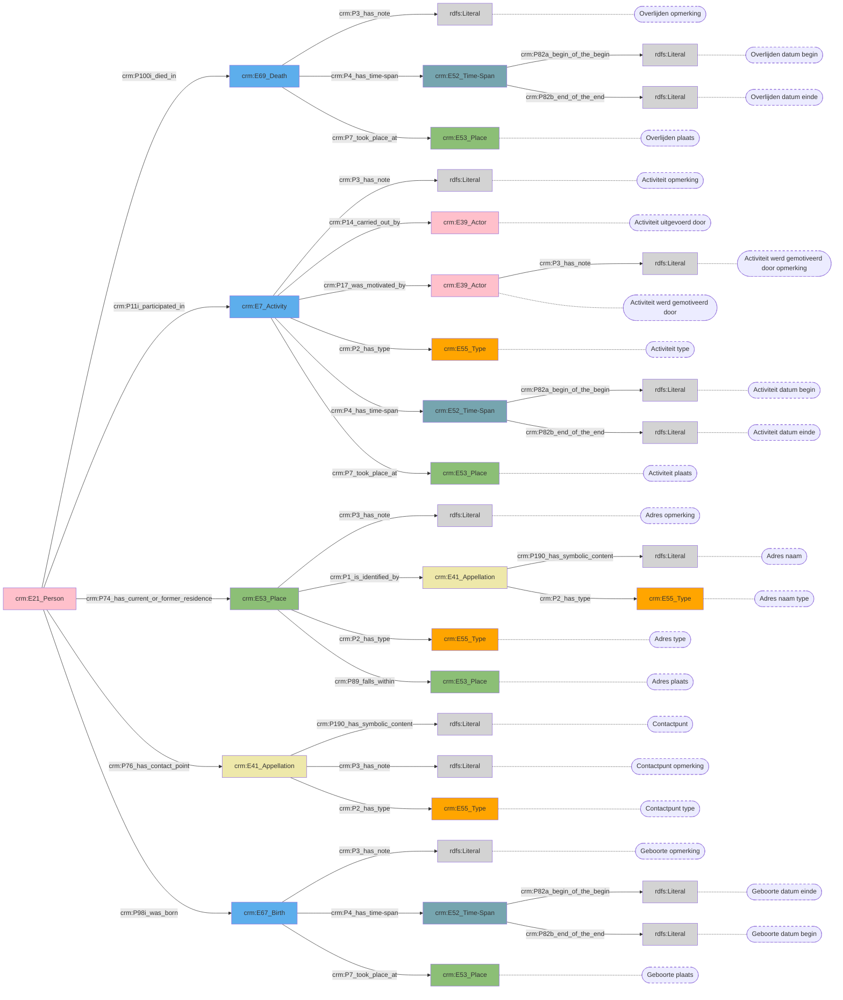

```mermaid
graph LR
style 0a6351cd-2987-11ef-b69e-960002548b4f fill:#D3D3D3
style 0d9cefd0-e37c-11ed-9064-00163e71351b fill:#5DAEEC
style 0d9cf714-e37c-11ed-9064-00163e71351b fill:#5DAEEC
style 0d9cfe80-e37c-11ed-9064-00163e71351b fill:#5DAEEC
style 0d9d10e6-e37c-11ed-9064-00163e71351b fill:#EEE8AA
style 0d9d1578-e37c-11ed-9064-00163e71351b fill:#8CBF76
style 0d9d1a64-e37c-11ed-9064-00163e71351b fill:#8CBF76
style 0d9d1c58-e37c-11ed-9064-00163e71351b fill:#76A5AF
style 0d9d2086-e37c-11ed-9064-00163e71351b fill:#ffa500
style 0d9d2bee-e37c-11ed-9064-00163e71351b fill:#D3D3D3
style 0d9d2cca-e37c-11ed-9064-00163e71351b fill:#D3D3D3
style 0d9d32f6-e37c-11ed-9064-00163e71351b fill:#D3D3D3
style 0d9d3418-e37c-11ed-9064-00163e71351b fill:#D3D3D3
style 0d9d390e-e37c-11ed-9064-00163e71351b fill:#ffa500
style 0d9d3c56-e37c-11ed-9064-00163e71351b fill:#76A5AF
style 0d9d3d32-e37c-11ed-9064-00163e71351b fill:#D3D3D3
style 0d9d3e04-e37c-11ed-9064-00163e71351b fill:#ffa500
style 0d9d4084-e37c-11ed-9064-00163e71351b fill:#76A5AF
style 0d9d43f4-e37c-11ed-9064-00163e71351b fill:#8CBF76
style 0d9d44d0-e37c-11ed-9064-00163e71351b fill:#D3D3D3
style 0d9d4958-e37c-11ed-9064-00163e71351b fill:#D3D3D3
style 0d9d4b10-e37c-11ed-9064-00163e71351b fill:#D3D3D3
style 0d9d4cb4-e37c-11ed-9064-00163e71351b fill:#ffc0cb
style 0d9d5006-e37c-11ed-9064-00163e71351b fill:#D3D3D3
style 0d9d51b4-e37c-11ed-9064-00163e71351b fill:#EEE8AA
style 1c538a75-14e7-11ef-8576-960002548b4f fill:#D3D3D3
style 3a1f1eef-14e9-11ef-91d1-960002548b4f fill:#D3D3D3
style 79589481-14e8-11ef-88df-960002548b4f fill:#8CBF76
style aa652cd6-14eb-11ef-9150-960002548b4f fill:#D3D3D3
style c4b1ee90-14e8-11ef-ae05-960002548b4f fill:#ffa500
style ca651fcf-14eb-11ef-befe-960002548b4f fill:#D3D3D3
style d863f582-b083-11ee-993d-960002548b4f fill:#8CBF76
style e20deede-174d-11ef-805d-960002548b4f fill:#ffc0cb
style ed606a3b-14e6-11ef-a9ef-960002548b4f fill:#ffc0cb
0d9cefd0-e37c-11ed-9064-00163e71351b["crm:E69_Death"]-->|"crm:P3_has_note"|0d9d3d32-e37c-11ed-9064-00163e71351b(rdfs:Literal)
0d9cf714-e37c-11ed-9064-00163e71351b["crm:E67_Birth"]-->|"crm:P3_has_note"|ca651fcf-14eb-11ef-befe-960002548b4f(rdfs:Literal)
0d9cfe80-e37c-11ed-9064-00163e71351b["crm:E7_Activity"]-->|"crm:P3_has_note"|1c538a75-14e7-11ef-8576-960002548b4f(rdfs:Literal)
0d9d10e6-e37c-11ed-9064-00163e71351b["crm:E41_Appellation"]-->|"crm:P190_has_symbolic_content"|0d9d5006-e37c-11ed-9064-00163e71351b(rdfs:Literal)
0d9d10e6-e37c-11ed-9064-00163e71351b["crm:E41_Appellation"]-->|"crm:P3_has_note"|aa652cd6-14eb-11ef-9150-960002548b4f(rdfs:Literal)
0d9d1578-e37c-11ed-9064-00163e71351b["crm:E53_Place"]-->|"crm:P3_has_note"|3a1f1eef-14e9-11ef-91d1-960002548b4f(rdfs:Literal)
0d9d1c58-e37c-11ed-9064-00163e71351b["crm:E52_Time-Span"]-->|"crm:P82a_begin_of_the_begin"|0d9d32f6-e37c-11ed-9064-00163e71351b(rdfs:Literal)
0d9d1c58-e37c-11ed-9064-00163e71351b["crm:E52_Time-Span"]-->|"crm:P82b_end_of_the_end"|0d9d4958-e37c-11ed-9064-00163e71351b(rdfs:Literal)
0d9d3c56-e37c-11ed-9064-00163e71351b["crm:E52_Time-Span"]-->|"crm:P82a_begin_of_the_begin"|0d9d2bee-e37c-11ed-9064-00163e71351b(rdfs:Literal)
0d9d3c56-e37c-11ed-9064-00163e71351b["crm:E52_Time-Span"]-->|"crm:P82b_end_of_the_end"|0d9d3418-e37c-11ed-9064-00163e71351b(rdfs:Literal)
0d9d4084-e37c-11ed-9064-00163e71351b["crm:E52_Time-Span"]-->|"crm:P82a_begin_of_the_begin"|0d9d44d0-e37c-11ed-9064-00163e71351b(rdfs:Literal)
0d9d4084-e37c-11ed-9064-00163e71351b["crm:E52_Time-Span"]-->|"crm:P82b_end_of_the_end"|0d9d2cca-e37c-11ed-9064-00163e71351b(rdfs:Literal)
0d9d51b4-e37c-11ed-9064-00163e71351b["crm:E41_Appellation"]-->|"crm:P190_has_symbolic_content"|0d9d4b10-e37c-11ed-9064-00163e71351b(rdfs:Literal)
e20deede-174d-11ef-805d-960002548b4f["crm:E39_Actor"]-->|"crm:P3_has_note"|0a6351cd-2987-11ef-b69e-960002548b4f(rdfs:Literal)
0d9d3d32-e37c-11ed-9064-00163e71351b["rdfs:Literal"]-.-0d9d3d32-e37c-11ed-9064-00163e71351b_s(["Overlijden opmerking"])
0d9d43f4-e37c-11ed-9064-00163e71351b["crm:E53_Place"]-.-0d9d43f4-e37c-11ed-9064-00163e71351b_s(["Overlijden plaats"])
ca651fcf-14eb-11ef-befe-960002548b4f["rdfs:Literal"]-.-ca651fcf-14eb-11ef-befe-960002548b4f_s(["Geboorte opmerking"])
0d9d1a64-e37c-11ed-9064-00163e71351b["crm:E53_Place"]-.-0d9d1a64-e37c-11ed-9064-00163e71351b_s(["Geboorte plaats"])
ed606a3b-14e6-11ef-a9ef-960002548b4f["crm:E39_Actor"]-.-ed606a3b-14e6-11ef-a9ef-960002548b4f_s(["Activiteit uitgevoerd door"])
e20deede-174d-11ef-805d-960002548b4f["crm:E39_Actor"]-.-e20deede-174d-11ef-805d-960002548b4f_s(["Activiteit werd gemotiveerd door"])
0d9d390e-e37c-11ed-9064-00163e71351b["crm:E55_Type"]-.-0d9d390e-e37c-11ed-9064-00163e71351b_s(["Activiteit type"])
1c538a75-14e7-11ef-8576-960002548b4f["rdfs:Literal"]-.-1c538a75-14e7-11ef-8576-960002548b4f_s(["Activiteit opmerking"])
d863f582-b083-11ee-993d-960002548b4f["crm:E53_Place"]-.-d863f582-b083-11ee-993d-960002548b4f_s(["Activiteit plaats"])
0d9d5006-e37c-11ed-9064-00163e71351b["rdfs:Literal"]-.-0d9d5006-e37c-11ed-9064-00163e71351b_s(["Contactpunt"])
0d9d3e04-e37c-11ed-9064-00163e71351b["crm:E55_Type"]-.-0d9d3e04-e37c-11ed-9064-00163e71351b_s(["Contactpunt type"])
aa652cd6-14eb-11ef-9150-960002548b4f["rdfs:Literal"]-.-aa652cd6-14eb-11ef-9150-960002548b4f_s(["Contactpunt opmerking"])
c4b1ee90-14e8-11ef-ae05-960002548b4f["crm:E55_Type"]-.-c4b1ee90-14e8-11ef-ae05-960002548b4f_s(["Adres type"])
3a1f1eef-14e9-11ef-91d1-960002548b4f["rdfs:Literal"]-.-3a1f1eef-14e9-11ef-91d1-960002548b4f_s(["Adres opmerking"])
79589481-14e8-11ef-88df-960002548b4f["crm:E53_Place"]-.-79589481-14e8-11ef-88df-960002548b4f_s(["Adres plaats"])
0d9d32f6-e37c-11ed-9064-00163e71351b["rdfs:Literal"]-.-0d9d32f6-e37c-11ed-9064-00163e71351b_s(["Geboorte datum einde"])
0d9d4958-e37c-11ed-9064-00163e71351b["rdfs:Literal"]-.-0d9d4958-e37c-11ed-9064-00163e71351b_s(["Geboorte datum begin"])
0d9d2bee-e37c-11ed-9064-00163e71351b["rdfs:Literal"]-.-0d9d2bee-e37c-11ed-9064-00163e71351b_s(["Overlijden datum begin"])
0d9d3418-e37c-11ed-9064-00163e71351b["rdfs:Literal"]-.-0d9d3418-e37c-11ed-9064-00163e71351b_s(["Overlijden datum einde"])
0d9d44d0-e37c-11ed-9064-00163e71351b["rdfs:Literal"]-.-0d9d44d0-e37c-11ed-9064-00163e71351b_s(["Activiteit datum begin"])
0d9d2cca-e37c-11ed-9064-00163e71351b["rdfs:Literal"]-.-0d9d2cca-e37c-11ed-9064-00163e71351b_s(["Activiteit datum einde"])
0d9d4b10-e37c-11ed-9064-00163e71351b["rdfs:Literal"]-.-0d9d4b10-e37c-11ed-9064-00163e71351b_s(["Adres naam"])
0d9d2086-e37c-11ed-9064-00163e71351b["crm:E55_Type"]-.-0d9d2086-e37c-11ed-9064-00163e71351b_s(["Adres naam type"])
0a6351cd-2987-11ef-b69e-960002548b4f["rdfs:Literal"]-.-0a6351cd-2987-11ef-b69e-960002548b4f_s(["Activiteit werd gemotiveerd door opmerking"])
style 0d9d3d32-e37c-11ed-9064-00163e71351b_s stroke-dasharray: 5
style 0d9d43f4-e37c-11ed-9064-00163e71351b_s stroke-dasharray: 5
style ca651fcf-14eb-11ef-befe-960002548b4f_s stroke-dasharray: 5
style 0d9d1a64-e37c-11ed-9064-00163e71351b_s stroke-dasharray: 5
style ed606a3b-14e6-11ef-a9ef-960002548b4f_s stroke-dasharray: 5
style e20deede-174d-11ef-805d-960002548b4f_s stroke-dasharray: 5
style 0d9d390e-e37c-11ed-9064-00163e71351b_s stroke-dasharray: 5
style 1c538a75-14e7-11ef-8576-960002548b4f_s stroke-dasharray: 5
style d863f582-b083-11ee-993d-960002548b4f_s stroke-dasharray: 5
style 0d9d5006-e37c-11ed-9064-00163e71351b_s stroke-dasharray: 5
style 0d9d3e04-e37c-11ed-9064-00163e71351b_s stroke-dasharray: 5
style aa652cd6-14eb-11ef-9150-960002548b4f_s stroke-dasharray: 5
style c4b1ee90-14e8-11ef-ae05-960002548b4f_s stroke-dasharray: 5
style 3a1f1eef-14e9-11ef-91d1-960002548b4f_s stroke-dasharray: 5
style 79589481-14e8-11ef-88df-960002548b4f_s stroke-dasharray: 5
style 0d9d32f6-e37c-11ed-9064-00163e71351b_s stroke-dasharray: 5
style 0d9d4958-e37c-11ed-9064-00163e71351b_s stroke-dasharray: 5
style 0d9d2bee-e37c-11ed-9064-00163e71351b_s stroke-dasharray: 5
style 0d9d3418-e37c-11ed-9064-00163e71351b_s stroke-dasharray: 5
style 0d9d44d0-e37c-11ed-9064-00163e71351b_s stroke-dasharray: 5
style 0d9d2cca-e37c-11ed-9064-00163e71351b_s stroke-dasharray: 5
style 0d9d4b10-e37c-11ed-9064-00163e71351b_s stroke-dasharray: 5
style 0d9d2086-e37c-11ed-9064-00163e71351b_s stroke-dasharray: 5
style 0a6351cd-2987-11ef-b69e-960002548b4f_s stroke-dasharray: 5
0d9cefd0-e37c-11ed-9064-00163e71351b["crm:E69_Death"]-->|"crm:P4_has_time-span"|0d9d3c56-e37c-11ed-9064-00163e71351b["crm:E52_Time-Span"]
0d9cefd0-e37c-11ed-9064-00163e71351b["crm:E69_Death"]-->|"crm:P7_took_place_at"|0d9d43f4-e37c-11ed-9064-00163e71351b["crm:E53_Place"]
0d9cf714-e37c-11ed-9064-00163e71351b["crm:E67_Birth"]-->|"crm:P4_has_time-span"|0d9d1c58-e37c-11ed-9064-00163e71351b["crm:E52_Time-Span"]
0d9cf714-e37c-11ed-9064-00163e71351b["crm:E67_Birth"]-->|"crm:P7_took_place_at"|0d9d1a64-e37c-11ed-9064-00163e71351b["crm:E53_Place"]
0d9cfe80-e37c-11ed-9064-00163e71351b["crm:E7_Activity"]-->|"crm:P14_carried_out_by"|ed606a3b-14e6-11ef-a9ef-960002548b4f["crm:E39_Actor"]
0d9cfe80-e37c-11ed-9064-00163e71351b["crm:E7_Activity"]-->|"crm:P17_was_motivated_by"|e20deede-174d-11ef-805d-960002548b4f["crm:E39_Actor"]
0d9cfe80-e37c-11ed-9064-00163e71351b["crm:E7_Activity"]-->|"crm:P2_has_type"|0d9d390e-e37c-11ed-9064-00163e71351b["crm:E55_Type"]
0d9cfe80-e37c-11ed-9064-00163e71351b["crm:E7_Activity"]-->|"crm:P4_has_time-span"|0d9d4084-e37c-11ed-9064-00163e71351b["crm:E52_Time-Span"]
0d9cfe80-e37c-11ed-9064-00163e71351b["crm:E7_Activity"]-->|"crm:P7_took_place_at"|d863f582-b083-11ee-993d-960002548b4f["crm:E53_Place"]
0d9d10e6-e37c-11ed-9064-00163e71351b["crm:E41_Appellation"]-->|"crm:P2_has_type"|0d9d3e04-e37c-11ed-9064-00163e71351b["crm:E55_Type"]
0d9d1578-e37c-11ed-9064-00163e71351b["crm:E53_Place"]-->|"crm:P1_is_identified_by"|0d9d51b4-e37c-11ed-9064-00163e71351b["crm:E41_Appellation"]
0d9d1578-e37c-11ed-9064-00163e71351b["crm:E53_Place"]-->|"crm:P2_has_type"|c4b1ee90-14e8-11ef-ae05-960002548b4f["crm:E55_Type"]
0d9d1578-e37c-11ed-9064-00163e71351b["crm:E53_Place"]-->|"crm:P89_falls_within"|79589481-14e8-11ef-88df-960002548b4f["crm:E53_Place"]
0d9d4cb4-e37c-11ed-9064-00163e71351b["crm:E21_Person"]-->|"crm:P100i_died_in"|0d9cefd0-e37c-11ed-9064-00163e71351b["crm:E69_Death"]
0d9d4cb4-e37c-11ed-9064-00163e71351b["crm:E21_Person"]-->|"crm:P11i_participated_in"|0d9cfe80-e37c-11ed-9064-00163e71351b["crm:E7_Activity"]
0d9d4cb4-e37c-11ed-9064-00163e71351b["crm:E21_Person"]-->|"crm:P74_has_current_or_former_residence"|0d9d1578-e37c-11ed-9064-00163e71351b["crm:E53_Place"]
0d9d4cb4-e37c-11ed-9064-00163e71351b["crm:E21_Person"]-->|"crm:P76_has_contact_point"|0d9d10e6-e37c-11ed-9064-00163e71351b["crm:E41_Appellation"]
0d9d4cb4-e37c-11ed-9064-00163e71351b["crm:E21_Person"]-->|"crm:P98i_was_born"|0d9cf714-e37c-11ed-9064-00163e71351b["crm:E67_Birth"]
0d9d51b4-e37c-11ed-9064-00163e71351b["crm:E41_Appellation"]-->|"crm:P2_has_type"|0d9d2086-e37c-11ed-9064-00163e71351b["crm:E55_Type"]
```
