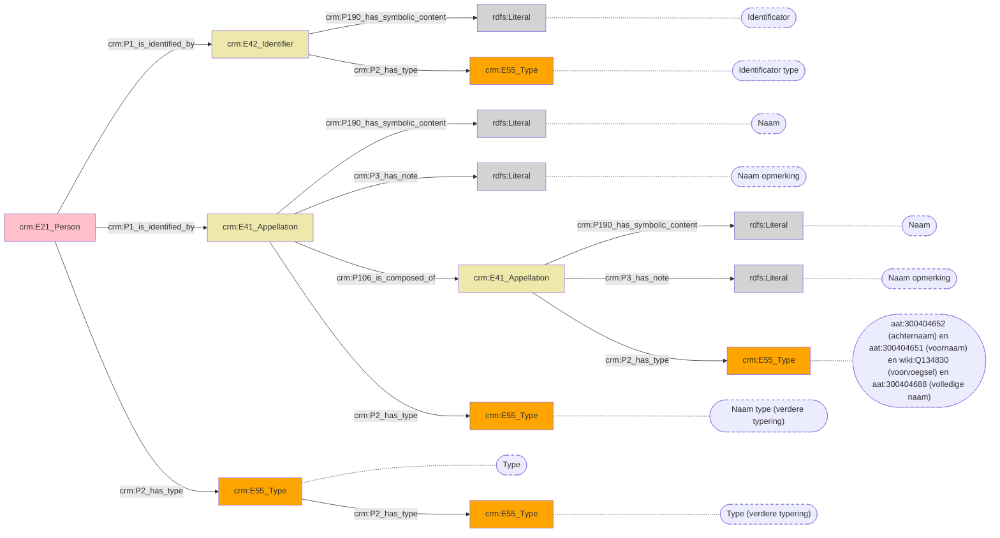

```mermaid
graph LR
style 07d9ff07-18e9-11ef-97b9-960002548b4f fill:#EEE8AA
style 07da01d0-18e9-11ef-b612-960002548b4f fill:#D3D3D3
style 07da0254-18e9-11ef-af3e-960002548b4f fill:#ffa500
style 0d9ce85a-e37c-11ed-9064-00163e71351b fill:#ffa500
style 0d9d4cb4-e37c-11ed-9064-00163e71351b fill:#ffc0cb
style 0d9d4e58-e37c-11ed-9064-00163e71351b fill:#ffa500
style 350fb619-39f9-11ef-bd0c-960002548b4f fill:#EEE8AA
style 350fb84c-39f9-11ef-9cf1-960002548b4f fill:#D3D3D3
style 350fb8f8-39f9-11ef-8fd7-960002548b4f fill:#D3D3D3
style 350fb979-39f9-11ef-b9d0-960002548b4f fill:#ffa500
style 852fddca-ed98-11ed-9232-00163e71351b fill:#EEE8AA
style 852fe766-ed98-11ed-9232-00163e71351b fill:#D3D3D3
style 852ff544-ed98-11ed-9232-00163e71351b fill:#ffa500
style f73d066d-2986-11ef-b8f7-960002548b4f fill:#D3D3D3
07d9ff07-18e9-11ef-97b9-960002548b4f["crm:E42_Identifier"]-->|"crm:P190_has_symbolic_content"|07da01d0-18e9-11ef-b612-960002548b4f(rdfs:Literal)
350fb619-39f9-11ef-bd0c-960002548b4f["crm:E41_Appellation"]-->|"crm:P190_has_symbolic_content"|350fb8f8-39f9-11ef-8fd7-960002548b4f(rdfs:Literal)
350fb619-39f9-11ef-bd0c-960002548b4f["crm:E41_Appellation"]-->|"crm:P3_has_note"|350fb84c-39f9-11ef-9cf1-960002548b4f(rdfs:Literal)
852fddca-ed98-11ed-9232-00163e71351b["crm:E41_Appellation"]-->|"crm:P190_has_symbolic_content"|852fe766-ed98-11ed-9232-00163e71351b(rdfs:Literal)
852fddca-ed98-11ed-9232-00163e71351b["crm:E41_Appellation"]-->|"crm:P3_has_note"|f73d066d-2986-11ef-b8f7-960002548b4f(rdfs:Literal)
style 07da01d0-18e9-11ef-b612-960002548b4f_s stroke-dasharray: 5
style 07da0254-18e9-11ef-af3e-960002548b4f_s stroke-dasharray: 5
style 0d9d4e58-e37c-11ed-9064-00163e71351b_s stroke-dasharray: 5
style 0d9ce85a-e37c-11ed-9064-00163e71351b_s stroke-dasharray: 5
style 350fb8f8-39f9-11ef-8fd7-960002548b4f_s stroke-dasharray: 5
style 350fb979-39f9-11ef-b9d0-960002548b4f_s stroke-dasharray: 5
style 350fb84c-39f9-11ef-9cf1-960002548b4f_s stroke-dasharray: 5
style 852fe766-ed98-11ed-9232-00163e71351b_s stroke-dasharray: 5
style 852ff544-ed98-11ed-9232-00163e71351b_s stroke-dasharray: 5
style f73d066d-2986-11ef-b8f7-960002548b4f_s stroke-dasharray: 5
07da01d0-18e9-11ef-b612-960002548b4f["rdfs:Literal"]-.-07da01d0-18e9-11ef-b612-960002548b4f_s(["Identificator"])
07da0254-18e9-11ef-af3e-960002548b4f["crm:E55_Type"]-.-07da0254-18e9-11ef-af3e-960002548b4f_s(["Identificator type"])
0d9d4e58-e37c-11ed-9064-00163e71351b["crm:E55_Type"]-.-0d9d4e58-e37c-11ed-9064-00163e71351b_s(["Type (verdere typering)"])
0d9ce85a-e37c-11ed-9064-00163e71351b["crm:E55_Type"]-.-0d9ce85a-e37c-11ed-9064-00163e71351b_s(["Type"])
350fb8f8-39f9-11ef-8fd7-960002548b4f["rdfs:Literal"]-.-350fb8f8-39f9-11ef-8fd7-960002548b4f_s(["Naam"])
350fb979-39f9-11ef-b9d0-960002548b4f["crm:E55_Type"]-.-350fb979-39f9-11ef-b9d0-960002548b4f_s(["aat:300404652 (achternaam) en aat:300404651 (voornaam) en wiki:Q134830 (voorvoegsel) en aat:300404688 (volledige naam)"])
350fb84c-39f9-11ef-9cf1-960002548b4f["rdfs:Literal"]-.-350fb84c-39f9-11ef-9cf1-960002548b4f_s(["Naam opmerking"])
852fe766-ed98-11ed-9232-00163e71351b["rdfs:Literal"]-.-852fe766-ed98-11ed-9232-00163e71351b_s(["Naam"])
852ff544-ed98-11ed-9232-00163e71351b["crm:E55_Type"]-.-852ff544-ed98-11ed-9232-00163e71351b_s(["Naam type (verdere typering)"])
f73d066d-2986-11ef-b8f7-960002548b4f["rdfs:Literal"]-.-f73d066d-2986-11ef-b8f7-960002548b4f_s(["Naam opmerking"])
07d9ff07-18e9-11ef-97b9-960002548b4f["crm:E42_Identifier"]-->|"crm:P2_has_type"|07da0254-18e9-11ef-af3e-960002548b4f["crm:E55_Type"]
0d9ce85a-e37c-11ed-9064-00163e71351b["crm:E55_Type"]-->|"crm:P2_has_type"|0d9d4e58-e37c-11ed-9064-00163e71351b["crm:E55_Type"]
0d9d4cb4-e37c-11ed-9064-00163e71351b["crm:E21_Person"]-->|"crm:P1_is_identified_by"|07d9ff07-18e9-11ef-97b9-960002548b4f["crm:E42_Identifier"]
0d9d4cb4-e37c-11ed-9064-00163e71351b["crm:E21_Person"]-->|"crm:P1_is_identified_by"|852fddca-ed98-11ed-9232-00163e71351b["crm:E41_Appellation"]
0d9d4cb4-e37c-11ed-9064-00163e71351b["crm:E21_Person"]-->|"crm:P2_has_type"|0d9ce85a-e37c-11ed-9064-00163e71351b["crm:E55_Type"]
350fb619-39f9-11ef-bd0c-960002548b4f["crm:E41_Appellation"]-->|"crm:P2_has_type"|350fb979-39f9-11ef-b9d0-960002548b4f["crm:E55_Type"]
852fddca-ed98-11ed-9232-00163e71351b["crm:E41_Appellation"]-->|"crm:P106_is_composed_of"|350fb619-39f9-11ef-bd0c-960002548b4f["crm:E41_Appellation"]
852fddca-ed98-11ed-9232-00163e71351b["crm:E41_Appellation"]-->|"crm:P2_has_type"|852ff544-ed98-11ed-9232-00163e71351b["crm:E55_Type"]
```
