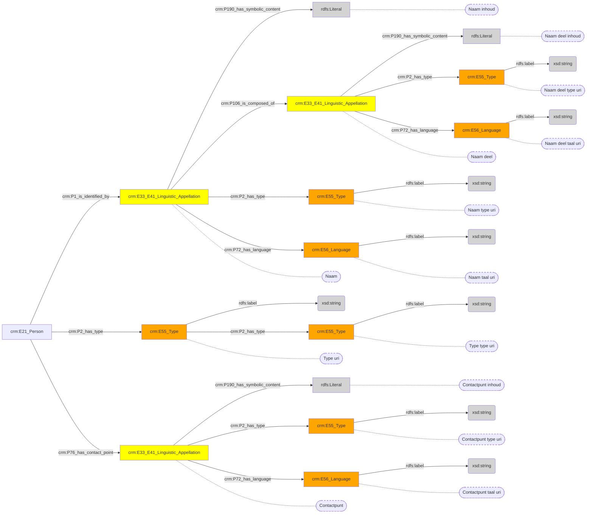

```mermaid
graph LR
0d9ce85a-e37c-11ed-9064-00163e71351b["crm:E55_Type"]-->|"rdfs:label"|0d9d4688-e37c-11ed-9064-00163e71351b(xsd:string)
0d9d10e6-e37c-11ed-9064-00163e71351b["crm:E33_E41_Linguistic_Appellation"]-->|"crm:P190_has_symbolic_content"|0d9d5006-e37c-11ed-9064-00163e71351b(rdfs:Literal)
0d9d3b84-e37c-11ed-9064-00163e71351b["crm:E56_Language"]-->|"rdfs:label"|0d9d4f34-e37c-11ed-9064-00163e71351b(xsd:string)
0d9d3e04-e37c-11ed-9064-00163e71351b["crm:E55_Type"]-->|"rdfs:label"|0d9d4318-e37c-11ed-9064-00163e71351b(xsd:string)
0d9d4e58-e37c-11ed-9064-00163e71351b["crm:E55_Type"]-->|"rdfs:label"|0d9d278e-e37c-11ed-9064-00163e71351b(xsd:string)
852fddca-ed98-11ed-9232-00163e71351b["crm:E33_E41_Linguistic_Appellation"]-->|"crm:P190_has_symbolic_content"|852fe766-ed98-11ed-9232-00163e71351b(rdfs:Literal)
852fe4f0-ed98-11ed-9232-00163e71351b["crm:E56_Language"]-->|"rdfs:label"|852ff17a-ed98-11ed-9232-00163e71351b(xsd:string)
852fed92-ed98-11ed-9232-00163e71351b["crm:E56_Language"]-->|"rdfs:label"|852fef90-ed98-11ed-9232-00163e71351b(xsd:string)
852ff544-ed98-11ed-9232-00163e71351b["crm:E55_Type"]-->|"rdfs:label"|852feb8a-ed98-11ed-9232-00163e71351b(xsd:string)
852ff72e-ed98-11ed-9232-00163e71351b["crm:E33_E41_Linguistic_Appellation"]-->|"crm:P190_has_symbolic_content"|852ff35a-ed98-11ed-9232-00163e71351b(rdfs:Literal)
852ff918-ed98-11ed-9232-00163e71351b["crm:E55_Type"]-->|"rdfs:label"|852fe978-ed98-11ed-9232-00163e71351b(xsd:string)
0d9ce85a-e37c-11ed-9064-00163e71351b["crm:E55_Type"]-->|"crm:P2_has_type"|0d9d4e58-e37c-11ed-9064-00163e71351b["crm:E55_Type"]
0d9d10e6-e37c-11ed-9064-00163e71351b["crm:E33_E41_Linguistic_Appellation"]-->|"crm:P2_has_type"|0d9d3e04-e37c-11ed-9064-00163e71351b["crm:E55_Type"]
0d9d10e6-e37c-11ed-9064-00163e71351b["crm:E33_E41_Linguistic_Appellation"]-->|"crm:P72_has_language"|0d9d3b84-e37c-11ed-9064-00163e71351b["crm:E56_Language"]
0d9d4cb4-e37c-11ed-9064-00163e71351b["crm:E21_Person"]-->|"crm:P1_is_identified_by"|852fddca-ed98-11ed-9232-00163e71351b["crm:E33_E41_Linguistic_Appellation"]
0d9d4cb4-e37c-11ed-9064-00163e71351b["crm:E21_Person"]-->|"crm:P2_has_type"|0d9ce85a-e37c-11ed-9064-00163e71351b["crm:E55_Type"]
0d9d4cb4-e37c-11ed-9064-00163e71351b["crm:E21_Person"]-->|"crm:P76_has_contact_point"|0d9d10e6-e37c-11ed-9064-00163e71351b["crm:E33_E41_Linguistic_Appellation"]
852fddca-ed98-11ed-9232-00163e71351b["crm:E33_E41_Linguistic_Appellation"]-->|"crm:P106_is_composed_of"|852ff72e-ed98-11ed-9232-00163e71351b["crm:E33_E41_Linguistic_Appellation"]
852fddca-ed98-11ed-9232-00163e71351b["crm:E33_E41_Linguistic_Appellation"]-->|"crm:P2_has_type"|852ff544-ed98-11ed-9232-00163e71351b["crm:E55_Type"]
852fddca-ed98-11ed-9232-00163e71351b["crm:E33_E41_Linguistic_Appellation"]-->|"crm:P72_has_language"|852fe4f0-ed98-11ed-9232-00163e71351b["crm:E56_Language"]
852ff72e-ed98-11ed-9232-00163e71351b["crm:E33_E41_Linguistic_Appellation"]-->|"crm:P2_has_type"|852ff918-ed98-11ed-9232-00163e71351b["crm:E55_Type"]
852ff72e-ed98-11ed-9232-00163e71351b["crm:E33_E41_Linguistic_Appellation"]-->|"crm:P72_has_language"|852fed92-ed98-11ed-9232-00163e71351b["crm:E56_Language"]
style 0d9d4e58-e37c-11ed-9064-00163e71351b_s stroke-dasharray: 5
style 0d9d5006-e37c-11ed-9064-00163e71351b_s stroke-dasharray: 5
style 0d9d3e04-e37c-11ed-9064-00163e71351b_s stroke-dasharray: 5
style 0d9d3b84-e37c-11ed-9064-00163e71351b_s stroke-dasharray: 5
style 852fddca-ed98-11ed-9232-00163e71351b_s stroke-dasharray: 5
style 0d9ce85a-e37c-11ed-9064-00163e71351b_s stroke-dasharray: 5
style 0d9d10e6-e37c-11ed-9064-00163e71351b_s stroke-dasharray: 5
style 852ff72e-ed98-11ed-9232-00163e71351b_s stroke-dasharray: 5
style 852fe766-ed98-11ed-9232-00163e71351b_s stroke-dasharray: 5
style 852ff544-ed98-11ed-9232-00163e71351b_s stroke-dasharray: 5
style 852fe4f0-ed98-11ed-9232-00163e71351b_s stroke-dasharray: 5
style 852ff35a-ed98-11ed-9232-00163e71351b_s stroke-dasharray: 5
style 852ff918-ed98-11ed-9232-00163e71351b_s stroke-dasharray: 5
style 852fed92-ed98-11ed-9232-00163e71351b_s stroke-dasharray: 5
0d9d4e58-e37c-11ed-9064-00163e71351b["crm:E55_Type"]-.-0d9d4e58-e37c-11ed-9064-00163e71351b_s(["Type type uri"])
0d9d5006-e37c-11ed-9064-00163e71351b["rdfs:Literal"]-.-0d9d5006-e37c-11ed-9064-00163e71351b_s(["Contactpunt inhoud"])
0d9d3e04-e37c-11ed-9064-00163e71351b["crm:E55_Type"]-.-0d9d3e04-e37c-11ed-9064-00163e71351b_s(["Contactpunt type uri"])
0d9d3b84-e37c-11ed-9064-00163e71351b["crm:E56_Language"]-.-0d9d3b84-e37c-11ed-9064-00163e71351b_s(["Contactpunt taal uri"])
852fddca-ed98-11ed-9232-00163e71351b["crm:E33_E41_Linguistic_Appellation"]-.-852fddca-ed98-11ed-9232-00163e71351b_s(["Naam"])
0d9ce85a-e37c-11ed-9064-00163e71351b["crm:E55_Type"]-.-0d9ce85a-e37c-11ed-9064-00163e71351b_s(["Type uri"])
0d9d10e6-e37c-11ed-9064-00163e71351b["crm:E33_E41_Linguistic_Appellation"]-.-0d9d10e6-e37c-11ed-9064-00163e71351b_s(["Contactpunt"])
852ff72e-ed98-11ed-9232-00163e71351b["crm:E33_E41_Linguistic_Appellation"]-.-852ff72e-ed98-11ed-9232-00163e71351b_s(["Naam deel"])
852fe766-ed98-11ed-9232-00163e71351b["rdfs:Literal"]-.-852fe766-ed98-11ed-9232-00163e71351b_s(["Naam inhoud"])
852ff544-ed98-11ed-9232-00163e71351b["crm:E55_Type"]-.-852ff544-ed98-11ed-9232-00163e71351b_s(["Naam type uri"])
852fe4f0-ed98-11ed-9232-00163e71351b["crm:E56_Language"]-.-852fe4f0-ed98-11ed-9232-00163e71351b_s(["Naam taal uri"])
852ff35a-ed98-11ed-9232-00163e71351b["rdfs:Literal"]-.-852ff35a-ed98-11ed-9232-00163e71351b_s(["Naam deel inhoud"])
852ff918-ed98-11ed-9232-00163e71351b["crm:E55_Type"]-.-852ff918-ed98-11ed-9232-00163e71351b_s(["Naam deel type uri"])
852fed92-ed98-11ed-9232-00163e71351b["crm:E56_Language"]-.-852fed92-ed98-11ed-9232-00163e71351b_s(["Naam deel taal uri"])
style 0d9ce85a-e37c-11ed-9064-00163e71351b fill:#ffa500
style 0d9d10e6-e37c-11ed-9064-00163e71351b fill:#ffff00
style 0d9d278e-e37c-11ed-9064-00163e71351b fill:#D3D3D3
style 0d9d3b84-e37c-11ed-9064-00163e71351b fill:#ffa500
style 0d9d3e04-e37c-11ed-9064-00163e71351b fill:#ffa500
style 0d9d4318-e37c-11ed-9064-00163e71351b fill:#D3D3D3
style 0d9d4688-e37c-11ed-9064-00163e71351b fill:#D3D3D3
style 0d9d4e58-e37c-11ed-9064-00163e71351b fill:#ffa500
style 0d9d4f34-e37c-11ed-9064-00163e71351b fill:#D3D3D3
style 0d9d5006-e37c-11ed-9064-00163e71351b fill:#D3D3D3
style 852fddca-ed98-11ed-9232-00163e71351b fill:#ffff00
style 852fe4f0-ed98-11ed-9232-00163e71351b fill:#ffa500
style 852fe766-ed98-11ed-9232-00163e71351b fill:#D3D3D3
style 852fe978-ed98-11ed-9232-00163e71351b fill:#D3D3D3
style 852feb8a-ed98-11ed-9232-00163e71351b fill:#D3D3D3
style 852fed92-ed98-11ed-9232-00163e71351b fill:#ffa500
style 852fef90-ed98-11ed-9232-00163e71351b fill:#D3D3D3
style 852ff17a-ed98-11ed-9232-00163e71351b fill:#D3D3D3
style 852ff35a-ed98-11ed-9232-00163e71351b fill:#D3D3D3
style 852ff544-ed98-11ed-9232-00163e71351b fill:#ffa500
style 852ff72e-ed98-11ed-9232-00163e71351b fill:#ffff00
style 852ff918-ed98-11ed-9232-00163e71351b fill:#ffa500
```
