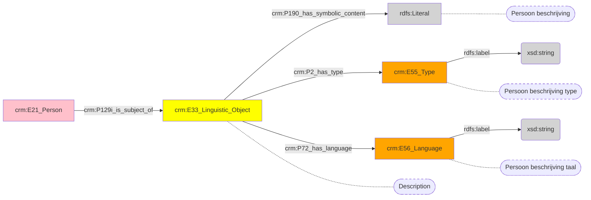

```mermaid
graph LR
b9e8fff2-ed97-11ed-9655-00163e71351b["crm:E33_Linguistic_Object"]-->|"crm:P190_has_symbolic_content"|b9e90498-ed97-11ed-9655-00163e71351b(rdfs:Literal)
b9e907b8-ed97-11ed-9655-00163e71351b["crm:E55_Type"]-->|"rdfs:label"|b9e9063c-ed97-11ed-9655-00163e71351b(xsd:string)
b9e90a60-ed97-11ed-9655-00163e71351b["crm:E56_Language"]-->|"rdfs:label"|b9e90916-ed97-11ed-9655-00163e71351b(xsd:string)
0d9d4cb4-e37c-11ed-9064-00163e71351b["crm:E21_Person"]-->|"crm:P129i_is_subject_of"|b9e8fff2-ed97-11ed-9655-00163e71351b["crm:E33_Linguistic_Object"]
b9e8fff2-ed97-11ed-9655-00163e71351b["crm:E33_Linguistic_Object"]-->|"crm:P2_has_type"|b9e907b8-ed97-11ed-9655-00163e71351b["crm:E55_Type"]
b9e8fff2-ed97-11ed-9655-00163e71351b["crm:E33_Linguistic_Object"]-->|"crm:P72_has_language"|b9e90a60-ed97-11ed-9655-00163e71351b["crm:E56_Language"]
b9e8fff2-ed97-11ed-9655-00163e71351b["crm:E33_Linguistic_Object"]-.-b9e8fff2-ed97-11ed-9655-00163e71351b_s(["Description"])
b9e90498-ed97-11ed-9655-00163e71351b["rdfs:Literal"]-.-b9e90498-ed97-11ed-9655-00163e71351b_s(["Persoon beschrijving"])
b9e907b8-ed97-11ed-9655-00163e71351b["crm:E55_Type"]-.-b9e907b8-ed97-11ed-9655-00163e71351b_s(["Persoon beschrijving type"])
b9e90a60-ed97-11ed-9655-00163e71351b["crm:E56_Language"]-.-b9e90a60-ed97-11ed-9655-00163e71351b_s(["Persoon beschrijving taal"])
style b9e8fff2-ed97-11ed-9655-00163e71351b_s stroke-dasharray: 5
style b9e90498-ed97-11ed-9655-00163e71351b_s stroke-dasharray: 5
style b9e907b8-ed97-11ed-9655-00163e71351b_s stroke-dasharray: 5
style b9e90a60-ed97-11ed-9655-00163e71351b_s stroke-dasharray: 5
style 0d9d4cb4-e37c-11ed-9064-00163e71351b fill:#ffc0cb
style b9e8fff2-ed97-11ed-9655-00163e71351b fill:#ffff00
style b9e90498-ed97-11ed-9655-00163e71351b fill:#D3D3D3
style b9e9063c-ed97-11ed-9655-00163e71351b fill:#D3D3D3
style b9e907b8-ed97-11ed-9655-00163e71351b fill:#ffa500
style b9e90916-ed97-11ed-9655-00163e71351b fill:#D3D3D3
style b9e90a60-ed97-11ed-9655-00163e71351b fill:#ffa500
```
