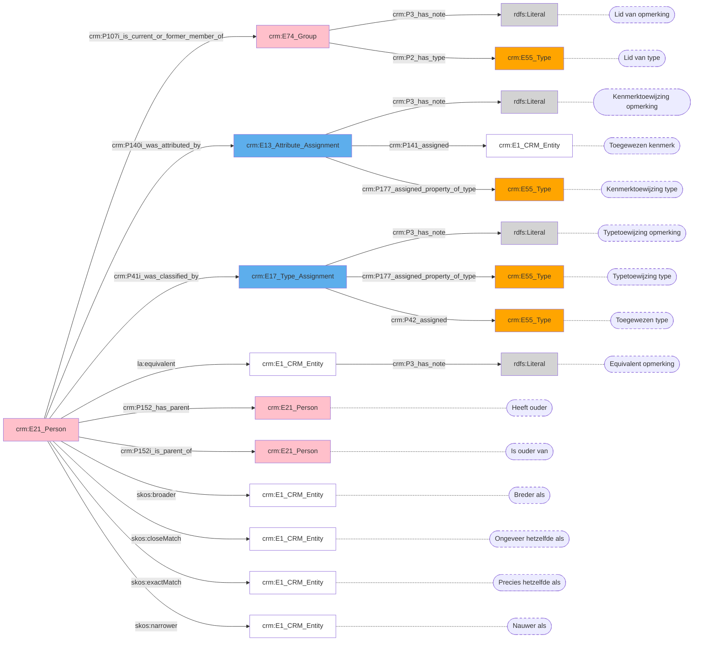

```mermaid
graph LR
style 04c16994-14ef-11ef-9bd2-960002548b4f fill:#D3D3D3
style 0a82e242-e9a2-11ed-9232-00163e71351b fill:#ffa500
style 0d9ce3fa-e37c-11ed-9064-00163e71351b fill:#ffffff
style 0d9cfaca-e37c-11ed-9064-00163e71351b fill:#ffc0cb
style 0d9d05d8-e37c-11ed-9064-00163e71351b fill:#ffc0cb
style 0d9d0984-e37c-11ed-9064-00163e71351b fill:#ffc0cb
style 0d9d4cb4-e37c-11ed-9064-00163e71351b fill:#ffc0cb
style 21700ecb-1d03-11ef-8d88-960002548b4f fill:#5DAEEC
style 217010ea-1d03-11ef-be3c-960002548b4f fill:#D3D3D3
style 2170122e-1d03-11ef-98a2-960002548b4f fill:#ffa500
style 217012b4-1d03-11ef-9e4a-960002548b4f fill:#ffffff
style 81f0fa1a-1db1-11ef-87b0-960002548b4f fill:#ffffff
style 8451385f-14ea-11ef-970d-960002548b4f fill:#D3D3D3
style 906450b0-1db1-11ef-991d-960002548b4f fill:#ffffff
style 9f0883d6-181e-11ef-9a70-960002548b4f fill:#5DAEEC
style 9f08861f-181e-11ef-a162-960002548b4f fill:#ffa500
style 9f0886eb-181e-11ef-b796-960002548b4f fill:#ffa500
style 9f088851-181e-11ef-a70f-960002548b4f fill:#D3D3D3
style a6201089-1db1-11ef-a48b-960002548b4f fill:#ffffff
style b1d6161a-1db1-11ef-a6ee-960002548b4f fill:#ffffff
0d9ce3fa-e37c-11ed-9064-00163e71351b["crm:E1_CRM_Entity"]-->|"crm:P3_has_note"|04c16994-14ef-11ef-9bd2-960002548b4f(rdfs:Literal)
0d9d05d8-e37c-11ed-9064-00163e71351b["crm:E74_Group"]-->|"crm:P3_has_note"|8451385f-14ea-11ef-970d-960002548b4f(rdfs:Literal)
21700ecb-1d03-11ef-8d88-960002548b4f["crm:E13_Attribute_Assignment"]-->|"crm:P3_has_note"|217010ea-1d03-11ef-be3c-960002548b4f(rdfs:Literal)
9f0883d6-181e-11ef-9a70-960002548b4f["crm:E17_Type_Assignment"]-->|"crm:P3_has_note"|9f088851-181e-11ef-a70f-960002548b4f(rdfs:Literal)
style 04c16994-14ef-11ef-9bd2-960002548b4f_s stroke-dasharray: 5
style 0a82e242-e9a2-11ed-9232-00163e71351b_s stroke-dasharray: 5
style 8451385f-14ea-11ef-970d-960002548b4f_s stroke-dasharray: 5
style 0d9cfaca-e37c-11ed-9064-00163e71351b_s stroke-dasharray: 5
style 0d9d0984-e37c-11ed-9064-00163e71351b_s stroke-dasharray: 5
style 81f0fa1a-1db1-11ef-87b0-960002548b4f_s stroke-dasharray: 5
style 906450b0-1db1-11ef-991d-960002548b4f_s stroke-dasharray: 5
style a6201089-1db1-11ef-a48b-960002548b4f_s stroke-dasharray: 5
style b1d6161a-1db1-11ef-a6ee-960002548b4f_s stroke-dasharray: 5
style 217012b4-1d03-11ef-9e4a-960002548b4f_s stroke-dasharray: 5
style 2170122e-1d03-11ef-98a2-960002548b4f_s stroke-dasharray: 5
style 217010ea-1d03-11ef-be3c-960002548b4f_s stroke-dasharray: 5
style 9f08861f-181e-11ef-a162-960002548b4f_s stroke-dasharray: 5
style 9f088851-181e-11ef-a70f-960002548b4f_s stroke-dasharray: 5
style 9f0886eb-181e-11ef-b796-960002548b4f_s stroke-dasharray: 5
04c16994-14ef-11ef-9bd2-960002548b4f["rdfs:Literal"]-.-04c16994-14ef-11ef-9bd2-960002548b4f_s(["Equivalent opmerking"])
0a82e242-e9a2-11ed-9232-00163e71351b["crm:E55_Type"]-.-0a82e242-e9a2-11ed-9232-00163e71351b_s(["Lid van type"])
8451385f-14ea-11ef-970d-960002548b4f["rdfs:Literal"]-.-8451385f-14ea-11ef-970d-960002548b4f_s(["Lid van opmerking"])
0d9cfaca-e37c-11ed-9064-00163e71351b["crm:E21_Person"]-.-0d9cfaca-e37c-11ed-9064-00163e71351b_s(["Heeft ouder"])
0d9d0984-e37c-11ed-9064-00163e71351b["crm:E21_Person"]-.-0d9d0984-e37c-11ed-9064-00163e71351b_s(["Is ouder van"])
81f0fa1a-1db1-11ef-87b0-960002548b4f["crm:E1_CRM_Entity"]-.-81f0fa1a-1db1-11ef-87b0-960002548b4f_s(["Breder als"])
906450b0-1db1-11ef-991d-960002548b4f["crm:E1_CRM_Entity"]-.-906450b0-1db1-11ef-991d-960002548b4f_s(["Ongeveer hetzelfde als"])
a6201089-1db1-11ef-a48b-960002548b4f["crm:E1_CRM_Entity"]-.-a6201089-1db1-11ef-a48b-960002548b4f_s(["Precies hetzelfde als"])
b1d6161a-1db1-11ef-a6ee-960002548b4f["crm:E1_CRM_Entity"]-.-b1d6161a-1db1-11ef-a6ee-960002548b4f_s(["Nauwer als"])
217012b4-1d03-11ef-9e4a-960002548b4f["crm:E1_CRM_Entity"]-.-217012b4-1d03-11ef-9e4a-960002548b4f_s(["Toegewezen kenmerk"])
2170122e-1d03-11ef-98a2-960002548b4f["crm:E55_Type"]-.-2170122e-1d03-11ef-98a2-960002548b4f_s(["Kenmerktoewijzing type"])
217010ea-1d03-11ef-be3c-960002548b4f["rdfs:Literal"]-.-217010ea-1d03-11ef-be3c-960002548b4f_s(["Kenmerktoewijzing opmerking"])
9f08861f-181e-11ef-a162-960002548b4f["crm:E55_Type"]-.-9f08861f-181e-11ef-a162-960002548b4f_s(["Typetoewijzing type"])
9f088851-181e-11ef-a70f-960002548b4f["rdfs:Literal"]-.-9f088851-181e-11ef-a70f-960002548b4f_s(["Typetoewijzing opmerking"])
9f0886eb-181e-11ef-b796-960002548b4f["crm:E55_Type"]-.-9f0886eb-181e-11ef-b796-960002548b4f_s(["Toegewezen type"])
0d9d05d8-e37c-11ed-9064-00163e71351b["crm:E74_Group"]-->|"crm:P2_has_type"|0a82e242-e9a2-11ed-9232-00163e71351b["crm:E55_Type"]
0d9d4cb4-e37c-11ed-9064-00163e71351b["crm:E21_Person"]-->|"crm:P107i_is_current_or_former_member_of"|0d9d05d8-e37c-11ed-9064-00163e71351b["crm:E74_Group"]
0d9d4cb4-e37c-11ed-9064-00163e71351b["crm:E21_Person"]-->|"crm:P140i_was_attributed_by"|21700ecb-1d03-11ef-8d88-960002548b4f["crm:E13_Attribute_Assignment"]
0d9d4cb4-e37c-11ed-9064-00163e71351b["crm:E21_Person"]-->|"crm:P152_has_parent"|0d9cfaca-e37c-11ed-9064-00163e71351b["crm:E21_Person"]
0d9d4cb4-e37c-11ed-9064-00163e71351b["crm:E21_Person"]-->|"crm:P152i_is_parent_of"|0d9d0984-e37c-11ed-9064-00163e71351b["crm:E21_Person"]
0d9d4cb4-e37c-11ed-9064-00163e71351b["crm:E21_Person"]-->|"crm:P41i_was_classified_by"|9f0883d6-181e-11ef-9a70-960002548b4f["crm:E17_Type_Assignment"]
0d9d4cb4-e37c-11ed-9064-00163e71351b["crm:E21_Person"]-->|"skos:broader"|81f0fa1a-1db1-11ef-87b0-960002548b4f["crm:E1_CRM_Entity"]
0d9d4cb4-e37c-11ed-9064-00163e71351b["crm:E21_Person"]-->|"skos:closeMatch"|906450b0-1db1-11ef-991d-960002548b4f["crm:E1_CRM_Entity"]
0d9d4cb4-e37c-11ed-9064-00163e71351b["crm:E21_Person"]-->|"skos:exactMatch"|a6201089-1db1-11ef-a48b-960002548b4f["crm:E1_CRM_Entity"]
0d9d4cb4-e37c-11ed-9064-00163e71351b["crm:E21_Person"]-->|"skos:narrower"|b1d6161a-1db1-11ef-a6ee-960002548b4f["crm:E1_CRM_Entity"]
0d9d4cb4-e37c-11ed-9064-00163e71351b["crm:E21_Person"]-->|"la:equivalent"|0d9ce3fa-e37c-11ed-9064-00163e71351b["crm:E1_CRM_Entity"]
21700ecb-1d03-11ef-8d88-960002548b4f["crm:E13_Attribute_Assignment"]-->|"crm:P141_assigned"|217012b4-1d03-11ef-9e4a-960002548b4f["crm:E1_CRM_Entity"]
21700ecb-1d03-11ef-8d88-960002548b4f["crm:E13_Attribute_Assignment"]-->|"crm:P177_assigned_property_of_type"|2170122e-1d03-11ef-98a2-960002548b4f["crm:E55_Type"]
9f0883d6-181e-11ef-9a70-960002548b4f["crm:E17_Type_Assignment"]-->|"crm:P177_assigned_property_of_type"|9f08861f-181e-11ef-a162-960002548b4f["crm:E55_Type"]
9f0883d6-181e-11ef-9a70-960002548b4f["crm:E17_Type_Assignment"]-->|"crm:P42_assigned"|9f0886eb-181e-11ef-b796-960002548b4f["crm:E55_Type"]
```
