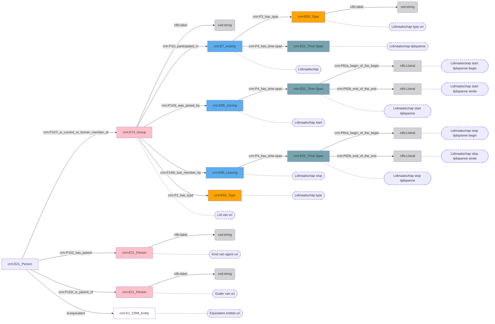

```mermaid
graph LR
0d9cfaca-e37c-11ed-9064-00163e71351b["crm:E21_Person"]-->|"rdfs:label"|0d9d4be2-e37c-11ed-9064-00163e71351b(xsd:string)
0d9d05d8-e37c-11ed-9064-00163e71351b["crm:E74_Group"]-->|"rdfs:label"|0d9d3ed6-e37c-11ed-9064-00163e71351b(xsd:string)
0d9d0984-e37c-11ed-9064-00163e71351b["crm:E21_Person"]-->|"rdfs:label"|0d9d1f96-e37c-11ed-9064-00163e71351b(xsd:string)
15d1ad32-57a1-11ee-b0c4-00163e71351b["crm:E52_Time-Span"]-->|"crm:P82a_begin_of_the_begin"|2a3071ae-57a2-11ee-bc5c-00163e71351b(rdfs:Literal)
15d1ad32-57a1-11ee-b0c4-00163e71351b["crm:E52_Time-Span"]-->|"crm:P82b_end_of_the_end"|4730bcc8-57a2-11ee-974d-00163e71351b(rdfs:Literal)
348369c6-ea70-11ed-a1e6-00163e71351b["crm:E52_Time-Span"]-->|"crm:P82a_begin_of_the_begin"|38c4fbdc-57a1-11ee-974d-00163e71351b(rdfs:Literal)
348369c6-ea70-11ed-a1e6-00163e71351b["crm:E52_Time-Span"]-->|"crm:P82b_end_of_the_end"|67722874-57a1-11ee-bc5c-00163e71351b(rdfs:Literal)
c22ec692-e9a5-11ed-9655-00163e71351b["crm:E55_Type"]-->|"rdfs:label"|07fc5d7e-e9a6-11ed-9655-00163e71351b(xsd:string)
0911bc54-e438-11ed-a1e6-00163e71351b["crm:E85_Joining"]-->|"crm:P4_has_time-span"|15d1ad32-57a1-11ee-b0c4-00163e71351b["crm:E52_Time-Span"]
0d9d05d8-e37c-11ed-9064-00163e71351b["crm:E74_Group"]-->|"crm:P11i_participated_in"|cba2f8ae-e9a2-11ed-9064-00163e71351b["crm:E7_Activity"]
0d9d05d8-e37c-11ed-9064-00163e71351b["crm:E74_Group"]-->|"crm:P143i_was_joined_by"|0911bc54-e438-11ed-a1e6-00163e71351b["crm:E85_Joining"]
0d9d05d8-e37c-11ed-9064-00163e71351b["crm:E74_Group"]-->|"crm:P146i_lost_member_by"|5f145dfa-e9a1-11ed-a1e6-00163e71351b["crm:E86_Leaving"]
0d9d05d8-e37c-11ed-9064-00163e71351b["crm:E74_Group"]-->|"crm:P2_has_type"|0a82e242-e9a2-11ed-9232-00163e71351b["crm:E55_Type"]
0d9d4cb4-e37c-11ed-9064-00163e71351b["crm:E21_Person"]-->|"crm:P107i_is_current_or_former_member_of"|0d9d05d8-e37c-11ed-9064-00163e71351b["crm:E74_Group"]
0d9d4cb4-e37c-11ed-9064-00163e71351b["crm:E21_Person"]-->|"crm:P152_has_parent"|0d9cfaca-e37c-11ed-9064-00163e71351b["crm:E21_Person"]
0d9d4cb4-e37c-11ed-9064-00163e71351b["crm:E21_Person"]-->|"crm:P152i_is_parent_of"|0d9d0984-e37c-11ed-9064-00163e71351b["crm:E21_Person"]
0d9d4cb4-e37c-11ed-9064-00163e71351b["crm:E21_Person"]-->|"la:equivalent"|0d9ce3fa-e37c-11ed-9064-00163e71351b["crm:E1_CRM_Entity"]
5f145dfa-e9a1-11ed-a1e6-00163e71351b["crm:E86_Leaving"]-->|"crm:P4_has_time-span"|348369c6-ea70-11ed-a1e6-00163e71351b["crm:E52_Time-Span"]
cba2f8ae-e9a2-11ed-9064-00163e71351b["crm:E7_Activity"]-->|"crm:P2_has_type"|c22ec692-e9a5-11ed-9655-00163e71351b["crm:E55_Type"]
cba2f8ae-e9a2-11ed-9064-00163e71351b["crm:E7_Activity"]-->|"crm:P4_has_time-span"|0fb2af62-ea70-11ed-9232-00163e71351b["crm:E52_Time-Span"]
style 15d1ad32-57a1-11ee-b0c4-00163e71351b_s stroke-dasharray: 5
style cba2f8ae-e9a2-11ed-9064-00163e71351b_s stroke-dasharray: 5
style 0911bc54-e438-11ed-a1e6-00163e71351b_s stroke-dasharray: 5
style 5f145dfa-e9a1-11ed-a1e6-00163e71351b_s stroke-dasharray: 5
style 0a82e242-e9a2-11ed-9232-00163e71351b_s stroke-dasharray: 5
style 0d9d05d8-e37c-11ed-9064-00163e71351b_s stroke-dasharray: 5
style 0d9cfaca-e37c-11ed-9064-00163e71351b_s stroke-dasharray: 5
style 0d9d0984-e37c-11ed-9064-00163e71351b_s stroke-dasharray: 5
style 0d9ce3fa-e37c-11ed-9064-00163e71351b_s stroke-dasharray: 5
style 2a3071ae-57a2-11ee-bc5c-00163e71351b_s stroke-dasharray: 5
style 4730bcc8-57a2-11ee-974d-00163e71351b_s stroke-dasharray: 5
style 38c4fbdc-57a1-11ee-974d-00163e71351b_s stroke-dasharray: 5
style 67722874-57a1-11ee-bc5c-00163e71351b_s stroke-dasharray: 5
style 348369c6-ea70-11ed-a1e6-00163e71351b_s stroke-dasharray: 5
style c22ec692-e9a5-11ed-9655-00163e71351b_s stroke-dasharray: 5
style 0fb2af62-ea70-11ed-9232-00163e71351b_s stroke-dasharray: 5
15d1ad32-57a1-11ee-b0c4-00163e71351b["crm:E52_Time-Span"]-.-15d1ad32-57a1-11ee-b0c4-00163e71351b_s(["Lidmaatschap start tijdspanne"])
cba2f8ae-e9a2-11ed-9064-00163e71351b["crm:E7_Activity"]-.-cba2f8ae-e9a2-11ed-9064-00163e71351b_s(["Lidmaatschap"])
0911bc54-e438-11ed-a1e6-00163e71351b["crm:E85_Joining"]-.-0911bc54-e438-11ed-a1e6-00163e71351b_s(["Lidmaatschap start"])
5f145dfa-e9a1-11ed-a1e6-00163e71351b["crm:E86_Leaving"]-.-5f145dfa-e9a1-11ed-a1e6-00163e71351b_s(["Lidmaatschap stop"])
0a82e242-e9a2-11ed-9232-00163e71351b["crm:E55_Type"]-.-0a82e242-e9a2-11ed-9232-00163e71351b_s(["Lidmaatschap type"])
0d9d05d8-e37c-11ed-9064-00163e71351b["crm:E74_Group"]-.-0d9d05d8-e37c-11ed-9064-00163e71351b_s(["Lid van uri"])
0d9cfaca-e37c-11ed-9064-00163e71351b["crm:E21_Person"]-.-0d9cfaca-e37c-11ed-9064-00163e71351b_s(["Kind van agent uri"])
0d9d0984-e37c-11ed-9064-00163e71351b["crm:E21_Person"]-.-0d9d0984-e37c-11ed-9064-00163e71351b_s(["Ouder van uri"])
0d9ce3fa-e37c-11ed-9064-00163e71351b["crm:E1_CRM_Entity"]-.-0d9ce3fa-e37c-11ed-9064-00163e71351b_s(["Equivalent entiteit uri"])
2a3071ae-57a2-11ee-bc5c-00163e71351b["rdfs:Literal"]-.-2a3071ae-57a2-11ee-bc5c-00163e71351b_s(["Lidmaatschap start tijdspanne begin"])
4730bcc8-57a2-11ee-974d-00163e71351b["rdfs:Literal"]-.-4730bcc8-57a2-11ee-974d-00163e71351b_s(["Lidmaatschap start tijdspanne einde"])
38c4fbdc-57a1-11ee-974d-00163e71351b["rdfs:Literal"]-.-38c4fbdc-57a1-11ee-974d-00163e71351b_s(["Lidmaatschap stop tijdspanne begin"])
67722874-57a1-11ee-bc5c-00163e71351b["rdfs:Literal"]-.-67722874-57a1-11ee-bc5c-00163e71351b_s(["Lidmaatschap stop tijdspanne einde"])
348369c6-ea70-11ed-a1e6-00163e71351b["crm:E52_Time-Span"]-.-348369c6-ea70-11ed-a1e6-00163e71351b_s(["Lidmaatschap stop tijdspanne"])
c22ec692-e9a5-11ed-9655-00163e71351b["crm:E55_Type"]-.-c22ec692-e9a5-11ed-9655-00163e71351b_s(["Lidmaatschap type uri"])
0fb2af62-ea70-11ed-9232-00163e71351b["crm:E52_Time-Span"]-.-0fb2af62-ea70-11ed-9232-00163e71351b_s(["Lidmaatschap tijdspanne"])
style 07fc5d7e-e9a6-11ed-9655-00163e71351b fill:#D3D3D3
style 0911bc54-e438-11ed-a1e6-00163e71351b fill:#5DAEEC
style 0a82e242-e9a2-11ed-9232-00163e71351b fill:#ffa500
style 0d9ce3fa-e37c-11ed-9064-00163e71351b fill:#ffffff
style 0d9cfaca-e37c-11ed-9064-00163e71351b fill:#ffc0cb
style 0d9d05d8-e37c-11ed-9064-00163e71351b fill:#ffc0cb
style 0d9d0984-e37c-11ed-9064-00163e71351b fill:#ffc0cb
style 0d9d1f96-e37c-11ed-9064-00163e71351b fill:#D3D3D3
style 0d9d3ed6-e37c-11ed-9064-00163e71351b fill:#D3D3D3
style 0d9d4be2-e37c-11ed-9064-00163e71351b fill:#D3D3D3
style 0fb2af62-ea70-11ed-9232-00163e71351b fill:#76A5AF
style 15d1ad32-57a1-11ee-b0c4-00163e71351b fill:#76A5AF
style 2a3071ae-57a2-11ee-bc5c-00163e71351b fill:#D3D3D3
style 348369c6-ea70-11ed-a1e6-00163e71351b fill:#76A5AF
style 38c4fbdc-57a1-11ee-974d-00163e71351b fill:#D3D3D3
style 4730bcc8-57a2-11ee-974d-00163e71351b fill:#D3D3D3
style 5f145dfa-e9a1-11ed-a1e6-00163e71351b fill:#5DAEEC
style 67722874-57a1-11ee-bc5c-00163e71351b fill:#D3D3D3
style c22ec692-e9a5-11ed-9655-00163e71351b fill:#ffa500
style cba2f8ae-e9a2-11ed-9064-00163e71351b fill:#5DAEEC
```
