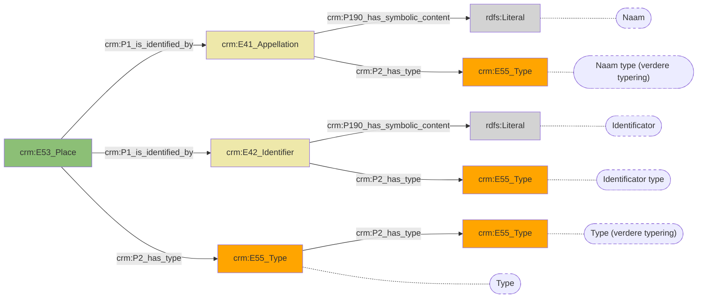

```mermaid
graph LR
style 03f0a4d7-936c-11ee-a7b2-960002548b4f fill:#8CBF76
style 090b86db-18e2-11ef-afa3-960002548b4f fill:#EEE8AA
style 090b8cb1-18e2-11ef-9503-960002548b4f fill:#ffa500
style 090b8f8a-18e2-11ef-8d33-960002548b4f fill:#D3D3D3
style 9384e21f-18e4-11ef-a05a-960002548b4f fill:#EEE8AA
style 9384e8d8-18e4-11ef-8890-960002548b4f fill:#D3D3D3
style 9384ea23-18e4-11ef-8291-960002548b4f fill:#ffa500
style c1f58db4-18e1-11ef-a6c6-960002548b4f fill:#ffa500
style c1f5947d-18e1-11ef-8823-960002548b4f fill:#ffa500
090b86db-18e2-11ef-afa3-960002548b4f["crm:E41_Appellation"]-->|"crm:P190_has_symbolic_content"|090b8f8a-18e2-11ef-8d33-960002548b4f(rdfs:Literal)
9384e21f-18e4-11ef-a05a-960002548b4f["crm:E42_Identifier"]-->|"crm:P190_has_symbolic_content"|9384e8d8-18e4-11ef-8890-960002548b4f(rdfs:Literal)
03f0a4d7-936c-11ee-a7b2-960002548b4f["crm:E53_Place"]-->|"crm:P1_is_identified_by"|090b86db-18e2-11ef-afa3-960002548b4f["crm:E41_Appellation"]
03f0a4d7-936c-11ee-a7b2-960002548b4f["crm:E53_Place"]-->|"crm:P1_is_identified_by"|9384e21f-18e4-11ef-a05a-960002548b4f["crm:E42_Identifier"]
03f0a4d7-936c-11ee-a7b2-960002548b4f["crm:E53_Place"]-->|"crm:P2_has_type"|c1f58db4-18e1-11ef-a6c6-960002548b4f["crm:E55_Type"]
090b86db-18e2-11ef-afa3-960002548b4f["crm:E41_Appellation"]-->|"crm:P2_has_type"|090b8cb1-18e2-11ef-9503-960002548b4f["crm:E55_Type"]
9384e21f-18e4-11ef-a05a-960002548b4f["crm:E42_Identifier"]-->|"crm:P2_has_type"|9384ea23-18e4-11ef-8291-960002548b4f["crm:E55_Type"]
c1f58db4-18e1-11ef-a6c6-960002548b4f["crm:E55_Type"]-->|"crm:P2_has_type"|c1f5947d-18e1-11ef-8823-960002548b4f["crm:E55_Type"]
c1f58db4-18e1-11ef-a6c6-960002548b4f["crm:E55_Type"]-.-c1f58db4-18e1-11ef-a6c6-960002548b4f_s(["Type"])
090b8f8a-18e2-11ef-8d33-960002548b4f["rdfs:Literal"]-.-090b8f8a-18e2-11ef-8d33-960002548b4f_s(["Naam"])
090b8cb1-18e2-11ef-9503-960002548b4f["crm:E55_Type"]-.-090b8cb1-18e2-11ef-9503-960002548b4f_s(["Naam type (verdere typering)"])
9384e8d8-18e4-11ef-8890-960002548b4f["rdfs:Literal"]-.-9384e8d8-18e4-11ef-8890-960002548b4f_s(["Identificator"])
9384ea23-18e4-11ef-8291-960002548b4f["crm:E55_Type"]-.-9384ea23-18e4-11ef-8291-960002548b4f_s(["Identificator type"])
c1f5947d-18e1-11ef-8823-960002548b4f["crm:E55_Type"]-.-c1f5947d-18e1-11ef-8823-960002548b4f_s(["Type (verdere typering)"])
style c1f58db4-18e1-11ef-a6c6-960002548b4f_s stroke-dasharray: 5
style 090b8f8a-18e2-11ef-8d33-960002548b4f_s stroke-dasharray: 5
style 090b8cb1-18e2-11ef-9503-960002548b4f_s stroke-dasharray: 5
style 9384e8d8-18e4-11ef-8890-960002548b4f_s stroke-dasharray: 5
style 9384ea23-18e4-11ef-8291-960002548b4f_s stroke-dasharray: 5
style c1f5947d-18e1-11ef-8823-960002548b4f_s stroke-dasharray: 5
```
