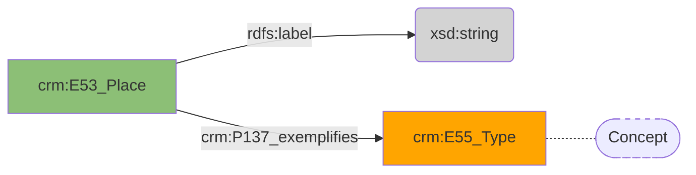

```mermaid
graph LR
81a7c17e-ef21-11ed-a1e6-00163e71351b["crm:E53_Place"]-->|"rdfs:label"|ac0f6444-ef21-11ed-9064-00163e71351b(xsd:string)
81a7c17e-ef21-11ed-a1e6-00163e71351b["crm:E53_Place"]-->|"crm:P137_exemplifies"|92bf450e-ef21-11ed-9655-00163e71351b["crm:E55_Type"]
92bf450e-ef21-11ed-9655-00163e71351b["crm:E55_Type"]-.-92bf450e-ef21-11ed-9655-00163e71351b_s(["Concept"])
style 92bf450e-ef21-11ed-9655-00163e71351b_s stroke-dasharray: 5
style 81a7c17e-ef21-11ed-a1e6-00163e71351b fill:#8CBF76
style 92bf450e-ef21-11ed-9655-00163e71351b fill:#ffa500
style ac0f6444-ef21-11ed-9064-00163e71351b fill:#D3D3D3
```
