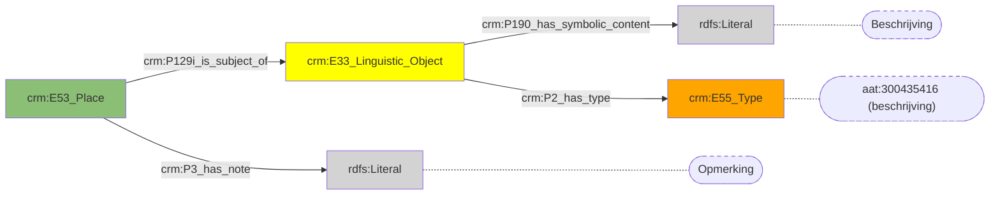

```mermaid
graph LR
style 03f0a4d7-936c-11ee-a7b2-960002548b4f fill:#8CBF76
style 177009f3-18e2-11ef-a48e-960002548b4f fill:#D3D3D3
style d62b8bb6-18e1-11ef-95c8-960002548b4f fill:#ffff00
style d62b91d8-18e1-11ef-9d40-960002548b4f fill:#D3D3D3
style d62b9371-18e1-11ef-94ed-960002548b4f fill:#ffa500
03f0a4d7-936c-11ee-a7b2-960002548b4f["crm:E53_Place"]-->|"crm:P3_has_note"|177009f3-18e2-11ef-a48e-960002548b4f(rdfs:Literal)
d62b8bb6-18e1-11ef-95c8-960002548b4f["crm:E33_Linguistic_Object"]-->|"crm:P190_has_symbolic_content"|d62b91d8-18e1-11ef-9d40-960002548b4f(rdfs:Literal)
03f0a4d7-936c-11ee-a7b2-960002548b4f["crm:E53_Place"]-->|"crm:P129i_is_subject_of"|d62b8bb6-18e1-11ef-95c8-960002548b4f["crm:E33_Linguistic_Object"]
d62b8bb6-18e1-11ef-95c8-960002548b4f["crm:E33_Linguistic_Object"]-->|"crm:P2_has_type"|d62b9371-18e1-11ef-94ed-960002548b4f["crm:E55_Type"]
style 177009f3-18e2-11ef-a48e-960002548b4f_s stroke-dasharray: 5
style d62b91d8-18e1-11ef-9d40-960002548b4f_s stroke-dasharray: 5
style d62b9371-18e1-11ef-94ed-960002548b4f_s stroke-dasharray: 5
177009f3-18e2-11ef-a48e-960002548b4f["rdfs:Literal"]-.-177009f3-18e2-11ef-a48e-960002548b4f_s(["Opmerking"])
d62b91d8-18e1-11ef-9d40-960002548b4f["rdfs:Literal"]-.-d62b91d8-18e1-11ef-9d40-960002548b4f_s(["Beschrijving"])
d62b9371-18e1-11ef-94ed-960002548b4f["crm:E55_Type"]-.-d62b9371-18e1-11ef-94ed-960002548b4f_s(["aat:300435416 (beschrijving)"])
```
