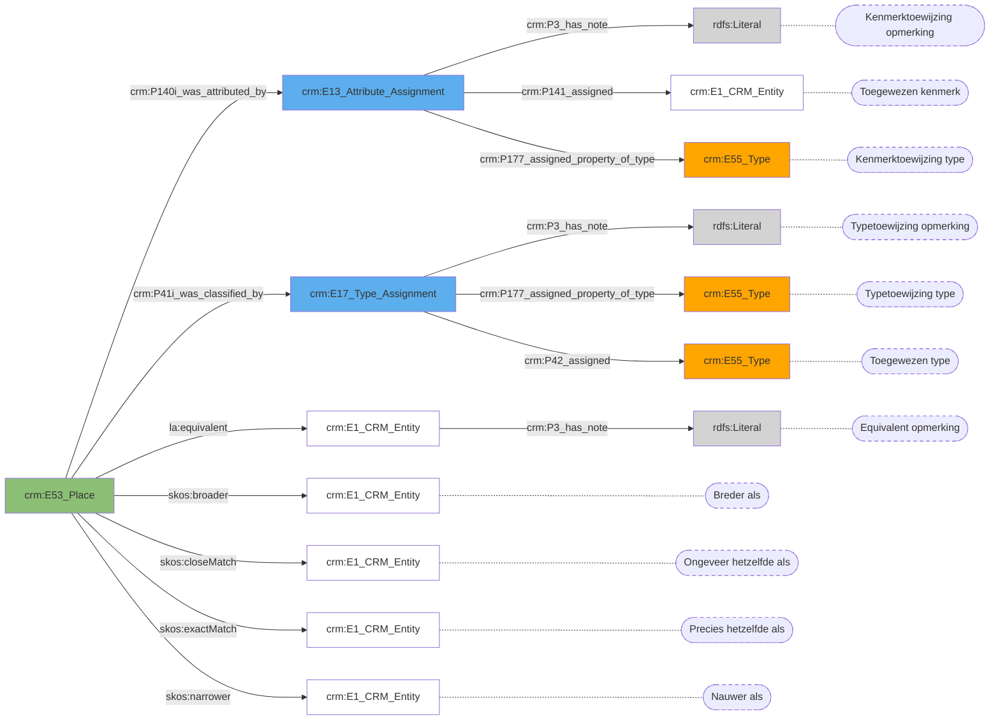

```mermaid
graph LR
style 03f0a4d7-936c-11ee-a7b2-960002548b4f fill:#8CBF76
style 347c8111-1dad-11ef-9307-960002548b4f fill:#ffffff
style 3a109c87-1dad-11ef-9f9a-960002548b4f fill:#ffffff
style 400c0d8c-1dad-11ef-af5f-960002548b4f fill:#ffffff
style 506cf9df-1dad-11ef-a85e-960002548b4f fill:#ffffff
style a4d88468-18e1-11ef-9bb4-960002548b4f fill:#5DAEEC
style a4d88992-18e1-11ef-90d2-960002548b4f fill:#ffa500
style a4d88b36-18e1-11ef-a745-960002548b4f fill:#ffffff
style a4d88c7b-18e1-11ef-a827-960002548b4f fill:#D3D3D3
style e533b4f5-18e1-11ef-b2bf-960002548b4f fill:#5DAEEC
style e533b9f0-18e1-11ef-8121-960002548b4f fill:#ffa500
style e533bb8e-18e1-11ef-9016-960002548b4f fill:#ffa500
style e533bf09-18e1-11ef-88d8-960002548b4f fill:#D3D3D3
style f67bc463-18e1-11ef-84c4-960002548b4f fill:#ffffff
style f67bc97c-18e1-11ef-b527-960002548b4f fill:#D3D3D3
a4d88468-18e1-11ef-9bb4-960002548b4f["crm:E13_Attribute_Assignment"]-->|"crm:P3_has_note"|a4d88c7b-18e1-11ef-a827-960002548b4f(rdfs:Literal)
e533b4f5-18e1-11ef-b2bf-960002548b4f["crm:E17_Type_Assignment"]-->|"crm:P3_has_note"|e533bf09-18e1-11ef-88d8-960002548b4f(rdfs:Literal)
f67bc463-18e1-11ef-84c4-960002548b4f["crm:E1_CRM_Entity"]-->|"crm:P3_has_note"|f67bc97c-18e1-11ef-b527-960002548b4f(rdfs:Literal)
style 347c8111-1dad-11ef-9307-960002548b4f_s stroke-dasharray: 5
style 3a109c87-1dad-11ef-9f9a-960002548b4f_s stroke-dasharray: 5
style 400c0d8c-1dad-11ef-af5f-960002548b4f_s stroke-dasharray: 5
style 506cf9df-1dad-11ef-a85e-960002548b4f_s stroke-dasharray: 5
style a4d88b36-18e1-11ef-a745-960002548b4f_s stroke-dasharray: 5
style a4d88992-18e1-11ef-90d2-960002548b4f_s stroke-dasharray: 5
style a4d88c7b-18e1-11ef-a827-960002548b4f_s stroke-dasharray: 5
style e533b9f0-18e1-11ef-8121-960002548b4f_s stroke-dasharray: 5
style e533bf09-18e1-11ef-88d8-960002548b4f_s stroke-dasharray: 5
style e533bb8e-18e1-11ef-9016-960002548b4f_s stroke-dasharray: 5
style f67bc97c-18e1-11ef-b527-960002548b4f_s stroke-dasharray: 5
347c8111-1dad-11ef-9307-960002548b4f["crm:E1_CRM_Entity"]-.-347c8111-1dad-11ef-9307-960002548b4f_s(["Breder als"])
3a109c87-1dad-11ef-9f9a-960002548b4f["crm:E1_CRM_Entity"]-.-3a109c87-1dad-11ef-9f9a-960002548b4f_s(["Ongeveer hetzelfde als"])
400c0d8c-1dad-11ef-af5f-960002548b4f["crm:E1_CRM_Entity"]-.-400c0d8c-1dad-11ef-af5f-960002548b4f_s(["Precies hetzelfde als"])
506cf9df-1dad-11ef-a85e-960002548b4f["crm:E1_CRM_Entity"]-.-506cf9df-1dad-11ef-a85e-960002548b4f_s(["Nauwer als"])
a4d88b36-18e1-11ef-a745-960002548b4f["crm:E1_CRM_Entity"]-.-a4d88b36-18e1-11ef-a745-960002548b4f_s(["Toegewezen kenmerk"])
a4d88992-18e1-11ef-90d2-960002548b4f["crm:E55_Type"]-.-a4d88992-18e1-11ef-90d2-960002548b4f_s(["Kenmerktoewijzing type"])
a4d88c7b-18e1-11ef-a827-960002548b4f["rdfs:Literal"]-.-a4d88c7b-18e1-11ef-a827-960002548b4f_s(["Kenmerktoewijzing opmerking"])
e533b9f0-18e1-11ef-8121-960002548b4f["crm:E55_Type"]-.-e533b9f0-18e1-11ef-8121-960002548b4f_s(["Typetoewijzing type"])
e533bf09-18e1-11ef-88d8-960002548b4f["rdfs:Literal"]-.-e533bf09-18e1-11ef-88d8-960002548b4f_s(["Typetoewijzing opmerking"])
e533bb8e-18e1-11ef-9016-960002548b4f["crm:E55_Type"]-.-e533bb8e-18e1-11ef-9016-960002548b4f_s(["Toegewezen type"])
f67bc97c-18e1-11ef-b527-960002548b4f["rdfs:Literal"]-.-f67bc97c-18e1-11ef-b527-960002548b4f_s(["Equivalent opmerking"])
03f0a4d7-936c-11ee-a7b2-960002548b4f["crm:E53_Place"]-->|"crm:P140i_was_attributed_by"|a4d88468-18e1-11ef-9bb4-960002548b4f["crm:E13_Attribute_Assignment"]
03f0a4d7-936c-11ee-a7b2-960002548b4f["crm:E53_Place"]-->|"crm:P41i_was_classified_by"|e533b4f5-18e1-11ef-b2bf-960002548b4f["crm:E17_Type_Assignment"]
03f0a4d7-936c-11ee-a7b2-960002548b4f["crm:E53_Place"]-->|"skos:broader"|347c8111-1dad-11ef-9307-960002548b4f["crm:E1_CRM_Entity"]
03f0a4d7-936c-11ee-a7b2-960002548b4f["crm:E53_Place"]-->|"skos:closeMatch"|3a109c87-1dad-11ef-9f9a-960002548b4f["crm:E1_CRM_Entity"]
03f0a4d7-936c-11ee-a7b2-960002548b4f["crm:E53_Place"]-->|"skos:exactMatch"|400c0d8c-1dad-11ef-af5f-960002548b4f["crm:E1_CRM_Entity"]
03f0a4d7-936c-11ee-a7b2-960002548b4f["crm:E53_Place"]-->|"skos:narrower"|506cf9df-1dad-11ef-a85e-960002548b4f["crm:E1_CRM_Entity"]
03f0a4d7-936c-11ee-a7b2-960002548b4f["crm:E53_Place"]-->|"la:equivalent"|f67bc463-18e1-11ef-84c4-960002548b4f["crm:E1_CRM_Entity"]
a4d88468-18e1-11ef-9bb4-960002548b4f["crm:E13_Attribute_Assignment"]-->|"crm:P141_assigned"|a4d88b36-18e1-11ef-a745-960002548b4f["crm:E1_CRM_Entity"]
a4d88468-18e1-11ef-9bb4-960002548b4f["crm:E13_Attribute_Assignment"]-->|"crm:P177_assigned_property_of_type"|a4d88992-18e1-11ef-90d2-960002548b4f["crm:E55_Type"]
e533b4f5-18e1-11ef-b2bf-960002548b4f["crm:E17_Type_Assignment"]-->|"crm:P177_assigned_property_of_type"|e533b9f0-18e1-11ef-8121-960002548b4f["crm:E55_Type"]
e533b4f5-18e1-11ef-b2bf-960002548b4f["crm:E17_Type_Assignment"]-->|"crm:P42_assigned"|e533bb8e-18e1-11ef-9016-960002548b4f["crm:E55_Type"]
```
