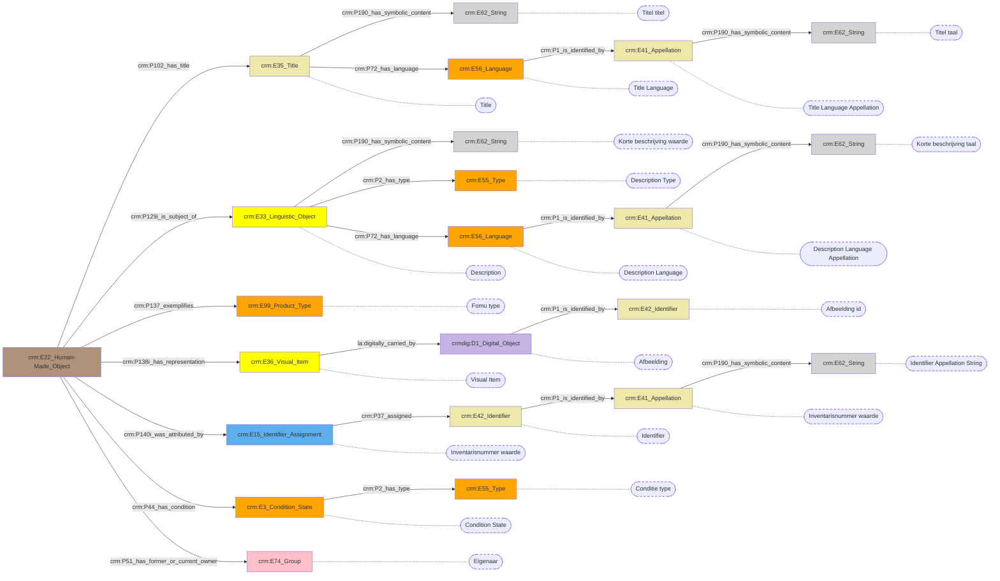

```mermaid
graph LR
style 1ad0637c-56bc-11ee-bc5c-00163e71351b fill:#EEE8AA
style 1ad06840-56bc-11ee-bc5c-00163e71351b fill:#D3D3D3
style 1ad06a16-56bc-11ee-bc5c-00163e71351b fill:#ffa500
style 2a29bfd2-5232-11ee-b0c4-00163e71351b fill:#ffff00
style 2a29c3a6-5232-11ee-b0c4-00163e71351b fill:#D3D3D3
style 2a29c5d6-5232-11ee-b0c4-00163e71351b fill:#ffa500
style 2a29c6bc-5232-11ee-b0c4-00163e71351b fill:#EEE8AA
style 2a29c7a2-5232-11ee-b0c4-00163e71351b fill:#ffa500
style 3fadcc61-dc8c-11ee-805e-960002548b4f fill:#ffff00
style 44f46230-5233-11ee-a9ac-00163e71351b fill:#5DAEEC
style 44f467c6-5233-11ee-a9ac-00163e71351b fill:#EEE8AA
style 44f46d84-5233-11ee-a9ac-00163e71351b fill:#EEE8AA
style 5352fb4b-e75f-11ee-ba57-960002548b4f fill:#EEE8AA
style 593ad4e5-dc8c-11ee-b808-960002548b4f fill:#C5B4E3
style 5b5c4a00-472b-11ee-a9ac-00163e71351b fill:#ffa500
style 7b1cfbc4-e75e-11ee-b435-960002548b4f fill:#EEE8AA
style 8458adf8-e75f-11ee-969d-960002548b4f fill:#D3D3D3
style 9503f17e-4729-11ee-974d-00163e71351b fill:#B0927A
style 9b72f879-dc8c-11ee-a8f1-960002548b4f fill:#ffc0cb
style d175ee0c-e75e-11ee-a4d8-960002548b4f fill:#D3D3D3
style e76d72bf-e75e-11ee-8833-960002548b4f fill:#D3D3D3
style f88a7f5a-472a-11ee-b0c4-00163e71351b fill:#ffa500
style f88a8338-472a-11ee-b0c4-00163e71351b fill:#ffa500
1ad0637c-56bc-11ee-bc5c-00163e71351b["crm:E35_Title"]-->|"crm:P190_has_symbolic_content"|1ad06840-56bc-11ee-bc5c-00163e71351b["crm:E62_String"]
1ad0637c-56bc-11ee-bc5c-00163e71351b["crm:E35_Title"]-->|"crm:P72_has_language"|1ad06a16-56bc-11ee-bc5c-00163e71351b["crm:E56_Language"]
1ad06a16-56bc-11ee-bc5c-00163e71351b["crm:E56_Language"]-->|"crm:P1_is_identified_by"|7b1cfbc4-e75e-11ee-b435-960002548b4f["crm:E41_Appellation"]
2a29bfd2-5232-11ee-b0c4-00163e71351b["crm:E33_Linguistic_Object"]-->|"crm:P190_has_symbolic_content"|2a29c3a6-5232-11ee-b0c4-00163e71351b["crm:E62_String"]
2a29bfd2-5232-11ee-b0c4-00163e71351b["crm:E33_Linguistic_Object"]-->|"crm:P2_has_type"|2a29c5d6-5232-11ee-b0c4-00163e71351b["crm:E55_Type"]
2a29bfd2-5232-11ee-b0c4-00163e71351b["crm:E33_Linguistic_Object"]-->|"crm:P72_has_language"|2a29c7a2-5232-11ee-b0c4-00163e71351b["crm:E56_Language"]
2a29c6bc-5232-11ee-b0c4-00163e71351b["crm:E41_Appellation"]-->|"crm:P190_has_symbolic_content"|d175ee0c-e75e-11ee-a4d8-960002548b4f["crm:E62_String"]
2a29c7a2-5232-11ee-b0c4-00163e71351b["crm:E56_Language"]-->|"crm:P1_is_identified_by"|2a29c6bc-5232-11ee-b0c4-00163e71351b["crm:E41_Appellation"]
3fadcc61-dc8c-11ee-805e-960002548b4f["crm:E36_Visual_Item"]-->|"la:digitally_carried_by"|593ad4e5-dc8c-11ee-b808-960002548b4f["crmdig:D1_Digital_Object"]
44f46230-5233-11ee-a9ac-00163e71351b["crm:E15_Identifier_Assignment"]-->|"crm:P37_assigned"|44f467c6-5233-11ee-a9ac-00163e71351b["crm:E42_Identifier"]
44f467c6-5233-11ee-a9ac-00163e71351b["crm:E42_Identifier"]-->|"crm:P1_is_identified_by"|44f46d84-5233-11ee-a9ac-00163e71351b["crm:E41_Appellation"]
44f46d84-5233-11ee-a9ac-00163e71351b["crm:E41_Appellation"]-->|"crm:P190_has_symbolic_content"|e76d72bf-e75e-11ee-8833-960002548b4f["crm:E62_String"]
593ad4e5-dc8c-11ee-b808-960002548b4f["crmdig:D1_Digital_Object"]-->|"crm:P1_is_identified_by"|5352fb4b-e75f-11ee-ba57-960002548b4f["crm:E42_Identifier"]
7b1cfbc4-e75e-11ee-b435-960002548b4f["crm:E41_Appellation"]-->|"crm:P190_has_symbolic_content"|8458adf8-e75f-11ee-969d-960002548b4f["crm:E62_String"]
9503f17e-4729-11ee-974d-00163e71351b["crm:E22_Human-Made_Object"]-->|"crm:P102_has_title"|1ad0637c-56bc-11ee-bc5c-00163e71351b["crm:E35_Title"]
9503f17e-4729-11ee-974d-00163e71351b["crm:E22_Human-Made_Object"]-->|"crm:P129i_is_subject_of"|2a29bfd2-5232-11ee-b0c4-00163e71351b["crm:E33_Linguistic_Object"]
9503f17e-4729-11ee-974d-00163e71351b["crm:E22_Human-Made_Object"]-->|"crm:P137_exemplifies"|5b5c4a00-472b-11ee-a9ac-00163e71351b["crm:E99_Product_Type"]
9503f17e-4729-11ee-974d-00163e71351b["crm:E22_Human-Made_Object"]-->|"crm:P138i_has_representation"|3fadcc61-dc8c-11ee-805e-960002548b4f["crm:E36_Visual_Item"]
9503f17e-4729-11ee-974d-00163e71351b["crm:E22_Human-Made_Object"]-->|"crm:P140i_was_attributed_by"|44f46230-5233-11ee-a9ac-00163e71351b["crm:E15_Identifier_Assignment"]
9503f17e-4729-11ee-974d-00163e71351b["crm:E22_Human-Made_Object"]-->|"crm:P44_has_condition"|f88a7f5a-472a-11ee-b0c4-00163e71351b["crm:E3_Condition_State"]
9503f17e-4729-11ee-974d-00163e71351b["crm:E22_Human-Made_Object"]-->|"crm:P51_has_former_or_current_owner"|9b72f879-dc8c-11ee-a8f1-960002548b4f["crm:E74_Group"]
f88a7f5a-472a-11ee-b0c4-00163e71351b["crm:E3_Condition_State"]-->|"crm:P2_has_type"|f88a8338-472a-11ee-b0c4-00163e71351b["crm:E55_Type"]
1ad06840-56bc-11ee-bc5c-00163e71351b["crm:E62_String"]-.-1ad06840-56bc-11ee-bc5c-00163e71351b_s(["Titel titel"])
1ad06a16-56bc-11ee-bc5c-00163e71351b["crm:E56_Language"]-.-1ad06a16-56bc-11ee-bc5c-00163e71351b_s(["Title Language"])
7b1cfbc4-e75e-11ee-b435-960002548b4f["crm:E41_Appellation"]-.-7b1cfbc4-e75e-11ee-b435-960002548b4f_s(["Title Language Appellation"])
2a29c3a6-5232-11ee-b0c4-00163e71351b["crm:E62_String"]-.-2a29c3a6-5232-11ee-b0c4-00163e71351b_s(["Korte beschrijving waarde"])
2a29c5d6-5232-11ee-b0c4-00163e71351b["crm:E55_Type"]-.-2a29c5d6-5232-11ee-b0c4-00163e71351b_s(["Description Type"])
2a29c7a2-5232-11ee-b0c4-00163e71351b["crm:E56_Language"]-.-2a29c7a2-5232-11ee-b0c4-00163e71351b_s(["Description Language"])
d175ee0c-e75e-11ee-a4d8-960002548b4f["crm:E62_String"]-.-d175ee0c-e75e-11ee-a4d8-960002548b4f_s(["Korte beschrijving taal"])
2a29c6bc-5232-11ee-b0c4-00163e71351b["crm:E41_Appellation"]-.-2a29c6bc-5232-11ee-b0c4-00163e71351b_s(["Description Language Appellation"])
593ad4e5-dc8c-11ee-b808-960002548b4f["crmdig:D1_Digital_Object"]-.-593ad4e5-dc8c-11ee-b808-960002548b4f_s(["Afbeelding"])
44f467c6-5233-11ee-a9ac-00163e71351b["crm:E42_Identifier"]-.-44f467c6-5233-11ee-a9ac-00163e71351b_s(["Identifier"])
44f46d84-5233-11ee-a9ac-00163e71351b["crm:E41_Appellation"]-.-44f46d84-5233-11ee-a9ac-00163e71351b_s(["Inventarisnummer waarde"])
e76d72bf-e75e-11ee-8833-960002548b4f["crm:E62_String"]-.-e76d72bf-e75e-11ee-8833-960002548b4f_s(["Identifier Appellation String"])
5352fb4b-e75f-11ee-ba57-960002548b4f["crm:E42_Identifier"]-.-5352fb4b-e75f-11ee-ba57-960002548b4f_s(["Afbeelding id"])
8458adf8-e75f-11ee-969d-960002548b4f["crm:E62_String"]-.-8458adf8-e75f-11ee-969d-960002548b4f_s(["Titel taal"])
1ad0637c-56bc-11ee-bc5c-00163e71351b["crm:E35_Title"]-.-1ad0637c-56bc-11ee-bc5c-00163e71351b_s(["Title"])
2a29bfd2-5232-11ee-b0c4-00163e71351b["crm:E33_Linguistic_Object"]-.-2a29bfd2-5232-11ee-b0c4-00163e71351b_s(["Description"])
5b5c4a00-472b-11ee-a9ac-00163e71351b["crm:E99_Product_Type"]-.-5b5c4a00-472b-11ee-a9ac-00163e71351b_s(["Fomu type"])
3fadcc61-dc8c-11ee-805e-960002548b4f["crm:E36_Visual_Item"]-.-3fadcc61-dc8c-11ee-805e-960002548b4f_s(["Visual Item"])
44f46230-5233-11ee-a9ac-00163e71351b["crm:E15_Identifier_Assignment"]-.-44f46230-5233-11ee-a9ac-00163e71351b_s(["Inventarisnummer waarde"])
f88a7f5a-472a-11ee-b0c4-00163e71351b["crm:E3_Condition_State"]-.-f88a7f5a-472a-11ee-b0c4-00163e71351b_s(["Condition State"])
9b72f879-dc8c-11ee-a8f1-960002548b4f["crm:E74_Group"]-.-9b72f879-dc8c-11ee-a8f1-960002548b4f_s(["Eigenaar"])
f88a8338-472a-11ee-b0c4-00163e71351b["crm:E55_Type"]-.-f88a8338-472a-11ee-b0c4-00163e71351b_s(["Conditie type"])
style 1ad06840-56bc-11ee-bc5c-00163e71351b_s stroke-dasharray: 5
style 1ad06a16-56bc-11ee-bc5c-00163e71351b_s stroke-dasharray: 5
style 7b1cfbc4-e75e-11ee-b435-960002548b4f_s stroke-dasharray: 5
style 2a29c3a6-5232-11ee-b0c4-00163e71351b_s stroke-dasharray: 5
style 2a29c5d6-5232-11ee-b0c4-00163e71351b_s stroke-dasharray: 5
style 2a29c7a2-5232-11ee-b0c4-00163e71351b_s stroke-dasharray: 5
style d175ee0c-e75e-11ee-a4d8-960002548b4f_s stroke-dasharray: 5
style 2a29c6bc-5232-11ee-b0c4-00163e71351b_s stroke-dasharray: 5
style 593ad4e5-dc8c-11ee-b808-960002548b4f_s stroke-dasharray: 5
style 44f467c6-5233-11ee-a9ac-00163e71351b_s stroke-dasharray: 5
style 44f46d84-5233-11ee-a9ac-00163e71351b_s stroke-dasharray: 5
style e76d72bf-e75e-11ee-8833-960002548b4f_s stroke-dasharray: 5
style 5352fb4b-e75f-11ee-ba57-960002548b4f_s stroke-dasharray: 5
style 8458adf8-e75f-11ee-969d-960002548b4f_s stroke-dasharray: 5
style 1ad0637c-56bc-11ee-bc5c-00163e71351b_s stroke-dasharray: 5
style 2a29bfd2-5232-11ee-b0c4-00163e71351b_s stroke-dasharray: 5
style 5b5c4a00-472b-11ee-a9ac-00163e71351b_s stroke-dasharray: 5
style 3fadcc61-dc8c-11ee-805e-960002548b4f_s stroke-dasharray: 5
style 44f46230-5233-11ee-a9ac-00163e71351b_s stroke-dasharray: 5
style f88a7f5a-472a-11ee-b0c4-00163e71351b_s stroke-dasharray: 5
style 9b72f879-dc8c-11ee-a8f1-960002548b4f_s stroke-dasharray: 5
style f88a8338-472a-11ee-b0c4-00163e71351b_s stroke-dasharray: 5
```
