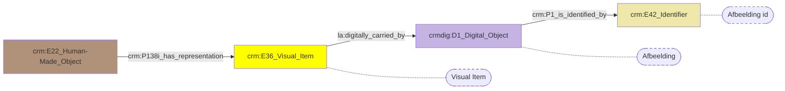

```mermaid
graph LR
3fadcc61-dc8c-11ee-805e-960002548b4f["crm:E36_Visual_Item"]-->|"la:digitally_carried_by"|593ad4e5-dc8c-11ee-b808-960002548b4f["crmdig:D1_Digital_Object"]
593ad4e5-dc8c-11ee-b808-960002548b4f["crmdig:D1_Digital_Object"]-->|"crm:P1_is_identified_by"|5352fb4b-e75f-11ee-ba57-960002548b4f["crm:E42_Identifier"]
9503f17e-4729-11ee-974d-00163e71351b["crm:E22_Human-Made_Object"]-->|"crm:P138i_has_representation"|3fadcc61-dc8c-11ee-805e-960002548b4f["crm:E36_Visual_Item"]
593ad4e5-dc8c-11ee-b808-960002548b4f["crmdig:D1_Digital_Object"]-.-593ad4e5-dc8c-11ee-b808-960002548b4f_s(["Afbeelding"])
5352fb4b-e75f-11ee-ba57-960002548b4f["crm:E42_Identifier"]-.-5352fb4b-e75f-11ee-ba57-960002548b4f_s(["Afbeelding id"])
3fadcc61-dc8c-11ee-805e-960002548b4f["crm:E36_Visual_Item"]-.-3fadcc61-dc8c-11ee-805e-960002548b4f_s(["Visual Item"])
style 593ad4e5-dc8c-11ee-b808-960002548b4f_s stroke-dasharray: 5
style 5352fb4b-e75f-11ee-ba57-960002548b4f_s stroke-dasharray: 5
style 3fadcc61-dc8c-11ee-805e-960002548b4f_s stroke-dasharray: 5
style 3fadcc61-dc8c-11ee-805e-960002548b4f fill:#ffff00
style 5352fb4b-e75f-11ee-ba57-960002548b4f fill:#EEE8AA
style 593ad4e5-dc8c-11ee-b808-960002548b4f fill:#C5B4E3
style 9503f17e-4729-11ee-974d-00163e71351b fill:#B0927A
```
