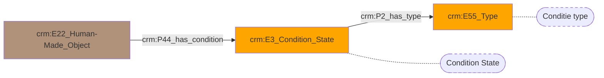

```mermaid
graph LR
style 9503f17e-4729-11ee-974d-00163e71351b fill:#B0927A
style f88a7f5a-472a-11ee-b0c4-00163e71351b fill:#ffa500
style f88a8338-472a-11ee-b0c4-00163e71351b fill:#ffa500
9503f17e-4729-11ee-974d-00163e71351b["crm:E22_Human-Made_Object"]-->|"crm:P44_has_condition"|f88a7f5a-472a-11ee-b0c4-00163e71351b["crm:E3_Condition_State"]
f88a7f5a-472a-11ee-b0c4-00163e71351b["crm:E3_Condition_State"]-->|"crm:P2_has_type"|f88a8338-472a-11ee-b0c4-00163e71351b["crm:E55_Type"]
f88a7f5a-472a-11ee-b0c4-00163e71351b["crm:E3_Condition_State"]-.-f88a7f5a-472a-11ee-b0c4-00163e71351b_s(["Condition State"])
f88a8338-472a-11ee-b0c4-00163e71351b["crm:E55_Type"]-.-f88a8338-472a-11ee-b0c4-00163e71351b_s(["Conditie type"])
style f88a7f5a-472a-11ee-b0c4-00163e71351b_s stroke-dasharray: 5
style f88a8338-472a-11ee-b0c4-00163e71351b_s stroke-dasharray: 5
```
