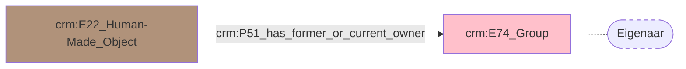

```mermaid
graph LR
style 9503f17e-4729-11ee-974d-00163e71351b fill:#B0927A
style 9b72f879-dc8c-11ee-a8f1-960002548b4f fill:#ffc0cb
9503f17e-4729-11ee-974d-00163e71351b["crm:E22_Human-Made_Object"]-->|"crm:P51_has_former_or_current_owner"|9b72f879-dc8c-11ee-a8f1-960002548b4f["crm:E74_Group"]
style 9b72f879-dc8c-11ee-a8f1-960002548b4f_s stroke-dasharray: 5
9b72f879-dc8c-11ee-a8f1-960002548b4f["crm:E74_Group"]-.-9b72f879-dc8c-11ee-a8f1-960002548b4f_s(["Eigenaar"])
```
