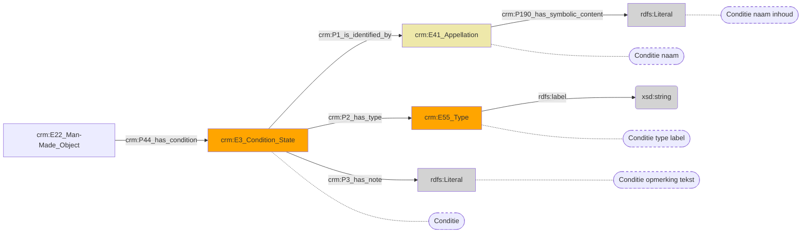

```mermaid
graph LR
9503f17e-4729-11ee-974d-00163e71351b["crm:E22_Man-Made_Object"]-->|"crm:P44_has_condition"|f88a7f5a-472a-11ee-b0c4-00163e71351b["crm:E3_Condition_State"]
f88a7f5a-472a-11ee-b0c4-00163e71351b["crm:E3_Condition_State"]-->|"crm:P1_is_identified_by"|fad11fd2-47d2-11ee-a9ac-00163e71351b["crm:E41_Appellation"]
f88a7f5a-472a-11ee-b0c4-00163e71351b["crm:E3_Condition_State"]-->|"crm:P2_has_type"|f88a8338-472a-11ee-b0c4-00163e71351b["crm:E55_Type"]
f88a7f5a-472a-11ee-b0c4-00163e71351b["crm:E3_Condition_State"]-->|"crm:P3_has_note"|f88a855e-472a-11ee-b0c4-00163e71351b(rdfs:Literal)
f88a8338-472a-11ee-b0c4-00163e71351b["crm:E55_Type"]-->|"rdfs:label"|f88a8464-472a-11ee-b0c4-00163e71351b(xsd:string)
fad11fd2-47d2-11ee-a9ac-00163e71351b["crm:E41_Appellation"]-->|"crm:P190_has_symbolic_content"|fad1239c-47d2-11ee-a9ac-00163e71351b(rdfs:Literal)
style f88a7f5a-472a-11ee-b0c4-00163e71351b_s stroke-dasharray: 5
style fad11fd2-47d2-11ee-a9ac-00163e71351b_s stroke-dasharray: 5
style f88a8338-472a-11ee-b0c4-00163e71351b_s stroke-dasharray: 5
style f88a855e-472a-11ee-b0c4-00163e71351b_s stroke-dasharray: 5
style fad1239c-47d2-11ee-a9ac-00163e71351b_s stroke-dasharray: 5
f88a7f5a-472a-11ee-b0c4-00163e71351b["crm:E3_Condition_State"]-.-f88a7f5a-472a-11ee-b0c4-00163e71351b_s(["Conditie"])
fad11fd2-47d2-11ee-a9ac-00163e71351b["crm:E41_Appellation"]-.-fad11fd2-47d2-11ee-a9ac-00163e71351b_s(["Conditie naam"])
f88a8338-472a-11ee-b0c4-00163e71351b["crm:E55_Type"]-.-f88a8338-472a-11ee-b0c4-00163e71351b_s(["Conditie type label"])
f88a855e-472a-11ee-b0c4-00163e71351b["rdfs:Literal"]-.-f88a855e-472a-11ee-b0c4-00163e71351b_s(["Conditie opmerking tekst"])
fad1239c-47d2-11ee-a9ac-00163e71351b["rdfs:Literal"]-.-fad1239c-47d2-11ee-a9ac-00163e71351b_s(["Conditie naam inhoud"])
style f88a7f5a-472a-11ee-b0c4-00163e71351b fill:#ffa500
style f88a8338-472a-11ee-b0c4-00163e71351b fill:#ffa500
style f88a8464-472a-11ee-b0c4-00163e71351b fill:#D3D3D3
style f88a855e-472a-11ee-b0c4-00163e71351b fill:#D3D3D3
style fad11fd2-47d2-11ee-a9ac-00163e71351b fill:#EEE8AA
style fad1239c-47d2-11ee-a9ac-00163e71351b fill:#D3D3D3
```
