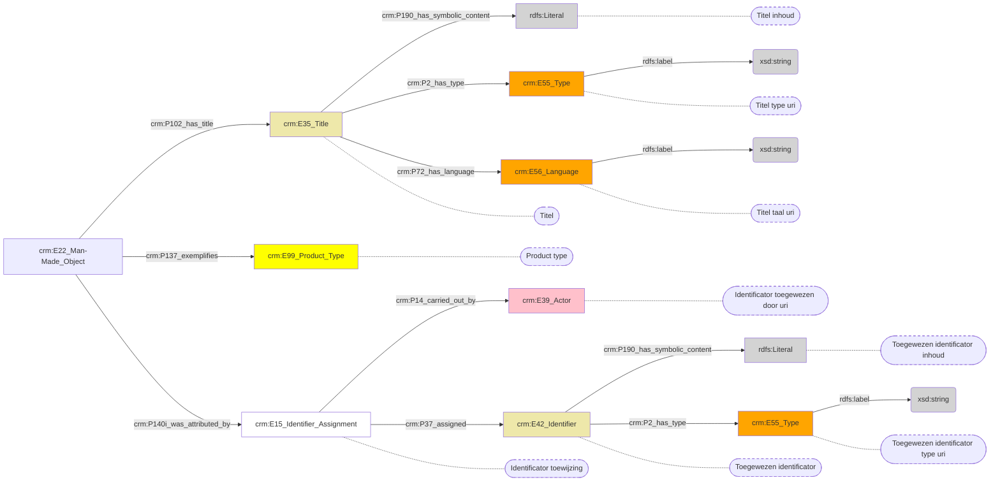

```mermaid
graph LR
1ad0637c-56bc-11ee-bc5c-00163e71351b["crm:E35_Title"]-->|"crm:P190_has_symbolic_content"|1ad06840-56bc-11ee-bc5c-00163e71351b(rdfs:Literal)
1ad0670a-56bc-11ee-bc5c-00163e71351b["crm:E55_Type"]-->|"rdfs:label"|1ad06af2-56bc-11ee-bc5c-00163e71351b(xsd:string)
1ad06a16-56bc-11ee-bc5c-00163e71351b["crm:E56_Language"]-->|"rdfs:label"|1ad06930-56bc-11ee-bc5c-00163e71351b(xsd:string)
44f467c6-5233-11ee-a9ac-00163e71351b["crm:E42_Identifier"]-->|"crm:P190_has_symbolic_content"|44f46d84-5233-11ee-a9ac-00163e71351b(rdfs:Literal)
44f46bd6-5233-11ee-a9ac-00163e71351b["crm:E55_Type"]-->|"rdfs:label"|44f46eec-5233-11ee-a9ac-00163e71351b(xsd:string)
1ad0637c-56bc-11ee-bc5c-00163e71351b["crm:E35_Title"]-->|"crm:P2_has_type"|1ad0670a-56bc-11ee-bc5c-00163e71351b["crm:E55_Type"]
1ad0637c-56bc-11ee-bc5c-00163e71351b["crm:E35_Title"]-->|"crm:P72_has_language"|1ad06a16-56bc-11ee-bc5c-00163e71351b["crm:E56_Language"]
44f46230-5233-11ee-a9ac-00163e71351b["crm:E15_Identifier_Assignment"]-->|"crm:P14_carried_out_by"|44f4704a-5233-11ee-a9ac-00163e71351b["crm:E39_Actor"]
44f46230-5233-11ee-a9ac-00163e71351b["crm:E15_Identifier_Assignment"]-->|"crm:P37_assigned"|44f467c6-5233-11ee-a9ac-00163e71351b["crm:E42_Identifier"]
44f467c6-5233-11ee-a9ac-00163e71351b["crm:E42_Identifier"]-->|"crm:P2_has_type"|44f46bd6-5233-11ee-a9ac-00163e71351b["crm:E55_Type"]
9503f17e-4729-11ee-974d-00163e71351b["crm:E22_Man-Made_Object"]-->|"crm:P102_has_title"|1ad0637c-56bc-11ee-bc5c-00163e71351b["crm:E35_Title"]
9503f17e-4729-11ee-974d-00163e71351b["crm:E22_Man-Made_Object"]-->|"crm:P137_exemplifies"|5b5c4a00-472b-11ee-a9ac-00163e71351b["crm:E99_Product_Type"]
9503f17e-4729-11ee-974d-00163e71351b["crm:E22_Man-Made_Object"]-->|"crm:P140i_was_attributed_by"|44f46230-5233-11ee-a9ac-00163e71351b["crm:E15_Identifier_Assignment"]
style 1ad06840-56bc-11ee-bc5c-00163e71351b_s stroke-dasharray: 5
style 1ad0670a-56bc-11ee-bc5c-00163e71351b_s stroke-dasharray: 5
style 1ad06a16-56bc-11ee-bc5c-00163e71351b_s stroke-dasharray: 5
style 44f4704a-5233-11ee-a9ac-00163e71351b_s stroke-dasharray: 5
style 44f467c6-5233-11ee-a9ac-00163e71351b_s stroke-dasharray: 5
style 44f46d84-5233-11ee-a9ac-00163e71351b_s stroke-dasharray: 5
style 44f46bd6-5233-11ee-a9ac-00163e71351b_s stroke-dasharray: 5
style 1ad0637c-56bc-11ee-bc5c-00163e71351b_s stroke-dasharray: 5
style 5b5c4a00-472b-11ee-a9ac-00163e71351b_s stroke-dasharray: 5
style 44f46230-5233-11ee-a9ac-00163e71351b_s stroke-dasharray: 5
1ad06840-56bc-11ee-bc5c-00163e71351b["rdfs:Literal"]-.-1ad06840-56bc-11ee-bc5c-00163e71351b_s(["Titel inhoud"])
1ad0670a-56bc-11ee-bc5c-00163e71351b["crm:E55_Type"]-.-1ad0670a-56bc-11ee-bc5c-00163e71351b_s(["Titel type uri"])
1ad06a16-56bc-11ee-bc5c-00163e71351b["crm:E56_Language"]-.-1ad06a16-56bc-11ee-bc5c-00163e71351b_s(["Titel taal uri"])
44f4704a-5233-11ee-a9ac-00163e71351b["crm:E39_Actor"]-.-44f4704a-5233-11ee-a9ac-00163e71351b_s(["Identificator toegewezen door uri"])
44f467c6-5233-11ee-a9ac-00163e71351b["crm:E42_Identifier"]-.-44f467c6-5233-11ee-a9ac-00163e71351b_s(["Toegewezen identificator"])
44f46d84-5233-11ee-a9ac-00163e71351b["rdfs:Literal"]-.-44f46d84-5233-11ee-a9ac-00163e71351b_s(["Toegewezen identificator inhoud"])
44f46bd6-5233-11ee-a9ac-00163e71351b["crm:E55_Type"]-.-44f46bd6-5233-11ee-a9ac-00163e71351b_s(["Toegewezen identificator type uri"])
1ad0637c-56bc-11ee-bc5c-00163e71351b["crm:E35_Title"]-.-1ad0637c-56bc-11ee-bc5c-00163e71351b_s(["Titel"])
5b5c4a00-472b-11ee-a9ac-00163e71351b["crm:E99_Product_Type"]-.-5b5c4a00-472b-11ee-a9ac-00163e71351b_s(["Product type"])
44f46230-5233-11ee-a9ac-00163e71351b["crm:E15_Identifier_Assignment"]-.-44f46230-5233-11ee-a9ac-00163e71351b_s(["Identificator toewijzing"])
style 1ad0637c-56bc-11ee-bc5c-00163e71351b fill:#EEE8AA
style 1ad0670a-56bc-11ee-bc5c-00163e71351b fill:#ffa500
style 1ad06840-56bc-11ee-bc5c-00163e71351b fill:#D3D3D3
style 1ad06930-56bc-11ee-bc5c-00163e71351b fill:#D3D3D3
style 1ad06a16-56bc-11ee-bc5c-00163e71351b fill:#ffa500
style 1ad06af2-56bc-11ee-bc5c-00163e71351b fill:#D3D3D3
style 44f46230-5233-11ee-a9ac-00163e71351b fill:#ffffff
style 44f467c6-5233-11ee-a9ac-00163e71351b fill:#EEE8AA
style 44f46bd6-5233-11ee-a9ac-00163e71351b fill:#ffa500
style 44f46d84-5233-11ee-a9ac-00163e71351b fill:#D3D3D3
style 44f46eec-5233-11ee-a9ac-00163e71351b fill:#D3D3D3
style 44f4704a-5233-11ee-a9ac-00163e71351b fill:#ffc0cb
style 5b5c4a00-472b-11ee-a9ac-00163e71351b fill:#ffff00
```
