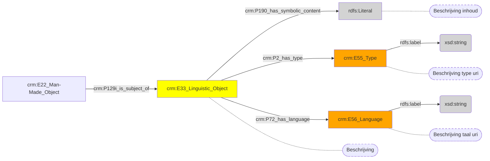

```mermaid
graph LR
2a29bfd2-5232-11ee-b0c4-00163e71351b["crm:E33_Linguistic_Object"]-->|"crm:P190_has_symbolic_content"|2a29c3a6-5232-11ee-b0c4-00163e71351b(rdfs:Literal)
2a29c5d6-5232-11ee-b0c4-00163e71351b["crm:E55_Type"]-->|"rdfs:label"|2a29c4dc-5232-11ee-b0c4-00163e71351b(xsd:string)
2a29c7a2-5232-11ee-b0c4-00163e71351b["crm:E56_Language"]-->|"rdfs:label"|2a29c6bc-5232-11ee-b0c4-00163e71351b(xsd:string)
2a29bfd2-5232-11ee-b0c4-00163e71351b["crm:E33_Linguistic_Object"]-->|"crm:P2_has_type"|2a29c5d6-5232-11ee-b0c4-00163e71351b["crm:E55_Type"]
2a29bfd2-5232-11ee-b0c4-00163e71351b["crm:E33_Linguistic_Object"]-->|"crm:P72_has_language"|2a29c7a2-5232-11ee-b0c4-00163e71351b["crm:E56_Language"]
9503f17e-4729-11ee-974d-00163e71351b["crm:E22_Man-Made_Object"]-->|"crm:P129i_is_subject_of"|2a29bfd2-5232-11ee-b0c4-00163e71351b["crm:E33_Linguistic_Object"]
style 2a29c3a6-5232-11ee-b0c4-00163e71351b_s stroke-dasharray: 5
style 2a29c5d6-5232-11ee-b0c4-00163e71351b_s stroke-dasharray: 5
style 2a29c7a2-5232-11ee-b0c4-00163e71351b_s stroke-dasharray: 5
style 2a29bfd2-5232-11ee-b0c4-00163e71351b_s stroke-dasharray: 5
2a29c3a6-5232-11ee-b0c4-00163e71351b["rdfs:Literal"]-.-2a29c3a6-5232-11ee-b0c4-00163e71351b_s(["Beschrijving inhoud"])
2a29c5d6-5232-11ee-b0c4-00163e71351b["crm:E55_Type"]-.-2a29c5d6-5232-11ee-b0c4-00163e71351b_s(["Beschrijving type uri"])
2a29c7a2-5232-11ee-b0c4-00163e71351b["crm:E56_Language"]-.-2a29c7a2-5232-11ee-b0c4-00163e71351b_s(["Beschrijving taal uri"])
2a29bfd2-5232-11ee-b0c4-00163e71351b["crm:E33_Linguistic_Object"]-.-2a29bfd2-5232-11ee-b0c4-00163e71351b_s(["Beschrijving"])
style 2a29bfd2-5232-11ee-b0c4-00163e71351b fill:#ffff00
style 2a29c3a6-5232-11ee-b0c4-00163e71351b fill:#D3D3D3
style 2a29c4dc-5232-11ee-b0c4-00163e71351b fill:#D3D3D3
style 2a29c5d6-5232-11ee-b0c4-00163e71351b fill:#ffa500
style 2a29c6bc-5232-11ee-b0c4-00163e71351b fill:#D3D3D3
style 2a29c7a2-5232-11ee-b0c4-00163e71351b fill:#ffa500
```
