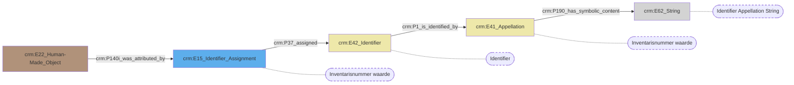

```mermaid
graph LR
style 44f46230-5233-11ee-a9ac-00163e71351b fill:#5DAEEC
style 44f467c6-5233-11ee-a9ac-00163e71351b fill:#EEE8AA
style 44f46d84-5233-11ee-a9ac-00163e71351b fill:#EEE8AA
style 9503f17e-4729-11ee-974d-00163e71351b fill:#B0927A
style e76d72bf-e75e-11ee-8833-960002548b4f fill:#D3D3D3
44f46230-5233-11ee-a9ac-00163e71351b["crm:E15_Identifier_Assignment"]-->|"crm:P37_assigned"|44f467c6-5233-11ee-a9ac-00163e71351b["crm:E42_Identifier"]
44f467c6-5233-11ee-a9ac-00163e71351b["crm:E42_Identifier"]-->|"crm:P1_is_identified_by"|44f46d84-5233-11ee-a9ac-00163e71351b["crm:E41_Appellation"]
44f46d84-5233-11ee-a9ac-00163e71351b["crm:E41_Appellation"]-->|"crm:P190_has_symbolic_content"|e76d72bf-e75e-11ee-8833-960002548b4f["crm:E62_String"]
9503f17e-4729-11ee-974d-00163e71351b["crm:E22_Human-Made_Object"]-->|"crm:P140i_was_attributed_by"|44f46230-5233-11ee-a9ac-00163e71351b["crm:E15_Identifier_Assignment"]
style 44f467c6-5233-11ee-a9ac-00163e71351b_s stroke-dasharray: 5
style 44f46d84-5233-11ee-a9ac-00163e71351b_s stroke-dasharray: 5
style e76d72bf-e75e-11ee-8833-960002548b4f_s stroke-dasharray: 5
style 44f46230-5233-11ee-a9ac-00163e71351b_s stroke-dasharray: 5
44f467c6-5233-11ee-a9ac-00163e71351b["crm:E42_Identifier"]-.-44f467c6-5233-11ee-a9ac-00163e71351b_s(["Identifier"])
44f46d84-5233-11ee-a9ac-00163e71351b["crm:E41_Appellation"]-.-44f46d84-5233-11ee-a9ac-00163e71351b_s(["Inventarisnummer waarde"])
e76d72bf-e75e-11ee-8833-960002548b4f["crm:E62_String"]-.-e76d72bf-e75e-11ee-8833-960002548b4f_s(["Identifier Appellation String"])
44f46230-5233-11ee-a9ac-00163e71351b["crm:E15_Identifier_Assignment"]-.-44f46230-5233-11ee-a9ac-00163e71351b_s(["Inventarisnummer waarde"])
```
