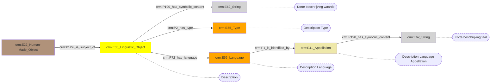

```mermaid
graph LR
style 2a29bfd2-5232-11ee-b0c4-00163e71351b fill:#ffff00
style 2a29c3a6-5232-11ee-b0c4-00163e71351b fill:#D3D3D3
style 2a29c5d6-5232-11ee-b0c4-00163e71351b fill:#ffa500
style 2a29c6bc-5232-11ee-b0c4-00163e71351b fill:#EEE8AA
style 2a29c7a2-5232-11ee-b0c4-00163e71351b fill:#ffa500
style 9503f17e-4729-11ee-974d-00163e71351b fill:#B0927A
style d175ee0c-e75e-11ee-a4d8-960002548b4f fill:#D3D3D3
2a29bfd2-5232-11ee-b0c4-00163e71351b["crm:E33_Linguistic_Object"]-->|"crm:P190_has_symbolic_content"|2a29c3a6-5232-11ee-b0c4-00163e71351b["crm:E62_String"]
2a29bfd2-5232-11ee-b0c4-00163e71351b["crm:E33_Linguistic_Object"]-->|"crm:P2_has_type"|2a29c5d6-5232-11ee-b0c4-00163e71351b["crm:E55_Type"]
2a29bfd2-5232-11ee-b0c4-00163e71351b["crm:E33_Linguistic_Object"]-->|"crm:P72_has_language"|2a29c7a2-5232-11ee-b0c4-00163e71351b["crm:E56_Language"]
2a29c6bc-5232-11ee-b0c4-00163e71351b["crm:E41_Appellation"]-->|"crm:P190_has_symbolic_content"|d175ee0c-e75e-11ee-a4d8-960002548b4f["crm:E62_String"]
2a29c7a2-5232-11ee-b0c4-00163e71351b["crm:E56_Language"]-->|"crm:P1_is_identified_by"|2a29c6bc-5232-11ee-b0c4-00163e71351b["crm:E41_Appellation"]
9503f17e-4729-11ee-974d-00163e71351b["crm:E22_Human-Made_Object"]-->|"crm:P129i_is_subject_of"|2a29bfd2-5232-11ee-b0c4-00163e71351b["crm:E33_Linguistic_Object"]
style 2a29c3a6-5232-11ee-b0c4-00163e71351b_s stroke-dasharray: 5
style 2a29c5d6-5232-11ee-b0c4-00163e71351b_s stroke-dasharray: 5
style 2a29c7a2-5232-11ee-b0c4-00163e71351b_s stroke-dasharray: 5
style d175ee0c-e75e-11ee-a4d8-960002548b4f_s stroke-dasharray: 5
style 2a29c6bc-5232-11ee-b0c4-00163e71351b_s stroke-dasharray: 5
style 2a29bfd2-5232-11ee-b0c4-00163e71351b_s stroke-dasharray: 5
2a29c3a6-5232-11ee-b0c4-00163e71351b["crm:E62_String"]-.-2a29c3a6-5232-11ee-b0c4-00163e71351b_s(["Korte beschrijving waarde"])
2a29c5d6-5232-11ee-b0c4-00163e71351b["crm:E55_Type"]-.-2a29c5d6-5232-11ee-b0c4-00163e71351b_s(["Description Type"])
2a29c7a2-5232-11ee-b0c4-00163e71351b["crm:E56_Language"]-.-2a29c7a2-5232-11ee-b0c4-00163e71351b_s(["Description Language"])
d175ee0c-e75e-11ee-a4d8-960002548b4f["crm:E62_String"]-.-d175ee0c-e75e-11ee-a4d8-960002548b4f_s(["Korte beschrijving taal"])
2a29c6bc-5232-11ee-b0c4-00163e71351b["crm:E41_Appellation"]-.-2a29c6bc-5232-11ee-b0c4-00163e71351b_s(["Description Language Appellation"])
2a29bfd2-5232-11ee-b0c4-00163e71351b["crm:E33_Linguistic_Object"]-.-2a29bfd2-5232-11ee-b0c4-00163e71351b_s(["Description"])
```
