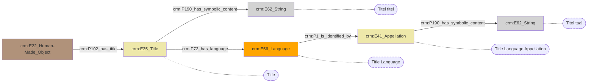

```mermaid
graph LR
style 1ad0637c-56bc-11ee-bc5c-00163e71351b fill:#EEE8AA
style 1ad06840-56bc-11ee-bc5c-00163e71351b fill:#D3D3D3
style 1ad06a16-56bc-11ee-bc5c-00163e71351b fill:#ffa500
style 7b1cfbc4-e75e-11ee-b435-960002548b4f fill:#EEE8AA
style 8458adf8-e75f-11ee-969d-960002548b4f fill:#D3D3D3
style 9503f17e-4729-11ee-974d-00163e71351b fill:#B0927A
1ad0637c-56bc-11ee-bc5c-00163e71351b["crm:E35_Title"]-->|"crm:P190_has_symbolic_content"|1ad06840-56bc-11ee-bc5c-00163e71351b["crm:E62_String"]
1ad0637c-56bc-11ee-bc5c-00163e71351b["crm:E35_Title"]-->|"crm:P72_has_language"|1ad06a16-56bc-11ee-bc5c-00163e71351b["crm:E56_Language"]
1ad06a16-56bc-11ee-bc5c-00163e71351b["crm:E56_Language"]-->|"crm:P1_is_identified_by"|7b1cfbc4-e75e-11ee-b435-960002548b4f["crm:E41_Appellation"]
7b1cfbc4-e75e-11ee-b435-960002548b4f["crm:E41_Appellation"]-->|"crm:P190_has_symbolic_content"|8458adf8-e75f-11ee-969d-960002548b4f["crm:E62_String"]
9503f17e-4729-11ee-974d-00163e71351b["crm:E22_Human-Made_Object"]-->|"crm:P102_has_title"|1ad0637c-56bc-11ee-bc5c-00163e71351b["crm:E35_Title"]
style 1ad06840-56bc-11ee-bc5c-00163e71351b_s stroke-dasharray: 5
style 1ad06a16-56bc-11ee-bc5c-00163e71351b_s stroke-dasharray: 5
style 7b1cfbc4-e75e-11ee-b435-960002548b4f_s stroke-dasharray: 5
style 8458adf8-e75f-11ee-969d-960002548b4f_s stroke-dasharray: 5
style 1ad0637c-56bc-11ee-bc5c-00163e71351b_s stroke-dasharray: 5
1ad06840-56bc-11ee-bc5c-00163e71351b["crm:E62_String"]-.-1ad06840-56bc-11ee-bc5c-00163e71351b_s(["Titel titel"])
1ad06a16-56bc-11ee-bc5c-00163e71351b["crm:E56_Language"]-.-1ad06a16-56bc-11ee-bc5c-00163e71351b_s(["Title Language"])
7b1cfbc4-e75e-11ee-b435-960002548b4f["crm:E41_Appellation"]-.-7b1cfbc4-e75e-11ee-b435-960002548b4f_s(["Title Language Appellation"])
8458adf8-e75f-11ee-969d-960002548b4f["crm:E62_String"]-.-8458adf8-e75f-11ee-969d-960002548b4f_s(["Titel taal"])
1ad0637c-56bc-11ee-bc5c-00163e71351b["crm:E35_Title"]-.-1ad0637c-56bc-11ee-bc5c-00163e71351b_s(["Title"])
```
