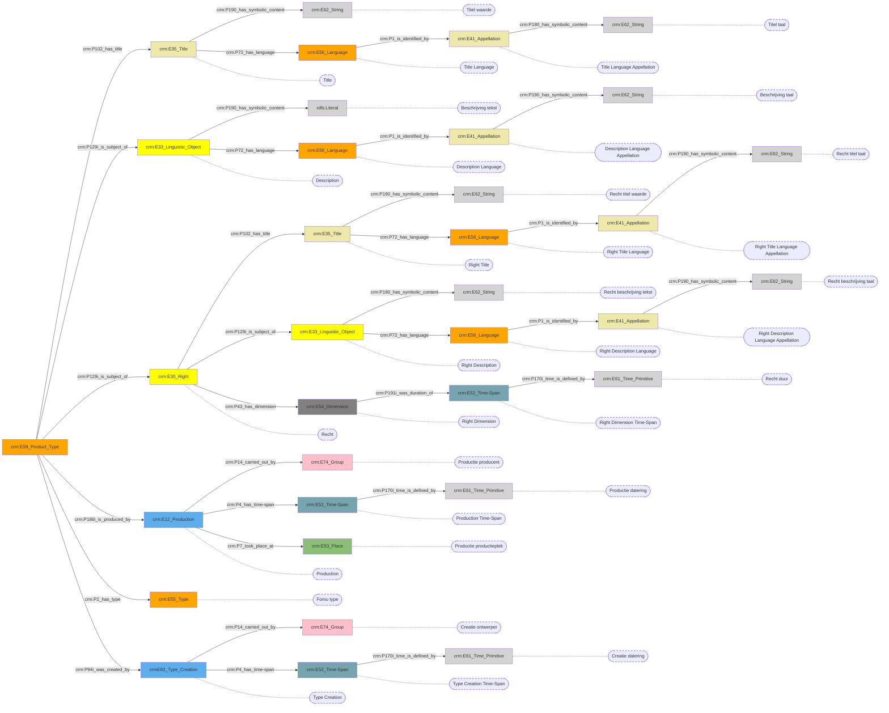

```mermaid
graph LR
style 03fa8dea-dc8b-11ee-997f-960002548b4f fill:#76A5AF
style 0b4974bb-e763-11ee-982c-960002548b4f fill:#D3D3D3
style 0f778d23-e765-11ee-a40e-960002548b4f fill:#ffa500
style 1f0e84f8-e764-11ee-a1e0-960002548b4f fill:#D3D3D3
style 21f0f17a-e765-11ee-b5a8-960002548b4f fill:#EEE8AA
style 24a98d4a-522c-11ee-bc5c-00163e71351b fill:#5DAEEC
style 2d3f4768-dc8b-11ee-ae3e-960002548b4f fill:#D3D3D3
style 32ae71bf-dc8a-11ee-a0ec-960002548b4f fill:#ffff00
style 32ae78c0-dc8a-11ee-9eb4-960002548b4f fill:#D3D3D3
style 32ae7be7-dc8a-11ee-92ff-960002548b4f fill:#ffa500
style 32ae7d00-dc8a-11ee-b543-960002548b4f fill:#EEE8AA
style 385e3835-e765-11ee-a70c-960002548b4f fill:#D3D3D3
style 3e873424-522c-11ee-974d-00163e71351b fill:#ffc0cb
style 4c0a7b94-56bc-11ee-bc5c-00163e71351b fill:#EEE8AA
style 4c0a856c-56bc-11ee-bc5c-00163e71351b fill:#D3D3D3
style 4c0a8792-56bc-11ee-bc5c-00163e71351b fill:#EEE8AA
style 4c0a89a4-56bc-11ee-bc5c-00163e71351b fill:#ffa500
style 4d27c45e-522b-11ee-974d-00163e71351b fill:#ffa500
style 58e05d5a-522c-11ee-a9ac-00163e71351b fill:#76A5AF
style 5f97bf63-e765-11ee-910c-960002548b4f fill:#ffff00
style 621a9706-522b-11ee-bc5c-00163e71351b fill:#ffa500
style 62491f63-dc8a-11ee-8bff-960002548b4f fill:#D3D3D3
style 75cdbe02-e765-11ee-867b-960002548b4f fill:#D3D3D3
style 88c38558-e765-11ee-a0fc-960002548b4f fill:#ffa500
style 90d070f6-dc8a-11ee-9063-960002548b4f fill:#5DAEEC
style 9688c9f4-522b-11ee-bc5c-00163e71351b fill:#ffff00
style 9688e574-522b-11ee-bc5c-00163e71351b fill:#808080
style 9688e664-522b-11ee-bc5c-00163e71351b fill:#76A5AF
style 9a80d38a-e765-11ee-bd77-960002548b4f fill:#EEE8AA
style a1f2aa78-56bb-11ee-b0c4-00163e71351b fill:#D3D3D3
style ae7e255c-e765-11ee-9a25-960002548b4f fill:#D3D3D3
style c93e0202-dc8a-11ee-ae5e-960002548b4f fill:#ffc0cb
style e21bd5db-dc8a-11ee-991e-960002548b4f fill:#8CBF76
style e704b981-e764-11ee-bbf1-960002548b4f fill:#EEE8AA
style f8fd7ba7-e764-11ee-9c55-960002548b4f fill:#D3D3D3
32ae71bf-dc8a-11ee-a0ec-960002548b4f["crm:E33_Linguistic_Object"]-->|"crm:P190_has_symbolic_content"|32ae78c0-dc8a-11ee-9eb4-960002548b4f(rdfs:Literal)
03fa8dea-dc8b-11ee-997f-960002548b4f["crm:E52_Time-Span"]-->|"crm:P170i_time_is_defined_by"|2d3f4768-dc8b-11ee-ae3e-960002548b4f["crm:E61_Time_Primitive"]
0f778d23-e765-11ee-a40e-960002548b4f["crm:E56_Language"]-->|"crm:P1_is_identified_by"|21f0f17a-e765-11ee-b5a8-960002548b4f["crm:E41_Appellation"]
21f0f17a-e765-11ee-b5a8-960002548b4f["crm:E41_Appellation"]-->|"crm:P190_has_symbolic_content"|385e3835-e765-11ee-a70c-960002548b4f["crm:E62_String"]
24a98d4a-522c-11ee-bc5c-00163e71351b["crmE83_Type_Creation"]-->|"crm:P14_carried_out_by"|3e873424-522c-11ee-974d-00163e71351b["crm:E74_Group"]
24a98d4a-522c-11ee-bc5c-00163e71351b["crmE83_Type_Creation"]-->|"crm:P4_has_time-span"|58e05d5a-522c-11ee-a9ac-00163e71351b["crm:E52_Time-Span"]
32ae71bf-dc8a-11ee-a0ec-960002548b4f["crm:E33_Linguistic_Object"]-->|"crm:P72_has_language"|32ae7be7-dc8a-11ee-92ff-960002548b4f["crm:E56_Language"]
32ae7be7-dc8a-11ee-92ff-960002548b4f["crm:E56_Language"]-->|"crm:P1_is_identified_by"|32ae7d00-dc8a-11ee-b543-960002548b4f["crm:E41_Appellation"]
32ae7d00-dc8a-11ee-b543-960002548b4f["crm:E41_Appellation"]-->|"crm:P190_has_symbolic_content"|1f0e84f8-e764-11ee-a1e0-960002548b4f["crm:E62_String"]
4c0a7b94-56bc-11ee-bc5c-00163e71351b["crm:E35_Title"]-->|"crm:P190_has_symbolic_content"|4c0a856c-56bc-11ee-bc5c-00163e71351b["crm:E62_String"]
4c0a7b94-56bc-11ee-bc5c-00163e71351b["crm:E35_Title"]-->|"crm:P72_has_language"|4c0a89a4-56bc-11ee-bc5c-00163e71351b["crm:E56_Language"]
4c0a8792-56bc-11ee-bc5c-00163e71351b["crm:E41_Appellation"]-->|"crm:P190_has_symbolic_content"|0b4974bb-e763-11ee-982c-960002548b4f["crm:E62_String"]
4c0a89a4-56bc-11ee-bc5c-00163e71351b["crm:E56_Language"]-->|"crm:P1_is_identified_by"|4c0a8792-56bc-11ee-bc5c-00163e71351b["crm:E41_Appellation"]
4d27c45e-522b-11ee-974d-00163e71351b["crm:E99_Product_Type"]-->|"crm:P102_has_title"|4c0a7b94-56bc-11ee-bc5c-00163e71351b["crm:E35_Title"]
4d27c45e-522b-11ee-974d-00163e71351b["crm:E99_Product_Type"]-->|"crm:P129i_is_subject_of"|32ae71bf-dc8a-11ee-a0ec-960002548b4f["crm:E33_Linguistic_Object"]
4d27c45e-522b-11ee-974d-00163e71351b["crm:E99_Product_Type"]-->|"crm:P129i_is_subject_of"|9688c9f4-522b-11ee-bc5c-00163e71351b["crm:E30_Right"]
4d27c45e-522b-11ee-974d-00163e71351b["crm:E99_Product_Type"]-->|"crm:P186i_is_produced_by"|90d070f6-dc8a-11ee-9063-960002548b4f["crm:E12_Production"]
4d27c45e-522b-11ee-974d-00163e71351b["crm:E99_Product_Type"]-->|"crm:P2_has_type"|621a9706-522b-11ee-bc5c-00163e71351b["crm:E55_Type"]
4d27c45e-522b-11ee-974d-00163e71351b["crm:E99_Product_Type"]-->|"crm:P94i_was_created_by"|24a98d4a-522c-11ee-bc5c-00163e71351b["crmE83_Type_Creation"]
58e05d5a-522c-11ee-a9ac-00163e71351b["crm:E52_Time-Span"]-->|"crm:P170i_time_is_defined_by"|62491f63-dc8a-11ee-8bff-960002548b4f["crm:E61_Time_Primitive"]
5f97bf63-e765-11ee-910c-960002548b4f["crm:E33_Linguistic_Object"]-->|"crm:P190_has_symbolic_content"|75cdbe02-e765-11ee-867b-960002548b4f["crm:E62_String"]
5f97bf63-e765-11ee-910c-960002548b4f["crm:E33_Linguistic_Object"]-->|"crm:P72_has_language"|88c38558-e765-11ee-a0fc-960002548b4f["crm:E56_Language"]
88c38558-e765-11ee-a0fc-960002548b4f["crm:E56_Language"]-->|"crm:P1_is_identified_by"|9a80d38a-e765-11ee-bd77-960002548b4f["crm:E41_Appellation"]
90d070f6-dc8a-11ee-9063-960002548b4f["crm:E12_Production"]-->|"crm:P14_carried_out_by"|c93e0202-dc8a-11ee-ae5e-960002548b4f["crm:E74_Group"]
90d070f6-dc8a-11ee-9063-960002548b4f["crm:E12_Production"]-->|"crm:P4_has_time-span"|03fa8dea-dc8b-11ee-997f-960002548b4f["crm:E52_Time-Span"]
90d070f6-dc8a-11ee-9063-960002548b4f["crm:E12_Production"]-->|"crm:P7_took_place_at"|e21bd5db-dc8a-11ee-991e-960002548b4f["crm:E53_Place"]
9688c9f4-522b-11ee-bc5c-00163e71351b["crm:E30_Right"]-->|"crm:P102_has_title"|e704b981-e764-11ee-bbf1-960002548b4f["crm:E35_Title"]
9688c9f4-522b-11ee-bc5c-00163e71351b["crm:E30_Right"]-->|"crm:P129i_is_subject_of"|5f97bf63-e765-11ee-910c-960002548b4f["crm:E33_Linguistic_Object"]
9688c9f4-522b-11ee-bc5c-00163e71351b["crm:E30_Right"]-->|"crm:P43_has_dimension"|9688e574-522b-11ee-bc5c-00163e71351b["crm:E54_Dimension"]
9688e574-522b-11ee-bc5c-00163e71351b["crm:E54_Dimension"]-->|"crm:P191i_was_duration_of"|9688e664-522b-11ee-bc5c-00163e71351b["crm:E52_Time-Span"]
9688e664-522b-11ee-bc5c-00163e71351b["crm:E52_Time-Span"]-->|"crm:P170i_time_is_defined_by"|a1f2aa78-56bb-11ee-b0c4-00163e71351b["crm:E61_Time_Primitive"]
9a80d38a-e765-11ee-bd77-960002548b4f["crm:E41_Appellation"]-->|"crm:P190_has_symbolic_content"|ae7e255c-e765-11ee-9a25-960002548b4f["crm:E62_String"]
e704b981-e764-11ee-bbf1-960002548b4f["crm:E35_Title"]-->|"crm:P190_has_symbolic_content"|f8fd7ba7-e764-11ee-9c55-960002548b4f["crm:E62_String"]
e704b981-e764-11ee-bbf1-960002548b4f["crm:E35_Title"]-->|"crm:P72_has_language"|0f778d23-e765-11ee-a40e-960002548b4f["crm:E56_Language"]
2d3f4768-dc8b-11ee-ae3e-960002548b4f["crm:E61_Time_Primitive"]-.-2d3f4768-dc8b-11ee-ae3e-960002548b4f_s(["Productie datering"])
21f0f17a-e765-11ee-b5a8-960002548b4f["crm:E41_Appellation"]-.-21f0f17a-e765-11ee-b5a8-960002548b4f_s(["Right Title Language Appellation"])
385e3835-e765-11ee-a70c-960002548b4f["crm:E62_String"]-.-385e3835-e765-11ee-a70c-960002548b4f_s(["Recht titel taal"])
3e873424-522c-11ee-974d-00163e71351b["crm:E74_Group"]-.-3e873424-522c-11ee-974d-00163e71351b_s(["Creatie ontwerper"])
58e05d5a-522c-11ee-a9ac-00163e71351b["crm:E52_Time-Span"]-.-58e05d5a-522c-11ee-a9ac-00163e71351b_s(["Type Creation Time-Span"])
32ae78c0-dc8a-11ee-9eb4-960002548b4f["rdfs:Literal"]-.-32ae78c0-dc8a-11ee-9eb4-960002548b4f_s(["Beschrijving tekst"])
32ae7be7-dc8a-11ee-92ff-960002548b4f["crm:E56_Language"]-.-32ae7be7-dc8a-11ee-92ff-960002548b4f_s(["Description Language"])
32ae7d00-dc8a-11ee-b543-960002548b4f["crm:E41_Appellation"]-.-32ae7d00-dc8a-11ee-b543-960002548b4f_s(["Description Language Appellation"])
1f0e84f8-e764-11ee-a1e0-960002548b4f["crm:E62_String"]-.-1f0e84f8-e764-11ee-a1e0-960002548b4f_s(["Beschrijving taal"])
4c0a856c-56bc-11ee-bc5c-00163e71351b["crm:E62_String"]-.-4c0a856c-56bc-11ee-bc5c-00163e71351b_s(["Titel waarde"])
4c0a89a4-56bc-11ee-bc5c-00163e71351b["crm:E56_Language"]-.-4c0a89a4-56bc-11ee-bc5c-00163e71351b_s(["Title Language"])
0b4974bb-e763-11ee-982c-960002548b4f["crm:E62_String"]-.-0b4974bb-e763-11ee-982c-960002548b4f_s(["Titel taal"])
4c0a8792-56bc-11ee-bc5c-00163e71351b["crm:E41_Appellation"]-.-4c0a8792-56bc-11ee-bc5c-00163e71351b_s(["Title Language Appellation"])
4c0a7b94-56bc-11ee-bc5c-00163e71351b["crm:E35_Title"]-.-4c0a7b94-56bc-11ee-bc5c-00163e71351b_s(["Title"])
32ae71bf-dc8a-11ee-a0ec-960002548b4f["crm:E33_Linguistic_Object"]-.-32ae71bf-dc8a-11ee-a0ec-960002548b4f_s(["Description"])
9688c9f4-522b-11ee-bc5c-00163e71351b["crm:E30_Right"]-.-9688c9f4-522b-11ee-bc5c-00163e71351b_s(["Recht"])
90d070f6-dc8a-11ee-9063-960002548b4f["crm:E12_Production"]-.-90d070f6-dc8a-11ee-9063-960002548b4f_s(["Production"])
621a9706-522b-11ee-bc5c-00163e71351b["crm:E55_Type"]-.-621a9706-522b-11ee-bc5c-00163e71351b_s(["Fomu type"])
24a98d4a-522c-11ee-bc5c-00163e71351b["crmE83_Type_Creation"]-.-24a98d4a-522c-11ee-bc5c-00163e71351b_s(["Type Creation"])
62491f63-dc8a-11ee-8bff-960002548b4f["crm:E61_Time_Primitive"]-.-62491f63-dc8a-11ee-8bff-960002548b4f_s(["Creatie datering"])
75cdbe02-e765-11ee-867b-960002548b4f["crm:E62_String"]-.-75cdbe02-e765-11ee-867b-960002548b4f_s(["Recht beschrijving tekst"])
88c38558-e765-11ee-a0fc-960002548b4f["crm:E56_Language"]-.-88c38558-e765-11ee-a0fc-960002548b4f_s(["Right Description Language"])
9a80d38a-e765-11ee-bd77-960002548b4f["crm:E41_Appellation"]-.-9a80d38a-e765-11ee-bd77-960002548b4f_s(["Right Description Language Appellation"])
c93e0202-dc8a-11ee-ae5e-960002548b4f["crm:E74_Group"]-.-c93e0202-dc8a-11ee-ae5e-960002548b4f_s(["Productie producent"])
03fa8dea-dc8b-11ee-997f-960002548b4f["crm:E52_Time-Span"]-.-03fa8dea-dc8b-11ee-997f-960002548b4f_s(["Production Time-Span"])
e21bd5db-dc8a-11ee-991e-960002548b4f["crm:E53_Place"]-.-e21bd5db-dc8a-11ee-991e-960002548b4f_s(["Productie productieplek"])
e704b981-e764-11ee-bbf1-960002548b4f["crm:E35_Title"]-.-e704b981-e764-11ee-bbf1-960002548b4f_s(["Right Title"])
5f97bf63-e765-11ee-910c-960002548b4f["crm:E33_Linguistic_Object"]-.-5f97bf63-e765-11ee-910c-960002548b4f_s(["Right Description"])
9688e574-522b-11ee-bc5c-00163e71351b["crm:E54_Dimension"]-.-9688e574-522b-11ee-bc5c-00163e71351b_s(["Right Dimension"])
9688e664-522b-11ee-bc5c-00163e71351b["crm:E52_Time-Span"]-.-9688e664-522b-11ee-bc5c-00163e71351b_s(["Right Dimension Time-Span"])
a1f2aa78-56bb-11ee-b0c4-00163e71351b["crm:E61_Time_Primitive"]-.-a1f2aa78-56bb-11ee-b0c4-00163e71351b_s(["Recht duur"])
ae7e255c-e765-11ee-9a25-960002548b4f["crm:E62_String"]-.-ae7e255c-e765-11ee-9a25-960002548b4f_s(["Recht beschrijving taal"])
f8fd7ba7-e764-11ee-9c55-960002548b4f["crm:E62_String"]-.-f8fd7ba7-e764-11ee-9c55-960002548b4f_s(["Recht titel waarde"])
0f778d23-e765-11ee-a40e-960002548b4f["crm:E56_Language"]-.-0f778d23-e765-11ee-a40e-960002548b4f_s(["Right Title Language"])
style 2d3f4768-dc8b-11ee-ae3e-960002548b4f_s stroke-dasharray: 5
style 21f0f17a-e765-11ee-b5a8-960002548b4f_s stroke-dasharray: 5
style 385e3835-e765-11ee-a70c-960002548b4f_s stroke-dasharray: 5
style 3e873424-522c-11ee-974d-00163e71351b_s stroke-dasharray: 5
style 58e05d5a-522c-11ee-a9ac-00163e71351b_s stroke-dasharray: 5
style 32ae78c0-dc8a-11ee-9eb4-960002548b4f_s stroke-dasharray: 5
style 32ae7be7-dc8a-11ee-92ff-960002548b4f_s stroke-dasharray: 5
style 32ae7d00-dc8a-11ee-b543-960002548b4f_s stroke-dasharray: 5
style 1f0e84f8-e764-11ee-a1e0-960002548b4f_s stroke-dasharray: 5
style 4c0a856c-56bc-11ee-bc5c-00163e71351b_s stroke-dasharray: 5
style 4c0a89a4-56bc-11ee-bc5c-00163e71351b_s stroke-dasharray: 5
style 0b4974bb-e763-11ee-982c-960002548b4f_s stroke-dasharray: 5
style 4c0a8792-56bc-11ee-bc5c-00163e71351b_s stroke-dasharray: 5
style 4c0a7b94-56bc-11ee-bc5c-00163e71351b_s stroke-dasharray: 5
style 32ae71bf-dc8a-11ee-a0ec-960002548b4f_s stroke-dasharray: 5
style 9688c9f4-522b-11ee-bc5c-00163e71351b_s stroke-dasharray: 5
style 90d070f6-dc8a-11ee-9063-960002548b4f_s stroke-dasharray: 5
style 621a9706-522b-11ee-bc5c-00163e71351b_s stroke-dasharray: 5
style 24a98d4a-522c-11ee-bc5c-00163e71351b_s stroke-dasharray: 5
style 62491f63-dc8a-11ee-8bff-960002548b4f_s stroke-dasharray: 5
style 75cdbe02-e765-11ee-867b-960002548b4f_s stroke-dasharray: 5
style 88c38558-e765-11ee-a0fc-960002548b4f_s stroke-dasharray: 5
style 9a80d38a-e765-11ee-bd77-960002548b4f_s stroke-dasharray: 5
style c93e0202-dc8a-11ee-ae5e-960002548b4f_s stroke-dasharray: 5
style 03fa8dea-dc8b-11ee-997f-960002548b4f_s stroke-dasharray: 5
style e21bd5db-dc8a-11ee-991e-960002548b4f_s stroke-dasharray: 5
style e704b981-e764-11ee-bbf1-960002548b4f_s stroke-dasharray: 5
style 5f97bf63-e765-11ee-910c-960002548b4f_s stroke-dasharray: 5
style 9688e574-522b-11ee-bc5c-00163e71351b_s stroke-dasharray: 5
style 9688e664-522b-11ee-bc5c-00163e71351b_s stroke-dasharray: 5
style a1f2aa78-56bb-11ee-b0c4-00163e71351b_s stroke-dasharray: 5
style ae7e255c-e765-11ee-9a25-960002548b4f_s stroke-dasharray: 5
style f8fd7ba7-e764-11ee-9c55-960002548b4f_s stroke-dasharray: 5
style 0f778d23-e765-11ee-a40e-960002548b4f_s stroke-dasharray: 5
```
