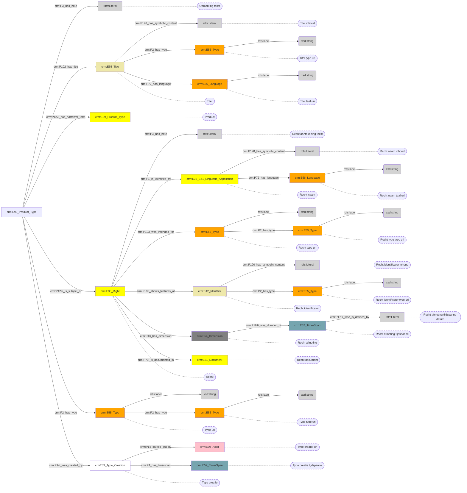

```mermaid
graph LR
4c0a7b94-56bc-11ee-bc5c-00163e71351b["crm:E35_Title"]-->|"crm:P190_has_symbolic_content"|4c0a856c-56bc-11ee-bc5c-00163e71351b(rdfs:Literal)
4c0a82d8-56bc-11ee-bc5c-00163e71351b["crm:E55_Type"]-->|"rdfs:label"|4c0a8ba2-56bc-11ee-bc5c-00163e71351b(xsd:string)
4c0a89a4-56bc-11ee-bc5c-00163e71351b["crm:E56_Language"]-->|"rdfs:label"|4c0a8792-56bc-11ee-bc5c-00163e71351b(xsd:string)
4d27c45e-522b-11ee-974d-00163e71351b["crm:E99_Product_Type"]-->|"crm:P3_has_note"|6e43045a-522b-11ee-b0c4-00163e71351b(rdfs:Literal)
621a9706-522b-11ee-bc5c-00163e71351b["crm:E55_Type"]-->|"rdfs:label"|621a9c42-522b-11ee-bc5c-00163e71351b(xsd:string)
621a9b02-522b-11ee-bc5c-00163e71351b["crm:E55_Type"]-->|"rdfs:label"|621a9d3c-522b-11ee-bc5c-00163e71351b(xsd:string)
9688c9f4-522b-11ee-bc5c-00163e71351b["crm:E30_Right"]-->|"crm:P3_has_note"|9688df0c-522b-11ee-bc5c-00163e71351b(rdfs:Literal)
9688ce0e-522b-11ee-bc5c-00163e71351b["crm:E55_Type"]-->|"rdfs:label"|9688e48e-522b-11ee-bc5c-00163e71351b(xsd:string)
9688d0f2-522b-11ee-bc5c-00163e71351b["crm:E42_Identifier"]-->|"crm:P190_has_symbolic_content"|9688dc46-522b-11ee-bc5c-00163e71351b(rdfs:Literal)
9688d98a-522b-11ee-bc5c-00163e71351b["crm:E55_Type"]-->|"rdfs:label"|9688e1d2-522b-11ee-bc5c-00163e71351b(xsd:string)
9688db60-522b-11ee-bc5c-00163e71351b["crm:E55_Type"]-->|"rdfs:label"|9688dd36-522b-11ee-bc5c-00163e71351b(xsd:string)
9688de26-522b-11ee-bc5c-00163e71351b["crm:E33_E41_Linguistic_Appellation"]-->|"crm:P190_has_symbolic_content"|9688e772-522b-11ee-bc5c-00163e71351b(rdfs:Literal)
9688e664-522b-11ee-bc5c-00163e71351b["crm:E52_Time-Span"]-->|"crm:P170i_time_is_defined_by"|a1f2aa78-56bb-11ee-b0c4-00163e71351b(rdfs:Literal)
9688e862-522b-11ee-bc5c-00163e71351b["crm:E56_Language"]-->|"rdfs:label"|9688e2b8-522b-11ee-bc5c-00163e71351b(xsd:string)
24a98d4a-522c-11ee-bc5c-00163e71351b["crmE83_Type_Creation"]-->|"crm:P14_carried_out_by"|3e873424-522c-11ee-974d-00163e71351b["crm:E39_Actor"]
24a98d4a-522c-11ee-bc5c-00163e71351b["crmE83_Type_Creation"]-->|"crm:P4_has_time-span"|58e05d5a-522c-11ee-a9ac-00163e71351b["crm:E52_Time-Span"]
4c0a7b94-56bc-11ee-bc5c-00163e71351b["crm:E35_Title"]-->|"crm:P2_has_type"|4c0a82d8-56bc-11ee-bc5c-00163e71351b["crm:E55_Type"]
4c0a7b94-56bc-11ee-bc5c-00163e71351b["crm:E35_Title"]-->|"crm:P72_has_language"|4c0a89a4-56bc-11ee-bc5c-00163e71351b["crm:E56_Language"]
4d27c45e-522b-11ee-974d-00163e71351b["crm:E99_Product_Type"]-->|"crm:P102_has_title"|4c0a7b94-56bc-11ee-bc5c-00163e71351b["crm:E35_Title"]
4d27c45e-522b-11ee-974d-00163e71351b["crm:E99_Product_Type"]-->|"crm:P127i_has_narrower_term"|97a16e3a-522c-11ee-bc5c-00163e71351b["crm:E99_Product_Type"]
4d27c45e-522b-11ee-974d-00163e71351b["crm:E99_Product_Type"]-->|"crm:P129i_is_subject_of"|9688c9f4-522b-11ee-bc5c-00163e71351b["crm:E30_Right"]
4d27c45e-522b-11ee-974d-00163e71351b["crm:E99_Product_Type"]-->|"crm:P2_has_type"|621a9706-522b-11ee-bc5c-00163e71351b["crm:E55_Type"]
4d27c45e-522b-11ee-974d-00163e71351b["crm:E99_Product_Type"]-->|"crm:P94i_was_created_by"|24a98d4a-522c-11ee-bc5c-00163e71351b["crmE83_Type_Creation"]
621a9706-522b-11ee-bc5c-00163e71351b["crm:E55_Type"]-->|"crm:P2_has_type"|621a9b02-522b-11ee-bc5c-00163e71351b["crm:E55_Type"]
9688c9f4-522b-11ee-bc5c-00163e71351b["crm:E30_Right"]-->|"crm:P1_is_identified_by"|9688de26-522b-11ee-bc5c-00163e71351b["crm:E33_E41_Linguistic_Appellation"]
9688c9f4-522b-11ee-bc5c-00163e71351b["crm:E30_Right"]-->|"crm:P103_was_intended_for"|9688ce0e-522b-11ee-bc5c-00163e71351b["crm:E55_Type"]
9688c9f4-522b-11ee-bc5c-00163e71351b["crm:E30_Right"]-->|"crm:P130_shows_features_of"|9688d0f2-522b-11ee-bc5c-00163e71351b["crm:E42_Identifier"]
9688c9f4-522b-11ee-bc5c-00163e71351b["crm:E30_Right"]-->|"crm:P43_has_dimension"|9688e574-522b-11ee-bc5c-00163e71351b["crm:E54_Dimension"]
9688c9f4-522b-11ee-bc5c-00163e71351b["crm:E30_Right"]-->|"crm:P70i_is_documented_in"|9688dff2-522b-11ee-bc5c-00163e71351b["crm:E31_Document"]
9688ce0e-522b-11ee-bc5c-00163e71351b["crm:E55_Type"]-->|"crm:P2_has_type"|9688d98a-522b-11ee-bc5c-00163e71351b["crm:E55_Type"]
9688d0f2-522b-11ee-bc5c-00163e71351b["crm:E42_Identifier"]-->|"crm:P2_has_type"|9688db60-522b-11ee-bc5c-00163e71351b["crm:E55_Type"]
9688de26-522b-11ee-bc5c-00163e71351b["crm:E33_E41_Linguistic_Appellation"]-->|"crm:P72_has_language"|9688e862-522b-11ee-bc5c-00163e71351b["crm:E56_Language"]
9688e574-522b-11ee-bc5c-00163e71351b["crm:E54_Dimension"]-->|"crm:P191i_was_duration_of"|9688e664-522b-11ee-bc5c-00163e71351b["crm:E52_Time-Span"]
style 3e873424-522c-11ee-974d-00163e71351b_s stroke-dasharray: 5
style 58e05d5a-522c-11ee-a9ac-00163e71351b_s stroke-dasharray: 5
style 4c0a856c-56bc-11ee-bc5c-00163e71351b_s stroke-dasharray: 5
style 4c0a82d8-56bc-11ee-bc5c-00163e71351b_s stroke-dasharray: 5
style 4c0a89a4-56bc-11ee-bc5c-00163e71351b_s stroke-dasharray: 5
style 4c0a7b94-56bc-11ee-bc5c-00163e71351b_s stroke-dasharray: 5
style 97a16e3a-522c-11ee-bc5c-00163e71351b_s stroke-dasharray: 5
style 9688c9f4-522b-11ee-bc5c-00163e71351b_s stroke-dasharray: 5
style 621a9706-522b-11ee-bc5c-00163e71351b_s stroke-dasharray: 5
style 6e43045a-522b-11ee-b0c4-00163e71351b_s stroke-dasharray: 5
style 24a98d4a-522c-11ee-bc5c-00163e71351b_s stroke-dasharray: 5
style 621a9b02-522b-11ee-bc5c-00163e71351b_s stroke-dasharray: 5
style 9688de26-522b-11ee-bc5c-00163e71351b_s stroke-dasharray: 5
style 9688ce0e-522b-11ee-bc5c-00163e71351b_s stroke-dasharray: 5
style 9688d0f2-522b-11ee-bc5c-00163e71351b_s stroke-dasharray: 5
style 9688df0c-522b-11ee-bc5c-00163e71351b_s stroke-dasharray: 5
style 9688e574-522b-11ee-bc5c-00163e71351b_s stroke-dasharray: 5
style 9688dff2-522b-11ee-bc5c-00163e71351b_s stroke-dasharray: 5
style 9688d98a-522b-11ee-bc5c-00163e71351b_s stroke-dasharray: 5
style 9688dc46-522b-11ee-bc5c-00163e71351b_s stroke-dasharray: 5
style 9688db60-522b-11ee-bc5c-00163e71351b_s stroke-dasharray: 5
style 9688e772-522b-11ee-bc5c-00163e71351b_s stroke-dasharray: 5
style 9688e862-522b-11ee-bc5c-00163e71351b_s stroke-dasharray: 5
style 9688e664-522b-11ee-bc5c-00163e71351b_s stroke-dasharray: 5
style a1f2aa78-56bb-11ee-b0c4-00163e71351b_s stroke-dasharray: 5
3e873424-522c-11ee-974d-00163e71351b["crm:E39_Actor"]-.-3e873424-522c-11ee-974d-00163e71351b_s(["Type creator uri"])
58e05d5a-522c-11ee-a9ac-00163e71351b["crm:E52_Time-Span"]-.-58e05d5a-522c-11ee-a9ac-00163e71351b_s(["Type creatie tijdspanne"])
4c0a856c-56bc-11ee-bc5c-00163e71351b["rdfs:Literal"]-.-4c0a856c-56bc-11ee-bc5c-00163e71351b_s(["Titel inhoud"])
4c0a82d8-56bc-11ee-bc5c-00163e71351b["crm:E55_Type"]-.-4c0a82d8-56bc-11ee-bc5c-00163e71351b_s(["Titel type uri"])
4c0a89a4-56bc-11ee-bc5c-00163e71351b["crm:E56_Language"]-.-4c0a89a4-56bc-11ee-bc5c-00163e71351b_s(["Titel taal uri"])
4c0a7b94-56bc-11ee-bc5c-00163e71351b["crm:E35_Title"]-.-4c0a7b94-56bc-11ee-bc5c-00163e71351b_s(["Titel"])
97a16e3a-522c-11ee-bc5c-00163e71351b["crm:E99_Product_Type"]-.-97a16e3a-522c-11ee-bc5c-00163e71351b_s(["Product"])
9688c9f4-522b-11ee-bc5c-00163e71351b["crm:E30_Right"]-.-9688c9f4-522b-11ee-bc5c-00163e71351b_s(["Recht"])
621a9706-522b-11ee-bc5c-00163e71351b["crm:E55_Type"]-.-621a9706-522b-11ee-bc5c-00163e71351b_s(["Type uri"])
6e43045a-522b-11ee-b0c4-00163e71351b["rdfs:Literal"]-.-6e43045a-522b-11ee-b0c4-00163e71351b_s(["Opmerking tekst"])
24a98d4a-522c-11ee-bc5c-00163e71351b["crmE83_Type_Creation"]-.-24a98d4a-522c-11ee-bc5c-00163e71351b_s(["Type creatie"])
621a9b02-522b-11ee-bc5c-00163e71351b["crm:E55_Type"]-.-621a9b02-522b-11ee-bc5c-00163e71351b_s(["Type type uri"])
9688de26-522b-11ee-bc5c-00163e71351b["crm:E33_E41_Linguistic_Appellation"]-.-9688de26-522b-11ee-bc5c-00163e71351b_s(["Recht naam"])
9688ce0e-522b-11ee-bc5c-00163e71351b["crm:E55_Type"]-.-9688ce0e-522b-11ee-bc5c-00163e71351b_s(["Recht type uri"])
9688d0f2-522b-11ee-bc5c-00163e71351b["crm:E42_Identifier"]-.-9688d0f2-522b-11ee-bc5c-00163e71351b_s(["Recht identificator"])
9688df0c-522b-11ee-bc5c-00163e71351b["rdfs:Literal"]-.-9688df0c-522b-11ee-bc5c-00163e71351b_s(["Recht aantekening tekst"])
9688e574-522b-11ee-bc5c-00163e71351b["crm:E54_Dimension"]-.-9688e574-522b-11ee-bc5c-00163e71351b_s(["Recht afmeting"])
9688dff2-522b-11ee-bc5c-00163e71351b["crm:E31_Document"]-.-9688dff2-522b-11ee-bc5c-00163e71351b_s(["Recht document"])
9688d98a-522b-11ee-bc5c-00163e71351b["crm:E55_Type"]-.-9688d98a-522b-11ee-bc5c-00163e71351b_s(["Recht type type uri"])
9688dc46-522b-11ee-bc5c-00163e71351b["rdfs:Literal"]-.-9688dc46-522b-11ee-bc5c-00163e71351b_s(["Recht identificator inhoud"])
9688db60-522b-11ee-bc5c-00163e71351b["crm:E55_Type"]-.-9688db60-522b-11ee-bc5c-00163e71351b_s(["Recht identificator type uri"])
9688e772-522b-11ee-bc5c-00163e71351b["rdfs:Literal"]-.-9688e772-522b-11ee-bc5c-00163e71351b_s(["Recht naam inhoud"])
9688e862-522b-11ee-bc5c-00163e71351b["crm:E56_Language"]-.-9688e862-522b-11ee-bc5c-00163e71351b_s(["Recht naam taal uri"])
9688e664-522b-11ee-bc5c-00163e71351b["crm:E52_Time-Span"]-.-9688e664-522b-11ee-bc5c-00163e71351b_s(["Recht afmeting tijdspanne"])
a1f2aa78-56bb-11ee-b0c4-00163e71351b["rdfs:Literal"]-.-a1f2aa78-56bb-11ee-b0c4-00163e71351b_s(["Recht afmeting tijdspanne datum"])
style 24a98d4a-522c-11ee-bc5c-00163e71351b fill:#ffffff
style 3e873424-522c-11ee-974d-00163e71351b fill:#ffc0cb
style 4c0a7b94-56bc-11ee-bc5c-00163e71351b fill:#EEE8AA
style 4c0a82d8-56bc-11ee-bc5c-00163e71351b fill:#ffa500
style 4c0a856c-56bc-11ee-bc5c-00163e71351b fill:#D3D3D3
style 4c0a8792-56bc-11ee-bc5c-00163e71351b fill:#D3D3D3
style 4c0a89a4-56bc-11ee-bc5c-00163e71351b fill:#ffa500
style 4c0a8ba2-56bc-11ee-bc5c-00163e71351b fill:#D3D3D3
style 58e05d5a-522c-11ee-a9ac-00163e71351b fill:#76A5AF
style 621a9706-522b-11ee-bc5c-00163e71351b fill:#ffa500
style 621a9b02-522b-11ee-bc5c-00163e71351b fill:#ffa500
style 621a9c42-522b-11ee-bc5c-00163e71351b fill:#D3D3D3
style 621a9d3c-522b-11ee-bc5c-00163e71351b fill:#D3D3D3
style 6e43045a-522b-11ee-b0c4-00163e71351b fill:#D3D3D3
style 9688c9f4-522b-11ee-bc5c-00163e71351b fill:#ffff00
style 9688ce0e-522b-11ee-bc5c-00163e71351b fill:#ffa500
style 9688d0f2-522b-11ee-bc5c-00163e71351b fill:#EEE8AA
style 9688d98a-522b-11ee-bc5c-00163e71351b fill:#ffa500
style 9688db60-522b-11ee-bc5c-00163e71351b fill:#ffa500
style 9688dc46-522b-11ee-bc5c-00163e71351b fill:#D3D3D3
style 9688dd36-522b-11ee-bc5c-00163e71351b fill:#D3D3D3
style 9688de26-522b-11ee-bc5c-00163e71351b fill:#ffff00
style 9688df0c-522b-11ee-bc5c-00163e71351b fill:#D3D3D3
style 9688dff2-522b-11ee-bc5c-00163e71351b fill:#ffff00
style 9688e1d2-522b-11ee-bc5c-00163e71351b fill:#D3D3D3
style 9688e2b8-522b-11ee-bc5c-00163e71351b fill:#D3D3D3
style 9688e48e-522b-11ee-bc5c-00163e71351b fill:#D3D3D3
style 9688e574-522b-11ee-bc5c-00163e71351b fill:#808080
style 9688e664-522b-11ee-bc5c-00163e71351b fill:#76A5AF
style 9688e772-522b-11ee-bc5c-00163e71351b fill:#D3D3D3
style 9688e862-522b-11ee-bc5c-00163e71351b fill:#ffa500
style 97a16e3a-522c-11ee-bc5c-00163e71351b fill:#ffff00
style a1f2aa78-56bb-11ee-b0c4-00163e71351b fill:#D3D3D3
```
