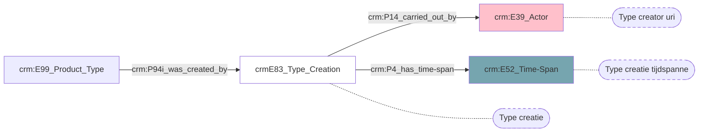

```mermaid
graph LR
24a98d4a-522c-11ee-bc5c-00163e71351b["crmE83_Type_Creation"]-->|"crm:P14_carried_out_by"|3e873424-522c-11ee-974d-00163e71351b["crm:E39_Actor"]
24a98d4a-522c-11ee-bc5c-00163e71351b["crmE83_Type_Creation"]-->|"crm:P4_has_time-span"|58e05d5a-522c-11ee-a9ac-00163e71351b["crm:E52_Time-Span"]
4d27c45e-522b-11ee-974d-00163e71351b["crm:E99_Product_Type"]-->|"crm:P94i_was_created_by"|24a98d4a-522c-11ee-bc5c-00163e71351b["crmE83_Type_Creation"]
style 3e873424-522c-11ee-974d-00163e71351b_s stroke-dasharray: 5
style 58e05d5a-522c-11ee-a9ac-00163e71351b_s stroke-dasharray: 5
style 24a98d4a-522c-11ee-bc5c-00163e71351b_s stroke-dasharray: 5
3e873424-522c-11ee-974d-00163e71351b["crm:E39_Actor"]-.-3e873424-522c-11ee-974d-00163e71351b_s(["Type creator uri"])
58e05d5a-522c-11ee-a9ac-00163e71351b["crm:E52_Time-Span"]-.-58e05d5a-522c-11ee-a9ac-00163e71351b_s(["Type creatie tijdspanne"])
24a98d4a-522c-11ee-bc5c-00163e71351b["crmE83_Type_Creation"]-.-24a98d4a-522c-11ee-bc5c-00163e71351b_s(["Type creatie"])
style 24a98d4a-522c-11ee-bc5c-00163e71351b fill:#ffffff
style 3e873424-522c-11ee-974d-00163e71351b fill:#ffc0cb
style 58e05d5a-522c-11ee-a9ac-00163e71351b fill:#76A5AF
```
