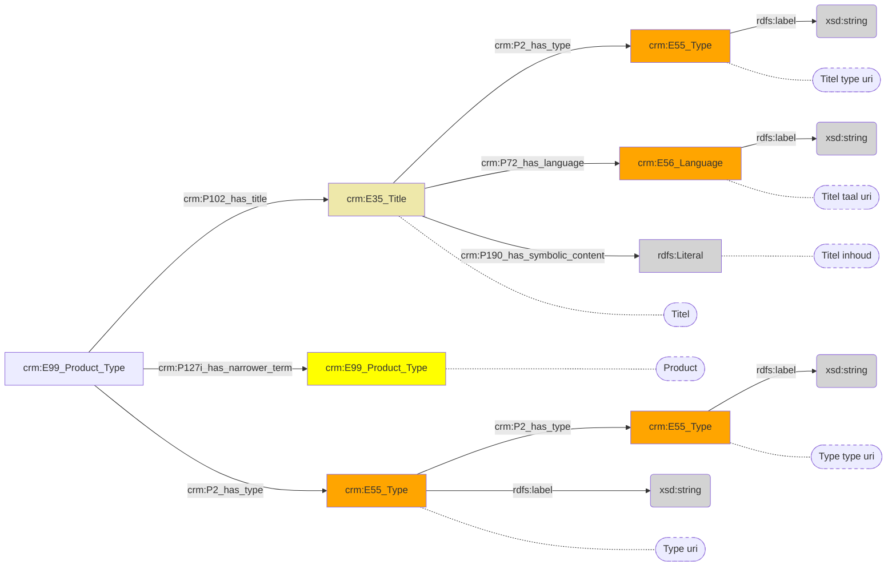

```mermaid
graph LR
4c0a7b94-56bc-11ee-bc5c-00163e71351b["crm:E35_Title"]-->|"crm:P2_has_type"|4c0a82d8-56bc-11ee-bc5c-00163e71351b["crm:E55_Type"]
4c0a7b94-56bc-11ee-bc5c-00163e71351b["crm:E35_Title"]-->|"crm:P72_has_language"|4c0a89a4-56bc-11ee-bc5c-00163e71351b["crm:E56_Language"]
4d27c45e-522b-11ee-974d-00163e71351b["crm:E99_Product_Type"]-->|"crm:P102_has_title"|4c0a7b94-56bc-11ee-bc5c-00163e71351b["crm:E35_Title"]
4d27c45e-522b-11ee-974d-00163e71351b["crm:E99_Product_Type"]-->|"crm:P127i_has_narrower_term"|97a16e3a-522c-11ee-bc5c-00163e71351b["crm:E99_Product_Type"]
4d27c45e-522b-11ee-974d-00163e71351b["crm:E99_Product_Type"]-->|"crm:P2_has_type"|621a9706-522b-11ee-bc5c-00163e71351b["crm:E55_Type"]
621a9706-522b-11ee-bc5c-00163e71351b["crm:E55_Type"]-->|"crm:P2_has_type"|621a9b02-522b-11ee-bc5c-00163e71351b["crm:E55_Type"]
4c0a7b94-56bc-11ee-bc5c-00163e71351b["crm:E35_Title"]-->|"crm:P190_has_symbolic_content"|4c0a856c-56bc-11ee-bc5c-00163e71351b(rdfs:Literal)
4c0a82d8-56bc-11ee-bc5c-00163e71351b["crm:E55_Type"]-->|"rdfs:label"|4c0a8ba2-56bc-11ee-bc5c-00163e71351b(xsd:string)
4c0a89a4-56bc-11ee-bc5c-00163e71351b["crm:E56_Language"]-->|"rdfs:label"|4c0a8792-56bc-11ee-bc5c-00163e71351b(xsd:string)
621a9706-522b-11ee-bc5c-00163e71351b["crm:E55_Type"]-->|"rdfs:label"|621a9c42-522b-11ee-bc5c-00163e71351b(xsd:string)
621a9b02-522b-11ee-bc5c-00163e71351b["crm:E55_Type"]-->|"rdfs:label"|621a9d3c-522b-11ee-bc5c-00163e71351b(xsd:string)
style 4c0a856c-56bc-11ee-bc5c-00163e71351b_s stroke-dasharray: 5
style 4c0a82d8-56bc-11ee-bc5c-00163e71351b_s stroke-dasharray: 5
style 4c0a89a4-56bc-11ee-bc5c-00163e71351b_s stroke-dasharray: 5
style 4c0a7b94-56bc-11ee-bc5c-00163e71351b_s stroke-dasharray: 5
style 97a16e3a-522c-11ee-bc5c-00163e71351b_s stroke-dasharray: 5
style 621a9706-522b-11ee-bc5c-00163e71351b_s stroke-dasharray: 5
style 621a9b02-522b-11ee-bc5c-00163e71351b_s stroke-dasharray: 5
4c0a856c-56bc-11ee-bc5c-00163e71351b["rdfs:Literal"]-.-4c0a856c-56bc-11ee-bc5c-00163e71351b_s(["Titel inhoud"])
4c0a82d8-56bc-11ee-bc5c-00163e71351b["crm:E55_Type"]-.-4c0a82d8-56bc-11ee-bc5c-00163e71351b_s(["Titel type uri"])
4c0a89a4-56bc-11ee-bc5c-00163e71351b["crm:E56_Language"]-.-4c0a89a4-56bc-11ee-bc5c-00163e71351b_s(["Titel taal uri"])
4c0a7b94-56bc-11ee-bc5c-00163e71351b["crm:E35_Title"]-.-4c0a7b94-56bc-11ee-bc5c-00163e71351b_s(["Titel"])
97a16e3a-522c-11ee-bc5c-00163e71351b["crm:E99_Product_Type"]-.-97a16e3a-522c-11ee-bc5c-00163e71351b_s(["Product"])
621a9706-522b-11ee-bc5c-00163e71351b["crm:E55_Type"]-.-621a9706-522b-11ee-bc5c-00163e71351b_s(["Type uri"])
621a9b02-522b-11ee-bc5c-00163e71351b["crm:E55_Type"]-.-621a9b02-522b-11ee-bc5c-00163e71351b_s(["Type type uri"])
style 4c0a7b94-56bc-11ee-bc5c-00163e71351b fill:#EEE8AA
style 4c0a82d8-56bc-11ee-bc5c-00163e71351b fill:#ffa500
style 4c0a856c-56bc-11ee-bc5c-00163e71351b fill:#D3D3D3
style 4c0a8792-56bc-11ee-bc5c-00163e71351b fill:#D3D3D3
style 4c0a89a4-56bc-11ee-bc5c-00163e71351b fill:#ffa500
style 4c0a8ba2-56bc-11ee-bc5c-00163e71351b fill:#D3D3D3
style 621a9706-522b-11ee-bc5c-00163e71351b fill:#ffa500
style 621a9b02-522b-11ee-bc5c-00163e71351b fill:#ffa500
style 621a9c42-522b-11ee-bc5c-00163e71351b fill:#D3D3D3
style 621a9d3c-522b-11ee-bc5c-00163e71351b fill:#D3D3D3
style 97a16e3a-522c-11ee-bc5c-00163e71351b fill:#ffff00
```
