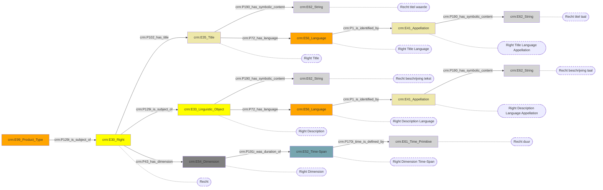

```mermaid
graph LR
style 0f778d23-e765-11ee-a40e-960002548b4f fill:#ffa500
style 21f0f17a-e765-11ee-b5a8-960002548b4f fill:#EEE8AA
style 385e3835-e765-11ee-a70c-960002548b4f fill:#D3D3D3
style 4d27c45e-522b-11ee-974d-00163e71351b fill:#ffa500
style 5f97bf63-e765-11ee-910c-960002548b4f fill:#ffff00
style 75cdbe02-e765-11ee-867b-960002548b4f fill:#D3D3D3
style 88c38558-e765-11ee-a0fc-960002548b4f fill:#ffa500
style 9688c9f4-522b-11ee-bc5c-00163e71351b fill:#ffff00
style 9688e574-522b-11ee-bc5c-00163e71351b fill:#808080
style 9688e664-522b-11ee-bc5c-00163e71351b fill:#76A5AF
style 9a80d38a-e765-11ee-bd77-960002548b4f fill:#EEE8AA
style a1f2aa78-56bb-11ee-b0c4-00163e71351b fill:#D3D3D3
style ae7e255c-e765-11ee-9a25-960002548b4f fill:#D3D3D3
style e704b981-e764-11ee-bbf1-960002548b4f fill:#EEE8AA
style f8fd7ba7-e764-11ee-9c55-960002548b4f fill:#D3D3D3
0f778d23-e765-11ee-a40e-960002548b4f["crm:E56_Language"]-->|"crm:P1_is_identified_by"|21f0f17a-e765-11ee-b5a8-960002548b4f["crm:E41_Appellation"]
21f0f17a-e765-11ee-b5a8-960002548b4f["crm:E41_Appellation"]-->|"crm:P190_has_symbolic_content"|385e3835-e765-11ee-a70c-960002548b4f["crm:E62_String"]
4d27c45e-522b-11ee-974d-00163e71351b["crm:E99_Product_Type"]-->|"crm:P129i_is_subject_of"|9688c9f4-522b-11ee-bc5c-00163e71351b["crm:E30_Right"]
5f97bf63-e765-11ee-910c-960002548b4f["crm:E33_Linguistic_Object"]-->|"crm:P190_has_symbolic_content"|75cdbe02-e765-11ee-867b-960002548b4f["crm:E62_String"]
5f97bf63-e765-11ee-910c-960002548b4f["crm:E33_Linguistic_Object"]-->|"crm:P72_has_language"|88c38558-e765-11ee-a0fc-960002548b4f["crm:E56_Language"]
88c38558-e765-11ee-a0fc-960002548b4f["crm:E56_Language"]-->|"crm:P1_is_identified_by"|9a80d38a-e765-11ee-bd77-960002548b4f["crm:E41_Appellation"]
9688c9f4-522b-11ee-bc5c-00163e71351b["crm:E30_Right"]-->|"crm:P102_has_title"|e704b981-e764-11ee-bbf1-960002548b4f["crm:E35_Title"]
9688c9f4-522b-11ee-bc5c-00163e71351b["crm:E30_Right"]-->|"crm:P129i_is_subject_of"|5f97bf63-e765-11ee-910c-960002548b4f["crm:E33_Linguistic_Object"]
9688c9f4-522b-11ee-bc5c-00163e71351b["crm:E30_Right"]-->|"crm:P43_has_dimension"|9688e574-522b-11ee-bc5c-00163e71351b["crm:E54_Dimension"]
9688e574-522b-11ee-bc5c-00163e71351b["crm:E54_Dimension"]-->|"crm:P191i_was_duration_of"|9688e664-522b-11ee-bc5c-00163e71351b["crm:E52_Time-Span"]
9688e664-522b-11ee-bc5c-00163e71351b["crm:E52_Time-Span"]-->|"crm:P170i_time_is_defined_by"|a1f2aa78-56bb-11ee-b0c4-00163e71351b["crm:E61_Time_Primitive"]
9a80d38a-e765-11ee-bd77-960002548b4f["crm:E41_Appellation"]-->|"crm:P190_has_symbolic_content"|ae7e255c-e765-11ee-9a25-960002548b4f["crm:E62_String"]
e704b981-e764-11ee-bbf1-960002548b4f["crm:E35_Title"]-->|"crm:P190_has_symbolic_content"|f8fd7ba7-e764-11ee-9c55-960002548b4f["crm:E62_String"]
e704b981-e764-11ee-bbf1-960002548b4f["crm:E35_Title"]-->|"crm:P72_has_language"|0f778d23-e765-11ee-a40e-960002548b4f["crm:E56_Language"]
style 21f0f17a-e765-11ee-b5a8-960002548b4f_s stroke-dasharray: 5
style 385e3835-e765-11ee-a70c-960002548b4f_s stroke-dasharray: 5
style 9688c9f4-522b-11ee-bc5c-00163e71351b_s stroke-dasharray: 5
style 75cdbe02-e765-11ee-867b-960002548b4f_s stroke-dasharray: 5
style 88c38558-e765-11ee-a0fc-960002548b4f_s stroke-dasharray: 5
style 9a80d38a-e765-11ee-bd77-960002548b4f_s stroke-dasharray: 5
style e704b981-e764-11ee-bbf1-960002548b4f_s stroke-dasharray: 5
style 5f97bf63-e765-11ee-910c-960002548b4f_s stroke-dasharray: 5
style 9688e574-522b-11ee-bc5c-00163e71351b_s stroke-dasharray: 5
style 9688e664-522b-11ee-bc5c-00163e71351b_s stroke-dasharray: 5
style a1f2aa78-56bb-11ee-b0c4-00163e71351b_s stroke-dasharray: 5
style ae7e255c-e765-11ee-9a25-960002548b4f_s stroke-dasharray: 5
style f8fd7ba7-e764-11ee-9c55-960002548b4f_s stroke-dasharray: 5
style 0f778d23-e765-11ee-a40e-960002548b4f_s stroke-dasharray: 5
21f0f17a-e765-11ee-b5a8-960002548b4f["crm:E41_Appellation"]-.-21f0f17a-e765-11ee-b5a8-960002548b4f_s(["Right Title Language Appellation"])
385e3835-e765-11ee-a70c-960002548b4f["crm:E62_String"]-.-385e3835-e765-11ee-a70c-960002548b4f_s(["Recht titel taal"])
9688c9f4-522b-11ee-bc5c-00163e71351b["crm:E30_Right"]-.-9688c9f4-522b-11ee-bc5c-00163e71351b_s(["Recht"])
75cdbe02-e765-11ee-867b-960002548b4f["crm:E62_String"]-.-75cdbe02-e765-11ee-867b-960002548b4f_s(["Recht beschrijving tekst"])
88c38558-e765-11ee-a0fc-960002548b4f["crm:E56_Language"]-.-88c38558-e765-11ee-a0fc-960002548b4f_s(["Right Description Language"])
9a80d38a-e765-11ee-bd77-960002548b4f["crm:E41_Appellation"]-.-9a80d38a-e765-11ee-bd77-960002548b4f_s(["Right Description Language Appellation"])
e704b981-e764-11ee-bbf1-960002548b4f["crm:E35_Title"]-.-e704b981-e764-11ee-bbf1-960002548b4f_s(["Right Title"])
5f97bf63-e765-11ee-910c-960002548b4f["crm:E33_Linguistic_Object"]-.-5f97bf63-e765-11ee-910c-960002548b4f_s(["Right Description"])
9688e574-522b-11ee-bc5c-00163e71351b["crm:E54_Dimension"]-.-9688e574-522b-11ee-bc5c-00163e71351b_s(["Right Dimension"])
9688e664-522b-11ee-bc5c-00163e71351b["crm:E52_Time-Span"]-.-9688e664-522b-11ee-bc5c-00163e71351b_s(["Right Dimension Time-Span"])
a1f2aa78-56bb-11ee-b0c4-00163e71351b["crm:E61_Time_Primitive"]-.-a1f2aa78-56bb-11ee-b0c4-00163e71351b_s(["Recht duur"])
ae7e255c-e765-11ee-9a25-960002548b4f["crm:E62_String"]-.-ae7e255c-e765-11ee-9a25-960002548b4f_s(["Recht beschrijving taal"])
f8fd7ba7-e764-11ee-9c55-960002548b4f["crm:E62_String"]-.-f8fd7ba7-e764-11ee-9c55-960002548b4f_s(["Recht titel waarde"])
0f778d23-e765-11ee-a40e-960002548b4f["crm:E56_Language"]-.-0f778d23-e765-11ee-a40e-960002548b4f_s(["Right Title Language"])
```
