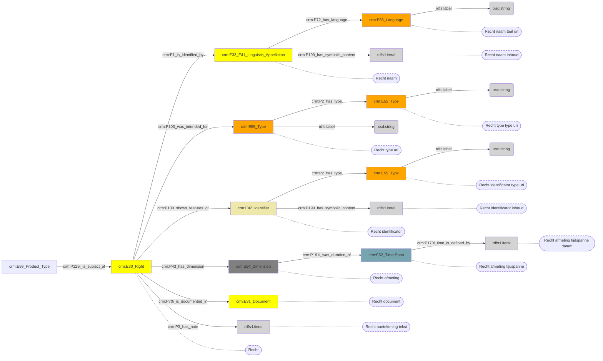

```mermaid
graph LR
4d27c45e-522b-11ee-974d-00163e71351b["crm:E99_Product_Type"]-->|"crm:P129i_is_subject_of"|9688c9f4-522b-11ee-bc5c-00163e71351b["crm:E30_Right"]
9688c9f4-522b-11ee-bc5c-00163e71351b["crm:E30_Right"]-->|"crm:P1_is_identified_by"|9688de26-522b-11ee-bc5c-00163e71351b["crm:E33_E41_Linguistic_Appellation"]
9688c9f4-522b-11ee-bc5c-00163e71351b["crm:E30_Right"]-->|"crm:P103_was_intended_for"|9688ce0e-522b-11ee-bc5c-00163e71351b["crm:E55_Type"]
9688c9f4-522b-11ee-bc5c-00163e71351b["crm:E30_Right"]-->|"crm:P130_shows_features_of"|9688d0f2-522b-11ee-bc5c-00163e71351b["crm:E42_Identifier"]
9688c9f4-522b-11ee-bc5c-00163e71351b["crm:E30_Right"]-->|"crm:P43_has_dimension"|9688e574-522b-11ee-bc5c-00163e71351b["crm:E54_Dimension"]
9688c9f4-522b-11ee-bc5c-00163e71351b["crm:E30_Right"]-->|"crm:P70i_is_documented_in"|9688dff2-522b-11ee-bc5c-00163e71351b["crm:E31_Document"]
9688ce0e-522b-11ee-bc5c-00163e71351b["crm:E55_Type"]-->|"crm:P2_has_type"|9688d98a-522b-11ee-bc5c-00163e71351b["crm:E55_Type"]
9688d0f2-522b-11ee-bc5c-00163e71351b["crm:E42_Identifier"]-->|"crm:P2_has_type"|9688db60-522b-11ee-bc5c-00163e71351b["crm:E55_Type"]
9688de26-522b-11ee-bc5c-00163e71351b["crm:E33_E41_Linguistic_Appellation"]-->|"crm:P72_has_language"|9688e862-522b-11ee-bc5c-00163e71351b["crm:E56_Language"]
9688e574-522b-11ee-bc5c-00163e71351b["crm:E54_Dimension"]-->|"crm:P191i_was_duration_of"|9688e664-522b-11ee-bc5c-00163e71351b["crm:E52_Time-Span"]
9688c9f4-522b-11ee-bc5c-00163e71351b["crm:E30_Right"]-->|"crm:P3_has_note"|9688df0c-522b-11ee-bc5c-00163e71351b(rdfs:Literal)
9688ce0e-522b-11ee-bc5c-00163e71351b["crm:E55_Type"]-->|"rdfs:label"|9688e48e-522b-11ee-bc5c-00163e71351b(xsd:string)
9688d0f2-522b-11ee-bc5c-00163e71351b["crm:E42_Identifier"]-->|"crm:P190_has_symbolic_content"|9688dc46-522b-11ee-bc5c-00163e71351b(rdfs:Literal)
9688d98a-522b-11ee-bc5c-00163e71351b["crm:E55_Type"]-->|"rdfs:label"|9688e1d2-522b-11ee-bc5c-00163e71351b(xsd:string)
9688db60-522b-11ee-bc5c-00163e71351b["crm:E55_Type"]-->|"rdfs:label"|9688dd36-522b-11ee-bc5c-00163e71351b(xsd:string)
9688de26-522b-11ee-bc5c-00163e71351b["crm:E33_E41_Linguistic_Appellation"]-->|"crm:P190_has_symbolic_content"|9688e772-522b-11ee-bc5c-00163e71351b(rdfs:Literal)
9688e664-522b-11ee-bc5c-00163e71351b["crm:E52_Time-Span"]-->|"crm:P170i_time_is_defined_by"|a1f2aa78-56bb-11ee-b0c4-00163e71351b(rdfs:Literal)
9688e862-522b-11ee-bc5c-00163e71351b["crm:E56_Language"]-->|"rdfs:label"|9688e2b8-522b-11ee-bc5c-00163e71351b(xsd:string)
style 9688c9f4-522b-11ee-bc5c-00163e71351b_s stroke-dasharray: 5
style 9688de26-522b-11ee-bc5c-00163e71351b_s stroke-dasharray: 5
style 9688ce0e-522b-11ee-bc5c-00163e71351b_s stroke-dasharray: 5
style 9688d0f2-522b-11ee-bc5c-00163e71351b_s stroke-dasharray: 5
style 9688df0c-522b-11ee-bc5c-00163e71351b_s stroke-dasharray: 5
style 9688e574-522b-11ee-bc5c-00163e71351b_s stroke-dasharray: 5
style 9688dff2-522b-11ee-bc5c-00163e71351b_s stroke-dasharray: 5
style 9688d98a-522b-11ee-bc5c-00163e71351b_s stroke-dasharray: 5
style 9688dc46-522b-11ee-bc5c-00163e71351b_s stroke-dasharray: 5
style 9688db60-522b-11ee-bc5c-00163e71351b_s stroke-dasharray: 5
style 9688e772-522b-11ee-bc5c-00163e71351b_s stroke-dasharray: 5
style 9688e862-522b-11ee-bc5c-00163e71351b_s stroke-dasharray: 5
style 9688e664-522b-11ee-bc5c-00163e71351b_s stroke-dasharray: 5
style a1f2aa78-56bb-11ee-b0c4-00163e71351b_s stroke-dasharray: 5
9688c9f4-522b-11ee-bc5c-00163e71351b["crm:E30_Right"]-.-9688c9f4-522b-11ee-bc5c-00163e71351b_s(["Recht"])
9688de26-522b-11ee-bc5c-00163e71351b["crm:E33_E41_Linguistic_Appellation"]-.-9688de26-522b-11ee-bc5c-00163e71351b_s(["Recht naam"])
9688ce0e-522b-11ee-bc5c-00163e71351b["crm:E55_Type"]-.-9688ce0e-522b-11ee-bc5c-00163e71351b_s(["Recht type uri"])
9688d0f2-522b-11ee-bc5c-00163e71351b["crm:E42_Identifier"]-.-9688d0f2-522b-11ee-bc5c-00163e71351b_s(["Recht identificator"])
9688df0c-522b-11ee-bc5c-00163e71351b["rdfs:Literal"]-.-9688df0c-522b-11ee-bc5c-00163e71351b_s(["Recht aantekening tekst"])
9688e574-522b-11ee-bc5c-00163e71351b["crm:E54_Dimension"]-.-9688e574-522b-11ee-bc5c-00163e71351b_s(["Recht afmeting"])
9688dff2-522b-11ee-bc5c-00163e71351b["crm:E31_Document"]-.-9688dff2-522b-11ee-bc5c-00163e71351b_s(["Recht document"])
9688d98a-522b-11ee-bc5c-00163e71351b["crm:E55_Type"]-.-9688d98a-522b-11ee-bc5c-00163e71351b_s(["Recht type type uri"])
9688dc46-522b-11ee-bc5c-00163e71351b["rdfs:Literal"]-.-9688dc46-522b-11ee-bc5c-00163e71351b_s(["Recht identificator inhoud"])
9688db60-522b-11ee-bc5c-00163e71351b["crm:E55_Type"]-.-9688db60-522b-11ee-bc5c-00163e71351b_s(["Recht identificator type uri"])
9688e772-522b-11ee-bc5c-00163e71351b["rdfs:Literal"]-.-9688e772-522b-11ee-bc5c-00163e71351b_s(["Recht naam inhoud"])
9688e862-522b-11ee-bc5c-00163e71351b["crm:E56_Language"]-.-9688e862-522b-11ee-bc5c-00163e71351b_s(["Recht naam taal uri"])
9688e664-522b-11ee-bc5c-00163e71351b["crm:E52_Time-Span"]-.-9688e664-522b-11ee-bc5c-00163e71351b_s(["Recht afmeting tijdspanne"])
a1f2aa78-56bb-11ee-b0c4-00163e71351b["rdfs:Literal"]-.-a1f2aa78-56bb-11ee-b0c4-00163e71351b_s(["Recht afmeting tijdspanne datum"])
style 9688c9f4-522b-11ee-bc5c-00163e71351b fill:#ffff00
style 9688ce0e-522b-11ee-bc5c-00163e71351b fill:#ffa500
style 9688d0f2-522b-11ee-bc5c-00163e71351b fill:#EEE8AA
style 9688d98a-522b-11ee-bc5c-00163e71351b fill:#ffa500
style 9688db60-522b-11ee-bc5c-00163e71351b fill:#ffa500
style 9688dc46-522b-11ee-bc5c-00163e71351b fill:#D3D3D3
style 9688dd36-522b-11ee-bc5c-00163e71351b fill:#D3D3D3
style 9688de26-522b-11ee-bc5c-00163e71351b fill:#ffff00
style 9688df0c-522b-11ee-bc5c-00163e71351b fill:#D3D3D3
style 9688dff2-522b-11ee-bc5c-00163e71351b fill:#ffff00
style 9688e1d2-522b-11ee-bc5c-00163e71351b fill:#D3D3D3
style 9688e2b8-522b-11ee-bc5c-00163e71351b fill:#D3D3D3
style 9688e48e-522b-11ee-bc5c-00163e71351b fill:#D3D3D3
style 9688e574-522b-11ee-bc5c-00163e71351b fill:#808080
style 9688e664-522b-11ee-bc5c-00163e71351b fill:#76A5AF
style 9688e772-522b-11ee-bc5c-00163e71351b fill:#D3D3D3
style 9688e862-522b-11ee-bc5c-00163e71351b fill:#ffa500
style a1f2aa78-56bb-11ee-b0c4-00163e71351b fill:#D3D3D3
```
