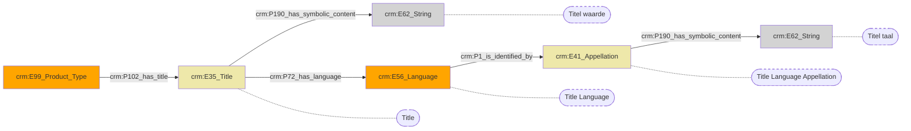

```mermaid
graph LR
style 0b4974bb-e763-11ee-982c-960002548b4f fill:#D3D3D3
style 4c0a7b94-56bc-11ee-bc5c-00163e71351b fill:#EEE8AA
style 4c0a856c-56bc-11ee-bc5c-00163e71351b fill:#D3D3D3
style 4c0a8792-56bc-11ee-bc5c-00163e71351b fill:#EEE8AA
style 4c0a89a4-56bc-11ee-bc5c-00163e71351b fill:#ffa500
style 4d27c45e-522b-11ee-974d-00163e71351b fill:#ffa500
4c0a7b94-56bc-11ee-bc5c-00163e71351b["crm:E35_Title"]-->|"crm:P190_has_symbolic_content"|4c0a856c-56bc-11ee-bc5c-00163e71351b["crm:E62_String"]
4c0a7b94-56bc-11ee-bc5c-00163e71351b["crm:E35_Title"]-->|"crm:P72_has_language"|4c0a89a4-56bc-11ee-bc5c-00163e71351b["crm:E56_Language"]
4c0a8792-56bc-11ee-bc5c-00163e71351b["crm:E41_Appellation"]-->|"crm:P190_has_symbolic_content"|0b4974bb-e763-11ee-982c-960002548b4f["crm:E62_String"]
4c0a89a4-56bc-11ee-bc5c-00163e71351b["crm:E56_Language"]-->|"crm:P1_is_identified_by"|4c0a8792-56bc-11ee-bc5c-00163e71351b["crm:E41_Appellation"]
4d27c45e-522b-11ee-974d-00163e71351b["crm:E99_Product_Type"]-->|"crm:P102_has_title"|4c0a7b94-56bc-11ee-bc5c-00163e71351b["crm:E35_Title"]
style 4c0a856c-56bc-11ee-bc5c-00163e71351b_s stroke-dasharray: 5
style 4c0a89a4-56bc-11ee-bc5c-00163e71351b_s stroke-dasharray: 5
style 0b4974bb-e763-11ee-982c-960002548b4f_s stroke-dasharray: 5
style 4c0a8792-56bc-11ee-bc5c-00163e71351b_s stroke-dasharray: 5
style 4c0a7b94-56bc-11ee-bc5c-00163e71351b_s stroke-dasharray: 5
4c0a856c-56bc-11ee-bc5c-00163e71351b["crm:E62_String"]-.-4c0a856c-56bc-11ee-bc5c-00163e71351b_s(["Titel waarde"])
4c0a89a4-56bc-11ee-bc5c-00163e71351b["crm:E56_Language"]-.-4c0a89a4-56bc-11ee-bc5c-00163e71351b_s(["Title Language"])
0b4974bb-e763-11ee-982c-960002548b4f["crm:E62_String"]-.-0b4974bb-e763-11ee-982c-960002548b4f_s(["Titel taal"])
4c0a8792-56bc-11ee-bc5c-00163e71351b["crm:E41_Appellation"]-.-4c0a8792-56bc-11ee-bc5c-00163e71351b_s(["Title Language Appellation"])
4c0a7b94-56bc-11ee-bc5c-00163e71351b["crm:E35_Title"]-.-4c0a7b94-56bc-11ee-bc5c-00163e71351b_s(["Title"])
```
