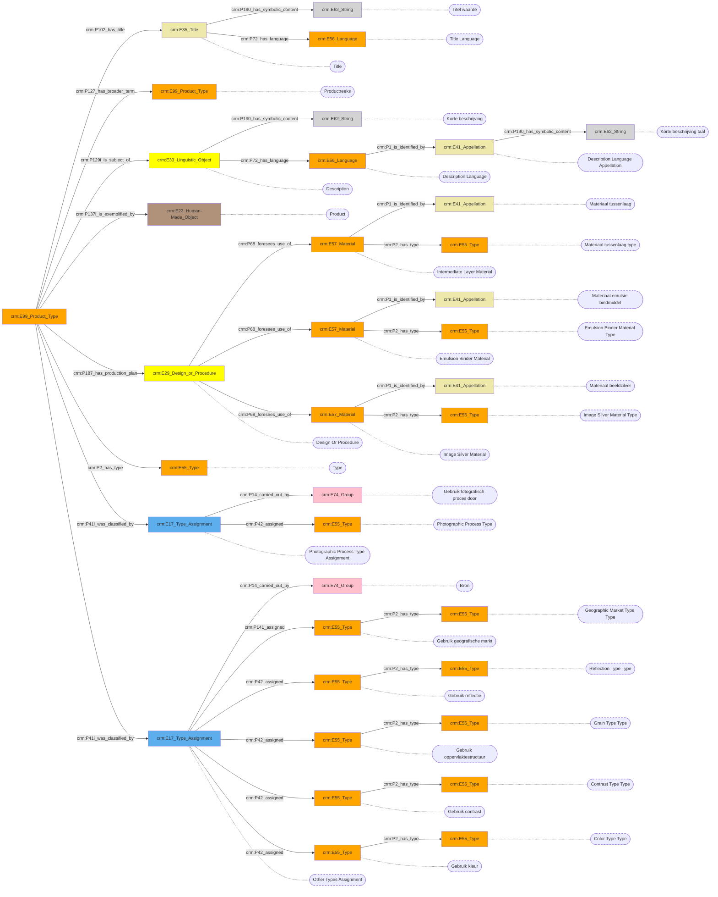

```mermaid
graph LR
style 1036f165-e768-11ee-b86a-960002548b4f fill:#ffa500
style 1984c26a-521b-11ee-b0c4-00163e71351b fill:#ffa500
style 20776035-e768-11ee-9a09-960002548b4f fill:#ffa500
style 335a7fea-522f-11ee-974d-00163e71351b fill:#ffff00
style 335a836e-522f-11ee-974d-00163e71351b fill:#D3D3D3
style 335a867a-522f-11ee-974d-00163e71351b fill:#EEE8AA
style 335a8760-522f-11ee-974d-00163e71351b fill:#ffa500
style 3729b9a5-e767-11ee-b748-960002548b4f fill:#D3D3D3
style 397f7a28-e768-11ee-a297-960002548b4f fill:#ffa500
style 3c3891a6-521b-11ee-974d-00163e71351b fill:#ffc0cb
style 3e7fcf30-8a0e-11ee-9586-00163e71351b fill:#ffc0cb
style 4eb7f310-8a0d-11ee-b60e-00163e71351b fill:#ffa500
style 57576f3e-8a0b-11ee-b60e-00163e71351b fill:#ffa500
style 6f574f22-dc89-11ee-b0a4-960002548b4f fill:#ffa500
style 72585daa-8a0d-11ee-a49f-00163e71351b fill:#ffa500
style 7620b8f8-5225-11ee-974d-00163e71351b fill:#ffff00
style 7892caec-471a-11ee-a9ac-00163e71351b fill:#ffa500
style 85c7b2dc-8a0d-11ee-9586-00163e71351b fill:#ffa500
style 908c5cfe-4728-11ee-974d-00163e71351b fill:#ffa500
style 91df1d15-dc89-11ee-b920-960002548b4f fill:#EEE8AA
style 928cfb24-521a-11ee-b0c4-00163e71351b fill:#5DAEEC
style 9425607c-8a0d-11ee-9586-00163e71351b fill:#ffa500
style 9475fd4e-4727-11ee-b0c4-00163e71351b fill:#B0927A
style 9d479c02-5230-11ee-a9ac-00163e71351b fill:#EEE8AA
style 9d47a116-5230-11ee-a9ac-00163e71351b fill:#D3D3D3
style 9d47a2f6-5230-11ee-a9ac-00163e71351b fill:#ffa500
style a2bb964e-8a0b-11ee-b60e-00163e71351b fill:#ffa500
style a375b51e-8a0c-11ee-84b7-00163e71351b fill:#5DAEEC
style bc3bcb84-dc89-11ee-a6ff-960002548b4f fill:#ffa500
style c0bca660-8a0b-11ee-a49f-00163e71351b fill:#ffa500
style ca33d592-dc88-11ee-a42e-960002548b4f fill:#ffa500
style d1a3d1cc-5222-11ee-974d-00163e71351b fill:#ffa500
style d5c96a2e-dc89-11ee-988e-960002548b4f fill:#EEE8AA
style dbb26eba-e767-11ee-80cb-960002548b4f fill:#ffa500
style eba53ad0-dc88-11ee-be52-960002548b4f fill:#EEE8AA
style ee01311c-8a0c-11ee-b60e-00163e71351b fill:#ffa500
style fe3bca30-e767-11ee-891d-960002548b4f fill:#ffa500
335a7fea-522f-11ee-974d-00163e71351b["crm:E33_Linguistic_Object"]-->|"crm:P190_has_symbolic_content"|335a836e-522f-11ee-974d-00163e71351b["crm:E62_String"]
335a7fea-522f-11ee-974d-00163e71351b["crm:E33_Linguistic_Object"]-->|"crm:P72_has_language"|335a8760-522f-11ee-974d-00163e71351b["crm:E56_Language"]
335a867a-522f-11ee-974d-00163e71351b["crm:E41_Appellation"]-->|"crm:P190_has_symbolic_content"|3729b9a5-e767-11ee-b748-960002548b4f["crm:E62_String"]
335a8760-522f-11ee-974d-00163e71351b["crm:E56_Language"]-->|"crm:P1_is_identified_by"|335a867a-522f-11ee-974d-00163e71351b["crm:E41_Appellation"]
4eb7f310-8a0d-11ee-b60e-00163e71351b["crm:E55_Type"]-->|"crm:P2_has_type"|20776035-e768-11ee-9a09-960002548b4f["crm:E55_Type"]
57576f3e-8a0b-11ee-b60e-00163e71351b["crm:E57_Material"]-->|"crm:P1_is_identified_by"|d5c96a2e-dc89-11ee-988e-960002548b4f["crm:E41_Appellation"]
57576f3e-8a0b-11ee-b60e-00163e71351b["crm:E57_Material"]-->|"crm:P2_has_type"|bc3bcb84-dc89-11ee-a6ff-960002548b4f["crm:E55_Type"]
72585daa-8a0d-11ee-a49f-00163e71351b["crm:E55_Type"]-->|"crm:P2_has_type"|dbb26eba-e767-11ee-80cb-960002548b4f["crm:E55_Type"]
7620b8f8-5225-11ee-974d-00163e71351b["crm:E29_Design_or_Procedure"]-->|"crm:P68_foresees_use_of"|57576f3e-8a0b-11ee-b60e-00163e71351b["crm:E57_Material"]
7620b8f8-5225-11ee-974d-00163e71351b["crm:E29_Design_or_Procedure"]-->|"crm:P68_foresees_use_of"|a2bb964e-8a0b-11ee-b60e-00163e71351b["crm:E57_Material"]
7620b8f8-5225-11ee-974d-00163e71351b["crm:E29_Design_or_Procedure"]-->|"crm:P68_foresees_use_of"|c0bca660-8a0b-11ee-a49f-00163e71351b["crm:E57_Material"]
7892caec-471a-11ee-a9ac-00163e71351b["crm:E99_Product_Type"]-->|"crm:P102_has_title"|9d479c02-5230-11ee-a9ac-00163e71351b["crm:E35_Title"]
7892caec-471a-11ee-a9ac-00163e71351b["crm:E99_Product_Type"]-->|"crm:P127_has_broader_term"|d1a3d1cc-5222-11ee-974d-00163e71351b["crm:E99_Product_Type"]
7892caec-471a-11ee-a9ac-00163e71351b["crm:E99_Product_Type"]-->|"crm:P129i_is_subject_of"|335a7fea-522f-11ee-974d-00163e71351b["crm:E33_Linguistic_Object"]
7892caec-471a-11ee-a9ac-00163e71351b["crm:E99_Product_Type"]-->|"crm:P137i_is_exemplified_by"|9475fd4e-4727-11ee-b0c4-00163e71351b["crm:E22_Human-Made_Object"]
7892caec-471a-11ee-a9ac-00163e71351b["crm:E99_Product_Type"]-->|"crm:P187_has_production_plan"|7620b8f8-5225-11ee-974d-00163e71351b["crm:E29_Design_or_Procedure"]
7892caec-471a-11ee-a9ac-00163e71351b["crm:E99_Product_Type"]-->|"crm:P2_has_type"|908c5cfe-4728-11ee-974d-00163e71351b["crm:E55_Type"]
7892caec-471a-11ee-a9ac-00163e71351b["crm:E99_Product_Type"]-->|"crm:P41i_was_classified_by"|928cfb24-521a-11ee-b0c4-00163e71351b["crm:E17_Type_Assignment"]
7892caec-471a-11ee-a9ac-00163e71351b["crm:E99_Product_Type"]-->|"crm:P41i_was_classified_by"|a375b51e-8a0c-11ee-84b7-00163e71351b["crm:E17_Type_Assignment"]
85c7b2dc-8a0d-11ee-9586-00163e71351b["crm:E55_Type"]-->|"crm:P2_has_type"|1036f165-e768-11ee-b86a-960002548b4f["crm:E55_Type"]
928cfb24-521a-11ee-b0c4-00163e71351b["crm:E17_Type_Assignment"]-->|"crm:P14_carried_out_by"|3c3891a6-521b-11ee-974d-00163e71351b["crm:E74_Group"]
928cfb24-521a-11ee-b0c4-00163e71351b["crm:E17_Type_Assignment"]-->|"crm:P42_assigned"|1984c26a-521b-11ee-b0c4-00163e71351b["crm:E55_Type"]
9425607c-8a0d-11ee-9586-00163e71351b["crm:E55_Type"]-->|"crm:P2_has_type"|fe3bca30-e767-11ee-891d-960002548b4f["crm:E55_Type"]
9d479c02-5230-11ee-a9ac-00163e71351b["crm:E35_Title"]-->|"crm:P190_has_symbolic_content"|9d47a116-5230-11ee-a9ac-00163e71351b["crm:E62_String"]
9d479c02-5230-11ee-a9ac-00163e71351b["crm:E35_Title"]-->|"crm:P72_has_language"|9d47a2f6-5230-11ee-a9ac-00163e71351b["crm:E56_Language"]
a2bb964e-8a0b-11ee-b60e-00163e71351b["crm:E57_Material"]-->|"crm:P1_is_identified_by"|91df1d15-dc89-11ee-b920-960002548b4f["crm:E41_Appellation"]
a2bb964e-8a0b-11ee-b60e-00163e71351b["crm:E57_Material"]-->|"crm:P2_has_type"|6f574f22-dc89-11ee-b0a4-960002548b4f["crm:E55_Type"]
a375b51e-8a0c-11ee-84b7-00163e71351b["crm:E17_Type_Assignment"]-->|"crm:P14_carried_out_by"|3e7fcf30-8a0e-11ee-9586-00163e71351b["crm:E74_Group"]
a375b51e-8a0c-11ee-84b7-00163e71351b["crm:E17_Type_Assignment"]-->|"crm:P141_assigned"|ee01311c-8a0c-11ee-b60e-00163e71351b["crm:E55_Type"]
a375b51e-8a0c-11ee-84b7-00163e71351b["crm:E17_Type_Assignment"]-->|"crm:P42_assigned"|4eb7f310-8a0d-11ee-b60e-00163e71351b["crm:E55_Type"]
a375b51e-8a0c-11ee-84b7-00163e71351b["crm:E17_Type_Assignment"]-->|"crm:P42_assigned"|72585daa-8a0d-11ee-a49f-00163e71351b["crm:E55_Type"]
a375b51e-8a0c-11ee-84b7-00163e71351b["crm:E17_Type_Assignment"]-->|"crm:P42_assigned"|85c7b2dc-8a0d-11ee-9586-00163e71351b["crm:E55_Type"]
a375b51e-8a0c-11ee-84b7-00163e71351b["crm:E17_Type_Assignment"]-->|"crm:P42_assigned"|9425607c-8a0d-11ee-9586-00163e71351b["crm:E55_Type"]
c0bca660-8a0b-11ee-a49f-00163e71351b["crm:E57_Material"]-->|"crm:P1_is_identified_by"|eba53ad0-dc88-11ee-be52-960002548b4f["crm:E41_Appellation"]
c0bca660-8a0b-11ee-a49f-00163e71351b["crm:E57_Material"]-->|"crm:P2_has_type"|ca33d592-dc88-11ee-a42e-960002548b4f["crm:E55_Type"]
ee01311c-8a0c-11ee-b60e-00163e71351b["crm:E55_Type"]-->|"crm:P2_has_type"|397f7a28-e768-11ee-a297-960002548b4f["crm:E55_Type"]
335a836e-522f-11ee-974d-00163e71351b["crm:E62_String"]-.-335a836e-522f-11ee-974d-00163e71351b_s(["Korte beschrijving"])
335a8760-522f-11ee-974d-00163e71351b["crm:E56_Language"]-.-335a8760-522f-11ee-974d-00163e71351b_s(["Description Language"])
3729b9a5-e767-11ee-b748-960002548b4f["crm:E62_String"]-.-3729b9a5-e767-11ee-b748-960002548b4f_s(["Korte beschrijving taal"])
335a867a-522f-11ee-974d-00163e71351b["crm:E41_Appellation"]-.-335a867a-522f-11ee-974d-00163e71351b_s(["Description Language Appellation"])
20776035-e768-11ee-9a09-960002548b4f["crm:E55_Type"]-.-20776035-e768-11ee-9a09-960002548b4f_s(["Reflection Type Type"])
d5c96a2e-dc89-11ee-988e-960002548b4f["crm:E41_Appellation"]-.-d5c96a2e-dc89-11ee-988e-960002548b4f_s(["Materiaal tussenlaag"])
bc3bcb84-dc89-11ee-a6ff-960002548b4f["crm:E55_Type"]-.-bc3bcb84-dc89-11ee-a6ff-960002548b4f_s(["Materiaal tussenlaag type"])
dbb26eba-e767-11ee-80cb-960002548b4f["crm:E55_Type"]-.-dbb26eba-e767-11ee-80cb-960002548b4f_s(["Grain Type Type"])
57576f3e-8a0b-11ee-b60e-00163e71351b["crm:E57_Material"]-.-57576f3e-8a0b-11ee-b60e-00163e71351b_s(["Intermediate Layer  Material"])
a2bb964e-8a0b-11ee-b60e-00163e71351b["crm:E57_Material"]-.-a2bb964e-8a0b-11ee-b60e-00163e71351b_s(["Emulsion Binder Material"])
c0bca660-8a0b-11ee-a49f-00163e71351b["crm:E57_Material"]-.-c0bca660-8a0b-11ee-a49f-00163e71351b_s(["Image Silver Material"])
9d479c02-5230-11ee-a9ac-00163e71351b["crm:E35_Title"]-.-9d479c02-5230-11ee-a9ac-00163e71351b_s(["Title"])
d1a3d1cc-5222-11ee-974d-00163e71351b["crm:E99_Product_Type"]-.-d1a3d1cc-5222-11ee-974d-00163e71351b_s(["Productreeks"])
335a7fea-522f-11ee-974d-00163e71351b["crm:E33_Linguistic_Object"]-.-335a7fea-522f-11ee-974d-00163e71351b_s(["Description"])
9475fd4e-4727-11ee-b0c4-00163e71351b["crm:E22_Human-Made_Object"]-.-9475fd4e-4727-11ee-b0c4-00163e71351b_s(["Product"])
7620b8f8-5225-11ee-974d-00163e71351b["crm:E29_Design_or_Procedure"]-.-7620b8f8-5225-11ee-974d-00163e71351b_s(["Design Or Procedure"])
908c5cfe-4728-11ee-974d-00163e71351b["crm:E55_Type"]-.-908c5cfe-4728-11ee-974d-00163e71351b_s(["Type"])
928cfb24-521a-11ee-b0c4-00163e71351b["crm:E17_Type_Assignment"]-.-928cfb24-521a-11ee-b0c4-00163e71351b_s(["Photographic Process Type Assignment"])
a375b51e-8a0c-11ee-84b7-00163e71351b["crm:E17_Type_Assignment"]-.-a375b51e-8a0c-11ee-84b7-00163e71351b_s(["Other Types Assignment"])
1036f165-e768-11ee-b86a-960002548b4f["crm:E55_Type"]-.-1036f165-e768-11ee-b86a-960002548b4f_s(["Contrast Type Type"])
3c3891a6-521b-11ee-974d-00163e71351b["crm:E74_Group"]-.-3c3891a6-521b-11ee-974d-00163e71351b_s(["Gebruik fotografisch proces door"])
1984c26a-521b-11ee-b0c4-00163e71351b["crm:E55_Type"]-.-1984c26a-521b-11ee-b0c4-00163e71351b_s(["Photographic Process Type"])
fe3bca30-e767-11ee-891d-960002548b4f["crm:E55_Type"]-.-fe3bca30-e767-11ee-891d-960002548b4f_s(["Color Type Type"])
9d47a116-5230-11ee-a9ac-00163e71351b["crm:E62_String"]-.-9d47a116-5230-11ee-a9ac-00163e71351b_s(["Titel waarde"])
9d47a2f6-5230-11ee-a9ac-00163e71351b["crm:E56_Language"]-.-9d47a2f6-5230-11ee-a9ac-00163e71351b_s(["Title Language"])
91df1d15-dc89-11ee-b920-960002548b4f["crm:E41_Appellation"]-.-91df1d15-dc89-11ee-b920-960002548b4f_s(["Materiaal emulsie bindmiddel"])
6f574f22-dc89-11ee-b0a4-960002548b4f["crm:E55_Type"]-.-6f574f22-dc89-11ee-b0a4-960002548b4f_s(["Emulsion Binder Material Type"])
3e7fcf30-8a0e-11ee-9586-00163e71351b["crm:E74_Group"]-.-3e7fcf30-8a0e-11ee-9586-00163e71351b_s(["Bron"])
ee01311c-8a0c-11ee-b60e-00163e71351b["crm:E55_Type"]-.-ee01311c-8a0c-11ee-b60e-00163e71351b_s(["Gebruik geografische markt"])
4eb7f310-8a0d-11ee-b60e-00163e71351b["crm:E55_Type"]-.-4eb7f310-8a0d-11ee-b60e-00163e71351b_s(["Gebruik reflectie"])
72585daa-8a0d-11ee-a49f-00163e71351b["crm:E55_Type"]-.-72585daa-8a0d-11ee-a49f-00163e71351b_s(["Gebruik oppervlaktestructuur"])
85c7b2dc-8a0d-11ee-9586-00163e71351b["crm:E55_Type"]-.-85c7b2dc-8a0d-11ee-9586-00163e71351b_s(["Gebruik contrast"])
9425607c-8a0d-11ee-9586-00163e71351b["crm:E55_Type"]-.-9425607c-8a0d-11ee-9586-00163e71351b_s(["Gebruik kleur"])
eba53ad0-dc88-11ee-be52-960002548b4f["crm:E41_Appellation"]-.-eba53ad0-dc88-11ee-be52-960002548b4f_s(["Materiaal beeldzilver"])
ca33d592-dc88-11ee-a42e-960002548b4f["crm:E55_Type"]-.-ca33d592-dc88-11ee-a42e-960002548b4f_s(["Image Silver Material Type"])
397f7a28-e768-11ee-a297-960002548b4f["crm:E55_Type"]-.-397f7a28-e768-11ee-a297-960002548b4f_s(["Geographic Market Type Type"])
style 335a836e-522f-11ee-974d-00163e71351b_s stroke-dasharray: 5
style 335a8760-522f-11ee-974d-00163e71351b_s stroke-dasharray: 5
style 3729b9a5-e767-11ee-b748-960002548b4f_s stroke-dasharray: 5
style 335a867a-522f-11ee-974d-00163e71351b_s stroke-dasharray: 5
style 20776035-e768-11ee-9a09-960002548b4f_s stroke-dasharray: 5
style d5c96a2e-dc89-11ee-988e-960002548b4f_s stroke-dasharray: 5
style bc3bcb84-dc89-11ee-a6ff-960002548b4f_s stroke-dasharray: 5
style dbb26eba-e767-11ee-80cb-960002548b4f_s stroke-dasharray: 5
style 57576f3e-8a0b-11ee-b60e-00163e71351b_s stroke-dasharray: 5
style a2bb964e-8a0b-11ee-b60e-00163e71351b_s stroke-dasharray: 5
style c0bca660-8a0b-11ee-a49f-00163e71351b_s stroke-dasharray: 5
style 9d479c02-5230-11ee-a9ac-00163e71351b_s stroke-dasharray: 5
style d1a3d1cc-5222-11ee-974d-00163e71351b_s stroke-dasharray: 5
style 335a7fea-522f-11ee-974d-00163e71351b_s stroke-dasharray: 5
style 9475fd4e-4727-11ee-b0c4-00163e71351b_s stroke-dasharray: 5
style 7620b8f8-5225-11ee-974d-00163e71351b_s stroke-dasharray: 5
style 908c5cfe-4728-11ee-974d-00163e71351b_s stroke-dasharray: 5
style 928cfb24-521a-11ee-b0c4-00163e71351b_s stroke-dasharray: 5
style a375b51e-8a0c-11ee-84b7-00163e71351b_s stroke-dasharray: 5
style 1036f165-e768-11ee-b86a-960002548b4f_s stroke-dasharray: 5
style 3c3891a6-521b-11ee-974d-00163e71351b_s stroke-dasharray: 5
style 1984c26a-521b-11ee-b0c4-00163e71351b_s stroke-dasharray: 5
style fe3bca30-e767-11ee-891d-960002548b4f_s stroke-dasharray: 5
style 9d47a116-5230-11ee-a9ac-00163e71351b_s stroke-dasharray: 5
style 9d47a2f6-5230-11ee-a9ac-00163e71351b_s stroke-dasharray: 5
style 91df1d15-dc89-11ee-b920-960002548b4f_s stroke-dasharray: 5
style 6f574f22-dc89-11ee-b0a4-960002548b4f_s stroke-dasharray: 5
style 3e7fcf30-8a0e-11ee-9586-00163e71351b_s stroke-dasharray: 5
style ee01311c-8a0c-11ee-b60e-00163e71351b_s stroke-dasharray: 5
style 4eb7f310-8a0d-11ee-b60e-00163e71351b_s stroke-dasharray: 5
style 72585daa-8a0d-11ee-a49f-00163e71351b_s stroke-dasharray: 5
style 85c7b2dc-8a0d-11ee-9586-00163e71351b_s stroke-dasharray: 5
style 9425607c-8a0d-11ee-9586-00163e71351b_s stroke-dasharray: 5
style eba53ad0-dc88-11ee-be52-960002548b4f_s stroke-dasharray: 5
style ca33d592-dc88-11ee-a42e-960002548b4f_s stroke-dasharray: 5
style 397f7a28-e768-11ee-a297-960002548b4f_s stroke-dasharray: 5
```
