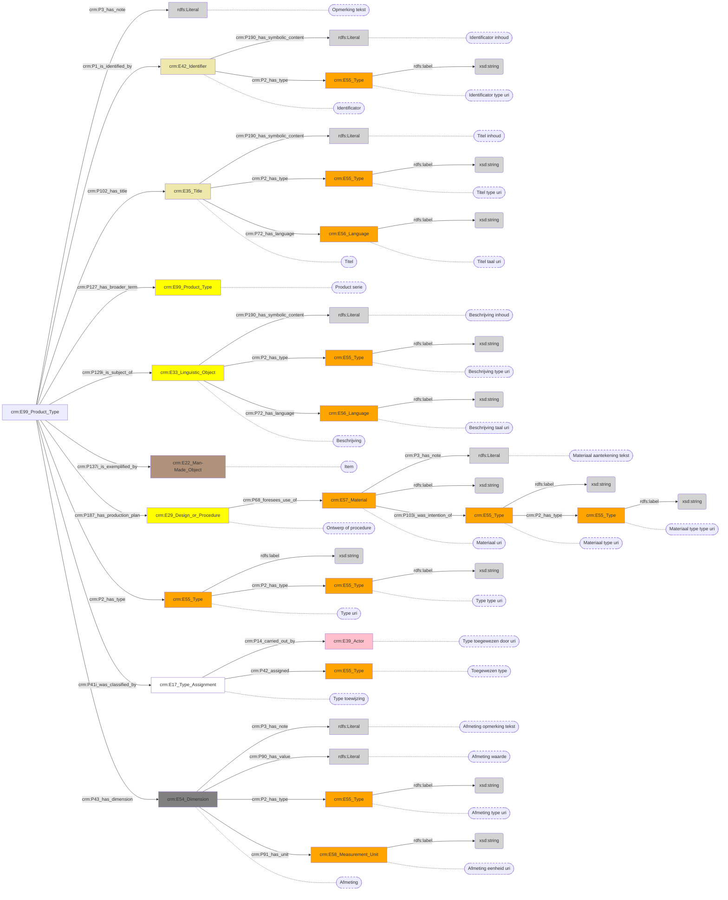

```mermaid
graph LR
335a7fea-522f-11ee-974d-00163e71351b["crm:E33_Linguistic_Object"]-->|"crm:P190_has_symbolic_content"|335a836e-522f-11ee-974d-00163e71351b(rdfs:Literal)
335a8594-522f-11ee-974d-00163e71351b["crm:E55_Type"]-->|"rdfs:label"|335a84a4-522f-11ee-974d-00163e71351b(xsd:string)
335a8760-522f-11ee-974d-00163e71351b["crm:E56_Language"]-->|"rdfs:label"|335a867a-522f-11ee-974d-00163e71351b(xsd:string)
7892caec-471a-11ee-a9ac-00163e71351b["crm:E99_Product_Type"]-->|"crm:P3_has_note"|800ef872-471f-11ee-b0c4-00163e71351b(rdfs:Literal)
908c5cfe-4728-11ee-974d-00163e71351b["crm:E55_Type"]-->|"rdfs:label"|908c621c-4728-11ee-974d-00163e71351b(xsd:string)
908c60d2-4728-11ee-974d-00163e71351b["crm:E55_Type"]-->|"rdfs:label"|908c6316-4728-11ee-974d-00163e71351b(xsd:string)
9c2594e2-5225-11ee-a9ac-00163e71351b["crm:E57_Material"]-->|"crm:P3_has_note"|9c259884-5225-11ee-a9ac-00163e71351b(rdfs:Literal)
9c2594e2-5225-11ee-a9ac-00163e71351b["crm:E57_Material"]-->|"rdfs:label"|9c2599ba-5225-11ee-a9ac-00163e71351b(xsd:string)
9d479c02-5230-11ee-a9ac-00163e71351b["crm:E35_Title"]-->|"crm:P190_has_symbolic_content"|9d47a116-5230-11ee-a9ac-00163e71351b(rdfs:Literal)
9d479fd6-5230-11ee-a9ac-00163e71351b["crm:E55_Type"]-->|"rdfs:label"|9d47a3d2-5230-11ee-a9ac-00163e71351b(xsd:string)
9d47a2f6-5230-11ee-a9ac-00163e71351b["crm:E56_Language"]-->|"rdfs:label"|9d47a210-5230-11ee-a9ac-00163e71351b(xsd:string)
a8804d10-471a-11ee-a9ac-00163e71351b["crm:E54_Dimension"]-->|"crm:P3_has_note"|a8805cb0-471a-11ee-a9ac-00163e71351b(rdfs:Literal)
a8804d10-471a-11ee-a9ac-00163e71351b["crm:E54_Dimension"]-->|"crm:P90_has_value"|a88059e0-471a-11ee-a9ac-00163e71351b(rdfs:Literal)
a880579c-471a-11ee-a9ac-00163e71351b["crm:E55_Type"]-->|"rdfs:label"|a8805ada-471a-11ee-a9ac-00163e71351b(xsd:string)
a88058e6-471a-11ee-a9ac-00163e71351b["crm:E58_Measurement_Unit"]-->|"rdfs:label"|a8805bc0-471a-11ee-a9ac-00163e71351b(xsd:string)
b015b84e-471a-11ee-974d-00163e71351b["crm:E42_Identifier"]-->|"crm:P190_has_symbolic_content"|b015bd80-471a-11ee-974d-00163e71351b(rdfs:Literal)
b015be84-471a-11ee-974d-00163e71351b["crm:E55_Type"]-->|"rdfs:label"|b015bc40-471a-11ee-974d-00163e71351b(xsd:string)
ed034a26-5225-11ee-b0c4-00163e71351b["crm:E55_Type"]-->|"rdfs:label"|ed0351f6-5225-11ee-b0c4-00163e71351b(xsd:string)
ed03503e-5225-11ee-b0c4-00163e71351b["crm:E55_Type"]-->|"rdfs:label"|ed03534a-5225-11ee-b0c4-00163e71351b(xsd:string)
335a7fea-522f-11ee-974d-00163e71351b["crm:E33_Linguistic_Object"]-->|"crm:P2_has_type"|335a8594-522f-11ee-974d-00163e71351b["crm:E55_Type"]
335a7fea-522f-11ee-974d-00163e71351b["crm:E33_Linguistic_Object"]-->|"crm:P72_has_language"|335a8760-522f-11ee-974d-00163e71351b["crm:E56_Language"]
7620b8f8-5225-11ee-974d-00163e71351b["crm:E29_Design_or_Procedure"]-->|"crm:P68_foresees_use_of"|9c2594e2-5225-11ee-a9ac-00163e71351b["crm:E57_Material"]
7892caec-471a-11ee-a9ac-00163e71351b["crm:E99_Product_Type"]-->|"crm:P1_is_identified_by"|b015b84e-471a-11ee-974d-00163e71351b["crm:E42_Identifier"]
7892caec-471a-11ee-a9ac-00163e71351b["crm:E99_Product_Type"]-->|"crm:P102_has_title"|9d479c02-5230-11ee-a9ac-00163e71351b["crm:E35_Title"]
7892caec-471a-11ee-a9ac-00163e71351b["crm:E99_Product_Type"]-->|"crm:P127_has_broader_term"|d1a3d1cc-5222-11ee-974d-00163e71351b["crm:E99_Product_Type"]
7892caec-471a-11ee-a9ac-00163e71351b["crm:E99_Product_Type"]-->|"crm:P129i_is_subject_of"|335a7fea-522f-11ee-974d-00163e71351b["crm:E33_Linguistic_Object"]
7892caec-471a-11ee-a9ac-00163e71351b["crm:E99_Product_Type"]-->|"crm:P137i_is_exemplified_by"|9475fd4e-4727-11ee-b0c4-00163e71351b["crm:E22_Man-Made_Object"]
7892caec-471a-11ee-a9ac-00163e71351b["crm:E99_Product_Type"]-->|"crm:P187_has_production_plan"|7620b8f8-5225-11ee-974d-00163e71351b["crm:E29_Design_or_Procedure"]
7892caec-471a-11ee-a9ac-00163e71351b["crm:E99_Product_Type"]-->|"crm:P2_has_type"|908c5cfe-4728-11ee-974d-00163e71351b["crm:E55_Type"]
7892caec-471a-11ee-a9ac-00163e71351b["crm:E99_Product_Type"]-->|"crm:P41i_was_classified_by"|928cfb24-521a-11ee-b0c4-00163e71351b["crm:E17_Type_Assignment"]
7892caec-471a-11ee-a9ac-00163e71351b["crm:E99_Product_Type"]-->|"crm:P43_has_dimension"|a8804d10-471a-11ee-a9ac-00163e71351b["crm:E54_Dimension"]
908c5cfe-4728-11ee-974d-00163e71351b["crm:E55_Type"]-->|"crm:P2_has_type"|908c60d2-4728-11ee-974d-00163e71351b["crm:E55_Type"]
928cfb24-521a-11ee-b0c4-00163e71351b["crm:E17_Type_Assignment"]-->|"crm:P14_carried_out_by"|3c3891a6-521b-11ee-974d-00163e71351b["crm:E39_Actor"]
928cfb24-521a-11ee-b0c4-00163e71351b["crm:E17_Type_Assignment"]-->|"crm:P42_assigned"|1984c26a-521b-11ee-b0c4-00163e71351b["crm:E55_Type"]
9c2594e2-5225-11ee-a9ac-00163e71351b["crm:E57_Material"]-->|"crm:P103i_was_intention_of"|ed034a26-5225-11ee-b0c4-00163e71351b["crm:E55_Type"]
9d479c02-5230-11ee-a9ac-00163e71351b["crm:E35_Title"]-->|"crm:P2_has_type"|9d479fd6-5230-11ee-a9ac-00163e71351b["crm:E55_Type"]
9d479c02-5230-11ee-a9ac-00163e71351b["crm:E35_Title"]-->|"crm:P72_has_language"|9d47a2f6-5230-11ee-a9ac-00163e71351b["crm:E56_Language"]
a8804d10-471a-11ee-a9ac-00163e71351b["crm:E54_Dimension"]-->|"crm:P2_has_type"|a880579c-471a-11ee-a9ac-00163e71351b["crm:E55_Type"]
a8804d10-471a-11ee-a9ac-00163e71351b["crm:E54_Dimension"]-->|"crm:P91_has_unit"|a88058e6-471a-11ee-a9ac-00163e71351b["crm:E58_Measurement_Unit"]
b015b84e-471a-11ee-974d-00163e71351b["crm:E42_Identifier"]-->|"crm:P2_has_type"|b015be84-471a-11ee-974d-00163e71351b["crm:E55_Type"]
ed034a26-5225-11ee-b0c4-00163e71351b["crm:E55_Type"]-->|"crm:P2_has_type"|ed03503e-5225-11ee-b0c4-00163e71351b["crm:E55_Type"]
335a836e-522f-11ee-974d-00163e71351b["rdfs:Literal"]-.-335a836e-522f-11ee-974d-00163e71351b_s(["Beschrijving inhoud"])
335a8594-522f-11ee-974d-00163e71351b["crm:E55_Type"]-.-335a8594-522f-11ee-974d-00163e71351b_s(["Beschrijving type uri"])
335a8760-522f-11ee-974d-00163e71351b["crm:E56_Language"]-.-335a8760-522f-11ee-974d-00163e71351b_s(["Beschrijving taal uri"])
9c2594e2-5225-11ee-a9ac-00163e71351b["crm:E57_Material"]-.-9c2594e2-5225-11ee-a9ac-00163e71351b_s(["Materiaal uri"])
b015b84e-471a-11ee-974d-00163e71351b["crm:E42_Identifier"]-.-b015b84e-471a-11ee-974d-00163e71351b_s(["Identificator"])
9d479c02-5230-11ee-a9ac-00163e71351b["crm:E35_Title"]-.-9d479c02-5230-11ee-a9ac-00163e71351b_s(["Titel"])
d1a3d1cc-5222-11ee-974d-00163e71351b["crm:E99_Product_Type"]-.-d1a3d1cc-5222-11ee-974d-00163e71351b_s(["Product serie"])
335a7fea-522f-11ee-974d-00163e71351b["crm:E33_Linguistic_Object"]-.-335a7fea-522f-11ee-974d-00163e71351b_s(["Beschrijving"])
9475fd4e-4727-11ee-b0c4-00163e71351b["crm:E22_Man-Made_Object"]-.-9475fd4e-4727-11ee-b0c4-00163e71351b_s(["Item"])
7620b8f8-5225-11ee-974d-00163e71351b["crm:E29_Design_or_Procedure"]-.-7620b8f8-5225-11ee-974d-00163e71351b_s(["Ontwerp of procedure"])
908c5cfe-4728-11ee-974d-00163e71351b["crm:E55_Type"]-.-908c5cfe-4728-11ee-974d-00163e71351b_s(["Type uri"])
800ef872-471f-11ee-b0c4-00163e71351b["rdfs:Literal"]-.-800ef872-471f-11ee-b0c4-00163e71351b_s(["Opmerking tekst"])
928cfb24-521a-11ee-b0c4-00163e71351b["crm:E17_Type_Assignment"]-.-928cfb24-521a-11ee-b0c4-00163e71351b_s(["Type toewijzing"])
a8804d10-471a-11ee-a9ac-00163e71351b["crm:E54_Dimension"]-.-a8804d10-471a-11ee-a9ac-00163e71351b_s(["Afmeting"])
908c60d2-4728-11ee-974d-00163e71351b["crm:E55_Type"]-.-908c60d2-4728-11ee-974d-00163e71351b_s(["Type type uri"])
3c3891a6-521b-11ee-974d-00163e71351b["crm:E39_Actor"]-.-3c3891a6-521b-11ee-974d-00163e71351b_s(["Type toegewezen door uri"])
1984c26a-521b-11ee-b0c4-00163e71351b["crm:E55_Type"]-.-1984c26a-521b-11ee-b0c4-00163e71351b_s(["Toegewezen type"])
ed034a26-5225-11ee-b0c4-00163e71351b["crm:E55_Type"]-.-ed034a26-5225-11ee-b0c4-00163e71351b_s(["Materiaal type uri"])
9c259884-5225-11ee-a9ac-00163e71351b["rdfs:Literal"]-.-9c259884-5225-11ee-a9ac-00163e71351b_s(["Materiaal aantekening tekst"])
9d47a116-5230-11ee-a9ac-00163e71351b["rdfs:Literal"]-.-9d47a116-5230-11ee-a9ac-00163e71351b_s(["Titel inhoud"])
9d479fd6-5230-11ee-a9ac-00163e71351b["crm:E55_Type"]-.-9d479fd6-5230-11ee-a9ac-00163e71351b_s(["Titel type uri"])
9d47a2f6-5230-11ee-a9ac-00163e71351b["crm:E56_Language"]-.-9d47a2f6-5230-11ee-a9ac-00163e71351b_s(["Titel taal uri"])
a880579c-471a-11ee-a9ac-00163e71351b["crm:E55_Type"]-.-a880579c-471a-11ee-a9ac-00163e71351b_s(["Afmeting type uri"])
a8805cb0-471a-11ee-a9ac-00163e71351b["rdfs:Literal"]-.-a8805cb0-471a-11ee-a9ac-00163e71351b_s(["Afmeting opmerking tekst"])
a88059e0-471a-11ee-a9ac-00163e71351b["rdfs:Literal"]-.-a88059e0-471a-11ee-a9ac-00163e71351b_s(["Afmeting waarde"])
a88058e6-471a-11ee-a9ac-00163e71351b["crm:E58_Measurement_Unit"]-.-a88058e6-471a-11ee-a9ac-00163e71351b_s(["Afmeting eenheid uri"])
b015bd80-471a-11ee-974d-00163e71351b["rdfs:Literal"]-.-b015bd80-471a-11ee-974d-00163e71351b_s(["Identificator inhoud"])
b015be84-471a-11ee-974d-00163e71351b["crm:E55_Type"]-.-b015be84-471a-11ee-974d-00163e71351b_s(["Identificator type uri"])
ed03503e-5225-11ee-b0c4-00163e71351b["crm:E55_Type"]-.-ed03503e-5225-11ee-b0c4-00163e71351b_s(["Materiaal type type uri"])
style 335a836e-522f-11ee-974d-00163e71351b_s stroke-dasharray: 5
style 335a8594-522f-11ee-974d-00163e71351b_s stroke-dasharray: 5
style 335a8760-522f-11ee-974d-00163e71351b_s stroke-dasharray: 5
style 9c2594e2-5225-11ee-a9ac-00163e71351b_s stroke-dasharray: 5
style b015b84e-471a-11ee-974d-00163e71351b_s stroke-dasharray: 5
style 9d479c02-5230-11ee-a9ac-00163e71351b_s stroke-dasharray: 5
style d1a3d1cc-5222-11ee-974d-00163e71351b_s stroke-dasharray: 5
style 335a7fea-522f-11ee-974d-00163e71351b_s stroke-dasharray: 5
style 9475fd4e-4727-11ee-b0c4-00163e71351b_s stroke-dasharray: 5
style 7620b8f8-5225-11ee-974d-00163e71351b_s stroke-dasharray: 5
style 908c5cfe-4728-11ee-974d-00163e71351b_s stroke-dasharray: 5
style 800ef872-471f-11ee-b0c4-00163e71351b_s stroke-dasharray: 5
style 928cfb24-521a-11ee-b0c4-00163e71351b_s stroke-dasharray: 5
style a8804d10-471a-11ee-a9ac-00163e71351b_s stroke-dasharray: 5
style 908c60d2-4728-11ee-974d-00163e71351b_s stroke-dasharray: 5
style 3c3891a6-521b-11ee-974d-00163e71351b_s stroke-dasharray: 5
style 1984c26a-521b-11ee-b0c4-00163e71351b_s stroke-dasharray: 5
style ed034a26-5225-11ee-b0c4-00163e71351b_s stroke-dasharray: 5
style 9c259884-5225-11ee-a9ac-00163e71351b_s stroke-dasharray: 5
style 9d47a116-5230-11ee-a9ac-00163e71351b_s stroke-dasharray: 5
style 9d479fd6-5230-11ee-a9ac-00163e71351b_s stroke-dasharray: 5
style 9d47a2f6-5230-11ee-a9ac-00163e71351b_s stroke-dasharray: 5
style a880579c-471a-11ee-a9ac-00163e71351b_s stroke-dasharray: 5
style a8805cb0-471a-11ee-a9ac-00163e71351b_s stroke-dasharray: 5
style a88059e0-471a-11ee-a9ac-00163e71351b_s stroke-dasharray: 5
style a88058e6-471a-11ee-a9ac-00163e71351b_s stroke-dasharray: 5
style b015bd80-471a-11ee-974d-00163e71351b_s stroke-dasharray: 5
style b015be84-471a-11ee-974d-00163e71351b_s stroke-dasharray: 5
style ed03503e-5225-11ee-b0c4-00163e71351b_s stroke-dasharray: 5
style 1984c26a-521b-11ee-b0c4-00163e71351b fill:#ffa500
style 335a7fea-522f-11ee-974d-00163e71351b fill:#ffff00
style 335a836e-522f-11ee-974d-00163e71351b fill:#D3D3D3
style 335a84a4-522f-11ee-974d-00163e71351b fill:#D3D3D3
style 335a8594-522f-11ee-974d-00163e71351b fill:#ffa500
style 335a867a-522f-11ee-974d-00163e71351b fill:#D3D3D3
style 335a8760-522f-11ee-974d-00163e71351b fill:#ffa500
style 3c3891a6-521b-11ee-974d-00163e71351b fill:#ffc0cb
style 7620b8f8-5225-11ee-974d-00163e71351b fill:#ffff00
style 800ef872-471f-11ee-b0c4-00163e71351b fill:#D3D3D3
style 908c5cfe-4728-11ee-974d-00163e71351b fill:#ffa500
style 908c60d2-4728-11ee-974d-00163e71351b fill:#ffa500
style 908c621c-4728-11ee-974d-00163e71351b fill:#D3D3D3
style 908c6316-4728-11ee-974d-00163e71351b fill:#D3D3D3
style 928cfb24-521a-11ee-b0c4-00163e71351b fill:#ffffff
style 9475fd4e-4727-11ee-b0c4-00163e71351b fill:#B0927A
style 9c2594e2-5225-11ee-a9ac-00163e71351b fill:#ffa500
style 9c259884-5225-11ee-a9ac-00163e71351b fill:#D3D3D3
style 9c2599ba-5225-11ee-a9ac-00163e71351b fill:#D3D3D3
style 9d479c02-5230-11ee-a9ac-00163e71351b fill:#EEE8AA
style 9d479fd6-5230-11ee-a9ac-00163e71351b fill:#ffa500
style 9d47a116-5230-11ee-a9ac-00163e71351b fill:#D3D3D3
style 9d47a210-5230-11ee-a9ac-00163e71351b fill:#D3D3D3
style 9d47a2f6-5230-11ee-a9ac-00163e71351b fill:#ffa500
style 9d47a3d2-5230-11ee-a9ac-00163e71351b fill:#D3D3D3
style a8804d10-471a-11ee-a9ac-00163e71351b fill:#808080
style a880579c-471a-11ee-a9ac-00163e71351b fill:#ffa500
style a88058e6-471a-11ee-a9ac-00163e71351b fill:#ffa500
style a88059e0-471a-11ee-a9ac-00163e71351b fill:#D3D3D3
style a8805ada-471a-11ee-a9ac-00163e71351b fill:#D3D3D3
style a8805bc0-471a-11ee-a9ac-00163e71351b fill:#D3D3D3
style a8805cb0-471a-11ee-a9ac-00163e71351b fill:#D3D3D3
style b015b84e-471a-11ee-974d-00163e71351b fill:#EEE8AA
style b015bc40-471a-11ee-974d-00163e71351b fill:#D3D3D3
style b015bd80-471a-11ee-974d-00163e71351b fill:#D3D3D3
style b015be84-471a-11ee-974d-00163e71351b fill:#ffa500
style d1a3d1cc-5222-11ee-974d-00163e71351b fill:#ffff00
style ed034a26-5225-11ee-b0c4-00163e71351b fill:#ffa500
style ed03503e-5225-11ee-b0c4-00163e71351b fill:#ffa500
style ed0351f6-5225-11ee-b0c4-00163e71351b fill:#D3D3D3
style ed03534a-5225-11ee-b0c4-00163e71351b fill:#D3D3D3
```
