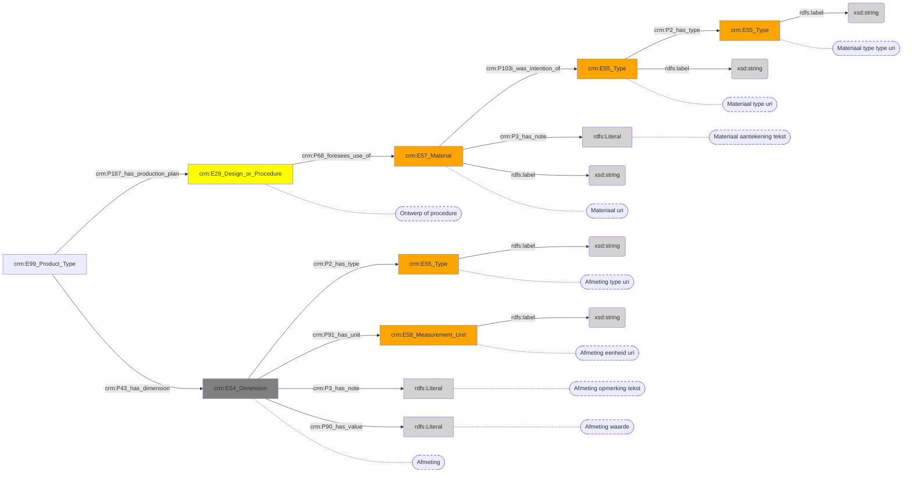

```mermaid
graph LR
7620b8f8-5225-11ee-974d-00163e71351b["crm:E29_Design_or_Procedure"]-->|"crm:P68_foresees_use_of"|9c2594e2-5225-11ee-a9ac-00163e71351b["crm:E57_Material"]
7892caec-471a-11ee-a9ac-00163e71351b["crm:E99_Product_Type"]-->|"crm:P187_has_production_plan"|7620b8f8-5225-11ee-974d-00163e71351b["crm:E29_Design_or_Procedure"]
7892caec-471a-11ee-a9ac-00163e71351b["crm:E99_Product_Type"]-->|"crm:P43_has_dimension"|a8804d10-471a-11ee-a9ac-00163e71351b["crm:E54_Dimension"]
9c2594e2-5225-11ee-a9ac-00163e71351b["crm:E57_Material"]-->|"crm:P103i_was_intention_of"|ed034a26-5225-11ee-b0c4-00163e71351b["crm:E55_Type"]
a8804d10-471a-11ee-a9ac-00163e71351b["crm:E54_Dimension"]-->|"crm:P2_has_type"|a880579c-471a-11ee-a9ac-00163e71351b["crm:E55_Type"]
a8804d10-471a-11ee-a9ac-00163e71351b["crm:E54_Dimension"]-->|"crm:P91_has_unit"|a88058e6-471a-11ee-a9ac-00163e71351b["crm:E58_Measurement_Unit"]
ed034a26-5225-11ee-b0c4-00163e71351b["crm:E55_Type"]-->|"crm:P2_has_type"|ed03503e-5225-11ee-b0c4-00163e71351b["crm:E55_Type"]
9c2594e2-5225-11ee-a9ac-00163e71351b["crm:E57_Material"]-->|"crm:P3_has_note"|9c259884-5225-11ee-a9ac-00163e71351b(rdfs:Literal)
9c2594e2-5225-11ee-a9ac-00163e71351b["crm:E57_Material"]-->|"rdfs:label"|9c2599ba-5225-11ee-a9ac-00163e71351b(xsd:string)
a8804d10-471a-11ee-a9ac-00163e71351b["crm:E54_Dimension"]-->|"crm:P3_has_note"|a8805cb0-471a-11ee-a9ac-00163e71351b(rdfs:Literal)
a8804d10-471a-11ee-a9ac-00163e71351b["crm:E54_Dimension"]-->|"crm:P90_has_value"|a88059e0-471a-11ee-a9ac-00163e71351b(rdfs:Literal)
a880579c-471a-11ee-a9ac-00163e71351b["crm:E55_Type"]-->|"rdfs:label"|a8805ada-471a-11ee-a9ac-00163e71351b(xsd:string)
a88058e6-471a-11ee-a9ac-00163e71351b["crm:E58_Measurement_Unit"]-->|"rdfs:label"|a8805bc0-471a-11ee-a9ac-00163e71351b(xsd:string)
ed034a26-5225-11ee-b0c4-00163e71351b["crm:E55_Type"]-->|"rdfs:label"|ed0351f6-5225-11ee-b0c4-00163e71351b(xsd:string)
ed03503e-5225-11ee-b0c4-00163e71351b["crm:E55_Type"]-->|"rdfs:label"|ed03534a-5225-11ee-b0c4-00163e71351b(xsd:string)
style 9c2594e2-5225-11ee-a9ac-00163e71351b_s stroke-dasharray: 5
style 7620b8f8-5225-11ee-974d-00163e71351b_s stroke-dasharray: 5
style a8804d10-471a-11ee-a9ac-00163e71351b_s stroke-dasharray: 5
style ed034a26-5225-11ee-b0c4-00163e71351b_s stroke-dasharray: 5
style 9c259884-5225-11ee-a9ac-00163e71351b_s stroke-dasharray: 5
style a880579c-471a-11ee-a9ac-00163e71351b_s stroke-dasharray: 5
style a8805cb0-471a-11ee-a9ac-00163e71351b_s stroke-dasharray: 5
style a88059e0-471a-11ee-a9ac-00163e71351b_s stroke-dasharray: 5
style a88058e6-471a-11ee-a9ac-00163e71351b_s stroke-dasharray: 5
style ed03503e-5225-11ee-b0c4-00163e71351b_s stroke-dasharray: 5
9c2594e2-5225-11ee-a9ac-00163e71351b["crm:E57_Material"]-.-9c2594e2-5225-11ee-a9ac-00163e71351b_s(["Materiaal uri"])
7620b8f8-5225-11ee-974d-00163e71351b["crm:E29_Design_or_Procedure"]-.-7620b8f8-5225-11ee-974d-00163e71351b_s(["Ontwerp of procedure"])
a8804d10-471a-11ee-a9ac-00163e71351b["crm:E54_Dimension"]-.-a8804d10-471a-11ee-a9ac-00163e71351b_s(["Afmeting"])
ed034a26-5225-11ee-b0c4-00163e71351b["crm:E55_Type"]-.-ed034a26-5225-11ee-b0c4-00163e71351b_s(["Materiaal type uri"])
9c259884-5225-11ee-a9ac-00163e71351b["rdfs:Literal"]-.-9c259884-5225-11ee-a9ac-00163e71351b_s(["Materiaal aantekening tekst"])
a880579c-471a-11ee-a9ac-00163e71351b["crm:E55_Type"]-.-a880579c-471a-11ee-a9ac-00163e71351b_s(["Afmeting type uri"])
a8805cb0-471a-11ee-a9ac-00163e71351b["rdfs:Literal"]-.-a8805cb0-471a-11ee-a9ac-00163e71351b_s(["Afmeting opmerking tekst"])
a88059e0-471a-11ee-a9ac-00163e71351b["rdfs:Literal"]-.-a88059e0-471a-11ee-a9ac-00163e71351b_s(["Afmeting waarde"])
a88058e6-471a-11ee-a9ac-00163e71351b["crm:E58_Measurement_Unit"]-.-a88058e6-471a-11ee-a9ac-00163e71351b_s(["Afmeting eenheid uri"])
ed03503e-5225-11ee-b0c4-00163e71351b["crm:E55_Type"]-.-ed03503e-5225-11ee-b0c4-00163e71351b_s(["Materiaal type type uri"])
style 7620b8f8-5225-11ee-974d-00163e71351b fill:#ffff00
style 9c2594e2-5225-11ee-a9ac-00163e71351b fill:#ffa500
style 9c259884-5225-11ee-a9ac-00163e71351b fill:#D3D3D3
style 9c2599ba-5225-11ee-a9ac-00163e71351b fill:#D3D3D3
style a8804d10-471a-11ee-a9ac-00163e71351b fill:#808080
style a880579c-471a-11ee-a9ac-00163e71351b fill:#ffa500
style a88058e6-471a-11ee-a9ac-00163e71351b fill:#ffa500
style a88059e0-471a-11ee-a9ac-00163e71351b fill:#D3D3D3
style a8805ada-471a-11ee-a9ac-00163e71351b fill:#D3D3D3
style a8805bc0-471a-11ee-a9ac-00163e71351b fill:#D3D3D3
style a8805cb0-471a-11ee-a9ac-00163e71351b fill:#D3D3D3
style ed034a26-5225-11ee-b0c4-00163e71351b fill:#ffa500
style ed03503e-5225-11ee-b0c4-00163e71351b fill:#ffa500
style ed0351f6-5225-11ee-b0c4-00163e71351b fill:#D3D3D3
style ed03534a-5225-11ee-b0c4-00163e71351b fill:#D3D3D3
```
