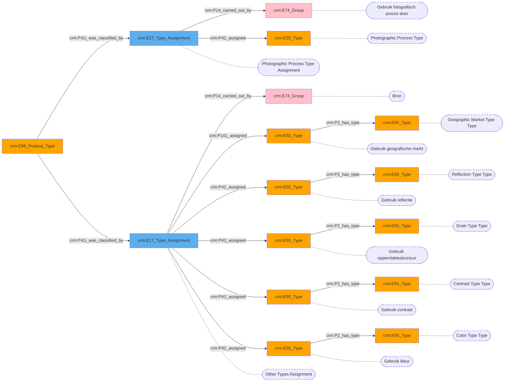

```mermaid
graph LR
4eb7f310-8a0d-11ee-b60e-00163e71351b["crm:E55_Type"]-->|"crm:P2_has_type"|20776035-e768-11ee-9a09-960002548b4f["crm:E55_Type"]
72585daa-8a0d-11ee-a49f-00163e71351b["crm:E55_Type"]-->|"crm:P2_has_type"|dbb26eba-e767-11ee-80cb-960002548b4f["crm:E55_Type"]
7892caec-471a-11ee-a9ac-00163e71351b["crm:E99_Product_Type"]-->|"crm:P41i_was_classified_by"|928cfb24-521a-11ee-b0c4-00163e71351b["crm:E17_Type_Assignment"]
7892caec-471a-11ee-a9ac-00163e71351b["crm:E99_Product_Type"]-->|"crm:P41i_was_classified_by"|a375b51e-8a0c-11ee-84b7-00163e71351b["crm:E17_Type_Assignment"]
85c7b2dc-8a0d-11ee-9586-00163e71351b["crm:E55_Type"]-->|"crm:P2_has_type"|1036f165-e768-11ee-b86a-960002548b4f["crm:E55_Type"]
928cfb24-521a-11ee-b0c4-00163e71351b["crm:E17_Type_Assignment"]-->|"crm:P14_carried_out_by"|3c3891a6-521b-11ee-974d-00163e71351b["crm:E74_Group"]
928cfb24-521a-11ee-b0c4-00163e71351b["crm:E17_Type_Assignment"]-->|"crm:P42_assigned"|1984c26a-521b-11ee-b0c4-00163e71351b["crm:E55_Type"]
9425607c-8a0d-11ee-9586-00163e71351b["crm:E55_Type"]-->|"crm:P2_has_type"|fe3bca30-e767-11ee-891d-960002548b4f["crm:E55_Type"]
a375b51e-8a0c-11ee-84b7-00163e71351b["crm:E17_Type_Assignment"]-->|"crm:P14_carried_out_by"|3e7fcf30-8a0e-11ee-9586-00163e71351b["crm:E74_Group"]
a375b51e-8a0c-11ee-84b7-00163e71351b["crm:E17_Type_Assignment"]-->|"crm:P141_assigned"|ee01311c-8a0c-11ee-b60e-00163e71351b["crm:E55_Type"]
a375b51e-8a0c-11ee-84b7-00163e71351b["crm:E17_Type_Assignment"]-->|"crm:P42_assigned"|4eb7f310-8a0d-11ee-b60e-00163e71351b["crm:E55_Type"]
a375b51e-8a0c-11ee-84b7-00163e71351b["crm:E17_Type_Assignment"]-->|"crm:P42_assigned"|72585daa-8a0d-11ee-a49f-00163e71351b["crm:E55_Type"]
a375b51e-8a0c-11ee-84b7-00163e71351b["crm:E17_Type_Assignment"]-->|"crm:P42_assigned"|85c7b2dc-8a0d-11ee-9586-00163e71351b["crm:E55_Type"]
a375b51e-8a0c-11ee-84b7-00163e71351b["crm:E17_Type_Assignment"]-->|"crm:P42_assigned"|9425607c-8a0d-11ee-9586-00163e71351b["crm:E55_Type"]
ee01311c-8a0c-11ee-b60e-00163e71351b["crm:E55_Type"]-->|"crm:P2_has_type"|397f7a28-e768-11ee-a297-960002548b4f["crm:E55_Type"]
20776035-e768-11ee-9a09-960002548b4f["crm:E55_Type"]-.-20776035-e768-11ee-9a09-960002548b4f_s(["Reflection Type Type"])
dbb26eba-e767-11ee-80cb-960002548b4f["crm:E55_Type"]-.-dbb26eba-e767-11ee-80cb-960002548b4f_s(["Grain Type Type"])
928cfb24-521a-11ee-b0c4-00163e71351b["crm:E17_Type_Assignment"]-.-928cfb24-521a-11ee-b0c4-00163e71351b_s(["Photographic Process Type Assignment"])
a375b51e-8a0c-11ee-84b7-00163e71351b["crm:E17_Type_Assignment"]-.-a375b51e-8a0c-11ee-84b7-00163e71351b_s(["Other Types Assignment"])
1036f165-e768-11ee-b86a-960002548b4f["crm:E55_Type"]-.-1036f165-e768-11ee-b86a-960002548b4f_s(["Contrast Type Type"])
3c3891a6-521b-11ee-974d-00163e71351b["crm:E74_Group"]-.-3c3891a6-521b-11ee-974d-00163e71351b_s(["Gebruik fotografisch proces door"])
1984c26a-521b-11ee-b0c4-00163e71351b["crm:E55_Type"]-.-1984c26a-521b-11ee-b0c4-00163e71351b_s(["Photographic Process Type"])
fe3bca30-e767-11ee-891d-960002548b4f["crm:E55_Type"]-.-fe3bca30-e767-11ee-891d-960002548b4f_s(["Color Type Type"])
3e7fcf30-8a0e-11ee-9586-00163e71351b["crm:E74_Group"]-.-3e7fcf30-8a0e-11ee-9586-00163e71351b_s(["Bron"])
ee01311c-8a0c-11ee-b60e-00163e71351b["crm:E55_Type"]-.-ee01311c-8a0c-11ee-b60e-00163e71351b_s(["Gebruik geografische markt"])
4eb7f310-8a0d-11ee-b60e-00163e71351b["crm:E55_Type"]-.-4eb7f310-8a0d-11ee-b60e-00163e71351b_s(["Gebruik reflectie"])
72585daa-8a0d-11ee-a49f-00163e71351b["crm:E55_Type"]-.-72585daa-8a0d-11ee-a49f-00163e71351b_s(["Gebruik oppervlaktestructuur"])
85c7b2dc-8a0d-11ee-9586-00163e71351b["crm:E55_Type"]-.-85c7b2dc-8a0d-11ee-9586-00163e71351b_s(["Gebruik contrast"])
9425607c-8a0d-11ee-9586-00163e71351b["crm:E55_Type"]-.-9425607c-8a0d-11ee-9586-00163e71351b_s(["Gebruik kleur"])
397f7a28-e768-11ee-a297-960002548b4f["crm:E55_Type"]-.-397f7a28-e768-11ee-a297-960002548b4f_s(["Geographic Market Type Type"])
style 20776035-e768-11ee-9a09-960002548b4f_s stroke-dasharray: 5
style dbb26eba-e767-11ee-80cb-960002548b4f_s stroke-dasharray: 5
style 928cfb24-521a-11ee-b0c4-00163e71351b_s stroke-dasharray: 5
style a375b51e-8a0c-11ee-84b7-00163e71351b_s stroke-dasharray: 5
style 1036f165-e768-11ee-b86a-960002548b4f_s stroke-dasharray: 5
style 3c3891a6-521b-11ee-974d-00163e71351b_s stroke-dasharray: 5
style 1984c26a-521b-11ee-b0c4-00163e71351b_s stroke-dasharray: 5
style fe3bca30-e767-11ee-891d-960002548b4f_s stroke-dasharray: 5
style 3e7fcf30-8a0e-11ee-9586-00163e71351b_s stroke-dasharray: 5
style ee01311c-8a0c-11ee-b60e-00163e71351b_s stroke-dasharray: 5
style 4eb7f310-8a0d-11ee-b60e-00163e71351b_s stroke-dasharray: 5
style 72585daa-8a0d-11ee-a49f-00163e71351b_s stroke-dasharray: 5
style 85c7b2dc-8a0d-11ee-9586-00163e71351b_s stroke-dasharray: 5
style 9425607c-8a0d-11ee-9586-00163e71351b_s stroke-dasharray: 5
style 397f7a28-e768-11ee-a297-960002548b4f_s stroke-dasharray: 5
style 1036f165-e768-11ee-b86a-960002548b4f fill:#ffa500
style 1984c26a-521b-11ee-b0c4-00163e71351b fill:#ffa500
style 20776035-e768-11ee-9a09-960002548b4f fill:#ffa500
style 397f7a28-e768-11ee-a297-960002548b4f fill:#ffa500
style 3c3891a6-521b-11ee-974d-00163e71351b fill:#ffc0cb
style 3e7fcf30-8a0e-11ee-9586-00163e71351b fill:#ffc0cb
style 4eb7f310-8a0d-11ee-b60e-00163e71351b fill:#ffa500
style 72585daa-8a0d-11ee-a49f-00163e71351b fill:#ffa500
style 7892caec-471a-11ee-a9ac-00163e71351b fill:#ffa500
style 85c7b2dc-8a0d-11ee-9586-00163e71351b fill:#ffa500
style 928cfb24-521a-11ee-b0c4-00163e71351b fill:#5DAEEC
style 9425607c-8a0d-11ee-9586-00163e71351b fill:#ffa500
style a375b51e-8a0c-11ee-84b7-00163e71351b fill:#5DAEEC
style dbb26eba-e767-11ee-80cb-960002548b4f fill:#ffa500
style ee01311c-8a0c-11ee-b60e-00163e71351b fill:#ffa500
style fe3bca30-e767-11ee-891d-960002548b4f fill:#ffa500
```
