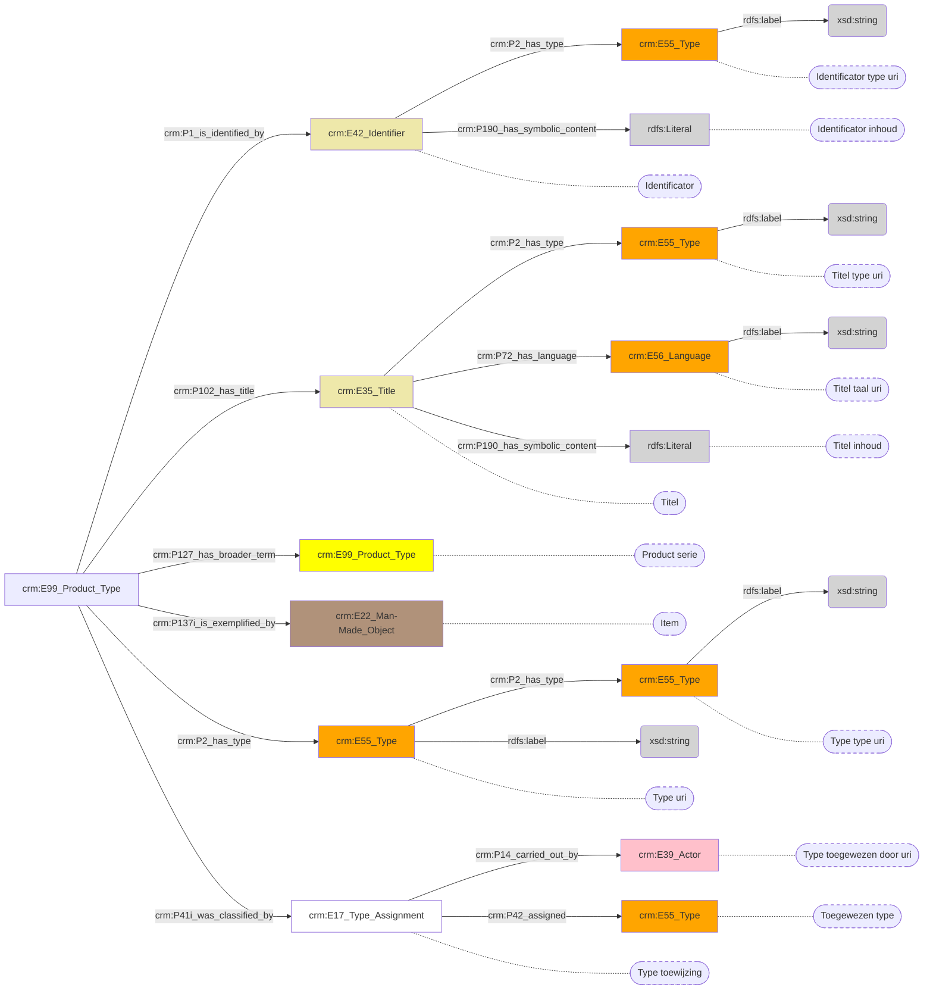

```mermaid
graph LR
7892caec-471a-11ee-a9ac-00163e71351b["crm:E99_Product_Type"]-->|"crm:P1_is_identified_by"|b015b84e-471a-11ee-974d-00163e71351b["crm:E42_Identifier"]
7892caec-471a-11ee-a9ac-00163e71351b["crm:E99_Product_Type"]-->|"crm:P102_has_title"|9d479c02-5230-11ee-a9ac-00163e71351b["crm:E35_Title"]
7892caec-471a-11ee-a9ac-00163e71351b["crm:E99_Product_Type"]-->|"crm:P127_has_broader_term"|d1a3d1cc-5222-11ee-974d-00163e71351b["crm:E99_Product_Type"]
7892caec-471a-11ee-a9ac-00163e71351b["crm:E99_Product_Type"]-->|"crm:P137i_is_exemplified_by"|9475fd4e-4727-11ee-b0c4-00163e71351b["crm:E22_Man-Made_Object"]
7892caec-471a-11ee-a9ac-00163e71351b["crm:E99_Product_Type"]-->|"crm:P2_has_type"|908c5cfe-4728-11ee-974d-00163e71351b["crm:E55_Type"]
7892caec-471a-11ee-a9ac-00163e71351b["crm:E99_Product_Type"]-->|"crm:P41i_was_classified_by"|928cfb24-521a-11ee-b0c4-00163e71351b["crm:E17_Type_Assignment"]
908c5cfe-4728-11ee-974d-00163e71351b["crm:E55_Type"]-->|"crm:P2_has_type"|908c60d2-4728-11ee-974d-00163e71351b["crm:E55_Type"]
928cfb24-521a-11ee-b0c4-00163e71351b["crm:E17_Type_Assignment"]-->|"crm:P14_carried_out_by"|3c3891a6-521b-11ee-974d-00163e71351b["crm:E39_Actor"]
928cfb24-521a-11ee-b0c4-00163e71351b["crm:E17_Type_Assignment"]-->|"crm:P42_assigned"|1984c26a-521b-11ee-b0c4-00163e71351b["crm:E55_Type"]
9d479c02-5230-11ee-a9ac-00163e71351b["crm:E35_Title"]-->|"crm:P2_has_type"|9d479fd6-5230-11ee-a9ac-00163e71351b["crm:E55_Type"]
9d479c02-5230-11ee-a9ac-00163e71351b["crm:E35_Title"]-->|"crm:P72_has_language"|9d47a2f6-5230-11ee-a9ac-00163e71351b["crm:E56_Language"]
b015b84e-471a-11ee-974d-00163e71351b["crm:E42_Identifier"]-->|"crm:P2_has_type"|b015be84-471a-11ee-974d-00163e71351b["crm:E55_Type"]
908c5cfe-4728-11ee-974d-00163e71351b["crm:E55_Type"]-->|"rdfs:label"|908c621c-4728-11ee-974d-00163e71351b(xsd:string)
908c60d2-4728-11ee-974d-00163e71351b["crm:E55_Type"]-->|"rdfs:label"|908c6316-4728-11ee-974d-00163e71351b(xsd:string)
9d479c02-5230-11ee-a9ac-00163e71351b["crm:E35_Title"]-->|"crm:P190_has_symbolic_content"|9d47a116-5230-11ee-a9ac-00163e71351b(rdfs:Literal)
9d479fd6-5230-11ee-a9ac-00163e71351b["crm:E55_Type"]-->|"rdfs:label"|9d47a3d2-5230-11ee-a9ac-00163e71351b(xsd:string)
9d47a2f6-5230-11ee-a9ac-00163e71351b["crm:E56_Language"]-->|"rdfs:label"|9d47a210-5230-11ee-a9ac-00163e71351b(xsd:string)
b015b84e-471a-11ee-974d-00163e71351b["crm:E42_Identifier"]-->|"crm:P190_has_symbolic_content"|b015bd80-471a-11ee-974d-00163e71351b(rdfs:Literal)
b015be84-471a-11ee-974d-00163e71351b["crm:E55_Type"]-->|"rdfs:label"|b015bc40-471a-11ee-974d-00163e71351b(xsd:string)
style b015b84e-471a-11ee-974d-00163e71351b_s stroke-dasharray: 5
style 9d479c02-5230-11ee-a9ac-00163e71351b_s stroke-dasharray: 5
style d1a3d1cc-5222-11ee-974d-00163e71351b_s stroke-dasharray: 5
style 9475fd4e-4727-11ee-b0c4-00163e71351b_s stroke-dasharray: 5
style 908c5cfe-4728-11ee-974d-00163e71351b_s stroke-dasharray: 5
style 928cfb24-521a-11ee-b0c4-00163e71351b_s stroke-dasharray: 5
style 908c60d2-4728-11ee-974d-00163e71351b_s stroke-dasharray: 5
style 3c3891a6-521b-11ee-974d-00163e71351b_s stroke-dasharray: 5
style 1984c26a-521b-11ee-b0c4-00163e71351b_s stroke-dasharray: 5
style 9d47a116-5230-11ee-a9ac-00163e71351b_s stroke-dasharray: 5
style 9d479fd6-5230-11ee-a9ac-00163e71351b_s stroke-dasharray: 5
style 9d47a2f6-5230-11ee-a9ac-00163e71351b_s stroke-dasharray: 5
style b015bd80-471a-11ee-974d-00163e71351b_s stroke-dasharray: 5
style b015be84-471a-11ee-974d-00163e71351b_s stroke-dasharray: 5
b015b84e-471a-11ee-974d-00163e71351b["crm:E42_Identifier"]-.-b015b84e-471a-11ee-974d-00163e71351b_s(["Identificator"])
9d479c02-5230-11ee-a9ac-00163e71351b["crm:E35_Title"]-.-9d479c02-5230-11ee-a9ac-00163e71351b_s(["Titel"])
d1a3d1cc-5222-11ee-974d-00163e71351b["crm:E99_Product_Type"]-.-d1a3d1cc-5222-11ee-974d-00163e71351b_s(["Product serie"])
9475fd4e-4727-11ee-b0c4-00163e71351b["crm:E22_Man-Made_Object"]-.-9475fd4e-4727-11ee-b0c4-00163e71351b_s(["Item"])
908c5cfe-4728-11ee-974d-00163e71351b["crm:E55_Type"]-.-908c5cfe-4728-11ee-974d-00163e71351b_s(["Type uri"])
928cfb24-521a-11ee-b0c4-00163e71351b["crm:E17_Type_Assignment"]-.-928cfb24-521a-11ee-b0c4-00163e71351b_s(["Type toewijzing"])
908c60d2-4728-11ee-974d-00163e71351b["crm:E55_Type"]-.-908c60d2-4728-11ee-974d-00163e71351b_s(["Type type uri"])
3c3891a6-521b-11ee-974d-00163e71351b["crm:E39_Actor"]-.-3c3891a6-521b-11ee-974d-00163e71351b_s(["Type toegewezen door uri"])
1984c26a-521b-11ee-b0c4-00163e71351b["crm:E55_Type"]-.-1984c26a-521b-11ee-b0c4-00163e71351b_s(["Toegewezen type"])
9d47a116-5230-11ee-a9ac-00163e71351b["rdfs:Literal"]-.-9d47a116-5230-11ee-a9ac-00163e71351b_s(["Titel inhoud"])
9d479fd6-5230-11ee-a9ac-00163e71351b["crm:E55_Type"]-.-9d479fd6-5230-11ee-a9ac-00163e71351b_s(["Titel type uri"])
9d47a2f6-5230-11ee-a9ac-00163e71351b["crm:E56_Language"]-.-9d47a2f6-5230-11ee-a9ac-00163e71351b_s(["Titel taal uri"])
b015bd80-471a-11ee-974d-00163e71351b["rdfs:Literal"]-.-b015bd80-471a-11ee-974d-00163e71351b_s(["Identificator inhoud"])
b015be84-471a-11ee-974d-00163e71351b["crm:E55_Type"]-.-b015be84-471a-11ee-974d-00163e71351b_s(["Identificator type uri"])
style 1984c26a-521b-11ee-b0c4-00163e71351b fill:#ffa500
style 3c3891a6-521b-11ee-974d-00163e71351b fill:#ffc0cb
style 908c5cfe-4728-11ee-974d-00163e71351b fill:#ffa500
style 908c60d2-4728-11ee-974d-00163e71351b fill:#ffa500
style 908c621c-4728-11ee-974d-00163e71351b fill:#D3D3D3
style 908c6316-4728-11ee-974d-00163e71351b fill:#D3D3D3
style 928cfb24-521a-11ee-b0c4-00163e71351b fill:#ffffff
style 9475fd4e-4727-11ee-b0c4-00163e71351b fill:#B0927A
style 9d479c02-5230-11ee-a9ac-00163e71351b fill:#EEE8AA
style 9d479fd6-5230-11ee-a9ac-00163e71351b fill:#ffa500
style 9d47a116-5230-11ee-a9ac-00163e71351b fill:#D3D3D3
style 9d47a210-5230-11ee-a9ac-00163e71351b fill:#D3D3D3
style 9d47a2f6-5230-11ee-a9ac-00163e71351b fill:#ffa500
style 9d47a3d2-5230-11ee-a9ac-00163e71351b fill:#D3D3D3
style b015b84e-471a-11ee-974d-00163e71351b fill:#EEE8AA
style b015bc40-471a-11ee-974d-00163e71351b fill:#D3D3D3
style b015bd80-471a-11ee-974d-00163e71351b fill:#D3D3D3
style b015be84-471a-11ee-974d-00163e71351b fill:#ffa500
style d1a3d1cc-5222-11ee-974d-00163e71351b fill:#ffff00
```
