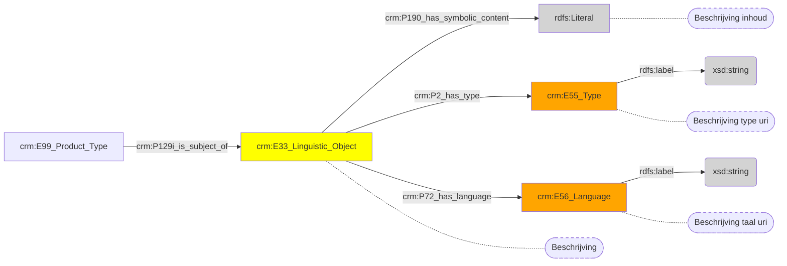

```mermaid
graph LR
335a7fea-522f-11ee-974d-00163e71351b["crm:E33_Linguistic_Object"]-->|"crm:P190_has_symbolic_content"|335a836e-522f-11ee-974d-00163e71351b(rdfs:Literal)
335a8594-522f-11ee-974d-00163e71351b["crm:E55_Type"]-->|"rdfs:label"|335a84a4-522f-11ee-974d-00163e71351b(xsd:string)
335a8760-522f-11ee-974d-00163e71351b["crm:E56_Language"]-->|"rdfs:label"|335a867a-522f-11ee-974d-00163e71351b(xsd:string)
335a7fea-522f-11ee-974d-00163e71351b["crm:E33_Linguistic_Object"]-->|"crm:P2_has_type"|335a8594-522f-11ee-974d-00163e71351b["crm:E55_Type"]
335a7fea-522f-11ee-974d-00163e71351b["crm:E33_Linguistic_Object"]-->|"crm:P72_has_language"|335a8760-522f-11ee-974d-00163e71351b["crm:E56_Language"]
7892caec-471a-11ee-a9ac-00163e71351b["crm:E99_Product_Type"]-->|"crm:P129i_is_subject_of"|335a7fea-522f-11ee-974d-00163e71351b["crm:E33_Linguistic_Object"]
style 335a836e-522f-11ee-974d-00163e71351b_s stroke-dasharray: 5
style 335a8594-522f-11ee-974d-00163e71351b_s stroke-dasharray: 5
style 335a8760-522f-11ee-974d-00163e71351b_s stroke-dasharray: 5
style 335a7fea-522f-11ee-974d-00163e71351b_s stroke-dasharray: 5
335a836e-522f-11ee-974d-00163e71351b["rdfs:Literal"]-.-335a836e-522f-11ee-974d-00163e71351b_s(["Beschrijving inhoud"])
335a8594-522f-11ee-974d-00163e71351b["crm:E55_Type"]-.-335a8594-522f-11ee-974d-00163e71351b_s(["Beschrijving type uri"])
335a8760-522f-11ee-974d-00163e71351b["crm:E56_Language"]-.-335a8760-522f-11ee-974d-00163e71351b_s(["Beschrijving taal uri"])
335a7fea-522f-11ee-974d-00163e71351b["crm:E33_Linguistic_Object"]-.-335a7fea-522f-11ee-974d-00163e71351b_s(["Beschrijving"])
style 335a7fea-522f-11ee-974d-00163e71351b fill:#ffff00
style 335a836e-522f-11ee-974d-00163e71351b fill:#D3D3D3
style 335a84a4-522f-11ee-974d-00163e71351b fill:#D3D3D3
style 335a8594-522f-11ee-974d-00163e71351b fill:#ffa500
style 335a867a-522f-11ee-974d-00163e71351b fill:#D3D3D3
style 335a8760-522f-11ee-974d-00163e71351b fill:#ffa500
```
